<h2 align="center">W3Cx Front-End Web Developer</h2>
<br/>
<!--~~~~~~~~~~~~~~~~~~~~~~~~~~~~~~~~~~~~~~~~~~~~~~~~~~~~~~~~~~~~~~~~~~~~~~~~~~~~~~~~~~~~~~~~~~~~-->
<!--~~~~~~~~~~~~~~~~~~~~~~~~~~~~~~ readme.md of W3Cx-5of5-JS.0x ~~~~~~~~~~~~~~~~~~~~~~~~~~~~~~~~-->
<!--~~~~~~~~~~~~~~~~~~~~~~~~~~~~~~~~~~~~~~~~~~~~~~~~~~~~~~~~~~~~~~~~~~~~~~~~~~~~~~~~~~~~~~~~~~~~-->
<!--~~~~~~~~~~~~~~~~~~~~~~~~~~~~~~~~~~~~~~~~ w3cx logo ~~~~~~~~~~~~~~~~~~~~~~~~~~~~~~~~~~~~~~~~~-->
<p align="center" width="100%">

</p>
<h3 align="center">W3Cx-5of5-JS.0x - JavaScript Introduction</h3>
<!--~~~~~~~~~~~~~~~~~~~~~~~~~~~~~~~~~~~~~~~~~~~~~~~~~~~~~~~~~~~~~~~~~~~~~~~~~~~~~~~~~~~~~~~~~~~~-->
<!--~~~~~~~~~~~~~~~~~~~~~~~~~~~~~ 01. W3Cx-5of5-JS.0x logo (01) ~~~~~~~~~~~~~~~~~~~~~~~~~~~~~~~~-->
<p align="center" width="100%">

</p>
<p id="table-of-contents"></p>

<h2><a href="#table-of-contents">Table of Contents - W3Cx-5of5-JS.0x - JavaScript Introduction</a></h2>

<h2>Syllabus</h2>

<h3>Course Information</h3>

<blockquote>
  <h4><a href="#cha-1">a1. Welcome to JavaScript Introduction</a></h4>
  <h4><a href="#cha-2">a2. Course forums</a></h4>
  <h4><a href="#cha-3">a3. Course tools</a></h4>
  <h4><a href="#cha-4">a4. Why accessibility is important</a></h4>
  <h4><a href="#cha-5">a5. Why internationalization is important</a></h4>
  <h4><a href="#cha-6">a6. About W3C and the Web</a></h4>
</blockquote>

<h3>Module 1: Introduction to JavaScript</h3>
<blockquote>
  <h4><a href="#ch1-1">1.1 Intro Module 1: Introduction to JavaScript</a></h4>
  <h4><a href="#ch1-2">1.2 JavaScript, HTML and CSS</a></h4>
  <h4><a href="#ch1-3">1.3 JavaScript Overview</a></h4>
  <h4><a href="#ch1-4">1.4 Your first HTML/CSS/JS page</a></h4>
  <h4><a href="#ch1-5">1.5 Variables, values, functions, operators and expressions</a></h4>
  <h4><a href="#ch1-6">1.6 Simple JavaScript examples to play with</a></h4>
</blockquote>

<h3>Module 2: Adding Interactivity to HTML Documents</h3>
<blockquote>
  <h4><a href="#ch2-1">2.1 Intro Module 2: Adding Interactivity to HTML Documents</a></h4>
  <h4><a href="#ch2-2">2.2 Conditional Statements, Loops and Logical Operators</a></h4>
  <h4><a href="#ch2-3">2.3 Functions and Callbacks</a></h4>
  <h4><a href="#ch2-4">2.4 Handling events</a></h4>
  <h4><a href="#ch2-5">2.5 The DOM API</a></h4>
  <h4><a href="#ch2-6">2.6 Let's write a small game</a></h4>
</blockquote>

<h3>Module 3: Playing with HTML5 APIs</h3>
<blockquote>
  <h4><a href="#ch3-1">3.1 Intro Module 3: Playing with HTML5 APIs</a></h4>
  <h4><a href="#ch3-2">3.2 Arrays and Iterators</a></h4>
  <h4><a href="#ch3-3">3.3 HTML5 Multimedia and JavaScript</a></h4>
  <h4><a href="#ch3-4">3.4 Displaying a map with the Geolocation API</a></h4>
  <h4><a href="#ch3-5">3.5 Playing sound samples and music</a></h4>
</blockquote>

<h3>Module 4: Structuring Data</h3>
<blockquote>
  <h4><a href="#ch4-1">4.1 Intro Module 4: Structuring Data</a></h4>
  <h4><a href="#ch4-2">4.2 Objects: properties and methods</a></h4>
  <h4><a href="#ch4-3">4.3 Creating multiple objects</a></h4>
  <h4><a href="#ch4-4">4.4 Organizing the code in separate files</a></h4>
</blockquote>

<h3>Module 5: Working with Forms</h3>
<blockquote>
  <h4><a href="#ch5-1">5.1 Intro Module 5: Working with Forms</a></h4>
  <h4><a href="#ch5-2">5.2 Built-in JavaScript Objects</a></h4>
  <h4><a href="#ch5-3">5.3 HTML5 tables, forms and input fields</a></h4>
  <h4><a href="#ch5-4">5.4 The JSON notation</a></h4>
  <h4><a href="#ch5-5">5.5 A small application</a></h4>
  <h4><a href="#ch5-6">5.6 Where to from here?</a></h4>
</blockquote>

<a href="https://github.com/bbauska/W3Cx-5of5-Introduction-JavaScript.git" 
target="_blank" rel="noopener noreferrer">Introduction JavaScript - git</a>

<h2 id="outline">Course Outline:</h2>

<h3>js.0x-w3cx - W3Cx-5of5-JS.0x JavaScript Introduction</h3>

<p>HTML5, CSS and JavaScript are the "classic three" for Web developers and
designers. JavaScript lets you add interactive features to your Web
sites, including dynamically updated content, controlled multimedia,
animated images, and much more.</p>

<ul>
  <li>In <b>Module 1</b>, we present the basics of JavaScript by the way of
    many examples. We also show how to use the browser devtools, a
    powerful, built-in set of tools that represent the Swiss army knife
    of any Web developer.</li>
  <li>In <b>Module 2</b>, you&apos;ll learn about conditional statements, logical
    operators, loops and how to detect events. We will introduce the DOM
    API and the selector API (for selecting elements in the DOM). At the
    end of this module, armed with this new knowledge, we&apos;ll write a
    small game together.</li>
  <li><b>Module 3</b> is more &quot;project oriented&quot;, and less focused on
    fundamental concepts. Discover the audio and video APIs, and other
    cool HTML5 APIs. You will play with sound samples and music, and
    this is going to be useful to put a music background and/or sound
    effects to the game you started to develop in Module 2!</li>
  <li><b>Module 4</b> is about structuring data with a focus on JavaScript
    Object Oriented Programming. As with many other programming
    languages, JavaScript objects can be compared to real-life objects.
    Learn how to create your own classes and multiples objects from the
    same class. And experiment it all by doing one or more optional
    projects!</li>
  <li><b>Module 5</b> is the last module of the course! Let&apos;s enhance
    interactivity of past projects by adding forms. To put into
    practice, let&apos;s develop a mini contact manager that load/save its
    data using the JSON format.</li>
</ul>

<p>This course is designed for anyone who is comfortable with programming
concepts. No prerequisites are required though we encourage you to
follow these two other W3Cx courses: <a href="https://www.edx.org/course/html5-and-css-fundamentals" target="_blank" rel="noopener noreferrer">
HTML5 and CSS Fundamentals</a> and <a href="https://www.edx.org/course/css-basics" target="_blank" rel="noopener noreferrer">CSS Basics</a>.</p>

<h4>During this course, you will learn:</h4>

<ul>
  <li>How to add JavaScript code in your Web site/Web app, and how to debug it.</li>
  <li>How to make interactive Web sites through the DOM API.</li>
  <li>How to change the CSS styles of HTML5 elements from JavaScript.</li>
  <li>How to deal with HTML5 forms.</li>
  <li>How to make basic graphics and animations using the HTML5 canvas.</li>
</ul>

<p>You will make good use of your JavaScript skills in the other 2 W3Cx
courses included in the <a href="https://www.edx.org/professional-certificate/w3cx-front-end-web-developer" target="_blank" rel="noopener noreferrer">
&quot;Front-End Web Developer&quot; W3Cx Professional Certificate</a> program: 
<a href="https://www.edx.org/course/html5-coding-essentials-and-best-practices" target="_blank" rel="noopener noreferrer">
HTML5 Coding Essentials and Best Practices</a> and <a href="https://www.edx.org/course/html5-apps-and-games" target="_blank" rel="noopener noreferrer">HTML5
Apps and Games</a>.</p>

<p>In the meantime, have fun in this course!</p>

<p>Professional Certificate programs are series of courses designed by
industry leaders and/or top universities to build and enhance critical
professional skills needed to succeed in today&apos;s most in-demand fields.</p>
<!--~~~~~~~~~~~~~~~~~~~~~~~~~~~~~~~~~~~~~~~~~~~~~~~~~~~~~~~~~~~~~~~~~~~~~~~~~~~~~~~~~~~~~~~~~~~~-->
<!--~~~~~~~~~~~ 02. banner image for the fewd professional certificate program (05) ~~~~~~~~~~~~-->
<p align="center" width="100%">

</p>
<p>W3C has designed a <a href="https://www.edx.org/professional-certificate/w3cx-front-end-web-developer" target="_blank" rel="noopener noreferrer">
&quot;Front-End Web Developer&quot; (FEWD) Professional Certificate</a> where
you will learn all of the necessary skills needed to build interactive
and responsive user experiences on the Web. This program will deepen
your knowledge of the 3 foundational languages that power the Web:
HTML5, CSS and JavaScript.</p>

<h4>The W3C FEWD program is composed of 5 courses:</h4>

<ol>
  <li><a href="https://www.edx.org/course/css-basics" target="_blank" rel="noopener noreferrer"><b>CSS Basics</b></a></li>
  <li><a href="https://www.edx.org/course/html5-and-css-fundamentals" target="_blank" rel="noopener noreferrer"><b>HTML5 and CSS Fundamentals</b></a></li>
  <li><a href="https://www.edx.org/course/html5-coding-essentials-and-best-practices" target="_blank" rel="noopener noreferrer">
    <b>HTML5 Coding Essentials and Best Practices</b></a></li>
  <li><a href="https://www.edx.org/course/html5-apps-and-games" target="_blank" rel="noopener noreferrer"><b>HTML5 Apps and Games</b></a></li>
  <li><b>This course</b>: <a href="https://www.edx.org/course/javascript-introduction" target="_blank" rel="noopener noreferrer">
    <b>JavaScript Introduction</b></a></li>
</ol>

<p><b>To get a W3C FEWD professional certificate, you must successfully pass 
and receive a Verified Certificate in the five courses above</b>.</p>

<h4>Foreword:</h4>

<h5><i>Michel Buffa, author of this course:</i></h5>

<blockquote>
  &ldquo;When I work locally, with files located on my computer hard drive, I
  use the Sublime Text source code editor, Visual Studio Code, WebStorm,
  NetBeans, depending on the size of the project I&apos;m working on.<br>
    - <b>For testing simple examples, I mainly use the JSBin.com online code 
    editor.</b><br>
    - <b>For embedding online examples in this course, I use the CodePen.io 
    online code editor.</b><br>
    - <b>For choosing a CSS color, shadow, text-shadow, gradients, etc. I use
    the LiveWeave online code editor.&rdquo;</b>
</blockquote>

<h4>Web editors</h4>

<h4>Traditional source code editors</h4>

<p>You can use any source code editor that has good support for HTML,
CSS and JavaScript files. For this course, you are free to use whichever
you prefer. However, there are some in particular that we recommend.</p>
<!--~~~~~~~~~~~~~~~~~~~~~~~~~~~~~~~~~~~~~~~~~~~~~~~~~~~~~~~~~~~~~~~~~~~~~~~~~~~~~~~~~~~~~~~~~~~~-->
<!--~~~~~~~~~~~~~~~~~~~~~~~~~~~~~~~ 03. sublime text logo (06) ~~~~~~~~~~~~~~~~~~~~~~~~~~~~~~~~~-->
<p align="left" width="100%">
Sublime Text</a> is a very powerful, 
multi-platform source code editor, it&apos;s semi-free (you can use it without 
paying, it will pop up a dialog asking you to buy it once in a while, but not 
very often). Sublime text supports hundreds of plugins to enhance its features.</p>
<!--~~~~~~~~~~~~~~~~~~~~~~~~~~~~~~~~~~~~~~~~~~~~~~~~~~~~~~~~~~~~~~~~~~~~~~~~~~~~~~~~~~~~~~~~~~~~-->
<!--~~~~~~~~~~~~~ 04. snapshot of sublime text editing an html/css/js project (06) ~~~~~~~~~~~~~-->
<p align="center" width="100%">
</p>
<!--~~~~~~~~~~~~~~~~~~~~~~~~~~~~~~~~~~~~~~~~~~~~~~~~~~~~~~~~~~~~~~~~~~~~~~~~~~~~~~~~~~~~~~~~~~~~-->
<!--~~~~~~~~~~~~~~~~~~~~~~~~~~~~~~~~~~ 05. vs code logo (06) ~~~~~~~~~~~~~~~~~~~~~~~~~~~~~~~~~~~-->
<p align="left" width="25%">

<a href="https://code.visualstudio.com/" target="_blank" rel="noopener noreferrer">Visual Studio Code</a> is a
free, open source, multi-platform editor by Microsoft.</p>
<!--~~~~~~~~~~~~~~~~~~~~~~~~~~~~~~~~~~~~~~~~~~~~~~~~~~~~~~~~~~~~~~~~~~~~~~~~~~~~~~~~~~~~~~~~~~~~-->
<!--~~~~~~~~~~ 06. snapshot of visual studio code editing an html/css/js project (07) ~~~~~~~~~~-->
<p align="center" width="100%">

</p>

<h4>Other tools</h4>

<h4>Free of charge:</h4>

<ul>
  <li><a href="https://atom.io/" target="_blank" rel="noopener noreferrer">
    Atom source</a> code editor (note that Visual Studio code is based on Atom).</li>
  <li><a href="http://brackets.io/" target="_blank" rel="noopener noreferrer">
    Brackets source</a> code editor.</li>
  <li><a href="https://notepad-plus-plus.org/" target="_blank" rel="noopener noreferrer">
    NotePad++</a> (Windows only)</li>
  <li><a href="https://netbeans.org/" target="_blank" rel="noopener noreferrer">
    NetBeans</a> and <a href="https://eclipse.org/" target="_blank" 
	rel="noopener noreferrer">Eclipse</a>: very powerful IDEs (integrated 
	development environments), but heavier than all the &quot;lightweight&quot; 
	source editors that we&apos;ve talked about so far. More dedicated to 
	&quot;mid-size/large-size projects&quot;, more for pro developers that are 
	also looking for good support for server-side languages such as Java, Python, 
	PHP, etc.</li>
</ul>

<h4>Not free of charge:</h4>

<ul>
  <li><a href="https://www.jetbrains.com/" target="_blank" rel="noopener noreferrer">IDEs by JetBrains.com</a> have a very good
    reputation and can be obtained for free if you are an academic
    customer (student or teacher).
    The <a href="https://www.jetbrains.com/webstorm" target="_blank" rel="noopener noreferrer">WebStorm</a> IDE is a very
    good mid-weight tool for developing HTML/CSS/JS/NodeJS code.</li>
  <li><a href="https://www.barebones.com/products/bbedit/" target="_blank" rel="noopener noreferrer">BBedit</a> (for Macs):
    source code editor for mac with support for Web languages.</li>
</ul>

<h4>Online editors/IDEs</h4>

<p>To help you practice for the duration of the course, you will use the following tools:</p>
<!--~~~~~~~~~~~~~~~~~~~~~~~~~~~~~~~~~~~~~~~~~~~~~~~~~~~~~~~~~~~~~~~~~~~~~~~~~~~~~~~~~~~~~~~~~~~~-->
<!--~~~~~~~~~~~~~~~~~~~~~~~~~~~~~~~~~~ 07. jsbin logo (08) ~~~~~~~~~~~~~~~~~~~~~~~~~~~~~~~~~~~~~-->
<p align="left" width="25%">

<a href="https://jsbin.com/" target="_blank" rel="noopener noreferrer">
JS Bin</a> is an open-source collaborative Web development debugging tool. Most 
of the examples you will find in this course are either on JSBin or on CodePen.</p>

<p>Tutorials can be found on the Web (such as 
<a href="https://www.youtube.com/playlist?list=PLXmT1r4krsTooRDWOrIu23P3SEZ3luIUq" 
target="_blank" rel="noopener noreferrer">these ones</a>) or on YouTube. The tool 
is really simple: just open the link to the provided examples, look at the code, 
look at the result, etc. And you can modify the examples as you like, you can 
also modify / clone / save / share them. Keep in mind that it&apos;s always better 
to be logged in (it&apos;s free) if you do not want to lose your work.</p>

<p>In our opinion, JSBin is the best online IDE for &quot;live coding&quot;: typing
and seeing what you are doing in real time, monitoring error messages in
the console tab, and debugging your code. We will mainly use this tool
for the live coding videos.</p>
<!--~~~~~~~~~~~~~~~~~~~~~~~~~~~~~~~~~~~~~~~~~~~~~~~~~~~~~~~~~~~~~~~~~~~~~~~~~~~~~~~~~~~~~~~~~~~~-->
<!--~~~~~~~~~~~~~~~~~~~~~~~~~~~ 08. jsbin example error code (08) ~~~~~~~~~~~~~~~~~~~~~~~~~~~~~~-->
<p align="center" width="100%">

</p>
<!--~~~~~~~~~~~~~~~~~~~~~~~~~~~~~~~~~~~~~~~~~~~~~~~~~~~~~~~~~~~~~~~~~~~~~~~~~~~~~~~~~~~~~~~~~~~~-->
<!--~~~~~~~~~~~~~~~~~~~~~~~~~~~~~~~~~ 09. codepen logo (09) ~~~~~~~~~~~~~~~~~~~~~~~~~~~~~~~~~~~~-->
<p align="left" width="25%">

<a href="https://codepen.io/" target="_blank" rel="noopener noreferrer">
CodePen</a> is similar to JSBin except that its Web site includes a search engine, 
which is very useful for finding out what others have developed. Looking for a nice 
HTML5/CSS button style? Just search for &quot;button&quot;, etc. It&apos;s also 
easier for us to embed HTML/CSS/JS examples in this course with CodePen than with 
other online IDEs; this is why so many &quot;pens&quot; are embedded in the course 
pages.</p>

<p>This is a great service to get you started quickly as it doesn&apos;t
require you to download anything and you can access it, along with your
saved projects from any Web browser. Here&apos;s an article which will be
of-interest if you use CodePen: 
<a href="https://codepen.io/brentmiller/post/things-you-can-do-with-codepen" 
target="_blank" rel="noopener noreferrer">Things you can do with CodePen</a> 
&lbrack;Brent Miller, February 6, 2019&rbrack;.</p>
<!--~~~~~~~~~~~~~~~~~~~~~~~~~~~~~~~~~~~~~~~~~~~~~~~~~~~~~~~~~~~~~~~~~~~~~~~~~~~~~~~~~~~~~~~~~~~~-->
<!--~~~~~~~~~~~~~~~~~~~~~ 10. snapshot of a 'button' codepen example (09) ~~~~~~~~~~~~~~~~~~~~~~-->
<p align="center" width="100%">

</p>
<!--~~~~~~~~~~~~~~~~~~~~~~~~~~~~~~~~~~~~~~~~~~~~~~~~~~~~~~~~~~~~~~~~~~~~~~~~~~~~~~~~~~~~~~~~~~~~-->
<!--~~~~~~~~~~~~~~~~~~~~~~~~~~~~~~~~~ 11. plunker logo (09) ~~~~~~~~~~~~~~~~~~~~~~~~~~~~~~~~~~~~-->
<p align="left" width="25%">

<a href="https://plnkr.co/" target="_blank" rel="noopener noreferrer">Plunker</a> 
allows us to work online with separate files. So, when we have no choice but to 
use separate files, we might use this tool.</p>
<!--~~~~~~~~~~~~~~~~~~~~~~~~~~~~~~~~~~~~~~~~~~~~~~~~~~~~~~~~~~~~~~~~~~~~~~~~~~~~~~~~~~~~~~~~~~~~-->
<!--~~~~~~~~~~~~~~~~~~~~~~~~~ 12. snapshot of a plunker example (10) ~~~~~~~~~~~~~~~~~~~~~~~~~~~-->
<p align="center" width="100%">

</p>
<!--~~~~~~~~~~~~~~~~~~~~~~~~~~~~~~~~~~~~~~~~~~~~~~~~~~~~~~~~~~~~~~~~~~~~~~~~~~~~~~~~~~~~~~~~~~~~-->
<!--~~~~~~~~~~~~~~~~~~~~~~~~~~~~~~~~~ 13. liveweave logo (10) ~~~~~~~~~~~~~~~~~~~~~~~~~~~~~~~~~~-->
<p align="left" width="25%">

<a href="https://liveweave.com/" target="_blank" rel="noopener noreferrer">
LiveWeave</a> is great for writing CSS code or for embedding SVG Graphics in 
an HTML document, as it includes online wizards and interactive editors. We 
use it when we have problems with CSS shadows, CSS colors or gradients, or 
when we want to include an SVG arrow in a document.</p>
<!--~~~~~~~~~~~~~~~~~~~~~~~~~~~~~~~~~~~~~~~~~~~~~~~~~~~~~~~~~~~~~~~~~~~~~~~~~~~~~~~~~~~~~~~~~~~~-->
<!--~~~~~~~~~~~~~~~~~~~~~~~~~ 14. liveweave code editor example (10) ~~~~~~~~~~~~~~~~~~~~~~~~~~~-->
<p align="center" width="100%">

</p>
<!--~~~~~~~~~~~~~~~~~~~~~~~~~~~~~~~~~~~~~~~~~~~~~~~~~~~~~~~~~~~~~~~~~~~~~~~~~~~~~~~~~~~~~~~~~~~~-->
<!--~~~~~~~~~~~~~~~~~~~~~~~~~ 15. liveweave code editor example (11) ~~~~~~~~~~~~~~~~~~~~~~~~~~~-->
<p align="center" width="100%">

</p>
<!--~~~~~~~~~~~~~~~~~~~~~~~~~~~~~~~~~~~~~~~~~~~~~~~~~~~~~~~~~~~~~~~~~~~~~~~~~~~~~~~~~~~~~~~~~~~~-->
<!--~~~~~~~~~~~~~~~~~~~~~~~~~~~~~~~~~ 16. jsfiddle logo (11) ~~~~~~~~~~~~~~~~~~~~~~~~~~~~~~~~~~~-->
<p align="left" width="25%">

<a href="https://jsfiddle.net/" target="_blank" rel="noopener noreferrer">
JSFiddle</a> is very similar to JSBin and CodePen in terms of features.</p>

<h4>Other tools</h4>

<p>There are many other online IDEs and new ones appear each year. If you want a real, 
heavyweight online IDE that has nearly all the features offered by 
&quot;big IDEs&quot; such as Eclipse, NetBeans and WebStorm, take a look at the 
<a href="https://c9.io/" target="_blank" rel="noopener noreferrer">Cloud9 IDE</a>. It&apos;s free and will enable you to 
develop huge projects, that can include many files, it supports uploaded assets 
such as images, videos and sound files.  Furthermore, like Google Docs, it will 
support multiple users working at the same time on the same project, even on the 
same file. It&apos;s a real collaborative environment.</p>

<p>Michel Buffa, author of this course, developed a whole multitrack audio
player this way. This application is <a href="https://mainline.i3s.unice.fr/" 
target="_blank" rel="noopener noreferrer">
available online</a>. (See also screenshots below:)</p>
<!--~~~~~~~~~~~~~~~~~~~~~~~~~~~~~~~~~~~~~~~~~~~~~~~~~~~~~~~~~~~~~~~~~~~~~~~~~~~~~~~~~~~~~~~~~~~~-->
<!--~~~~~~~~~~~~~~~~~~~~~~~~~~~~ 17. multitrack audio player (12) ~~~~~~~~~~~~~~~~~~~~~~~~~~~~~~-->
<p align="center" width="100%">

</p>

<p>100% of the development was done in a Web browser, by Michel Buffa and
two friends, using the c9.io (Cloud 9) IDE (to see if online IDEs were a
valuable approach):</p>
<!--~~~~~~~~~~~~~~~~~~~~~~~~~~~~~~~~~~~~~~~~~~~~~~~~~~~~~~~~~~~~~~~~~~~~~~~~~~~~~~~~~~~~~~~~~~~~-->
<!--~~~~~~~~~~~~~~~~~~~~~~~~~~~~~~~~ 18. c9 ide, example (12) ~~~~~~~~~~~~~~~~~~~~~~~~~~~~~~~~~~-->
<p align="center" width="100%">

</p>

<h4>JavaScript debuggers</h4>

<p>Here is a selection of tools to help debug JavaScript code. The
instructor will indicate other tools in module 1 of the course.</p>

<ul>
  <li><a href="https://developer.mozilla.org/en-US/docs/Tools/Debugger" 
    target="_blank" rel="noopener noreferrer">
    Firefox JS debugger</a> (debugger shipped inside Firefox) - all other 
	browsers have integrated debuggers as well.</li>
  <li><a href="https://www.jslint.com/" target="_blank" rel="noopener noreferrer">
    JS Lint</a> - The JavaScript Code Quality Tool
  <li><a href="https://codebeautify.org/jsvalidate" target="_blank" rel="noopener noreferrer">
    CodeBeautify</a> - JavaScript Validator
  <li>Check also other <a href="https://jqueryhouse.com/best-javascript-debugging-tools/" 
    target="_blank" rel="noopener noreferrer">
    JavaScript debugging tools</a></li>
</ul>

<h4>Browser compatibility</h4>

<p>The term browser compatibility refers to the ability of a given Web site
to appear fully functional on the browsers available in the market.</p>

<p>The most powerful aspect of the Web is what makes it so challenging to
build for: its universality. When you create a Web site, you're writing
code that needs to be understood by many different browsers on different
devices and operating systems!</p>

<p>To make the Web evolve in a sane and sustainable way for both users and
developers, browser vendors work together to standardize new features,
whether it's a new 
<a href="https://developer.mozilla.org/en-US/docs/Web/HTML/Element" 
target="_blank" rel="noopener noreferrer">HTML element</a>, 
<a href="https://developer.mozilla.org/en-US/docs/Web/CSS/Reference#Keyword_index" 
target="_blank" rel="noopener noreferrer">CSS property</a>, or 
<a href="https://developer.mozilla.org/en-US/docs/Web/API" 
target="_blank" rel="noopener noreferrer">JavaScript API</a>. 
But different vendors have different priorities, resources, and release
cycles --- so it's very unlikely that a new feature will land on all the
major browsers at once. As a Web developer, this is something you must
consider if you're relying on a feature to build your site.</p>

<p>We are then providing references to the browser support of HTML5
features presented in this course using 2 resources: 
<a href="https://caniuse.com/" target="_blank" rel="noopener noreferrer">
Can I Use</a> and 
<a href="https://developer.mozilla.org/en-US/" target="_blank" rel="noopener noreferrer">
Mozilla Developer Network (MDN) Web Docs</a>.</p>

<h4>Can I use</h4>

<p><a href="https://caniuse.com/" target="_blank" rel="noopener noreferrer">
Can I Use</a> provides up-to-date tables for support of front-end Web technologies 
on desktop and mobile Web browsers. Below is a snapshot of what information is 
given by CanIUse when searching for &quot;CSS3 colors&quot;.</p>
<!--~~~~~~~~~~~~~~~~~~~~~~~~~~~~~~~~~~~~~~~~~~~~~~~~~~~~~~~~~~~~~~~~~~~~~~~~~~~~~~~~~~~~~~~~~~~~-->
<!--~~~~~~~~~ 19. example of a caniuse browser support table (using css3) colors (14) ~~~~~~~~~~-->
<p align="center" width="100%">

</p>

<h4>MDN Web Docs</h4>
<!--~~~~~~~~~~~~~~~~~~~~~~~~~~~~~~~~~~~~~~~~~~~~~~~~~~~~~~~~~~~~~~~~~~~~~~~~~~~~~~~~~~~~~~~~~~~~-->
<!--~~~~~~~~~~~~~~~~~~~~~~~~~~~~~ 20/21. logo of mdn web docs (14) ~~~~~~~~~~~~~~~~~~~~~~~~~~~~~-->
<p align="center" width="100%">


</p>

<p>To help developers make these decisions consciously rather than accidentally, 
<a href="https://developer.mozilla.org/" target="_blank" rel="noopener noreferrer">MDN Web Docs</a> provides browser 
compatibility tables in its documentation pages, so that when looking up a 
feature you're considering for your project, you know exactly which browsers 
will support it.</p>

<h4>External resources</h4>

<ul>
  <li><a href="https://hacks.mozilla.org/2018/02/mdn-browser-compatibility-data/" target="_blank" rel="noopener noreferrer">
  MDN browser compatibility data: Taking the guesswork out of web compatibility</a></li>
  <li><a href="https://hacks.mozilla.org/2019/09/caniuse-and-mdn-compat-data-collaboration/" target="_blank" rel="noopener noreferrer">
  Caniuse and MDN compatibility data collaboration</a></li>
</ul>
<!--~~~~~~~~~~~~~~~~~~~~~~~~~~~~~~~~~~~~~~~~~~~~~~~~~~~~~~~~~~~~~~~~~~~~~~~~~~~~~~~~~~~~~~~~~~~~-->
<!--~~~~~~~~~~~~~~~~~~~~~~~~~~~~~~~ 22. w3c developers logo (14) ~~~~~~~~~~~~~~~~~~~~~~~~~~~~~~~-->
<p align="left" width="25%">

For over 20 years, the W3C has been developing and
hosting and <a href="https://w3c.github.io/developers/" target="_blank" rel="noopener noreferrer"><b>open source tools</b></a> used
every day by <b>millions of Web developers and Web designers</b>. All the
tools listed below are Web-based, and are available as downloadable
sources or as free services on the <a href="https://w3c.github.io/developers/tools/" target="_blank" rel="noopener noreferrer">
W3C Developers tools</a> site.</p>

<h4>W3C Validator</h4>

<p>The <a href="https://validator.w3.org/" target="_blank" rel="noopener noreferrer">W3C validator</a> checks the 
<a href="https://validator.w3.org/docs/help.html#validation_basics" target="_blank" rel="noopener noreferrer">markup validity</a> of
various Web document formats, such as HTML.</p>

<h4>CSS Validator</h4>

<p>The <a href="https://jigsaw.w3.org/css-validator/" target="_blank" rel="noopener noreferrer">CSS validator</a> checks
Cascading Style Sheets (CSS) and (X)HTML documents that use CSS
stylesheets.</p>
<!--~~~~~~~~~~~~~~~~~~~~~~~~~~~~~~~~~~~~~~~~~~~~~~~~~~~~~~~~~~~~~~~~~~~~~~~~~~~~~~~~~~~~~~~~~~~~-->
<!--~~~~~~~~~~~~~~~~~~~~~~~~ 23. laptop showing unicorn validator (15) ~~~~~~~~~~~~~~~~~~~~~~~~~-->
<p align="left" width="50%">

<a href="https://validator.w3.org/unicorn/" target="_blank" rel="noopener noreferrer">Unicorn</a> is W3C&apos;s unified
validator, which helps people improve the quality of their Web pages by
performing a variety of checks. Unicorn gathers the results of the
popular HTML and CSS validators, as well as other useful services, such
as RSS/Atom feeds and http headers.</p>

<h4>Link Checker</h4>

<p>The <a href="https://validator.w3.org/checklink" target="_blank" rel="noopener noreferrer">W3C Link Checker</a> looks for
issues in links, anchors and referenced objects in a Web page, CSS style
sheet, or recursively on a whole Web site. For best results, it is
recommended to first ensure that the documents checked use valid 
<a href="https://validator.w3.org/" target="_blank" rel="noopener noreferrer">HTML Markup</a> and 
<a href="https://jigsaw.w3.org/css-validator/" target="_blank" rel="noopener noreferrer">CSS</a>.</p>

<h4>Internationalization Checker</h4>

<p>The <a href="https://validator.w3.org/i18n-checker/" target="_blank" rel="noopener noreferrer">W3C Internationalization Checker</a> 
provides information about various internationalization-related aspects of your page,
including the HTTP headers that affect it. It also reports a number of
issues and offers advice about how to resolve them.</p>

<h4>W3C cheatsheet</h4>

<p>The <a href="https://www.w3.org/2009/cheatsheet/" target="_blank" rel="noopener noreferrer">W3C cheatsheet</a> provides quick
access to useful information from a variety of specifications published
by W3C. It aims at giving in a very compact and mobile-friendly format a
compilation of useful knowledge extracted from W3C specifications,
completed by summaries of guidelines developed at W3C, in particular Web
accessibility guidelines, the Mobile Web Best Practices, and a number of
internationalization tips.</p>
<!--~~~~~~~~~~~~~~~~~~~~~~~~~~~~~~~~~~~~~~~~~~~~~~~~~~~~~~~~~~~~~~~~~~~~~~~~~~~~~~~~~~~~~~~~~~~~-->
<!--~~~~~~~~~~~~~~~~~~~~~~~~~~~~~~~ 24. W3Cx cheatsheet (16) ~~~~~~~~~~~~~~~~~~~~~~~~~~~~~~~~~~~-->
<p align="center" width="100%">

</p>

<p>Its main feature is a lookup search box, where one can start typing a keyword 
and get a list of matching properties/elements/ attributes/functions in the 
above-mentioned specifications, and further details on those when selecting 
the one of interest.</p>

<p>The W3C cheatsheet is only available as a <a href="https://dev.w3.org/2009/cheatsheet/doc/" target="_blank" rel="noopener noreferrer">
pure Web application</a>.</p>

<h4>Help build the Web Platform!</h4>

<p>Most of the technologies you use when developing Web applications and
Web sites are designed and standardized in W3C in a completely open and
transparent process.</p>

<p>In fact, all W3C specifications are developed in public <a href="https://github.com/w3c/" target="_blank" rel="noopener noreferrer">
GitHub repositories</a>, so if you are familiar with GitHub, you already know 
how to contribute to W3C specifications! This is all about raising issues 
(with feedback and suggestions) and/or bringing pull requests to fix identified issues.</p>

<h4>Contribute</h4>

<p>Contributing to this standardization process might be a bit scary or
hard to approach at first, but understanding at a deeper level how these
technologies are built is a great way to build your expertise.</p>
<!--~~~~~~~~~~~~~~~~~~~~~~~~~~~~~~~~~~~~~~~~~~~~~~~~~~~~~~~~~~~~~~~~~~~~~~~~~~~~~~~~~~~~~~~~~~~~-->
<!--~~~~~~~~~~~~~~~~~~~~~~~~~~~~~~ 25. github octocat logo (16) ~~~~~~~~~~~~~~~~~~~~~~~~~~~~~~~~-->
<p align="left" width="100%">

If you&apos;re looking to an easy way to dive into this standardization processes, check out which 
<a href="https://github.com/search?q=org%3Aw3c+label%3A%22good+first+issue%22+state%3Aopen&type=Issues" target="_blank" rel="noopener noreferrer">
issues in the W3C GitHub repositories have been marked as &quot;good first issue&quot;</a> and
see if you find anything where you think you would be ready to help.</p>

<h4>First steps in Web accessibility</h4>

<p>As steward of global Web standards, W3C&apos;s mission is to safeguard the
openness, accessibility, and freedom of the World Wide Web from a
technical perspective.</p>

<p>W3C&apos;s primary activity is to develop protocols and guidelines that
ensure long-term growth for the Web. The widely adopted Web standards
define key parts of what actually makes the World Wide Web work.</p>

<h4>Shape the future</h4>
<!--~~~~~~~~~~~~~~~~~~~~~~~~~~~~~~~~~~~~~~~~~~~~~~~~~~~~~~~~~~~~~~~~~~~~~~~~~~~~~~~~~~~~~~~~~~~~-->
<!--~~~~~~~~~~~~~~~~~~~~ 26. w3c web incubator community group logo (17) ~~~~~~~~~~~~~~~~~~~~~~~-->
<p align="left" width="100%">

Another approach is to go and bring
feedback on ideas for future technologies: the <a href="https://wicg.io/" target="_blank" rel="noopener noreferrer">
W3C Web Platform Community Incubator Group</a> was built as an easy place 
to get started to provide feedback on new proposals or bring brand-new
proposals for consideration.</p>

<p>Happy Web building!</p>

<h4>What is W3C?</h4>

<p>As steward of global Web standards, W3C&apos;s mission is to safeguard the
openness, accessibility, and freedom of the World Wide Web from a
technical perspective.</p>
<p>W3C&apos;s primary activity is to develop protocols and guidelines that
ensure long-term growth for the Web. The widely adopted Web standards
define key parts of what actually makes the World Wide Web work.</p>

<h4>A few history bits</h4>
<!--~~~~~~~~~~~~~~~~~~~~~~~~~~~~~~~~~~~~~~~~~~~~~~~~~~~~~~~~~~~~~~~~~~~~~~~~~~~~~~~~~~~~~~~~~~~~-->
<!--~~~~~~~~~~~~~~~ 27. tim berners-lee at his desk in cern, switzerland (18) ~~~~~~~~~~~~~~~~~~-->
<p align="center" width="100%">

</p>

<h6 align="center"><i><b>Tim Berners-Lee at his desk in CERN, 1994</b></i></h6>

<p><a href="https://www.w3.org/People/Berners-Lee/" target="_blank" rel="noopener noreferrer">Tim Berners-Lee</a> wrote
a <a href="https://www.w3.org/History/1989/proposal.html" target="_blank" rel="noopener noreferrer">proposal</a> in 1989 for
a system called the World Wide Web. He then created the first Web browser, server, 
and Web page. He wrote the first specifications for URLs, HTTP, and HTML.</p>

<p>In October 1994, Tim Berners-Lee founded the World Wide Web Consortium
(W3C) at the Massachusetts Institute of Technology, Laboratory for Computer 
Science &lbrack;MIT/LCS&rbrack; in collaboration with 
<a href="https://home.cern/" target="_blank" rel="noopener noreferrer">CERN</a>, where the Web originated (see information 
on the <a href="https://www.w3.org/Daemon/" target="_blank" rel="noopener noreferrer">original CERN Server</a>), with 
support from DARPA and the <a href="https://ec.europa.eu/index_en.htm" target="_blank" rel="noopener noreferrer">
European Commission</a>.</p>

<p>In April 1995, <a href="https://www.inria.fr/" target="_blank" rel="noopener noreferrer">Inria</a> became the first European
W3C host, followed by <a href="https://www.keio.ac.jp/" target="_blank" rel="noopener noreferrer">
Keio University of Japan</a>(Shonan Fujisawa Campus) in Asia in 1996. In 2003, 
<a href="https://www.ercim.eu/">ERCIM</a> took over the role of 
European W3C Host from Inria. In 2013, W3C announced <a href="https://ev.buaa.edu.cn/" target="_blank" rel="noopener noreferrer">
Beihang University</a> as the fourth Host.</p>

<p>As of January 2023, W3C is a public-interest non-profit organization
incorporated in the United States of America, led by a Board of
Directors and employing a global staff across the globe.</p>

<h4>A few figures</h4>

As of July 2023, W3C:

<ul>
  <li>Is a <a href="https://www.w3.org/Consortium/Member/List" target="_blank" rel="noopener noreferrer">member</a>-driven
    organization composed of over 360 companies, universities, start-ups, etc. from 
	all over the world.</li>
  <li>Holds 52 <a href="https://www.w3.org/groups/" target="_blank" rel="noopener noreferrer">technical groups</a>, including
    Working and Interest Groups where technical specifications are discussed and developed.</li>
  <li>Published over 13585 <a href="https://www.w3.org/TR/" target="_blank" rel="noopener noreferrer">published technical reports</a>, 
  including 510 Web standards (or W3C Recommendations) - since January 1st,1995.</li>
  <li>Runs a <a href="https://www.w3.org/Consortium/Translation/" target="_blank" rel="noopener noreferrer">translation program</a> 
    to foster the translation of its specifications: see the 
	<a href="https://www.w3.org/Consortium/Translation/matrix.html" target="_blank" rel="noopener noreferrer">translation matrix</a> 
	currently listing 312 available translations of W3C recommendations.</li>
  <li>Hosts 143 <a href="https://www.w3.org/community/groups/" target="_blank" rel="noopener noreferrer">Community and Business
    Groups</a>, where developers, designers, and anyone passionate about the Web 
	have a place to hold discussions and publish ideas.</li>
  <li>Gathers over13860active participants constituting the W3C community.</li>
  <li>Has a <a href="https://www.w3.org/People/" target="_blank" rel="noopener noreferrer">technical staff</a> composed of 46
    people, spread on all five continents.</li>
</ul>

<h4>W3C&apos;s core values</h4>

<p>Committed to core values of an open Web that promotes innovation,
neutrality, and interoperability, W3C and its community are setting the
vision and standards for the Web, ensuring the building blocks of the
Web are open, accessible, secure, international and have been developed
via the collaboration of global technical experts.</p>

<h4>The Web is amazing!</h4>

<h5>Level 2 headings may be created by course providers in the future.</h5>

<p>People often use the words &quot;Internet&quot; and &quot;Web&quot; interchangeably, 
but this usage is technically incorrect.</p>

<p>The Web is an application of the Internet. The Web is the most popular
way of accessing the Internet, but other applications of the Internet
are <a href="https://en.wikipedia.org/wiki/Email" target="_blank" rel="noopener noreferrer">
e-mail</a> and <a href="https://en.wikipedia.org/wiki/File_Transfer_Protocol" target="_blank" rel="noopener noreferrer">
ftp</a> for example. One analogy equates the Internet to a road network where the
Web is a car, the email is a bicycle, etc.  Read 
<a href="https://www.lifewire.com/difference-between-the-internet-and-the-web-2483335" target="_blank" rel="noopener noreferrer">
this article</a> for more details about the difference between Internet and the Web.</p>

<h4>Check also this reminder ;)</h4>
<!--~~~~~~~~~~~~~~~~~~~~~~~~~~~~~~~~~~~~~~~~~~~~~~~~~~~~~~~~~~~~~~~~~~~~~~~~~~~~~~~~~~~~~~~~~~~~-->
<!--~~~~~~~~~~~~~~~~~ 28. tim berners-lee & fake vint cert on the right (17) ~~~~~~~~~~~~~~~~~~~-->
<p align="left" width="50%">

First photo: Tim Berners-Lee is on the left wearing a black shirt that 
says "I didn't invent the Internet" and Vint Cerf on the right wearing a black 
shirt that says "I did not invent shit. DARPA did.". Second photo: Both facing 
backwards, Tim Berners-Lee is on the left wearing a black shirt that says "I 
invented the Web" and Vint Cerf on the right incorrectly wearing a black shirt 
that says "I invented the Internet".</p>

<p>The W3C community is passionate about creating free and open Web
standards. The next video, created in partnership with Microsoft,
explains why standards are important to maintain a royalty-free, Open
Web Platform, as well as to help shape the Web of the future.</p>

<h4 id="chb-04">Why accessibility is important</h4>

<p>The power of the Web is in its universality. Access by everyone
regardless of disability is an essential aspect.
<b>Tim Berners-Lee, W3C Director and inventor of the World Wide Web</b></p>
<p>When websites and web tools are properly designed and coded, people with
disabilities can use them. However, currently many sites and tools are
developed with accessibility barriers that make them difficult or
impossible for some people to use.</p>
<p><b>Accessibility is essential for developers and organizations that want
to create high-quality websites and web tools, and not exclude people
from using their products and services.</b></p>
<p>Making the web accessible benefits people <b>with</b> and
<b>without</b> disabilities, businesses, and society. Accessibility is an
important aspect of diversity, equity, and inclusion (DEI).</p>
<p><a href="https://www.w3.org/WAI/videos/standards-and-benefits/" target="_blank" rel="noopener noreferrer">
Video Introduction to Web Accessibility and W3C Standards</a> is a 4-minute video 
with descriptive transcript and subtitles in over 20 languages.</p>

<h4>Who is impacted?</h4>

<p>Web accessibility addresses all disabilities, including hearing,
learning and cognitive, neurological, physical, speech, and visual
disabilities. Some examples of Web accessibility features include:</p>

<ul>
  <li><b>Captions</b> on audio and multimedia content for people who are hard
    of hearing;</li>
  <li><b>Clear and consistent layout</b> for people with learning and
    cognitive disabilities;</li>
  <li><b>Keyboard support</b> for people with physical disabilities and do
    not use a mouse;</li>
  <li><b>Text alternatives</b> for people with visual disabilities and using
    screen readers;</li>
</ul>

<h4>Web accessibility benefits people with and <b>without</b> disabilities</h4>

<p>Web accessibility features also benefit many more users, such as:</p>

<ul>
  <li>People with temporary situational limitations, such as a broken arm;</li>
  <li>People using mobile devices, televisions, and other access channels;</li>
  <li>People using older computers, with low bandwidth, and other limitations;</li>
  <li>People who are new to computers, to the Web, or to your own website;</li>
  <li>People who are not fluent in the language of your particular website;</li>
</ul>

<p>The Web is an increasingly important resource in many aspects of life:
education, employment, government, commerce, health care, recreation,
and more. When Web pages, Web technologies, Web tools, or Web
applications are badly designed, they can create barriers that exclude
people from using the Web. More information is available in the 
<a href="https://www.w3.org/standards/webdesign/accessibility" target="_blank" rel="noopener noreferrer">
W3C Accessibility</a> overview.</p>

<h4>First steps in Web accessibility</h4>

<p>There are many simple Web accessibility improvements that you can
implement and check right away, even when you are new to this topic. Two
example excerpts are provided below on this page but you can find more
tips and information from W3C/WAI:</p>

<ul>
  <li><a href="https://www.w3.org/WAI/gettingstarted/tips/" target="_blank" rel="noopener noreferrer">
    Tips for Getting Started with Web Accessibility</a></li>
  <li><a href="https://www.w3.org/WAI/eval/preliminary" target="_blank" rel="noopener noreferrer">
    Easy Checks - A First Review of Web Accessibility</a></li>
</ul>

<h4>Example 1: page title</h4>

<p>Good page titles are particularly important for orientation --- to help
people know where they are and move between pages open in their browser.
The first thing screen readers say when the user goes to a different Web
page is the page title. In the Web page markup, they are the &lt;title&gt;
within the &lt;head&gt;.</p>

<p><i>Check #1</i>: There is a title that adequately and briefly describes the
content of a page, and that it distinguishes the page from other Web
pages.</p>

<h5><b>Example</b>:</h5>

<pre>
&lt;head&gt;
  ...
  &lt;title&gt;Web Accessibility Initiative (WAI) - home page&lt;/title&gt;
  ...
&lt;/head&gt;
</pre>

<h4>Example 2: image text alternatives (&quot;alt text&quot;)</h4>

<p>Text alternatives (&quot;alt text&quot;) are a primary way of making visual
information accessible, because they can be rendered through any sensory
modality (for example, visual, auditory or tactile) to match the needs
of the user. Providing text alternatives allows the information to be
rendered in a variety of ways by a variety of user agents. For example,
a person who cannot see a picture can have the text alternative read
aloud using synthesized speech.</p>

<h4><b>Check #2: Every image has </b>alt<b> with appropriate alternative text.</b></h4>

<p><b>Example</b>: See the W3C logo below. It contains a link that points to
the W3C Web site. The text alternative is going to be a brief
description of the link target.</p>

<pre>
&lt;a href="https://w3.org"&gt;
  &lt;img src="https://w3.org/Icons/w3c_home.png" width="72" height="48" alt="W3C Web site"&gt;
&lt;/a&gt;
</pre>

<h4 id="chb-05">b5. Why internationalization is important</h4>

<p>Access to the Web for all has been a fundamental concern and goal of the
W3C since the beginning. It is easy to overlook the needs of people from
cultures different to your own, or who use different languages or
writing systems, but you have to ensure that any content or application
that you design or develop is ready to support the international
features that they will need.</p>

<p>&apos;Internationalization&apos; is sometimes abbreviated to &apos;i18n&apos; in
English, because there are 18 characters between the &apos;i&apos; and the
&apos;n&apos;.</p>
<!--~~~~~~~~~~~~~~~~~~~~~~~~~~~~~~~~~~~~~~~~~~~~~~~~~~~~~~~~~~~~~~~~~~~~~~~~~~~~~~~~~~~~~~~~~~~~-->
<!--~~~~~~~~~~~~~~~~~~~~ 29. W3C Internationalization Activity logo (23) ~~~~~~~~~~~~~~~~~~~~~~~-->
<p align="left" width="50%">

The <a href="https://www.w3.org/International/" target="_blank" rel="noopener noreferrer">W3C Internationalization Activity</a> 
works with W3C working groups and liaises with other organizations to make 
it possible to use Web technologies with different languages, scripts, and 
cultures.</p>

<p>During this course you will learn about some basic internationalization
features, such as character encoding and language declarations. If you
don&apos;t use those features you will create barriers for people from
different cultures who are trying to access your content. This is
important even if you think you are only designing for a specific
community -- communities are made up of diverse individuals, and the Web
stretches worldwide.</p>

<h4>Unicode</h4>
<!--~~~~~~~~~~~~~~~~~~~~~~~~~~~~~~~~~~~~~~~~~~~~~~~~~~~~~~~~~~~~~~~~~~~~~~~~~~~~~~~~~~~~~~~~~~~~-->
<!--~~~~~~~~~~~~~~~~~~~~~~~~~~~ 30. unicode symbols snapshot (24) ~~~~~~~~~~~~~~~~~~~~~~~~~~~~~~-->
<p align="left" width="50%">

Text in a computer or on the Web is composed of characters. 
<i>Characters</i> represent letters of the alphabet, punctuation, or other
symbols.</p>
<p>Unicode is a universal character set, ie. a standard that defines, in
one place, all the characters needed for writing languages in use on
computers. It is a superset of all other character sets that have been
encoded.</p>
<p>As a content author or developer, It is important to clearly distinguish
between the concepts of a character set versus a character encoding. You
should nowadays always 
<a href="https://www.w3.org/International/articles/definitions-characters/index.en#charsets" target="_blank" rel="noopener noreferrer">
choose the UTF-8 character encoding</a> for your content or data. This Unicode 
encoding is a good choice because you can use a single encoding to handle any 
character you are likely to meet. This greatly simplifies things.</p>

<h4>Essential steps in Web i18n</h4>

<p>You find below three examples (and checks!) to help you to ensure that
your Web page works for people around the world, and to make it work
differently for different cultures, where needed. Let&apos;s meet the words
&apos;charset&apos; and &apos;lang&apos;, soon to become your favorite markup ;)</p>

<h4>Example 1: Character encoding declaration</h4>

<p>A character encoding declaration is <b>vital to ensure that the text in
your page is recognized by browsers around the world</b>, and not garbled.
You will learn more about what this is, and how to use it as you work
through the course.  For now, just ensure that it&apos;s always there.</p>

<p><b>Check #1: There is a character encoding declaration near the start of
your source code, and  its value is UTF-8.</b></p>

<h4><b>Example 1</b>:</h4>

<pre>&lt;head&gt;
  &lt;meta charset=&quot;utf-8&quot;/&gt;
  ...
&lt;/head&gt;</pre>

<h4>Example 2: Primary language declaration</h4>

<p>For a wide variety of reasons, it&apos;s important for a browser to know
what language your page is written in, including font selection,
text-to-speech conversion, spell-checking, hyphenation and automated
line breaking, text transforms, automated translation, and more. <b>You
should always indicate the primary language of your page in the &lt;html&gt;
tag</b>. Again you will learn how to do this during the course.  You will
also learn how to change the language, where necessary, for parts of
your document that are in a different language.</p>

<h5><b>Check #2: The HTML tag has a lang attribute which correctly indicates 
the language of your content.</b></h5>

<h5><b>Example 2</b>: This indicates that the page is in French.</h5>

<pre>&lt;!doctype html&gt;
&lt;html lang="fr"&gt;
  &lt;head&gt;
  ...</pre>

<h5><b>Example 3</b>: Cultural bias</h5>

<p>People around the world don&apos;t always understand cultural references
that you are familiar with, for example the concept of a &apos;home run&apos; in
baseball, or a particular type of food. You should be careful when using
examples to illustrate ideas.</p>

<p>Also, people in other cultures don&apos;t necessarily identify with 
pictures that you would recognize, for example, hand gestures can have 
quite unexpected meanings in other parts of the world, and photos of people 
in a group may not be representative of populations elsewhere.  When creating 
forms for capturing personal details, you will quickly find that your 
assumptions about how personal names and addresses work are very different 
from those of people from other cultures.</p>

<p><b>Check #3: If your content will be seen by people from diverse
cultures, check that your cultural references will be recognized and
that there is no inappropriate cultural bias.</b></p>

<h4>Don&apos;t worry!</h4>

<p>The following 7 quick tips summarize some important concepts of international 
Web design. They will become more meaningful as you work through the course, so 
come back and review this page at the end.</p>

<ol>
  <li><b>Encoding</b>: use the UTF-8 (Unicode) character encoding for
    content, databases, etc. Always declare the encoding.</li>
  <li><b>Language</b>: declare the language of documents and indicate
    internal language changes.</li>
  <li><b>Navigation</b>: on each page include clearly visible navigation to
    localized pages or sites, using the target language.</li>
  <li><b>Escapes</b>: use characters rather than escapes (e.g. &#xE1; &#225;
    or &aacute;) whenever you can.</li>
  <li><b>Forms</b>: use UTF-8 on both form and server. Support local formats
    of names/addresses, times/dates, etc.</li>
  <li><b>Localizable styling</b>: use CSS styling for the presentational
    aspects of your page. So that it&apos;s easy to adapt content to suit
    the typographic needs of the audience, keep a clear separation
    between styling and semantic content, and don&apos;t use
    &apos;presentational&apos; markup.</li>
  <li><b>Images, animations & examples</b>: if your content will be seen by
    people from diverse cultures, check for translatability and
    inappropriate cultural bias.</li>
</ol>

<p>You will find more quick tips on the <a href="https://www.w3.org/International/quicktips/" target="_blank" rel="noopener noreferrer">
Internationalization quick tips</a> page. Remember that these tips do not constitute 
complete guidelines.</p>

<h4>Internationalization checker</h4>

<p>When you start creating Web pages, you can also run them through the
W3C&apos;s <a href="https://validator.w3.org/i18n-checker/" target="_blank" rel="noopener noreferrer">Internationalization
Checker</a>.  If there are internationalization problems with your page, this 
checker explains what they are and what to do about it.</p>
<!--~~~~~~~~~~~~~~~~~~~~~~~~~~~~~~~~~~~~~~~~~~~~~~~~~~~~~~~~~~~~~~~~~~~~~~~~~~~~~~~~~~~~~~~~~~~~-->
<h3 id="ch1-1">1.1 Introduction - Module 1: Intro to JavaScript (1:46)</h3>
<!--~~~~~~~~~~~~~~~~~~~~~~~~~~~~~~~~~~~~~~~~~~~~~~~~~~~~~~~~~~~~~~~~~~~~~~~~~~~~~~~~~~~~~~~~~~~~-->

<p>Hello everyone, welcome to the wonderful world of JavaScript!</p>

<p>In this module, after giving a brief history of JavaScript and Web
browsers, we will explain how HTML, CSS and JavaScript are related to
one another. We will see JavaScript in action through numerous
interactive examples. We have made sure that all examples can be run
directly in the course's Web pages.</p>

<p>Hey, we're teaching Web technologies, after all! We will do that
throughout the course, as you will be asked to change some code, tweak
this or that example, even if the code details are not fully explained
at first. Because, this is how we recommend beginners to learn
JavaScript: first look at examples, then tweak some code and see the
results of the changes. You will certainly encounter error messages, but
no worries, as I will teach you how to debug JavaScript code using your
browser's devtool console.</p>

<p>In this first module, you will also learn about JavaScript variables,
operators and expressions, and have a first lesson about functions,
objects, arrays and strings.</p>

<p>These are the basic concepts of JavaScript and are shared by many other
programming languages. We'll then develop together, and step by step, an
interactive graphic tool that will use many different features from
JavaScript, HTML and CSS. Let's start having fun with JavaScript, now
:-)</p>
<!--~~~~~~~~~~~~~~~~~~~~~~~~~~~~~~~~~~~~~~~~~~~~~~~~~~~~~~~~~~~~~~~~~~~~~~~~~~~~~~~~~~~~~~~~~~~~-->
<h3 id="ch1-2">1.2 Module 1 outline</h3>
<!--~~~~~~~~~~~~~~~~~~~~~~~~~~~~~~~~~~~~~~~~~~~~~~~~~~~~~~~~~~~~~~~~~~~~~~~~~~~~~~~~~~~~~~~~~~~~-->
<p>If you thought that a Web browser could only display HTML documents, you
were mistaken! ;)</p>

<p>Behind the scenes, an HTML document is nearly always associated with two
other standard languages of the Web: CSS and JavaScript. Before looking
at the guts of JavaScript, we introduce the basics and play with many
examples. We will also have a first look at the browser devtools, and
discover how JavaScript is useful.</p>

<ul>
  <li>First, let&apos;s briefly discuss the roles of HTML, CSS and JavaScript,
    and how they work together.</li>
  <li>We show examples of what can be done with JavaScript: a showcase of
    very small examples through to impressively complex ones.</li>
  <li>Then we look at a dozen different - very small - examples of typical
    uses of JavaScript.</li>
  <li>Finally, we learn how to use the browser devtools, a powerful,
    built-in set of tools that represent the Swiss army knife of any Web
    developer. Without the devtools, you would not be able to debug your
    code, find errors, print traces of what a JavaScript program is
    doing etc.</li>
</ul>

<p><b>A word of caution</b>: you will not learn JavaScript in full detail in
this course! This is an introductory course designed to help
you understand the basic concepts of the language.</p>
<!--~~~~~~~~~~~~~~~~~~~~~~~~~~~~~~~~~~~~~~~~~~~~~~~~~~~~~~~~~~~~~~~~~~~~~~~~~~~~~~~~~~~~~~~~~~~~-->
<h3 id="ch1-2-1">1.2.1 HTML is for structure</h3>
<!--~~~~~~~~~~~~~~~~~~~~~~~~~~~~~~~~~~~~~~~~~~~~~~~~~~~~~~~~~~~~~~~~~~~~~~~~~~~~~~~~~~~~~~~~~~~~-->
<h4>The &quot;<b>H</b>yper <b>T</b>ext&quot; part: links!</h4>
<!--~~~~~~~~~~~~~~~~~~~~~~~~~~~~~~~~~~~~~~~~~~~~~~~~~~~~~~~~~~~~~~~~~~~~~~~~~~~~~~~~~~~~~~~~~~~~-->
<!--~~~~~~~~~~~~~~~~~~~~~~~~~~~~~~~~~~ 31. html5 logo (27) ~~~~~~~~~~~~~~~~~~~~~~~~~~~~~~~~~~~~~-->
<p align="left" width="100%">

A fundamental key to the World Wide Web is the concept of
&quot;<b>hypertext</b>&quot;. Hypertext is built on the idea of linking information
together, not unlike using footnotes, but far easier and more flexible.
The idea is to &quot;mark up&quot; your document with links and define how to
break it down into different segments (chapters, sections, paragraphs,
tables, figures, etc.)</p>

<p>That&apos;s why, in 1989, Tim Berners-Lee began to create a definition of
HTML: Hypertext Markup Language, to provide a simple, uniform way to
incorporate hyperlinks into a text document.</p>
<!--~~~~~~~~~~~~~~~~~~~~~~~~~~~~~~~~~~~~~~~~~~~~~~~~~~~~~~~~~~~~~~~~~~~~~~~~~~~~~~~~~~~~~~~~~~~~-->
<!--~~~~~~~~~~~~~~~~~~~~~~ 32. illustration of hypertext documents (27) ~~~~~~~~~~~~~~~~~~~~~~~~-->
<p align="center" width="100%">

</p>

<p>He envisioned a technology that would facilitate thoroughly
interconnected documents. He wanted authors to be able to connect an
idea in one document to the source of the idea in another, or connect a
statement with the data that backs up that statement. Traditionally this
kind of thing was done with footnotes and bibliographies, which can be
cumbersome. This information should be easily transferable from one
place to another, so that in reading one document, it is easy to access
everything related (linked) to it. Tim Berners-Lee imagined a &quot;Web&quot; of
interconnected documents.</p>

<p>He used the metaphor of a Web to emphasize the importance of connections
between documents. It was not just a long list of details, but rather a
sea of information stretching out in all directions. This sea of
information was navigated by a new tool called a &quot;browser&quot;.</p>

<h4>The &quot;Markup&quot; part: elements, tags and attributes!</h4>

<p>The &quot;M&quot; in HTML stands for &quot;Markup&quot;, but what does Markup 
really mean?  Essentially it means to annotate a document with extra information: 
things like where different sections and paragraphs begin and end, which part is 
the title, which things should be emphasized and so on.</p>

<p>There are many ways to markup a document, but HTML borrows a technique
from an ancestor language, SGML 
(<a href="https://en.wikipedia.org/wiki/Standard_Generalized_Markup_Language" target="_blank" rel="noopener noreferrer">Standard Generalized Markup 
Language</a>), which uses angle brackets (&quot;&lt;&quot; and &quot;&gt;&quot;) 
to separate the annotations from the regular text.  In HTML these annotations 
are called &quot;tags&quot;.</p>

<p>For example, consider the following chunk of HTML code (note: you can
edit the source code and see the resulting Web page updating in real
time):</p>
<!--~~~~~~~~~~~~~~~~~~~~~~~~~~~~~~~~~~~~~~~~~~~~~~~~~~~~~~~~~~~~~~~~~~~~~~~~~~~~~~~~~~~~~~~~~~~~-->
<!--~~~~~~~~~~~~~~~~~~~~~~~~~ 33. codepen a tale of two cities (28) ~~~~~~~~~~~~~~~~~~~~~~~~~~~~-->
<p align="center" width="100%">

</p>
<h6 align="center"><a href="https://codepen.io/w3devcampus/pen/PWqYxG" target="_blank" rel="noopener noreferrer">CodePen: A Tale of Two Cities</a></h6>

<h5>HTML:</h5>

<pre>&lt;body&gt;
  &lt;h1&gt;A Tale of Two Cities&lt;/h1&gt;
  &lt;p&gt;
  It was the best of times, it was the worst of times, . . . .
  &lt;/p&gt;
  . . .
  &lt;p&gt;
  . . . it is a far, far better rest
  that I go to than I have ever known.
  &lt;/p&gt;
&lt;/body&gt;</pre>

<p>If you eliminated everything in between the angle brackets from the
text, for most purposes it would still read the same:</p>

<blockquote>
A Tale of Two Cities
  It was the best of times, it was the worst of times . . . .
  . . .
  . . . it is a far, far better rest
  that I go to than I have ever known.
</blockquote>

<p>Once you know that everything in angle brackets is &quot;meta-information&quot;,
it gives you a lot of flexibility. You can put a lot of different things
in between those brackets without any of it showing up (directly) in
your finished document. And though you don&apos;t usually see directly
what&apos;s in those angle brackets, they can often have a big effect on how
your Web page looks, as well as how it responds and interacts with you.</p>

<p>Here is another, more generic example:</p>

<h4>Notes:</h4>
<ul>
  <li>Remember that the first line of your HTML5 page should start
    by &lt;!DOCTYPE html&gt;. CodePen does not force you to add a DOCTYPE on
    CodePen, but be assured that you have to specify the DOCTYPE in all
    your Web documents.</li>
  <li>You can modify the source code in CodePen, and see the results in
    real time.</li>
</ul>
<!--~~~~~~~~~~~~~~~~~~~~~~~~~~~~~~~~~~~~~~~~~~~~~~~~~~~~~~~~~~~~~~~~~~~~~~~~~~~~~~~~~~~~~~~~~~~~-->
<!--~~~~~~~~~~~~~~~~~~~~~~~~~~~~~~~ 34. codepen: who am i? (29) ~~~~~~~~~~~~~~~~~~~~~~~~~~~~~~~~-->
<p align="center" width="100%">

</p>
<h6 align="center"><a href="https://codepen.io/w3devcampus/pen/egNOLj" target="_blank" rel="noopener noreferrer">CodePen: Who Am I?</a></h6>

<h4>Try it out!</h4>

<p>It&apos;s time to write your first HTML code :-)</p>

<p>You can use a source code editor like <a href="https://www.sublimetext.com/" target="_blank" rel="noopener noreferrer">Sublime Text</a>, 
<a href="https://atom.io/">Atom</a>,<a href="http://brackets.io/" target="_blank" rel="noopener noreferrer">brackets</a> or
any lightweight text editor. You can also use more &quot;professional&quot;
tools such as <a href="https://code.visualstudio.com/" target="_blank" rel="noopener noreferrer">Visual Studio Code</a>, 
<a href="https://netbeans.org/" target="_blank" rel="noopener noreferrer">NetBeans</a>, <a href="https://eclipse.org/downloads/" target="_blank" rel="noopener noreferrer">Eclipse</a>
<a href="https://eclipse.org/downloads/WebStorm" target="_blank" rel="noopener noreferrer">WebStorm</a>, 
<a href="https://www.jetbrains.com/webstorm" target="_blank" rel="noopener noreferrer">jetbrains, etc.</p>

<p>To try out the simple examples from this course, I&apos;d suggest using an
online IDE such as <a href="https://jsbin.com/">JSBin</a>, 
<a href="https://codepen.io/">CodePen</a>, <a href="https://plnkr.co/" target="_blank" rel="noopener noreferrer">Plunker</a>, etc.</p>

<p>During the course, we will show you how to test out simple code snippets
in online IDEs, but we will also teach you how to organize your code
with folders and files.</p>

<p>The next lesson shows how you can use JSBin, CodePen, and SublimeText in
order to test the HTML code provided earlier in this section.</p>
<!--~~~~~~~~~~~~~~~~~~~~~~~~~~~~~~~~~~~~~~~~~~~~~~~~~~~~~~~~~~~~~~~~~~~~~~~~~~~~~~~~~~~~~~~~~~~~-->
<h3 id="ch1-2-1">1.2.1 Live coding video: using the course&apos;s tools (6:25)</h3>
<!--~~~~~~~~~~~~~~~~~~~~~~~~~~~~~~~~~~~~~~~~~~~~~~~~~~~~~~~~~~~~~~~~~~~~~~~~~~~~~~~~~~~~~~~~~~~~-->
<!--~~~~~~~~~~~~~~~~~~~~~~~~~~~~~~~~ 35. jsbin live coding (31) ~~~~~~~~~~~~~~~~~~~~~~~~~~~~~~~~-->
<p align="center" width="100%">

</p>

<p>In this lesson, I will show you how to try and tweak the HTML example
from the Web page, the one from the course.</p>

<p>I propose first to show you two online tools that are very practical for
editing some HTML, CSS and JavaScript code, and seeing in real time the
result of your modifications.</p>

<p>In the second time, I will show you how to use the regular source code
editor for editing HTML5 files directly on your hard disk.</p>
<!--~~~~~~~~~~~~~~~~~~~~~~~~~~~~~~~~~~~~~~~~~~~~~~~~~~~~~~~~~~~~~~~~~~~~~~~~~~~~~~~~~~~~~~~~~~~~-->
<!--~~~~~~~~~~~~~~~~~~~~~~~~ 36. jsbin template and my home page (32) ~~~~~~~~~~~~~~~~~~~~~~~~~~-->
<p align="center" width="100%">

</p>

<p>In order to use the JSBin.com tool, that is the first one I recommend,
you will open a new tab with your browser and you go to <a href="http://jsbin.com" target="_blank" rel="noopener noreferrer">JSBin</a>.</p>
<!--~~~~~~~~~~~~~~~~~~~~~~~~~~~~~~~~~~~~~~~~~~~~~~~~~~~~~~~~~~~~~~~~~~~~~~~~~~~~~~~~~~~~~~~~~~~~-->
<!--~~~~~~~~~~~~~~~~~~~~ 37/38. jsbin create my home page, who am i? (32) ~~~~~~~~~~~~~~~~~~~~~~-->
<p align="center" width="100%">


</p>

<p>For the moment, we are going to use only HTML code. If you want to try
the example from the course, just copy and paste the code in the HTML
part on JSBin, and you see the result instantly. This is very practical
because then you can modify the content, you can change the different
values, the different elements... You can type your own text or your own
HTML elements and attributes, and so on.</p>

<p>You can also save your work
using the &quot;Save snapshot&quot; menu, and if you created an account, it&apos;s
completely free. And you will be able to find your work the next time.
You can share the URL; you can share the Web addresses of your work with friends. 
They won&apos;t to be able to break what you&apos;ve done because it will be 
create a new version or clone your own work so that your friends can work on 
what you&apos;ve done.</p>
<!--~~~~~~~~~~~~~~~~~~~~~~~~~~~~~~~~~~~~~~~~~~~~~~~~~~~~~~~~~~~~~~~~~~~~~~~~~~~~~~~~~~~~~~~~~~~~-->
<!--~~~~~~~~~~~~~~~~~~~~~~~~~~ 39. codepen.io has search engine (33) ~~~~~~~~~~~~~~~~~~~~~~~~~~~-->
<p align="center" width="100%">

</p>

<p>The other online tool, that is very practical, is codepen.io. This one
is maybe nicer but I think that JSBin is more practical for typing code.
This one is interesting because it&apos;s got a search engine, and you can
look for existing examples made by others.</p>
<!--~~~~~~~~~~~~~~~~~~~~~~~~~~~~~~~~~~~~~~~~~~~~~~~~~~~~~~~~~~~~~~~~~~~~~~~~~~~~~~~~~~~~~~~~~~~~-->
<!--~~~~~~~~~~~~~~~~~~~~~~~~~~~~ 40. codepen.io, my home page (33) ~~~~~~~~~~~~~~~~~~~~~~~~~~~~~-->
<p align="center" width="100%">

</p>

<p>I just typed &quot;button&quot;, and here I can see an example that create
buttons. I can see the HTML code; CSS code and I can learn by looking at
these examples.</p>
<!--~~~~~~~~~~~~~~~~~~~~~~~~~~~~~~~~~~~~~~~~~~~~~~~~~~~~~~~~~~~~~~~~~~~~~~~~~~~~~~~~~~~~~~~~~~~~-->
<!--~~~~~~~~~~~~~~~~~~~~~~~~~~~~ 41. my home page, who am i? (35) ~~~~~~~~~~~~~~~~~~~~~~~~~~~~~~-->
<p align="center" width="100%">

</p>

<p>In our case, if you want to create a new example, you just open
codepen.io, you click on the &quot;New Pen&quot; button and you copy the HTML
code in the HTML part on the editor, and you see the result. Don&apos;t
forget to save to create an account also. And here, you can download the
result for editing that offline if you would like using the &quot;export&quot;
option (bottom right of screen in 'edit CodePen' mode).</p>
<!--~~~~~~~~~~~~~~~~~~~~~~~~~~~~~~~~~~~~~~~~~~~~~~~~~~~~~~~~~~~~~~~~~~~~~~~~~~~~~~~~~~~~~~~~~~~~-->
<!--~~~~~~~~~~~~~~~~~~~~~~~~~~ 42. codepen, export to zip file (34) ~~~~~~~~~~~~~~~~~~~~~~~~~~~~-->
<p align="center" width="100%">

</p>

<p>&quot;Export.zip&quot;. With CodePen, I&apos;ve got a zip file and in the zip
file, I&apos;ve got index.html here. And if I look at the source, it&apos;s
exactly the source from the example.</p>

<p>With JSBin, you can also download your result: &quot;Download&quot;. And in that
case, the name of HTML file will be built using the name of your example
in the address bar of your browser. But if you click on it, you've got
the same result. You've got an HTML file that is local in your hard disk
that you can edit later on. You can see that the source code is nearly
the same. The only difference is some comments that have been inserted
at the top of the file. And if you want to create this example locally
on your hard disk, I recommend to install some source code editor. In
the course, we propose different ones.</p>

<p>The one I use is &quot;Sublime Text&quot;. You go to SublimeText.com Web site.
You download, it&apos;s free. You can also buy an enhanced version but the
free version is ok. You download it. And once it&apos;s installed, you can
work with it locally. I&apos;m going to show you how to do that. What I
recommend is that you create a directory somewhere.</p>
<!--~~~~~~~~~~~~~~~~~~~~~~~~~~~~~~~~~~~~~~~~~~~~~~~~~~~~~~~~~~~~~~~~~~~~~~~~~~~~~~~~~~~~~~~~~~~~-->
<!--~~~~~~~~~~~~~~~~~~~~~~~ 43. live web development using sublime (36) ~~~~~~~~~~~~~~~~~~~~~~~~-->
<p align="center" width="100%">

</p>

<p>Here, I&apos;m creating a directory on my desktop... so, a new directory:
&quot;Example 1&quot;. And inside that directory, I will create the HTML file. I
use the &quot;New file&quot; option from Sublime Text. I copy and paste the
code. I use &quot;Save as&quot; and i will save the page as index.html file...
you can name it as you like. &quot;index&quot; is very common for the main page
of Web site. I then go to the desktop to the « Example 1&quot; directory and
i save the file.</p>
<!--~~~~~~~~~~~~~~~~~~~~~~~~~~~~~~~~~~~~~~~~~~~~~~~~~~~~~~~~~~~~~~~~~~~~~~~~~~~~~~~~~~~~~~~~~~~~-->
<!--~~~~~~~~~~~~~~~~~~~~~~~ 44. sublime example opened in browser (36) ~~~~~~~~~~~~~~~~~~~~~~~~~-->
<p align="center" width="100%">

</p>

<p>And from Sublime Text, you can use the right click &quot;Open in browser&quot;
and you can see the result. If I change the code here, my home page
&quot;Hello W3Cx students&quot; and I want to see the result, I just save 'CTRL
s' or command s on my Mac. I do &quot;Open in the browser&quot; or I can just
reload the page, and I can see that I changed the content of the HTML file.</p>
<!--~~~~~~~~~~~~~~~~~~~~~~~~~~~~~~~~~~~~~~~~~~~~~~~~~~~~~~~~~~~~~~~~~~~~~~~~~~~~~~~~~~~~~~~~~~~~-->
<!--~~~~~~~~~~~~~~~~~~~~~~~~~~ 45. jsbin, hello w3cx students (36) ~~~~~~~~~~~~~~~~~~~~~~~~~~~~~-->
<p align="center" width="100%">

</p>

<p>This is how you can work. Or you can also directly open an example you
downloaded from JSBin or from CodePen. My download directory, I can find
back the file that I downloaded when I was working with CodePen.io. And
here, I have got HTML file. This is the code I prototyped, I tested
first using an online environment.</p>
<!--~~~~~~~~~~~~~~~~~~~~~~~~~~~~~~~~~~~~~~~~~~~~~~~~~~~~~~~~~~~~~~~~~~~~~~~~~~~~~~~~~~~~~~~~~~~~-->
<h3 id="ch1-2-2">1.2.2 HTML elements</h3>
<!--~~~~~~~~~~~~~~~~~~~~~~~~~~~~~~~~~~~~~~~~~~~~~~~~~~~~~~~~~~~~~~~~~~~~~~~~~~~~~~~~~~~~~~~~~~~~-->
<p>If you are sitting at a coffee shop next to a table of Web developers,
you will probably often hear these three words: &quot;Elements&quot;, &quot;Tags&quot;
and &quot;Attributes&quot;.</p>

<p>&quot;Elements&quot; are the pieces themselves, i.e. a paragraph is an element,
a header is an element, even the body is an element. Most elements can
contain other elements, as the body element would contain header
elements, paragraph elements, in fact pretty much all of the visible
elements of the Document Object Model (that developers refer to as the
&quot;DOM&quot;).</p>

<p>As an example, let&apos;s look at a simplified version of the last HTML code
we presented earlier:</p>

<pre>
&lt;!DOCTYPE html&gt;
&lt;html lang="en"&gt;
  &lt;head&gt;
   &lt;title&gt;Your first HTML page&lt;/title&gt;
   &lt;meta charset="utf-8"/&gt;
  &lt;/head&gt;
  &lt;body&gt;
   &lt;h1&gt;My home page&lt;/h1&gt;
   &lt;p&gt;Hi! Welcome to my Home Page! My name is Michel Buffa, I&apos;m a
professor at the University of Côte d&apos;Azur, in France, and I'm also
the author of three W3Cx MOOCS.&lt;/p&gt;
   &lt;/body&gt;
&lt;/html&gt;
</pre>

<p>Click the red circle next to HTML to unfold this HTML document structure
(we can also say &quot;see its DOM structure&quot;):</p>
<!--~~~~~~~~~~~~~~~~~~~~~~~~~~~~~~~~~~~~~~~~~~~~~~~~~~~~~~~~~~~~~~~~~~~~~~~~~~~~~~~~~~~~~~~~~~~~-->
<!--~~~~~~~~~~~~~~~~~~~~~~~~~~~~ 46. html, red circle in jsbin (38) ~~~~~~~~~~~~~~~~~~~~~~~~~~~~-->
<p align="center" width="100%">

</p>

<p>Consider the figure above. It contains a single html element. It turns
out this includes within it the entire content of your html file. If you
click on the &quot;html&quot; red node, you&apos;ll find that it contains two
components, a head and a body.</p>
<!--~~~~~~~~~~~~~~~~~~~~~~~~~~~~~~~~~~~~~~~~~~~~~~~~~~~~~~~~~~~~~~~~~~~~~~~~~~~~~~~~~~~~~~~~~~~~-->
<!--~~~~~~~~~~~~~~~~~~~~~~~~~~~~~~ 47. html tree structure (38) ~~~~~~~~~~~~~~~~~~~~~~~~~~~~~~~~-->
<p align="center" width="100%">

</p>

<p>Clicking on each of those will reveal their respective contents. This
structure is what we computer scientists call a &quot;tree&quot;. Any given
element (except for the outermost &quot;html&quot; element) is wholly contained
inside another element, referred to as the &quot;parent&quot; element. Not
surprisingly, the elements contained within a given element are its
&quot;child&quot; elements. And, yes, children of a common parent are often
referred to as &quot;siblings&quot;.</p>
<!--~~~~~~~~~~~~~~~~~~~~~~~~~~~~~~~~~~~~~~~~~~~~~~~~~~~~~~~~~~~~~~~~~~~~~~~~~~~~~~~~~~~~~~~~~~~~-->
<!--~~~~~~~~~~~~~~~~~~~~~~~~~~~~~ 48. html, with head & body (39) ~~~~~~~~~~~~~~~~~~~~~~~~~~~~~~-->
<p align="center" width="100%">

</p>

<p>Thus, in the example above, the top element is the html element, which
contains just two elements, the head and body.  The head element
contains a title element and the body contains an h1 element and
a p element.  In a more typical example, the body would contain many
more children, but for our purpose this is enough. p is for
&quot;paragraph&quot; (the text between &lt;p&gt; and &lt;/p&gt; will be separated by
some space before the next element is displayed in the final HTML page
rendering), h1 means &quot;heading level 1&quot;, and will be rendered by
default in bold with a bigger char size than any other text element,
etc.</p>

<p>That may be a great picture, but how do we represent such a structure in
a text file?  Well, that&apos;s where &quot;tags&quot; come in.</p>
<!--~~~~~~~~~~~~~~~~~~~~~~~~~~~~~~~~~~~~~~~~~~~~~~~~~~~~~~~~~~~~~~~~~~~~~~~~~~~~~~~~~~~~~~~~~~~~-->
<h3 id="ch1-2-3">1.2.3 HTML tags</h3>
<!--~~~~~~~~~~~~~~~~~~~~~~~~~~~~~~~~~~~~~~~~~~~~~~~~~~~~~~~~~~~~~~~~~~~~~~~~~~~~~~~~~~~~~~~~~~~~-->
<!--~~~~~~~~~~~~~~~~~~~~~~~~~~~ 49. thinking about html tags (39) ~~~~~~~~~~~~~~~~~~~~~~~~~~~~~~-->
<p align="left" width="50%">

<h3>&lt;html&gt;</h3>
<h3>&lt;BODY&gt;</h3>
<h3>&lt;p&gt;</h3>
<h3>&lt;em&gt;</h3>
<h3>&lt;i&gt;</h3>
<h3>&lt;b&gt;</h3>
</p>

<p>&quot;Tags&quot; are what we use to organize a text file (which is just a long
string of characters) such that it represents a tree of elements that
make up the html document. Tags are not the elements themselves, rather
they&apos;re the bits of text you use to tell the computer where an element
begins and ends. When you &quot;mark up&quot; a document, you generally don&apos;t
want those extra notes that are not really part of the text to be
presented to the reader.</p>

<p>HTML borrows a technique from another language, SGML, to provide an easy
way for a computer to determine which parts are &quot;MarkUp&quot; and which
parts are the content. By using &quot;&lt;&quot; and &quot;&gt;&quot; as a kind of
parentheses, HTML can indicate the beginning and end of a tag, i.e. the
presence of &quot;&lt;&quot; tells the browser &quot;this next bit is markup, pay
attention&quot;.</p>

<p>Whatever that tag (or &quot;open tag&quot;) does, it applies to the content
following the tag. Unless you want that to be the entire rest of the
document, you need to indicate when to stop using that tag and do
something else, so &quot;&lt;&quot; and &quot;&gt;&quot; are used again. Since elements are
typically nested within other elements, the browser needs to be able to
distinguish between the end of the current tag and the beginning of a
new tag (representing a nested element). This is done by adding a &quot;/&quot;
right after the &quot;&lt;&quot; to indicated that it&apos;s a &quot;close tag&quot;. To
indicate the beginning and end of a paragraph (indicated by the single
letter &quot;p&quot;) you end up with something like this:</p>

<pre>
&gt; &lt;p&gt;This is my first paragraph!&lt;/p&gt;
</pre>

<p>The browser sees the letters &quot;&lt;p&gt;&quot; and decides &quot;A new paragraph is
starting; I&apos;d better start a new line and maybe indent it&quot;. Then when
it sees &quot;&lt;/p&gt;&quot; it knows that the paragraph it was working on is
finished, so it should break the line there before going on to whatever
is next.</p>

<p>For example, the &quot;&lt;em&gt;&quot; tag is used for element that
needs <b>Em</b>phasis.  The  &quot;&lt;&quot; and &quot;&gt;&quot; indicate that this is a tag,
and the &quot;little bits of text&quot; in between tell us what kind of tag it
is.  To completely describe the element, it needs an open and close
tag, and everything in between the tags is the contents of the element:</p>
<!--~~~~~~~~~~~~~~~~~~~~~~~~~~~~~~~~~~~~~~~~~~~~~~~~~~~~~~~~~~~~~~~~~~~~~~~~~~~~~~~~~~~~~~~~~~~~-->
<!--~~~~~~~~~~~~~~~~~~~~~~~~~~~~~ 50. diagram of an element (41) ~~~~~~~~~~~~~~~~~~~~~~~~~~~~~~~-->
<p align="center" width="100%">

</p>

<p>Most tags have open and close versions, but there are a few strange
ones.  For more info, we strongly recommend that you follow the
W3Cx <a href="https://www.edx.org/course/html5-and-css-fundamentals" target="_blank" rel="noopener noreferrer">HTML5&CSS Fundamentals</a> 
course, but we generally refer to the strange ones as &quot;self closing&quot; 
tags. Usually these tags represent an element that is completely described by
its attributes, and thus there is no need for other content.  So if you see 
something like this:</p>

<pre>
&gt; &lt;img src="https://goo.gl/pVxY0e" alt="Floating Flower"/&gt;
</pre>

<p>&hellip; then you should know that the slash at the end of the open tag is
sort of a shorthand for a close tag, so you won&apos;t see any other
indication that this element is now complete. There are also a few tags
that don&apos;t even use the &quot;/&quot; at the end, they just don&apos;t have any
close tag at all.  This works because all of the information this tag
needs is declared in an &quot;attribute&quot;.</p>

<p>The &lt;img&gt; tag is one of them, the &quot;/&quot; at the end is optional and can
be removed entirely, this will still be 
<a href="https://w3c.github.io/html/syntax.html#void-elements" target="_blank" rel="noopener noreferrer">valid HTML5</a>.</p>

<pre>
&gt; &lt;img src="https://goo.gl/pVxY0e" alt="Floating Flower"&gt;
</pre>

<p>These elements, without a &quot;/&quot; at the end, are called &quot;void
elements&quot;. They are : area, base, br, col, embed, hr, img, input, link,
menuitem, meta, param, source, track, wbr.</p>
<!--~~~~~~~~~~~~~~~~~~~~~~~~~~~~~~~~~~~~~~~~~~~~~~~~~~~~~~~~~~~~~~~~~~~~~~~~~~~~~~~~~~~~~~~~~~~~-->
<h3 id="ch1-2-4">1.2.4 HTML attributes (6:01)</h3>
<!--~~~~~~~~~~~~~~~~~~~~~~~~~~~~~~~~~~~~~~~~~~~~~~~~~~~~~~~~~~~~~~~~~~~~~~~~~~~~~~~~~~~~~~~~~~~~-->
<p>Most of what you can learn about HTML attributes is presented 
<a href="https://www.edx.org/school/w3cx" target="_blank" rel="noopener noreferrer">
in the three W3Cx MOOCs about HTML5</a> (fundamentals, coding essentials, and advanced 
techniques), but we can introduce the idea briefly in this JavaScript course. Basically, 
a given element on your Web page can be distinguished by any number of unique or common 
attributes. For example, we&apos;ve already seen how an image can be inserted in your 
Web page, and in that example we used the width attribute of the &lt;img&gt; tag in order 
to constrain the width of the image:</p>

<pre>
&gt; &lt;img src="https://pbs.twimg.com/profile_images/110455194/n666194627_2302_400x400.jpg"
&gt;   width=200 alt="Michel Buffa plays rock&roll"&gt;
</pre>

<p>As you might guess, the &lt;img&gt; tag also has a height attribute, as well as 
others. Different HTML tags share some common attributes that we&apos;ll meet 
in the next section, which are particularly useful when coupled with CSS (id 
and class) for applying graphic styles (color, shadow, etc.), but can also 
have specific attributes (for example: the src attribute can be found in 
the &lt;video&gt;, &lt;audio&gt;, &lt;img&gt; tags but not on a &lt;p&gt; or on
an &lt;h1&gt; tag!)</p>

<p>Try changing the value of the width attribute in the example below, or
add a height attribute, and see the result:</p>
<!--~~~~~~~~~~~~~~~~~~~~~~~~~~~~~~~~~~~~~~~~~~~~~~~~~~~~~~~~~~~~~~~~~~~~~~~~~~~~~~~~~~~~~~~~~~~~-->
<!--~~~~~~~~~~~~~~~~~~~~~~~ 51. codepen: pbs twing profile image (43) ~~~~~~~~~~~~~~~~~~~~~~~~~~-->
<p align="center" width="100%">

</p>

<pre>
&lt;img
  src="https://pbs.twimg.com/profile_images/110455194/n666194627_2302_400x400.jpg" 
  width=200 
  alt="Michel Buffa plays rock and roll"&gt;
</pre>
<!--~~~~~~~~~~~~~~~~~~~~~~~~~~~~~~~~~~~~~~~~~~~~~~~~~~~~~~~~~~~~~~~~~~~~~~~~~~~~~~~~~~~~~~~~~~~~-->
<!--~~~~~~~~~~~~~~~~~~~~~~~~~~~~~ 52. your first html page (43) ~~~~~~~~~~~~~~~~~~~~~~~~~~~~~~~~-->
<p align="center" width="100%">

</p>

<p>In this lesson, I will show you how to create from scratch an HTML page
using some of the most common HTML tags. I will use an online tool for
doing that. Like that, you will see some live preview of what I&apos;m
doing. I&apos;m using &quot;jsbin.com&quot;, and I will work on the HTML part of the
editor, and you will see in the output part the results of what I&apos;m
doing. <b>JSBin</b> created for me a first template. Most common HTML5
starts with &lt;!DOCTYPE html&gt;, that tells the browser that the file is
going to render will be an HTML5 file.</p>
<!--~~~~~~~~~~~~~~~~~~~~~~~~~~~~~~~~~~~~~~~~~~~~~~~~~~~~~~~~~~~~~~~~~~~~~~~~~~~~~~~~~~~~~~~~~~~~-->
<!--~~~~~~~~~~~~~~~~~~~~~~~~~ 53. example: html, head and body (44) ~~~~~~~~~~~~~~~~~~~~~~~~~~~~-->
<p align="center" width="100%">

</p>

<p>Then, you&apos;ve got a first element that is called &lt;html&gt; and you&apos;ve
got the closing corresponding element that is &lt;/html&gt;. It&apos;s a common
way with markup languages to have opening and closing tags. And as you
saw earlier in the course, when you&apos;ve got such elements, they will
have children. In the HTML tag, we will have a head element and a body
element.</p>
<!--~~~~~~~~~~~~~~~~~~~~~~~~~~~~~~~~~~~~~~~~~~~~~~~~~~~~~~~~~~~~~~~~~~~~~~~~~~~~~~~~~~~~~~~~~~~~-->
<!--~~~~~~~~~~~~~~~~~~~~~~~~~~~~ 54. jsbin example; template (45) ~~~~~~~~~~~~~~~~~~~~~~~~~~~~~~-->
<p align="center" width="100%">

</p>

<p>We&apos;ve got a head element, and an empty body element, here.</p>
<!--~~~~~~~~~~~~~~~~~~~~~~~~~~~~~~~~~~~~~~~~~~~~~~~~~~~~~~~~~~~~~~~~~~~~~~~~~~~~~~~~~~~~~~~~~~~~-->
<!--~~~~~~~~~~~~~~~~~~~~~~~~~ 55. example: html, head and body (45) ~~~~~~~~~~~~~~~~~~~~~~~~~~~~-->
<p align="center" width="100%">

</p>

<p>In the &lt;head&gt;, usually, we specify the title: &quot;First HTML page&quot;. And
this title is what will be displayed when you put the cursor on a tab in
your browser. Then, it is a good practice to indicate the language:
&quot;lang=en&quot; (English). Like that, you will be better indexed by search
engines. And then in the body of the document, we will add some really
visible content. I start with the very common element, a very common tag.</p>
<!--~~~~~~~~~~~~~~~~~~~~~~~~~~~~~~~~~~~~~~~~~~~~~~~~~~~~~~~~~~~~~~~~~~~~~~~~~~~~~~~~~~~~~~~~~~~~-->
<!--~~~~~~~~~~~~~~~~~~~~~~~~~ 56. example: html, head and body (46) ~~~~~~~~~~~~~~~~~~~~~~~~~~~~-->
<p align="center" width="100%">

</p>

<p>The tag is the notation between &lt; and &gt; signs and the element is the
conceptual thing - like, I'm writing a heading. &quot;This is my first
page&quot;. This is a heading 1, and you&apos;ve got 6 levels for typing titles.
And also very common, is a paragraph: &lt;p&gt;, &lt;/p&gt;, I typed the opening
and closing tags. And I enter &quot;this is a paragraph&quot;. I write a
subheading h2: &quot;My hobbies are:&quot;. Ok, you see that the size of
headings <b>is</b> different here. And if, in the paragraph, if I go to the
next line, this doesn&apos;t have an effect here.</p>

<p>The only return to the next line I can do is, either write another paragraph 
inside the paragraph, or I can use another tag that is useful just for going to 
the next line without letting some space between paragraphs, it&apos;s called 
&lt;br&gt;. And &lt;br&gt; in that case, I can go to the next line.</p>
<!--~~~~~~~~~~~~~~~~~~~~~~~~~~~~~~~~~~~~~~~~~~~~~~~~~~~~~~~~~~~~~~~~~~~~~~~~~~~~~~~~~~~~~~~~~~~~-->
<!--~~~~~~~~~~~~~~~~~~~~~~~~~ 57. example: html, head and body (47) ~~~~~~~~~~~~~~~~~~~~~~~~~~~~-->
<p align="center" width="100%">

</p>

<p>If I want to enumerate my hobbies, a very common practice is to use lists. In 
HTML, you&apos;ve got an <b>unnumbered list</b> that are composed of list items. 
For example: &quot;I play guitar&quot;, &quot;I code video games&quot;. These are 
my hobbies. &quot;I like movies&quot;, etc. If I want, instead of an unnumbered 
list, a numbered list, I can use an order list.</p>
<!--~~~~~~~~~~~~~~~~~~~~~~~~~~~~~~~~~~~~~~~~~~~~~~~~~~~~~~~~~~~~~~~~~~~~~~~~~~~~~~~~~~~~~~~~~~~~-->
<!--~~~~~~~~~~~~~~~~~~~~~~~~~ 58. example: html, head and body (48) ~~~~~~~~~~~~~~~~~~~~~~~~~~~~-->
<p align="center" width="100%">

</p>

<p>With &lt;ol&gt; instead of &lt;ul&gt;. In that case, you can see numbers.
Another very common element is the &quot;img&quot; tag that is useful for
inserting an image in your Web page. The tag &quot;img /&quot; is a self-closing
element, so you don&apos;t have an opening tag and a closing tag. And you
will use different attributes for specifying the size of the image. For
example, I want an image of 100 pixels width. You can indicate a
description of an image, and this is a good practice. I&apos;m going to
insert a picture of Leonardo Di Caprio in this example.</p>

<p>And you&apos;ve got other different attributes that will not be detailed
this time but I recommend you to follow the HTML5 intro. <b>C</b>ourse
<b>a</b>nd the other course about HTML5 provided by the W3Cx. In order to
indicate which <b>image,</b> I want in this page, I need to use the &quot;src&quot;
attribute that will take as a value the URL of the image.</p>

<p>For this example, I&apos;m using the images.google.com for finding an image
of Leonardo. I pick an image of Leonardo. I display the image and
<b>I've</b> got the URL, here, in the address bar. I just copy and
<b>paste</b> it and <b>I've</b> got Leonardo Di Caprio in my document.</p>
<!--~~~~~~~~~~~~~~~~~~~~~~~~~~~~~~~~~~~~~~~~~~~~~~~~~~~~~~~~~~~~~~~~~~~~~~~~~~~~~~~~~~~~~~~~~~~~-->
<h3 id="ch1-2-5">1.2.5 CSS is for style (1:34)</h3>
<!--~~~~~~~~~~~~~~~~~~~~~~~~~~~~~~~~~~~~~~~~~~~~~~~~~~~~~~~~~~~~~~~~~~~~~~~~~~~~~~~~~~~~~~~~~~~~-->
<h4>Hi!</h4>

<p>In this short video, I will show you quickly the principle of CSS.</p>
<p>I recommend you however to follow the CSS Basics course from W3Cx if you
want to learn this technology more deeply.</p>
<p>HTML is for structure. CSS is another language, by W3C, that it&apos;s
useful for specifying the look and feel of these elements. How do they
fit together...How many spaces between them...What color to use, and so
on ...</p>
<!--~~~~~~~~~~~~~~~~~~~~~~~~~~~~~~~~~~~~~~~~~~~~~~~~~~~~~~~~~~~~~~~~~~~~~~~~~~~~~~~~~~~~~~~~~~~~-->
<!--~~~~~~~~~~~~~~~~~~~~~~~~~ 59. example: html, head and body (49) ~~~~~~~~~~~~~~~~~~~~~~~~~~~~-->
<p align="center" width="100%">

</p>

<p>I&apos;m just going to copy and paste some examples here, and you saw that
the look and feel of the document changed. And it&apos;s, now, using
shadows, borders, background colors, different character fonts and so on.</p>
<!--~~~~~~~~~~~~~~~~~~~~~~~~~~~~~~~~~~~~~~~~~~~~~~~~~~~~~~~~~~~~~~~~~~~~~~~~~~~~~~~~~~~~~~~~~~~~-->
<!--~~~~~~~~~~~~~~~~~~~~~~~~~ 60. example: html, head and body (50) ~~~~~~~~~~~~~~~~~~~~~~~~~~~~-->
<p align="center" width="100%">

</p>

<p>The CSS file, here, is just using what we call "rules". A rule is a
selector, so this means for all &quot;h1&quot; elements in the page, I want to
apply these properties.</p>

<p>And each property has a name 'color', and a value 'red'. So, you
indicate, for each different elements you selected (the &quot;h1&quot;, the
&quot;h2&quot;, the &quot;p&quot; the paragraph, for the image). You then indicate what
you want to change. For example, for the image in the document, you
indicate a box-shadow.</p>
<!--~~~~~~~~~~~~~~~~~~~~~~~~~~~~~~~~~~~~~~~~~~~~~~~~~~~~~~~~~~~~~~~~~~~~~~~~~~~~~~~~~~~~~~~~~~~~-->
<!--~~~~~~~~~~~~~~~~~~~~~~~~~~~ 61. css: cascade style sheet (50) ~~~~~~~~~~~~~~~~~~~~~~~~~~~~~~-->
<p align="center" width="100%">

</p>

<p>CSS, or <b>C</b>ascading <b>S</b>tyle <b>S</b>heets, is a style sheet language
used to describe the way an HTML or XML document should look to a user.
CSS is where you specify the color, size, spacing, font and other visual
aspects of the content that you create in your markup language document.</p>

<p>Usually, you see CSS used alongside HTML to describe the way a Web page
looks and feels. You can have a Web page without CSS, but it would be
very difficult to make it look the way you want with just HTML. This is
why almost every Web page is a combination of HTML and CSS.</p>

<h4>CSS • /si-ɛs-ɛs/ • noun </h4>

<p>Stands for &quot;<b>C</b>ascading <b>S</b>tyle <b>S</b>heets&quot;. A style sheet
language for describing how to display an HTML document.</p>

<h4>Let&apos;s look at an example!</h4>

<p>Let&apos;s take the (ridiculous) Michel Buffa home page again:</p>

<p>Notice the use of some HTML tags: h1, img, p, body etc.</p>

<p>Now, we can add some &quot;CSS rules&quot; to the HTML, and see that the
appearance of the resulting HTML page rendering is rather different
(click on the HMTL/CSS buttons to see alternatively the HTML or the CSS
code, remember you can always make changes to the code: change the color
in the CSS part, etc.):</p>
<!--~~~~~~~~~~~~~~~~~~~~~~~~~~~~~~~~~~~~~~~~~~~~~~~~~~~~~~~~~~~~~~~~~~~~~~~~~~~~~~~~~~~~~~~~~~~~-->
<!--~~~~~~~~~~~~~~~~~~~~~~~~~~~~~ 62. codepen: my home page (51) ~~~~~~~~~~~~~~~~~~~~~~~~~~~~~~~-->
<p align="center" width="100%">

</p>

<h6 align="center"><a href="https://codepen.io/w3devcampus/pen/GrJpXO" target="_blank" rel="noopener noreferrer">CodePen: My Home Page</a></h6>

<p>If you click on the CSS button on the top left of the previous codepen
example, you see the CSS rules that have been applied to the HTML
document. Let&apos;s look at the first one:</p>

<pre>
1.  h1 {
2.    color:red;
3.    background-color:lightGreen;
4.    border:12px solid violet;
5.    padding: 5px;   
6.    border-radius: 15px;
7.    text-align: center;
8.  }
</pre>

<p>This rule turns all the h1s in the document into red text, centered
horizontally, on a light green background, with a violet border of 12
pixels (a solid border, not a dashed one), and this border has rounded
corners made of arcs of a circle whose radius is 15 pixels.</p>

<p>The part before the opening brace (<b>line 1</b>) is the &quot;CSS selector&quot;,
it indicates the elements that have their properties changed according
to what is inside the braces.</p>

<p>The part inside the braces is a set of properties and values that are
useful for setting the look and feel of the selected elements.</p>

<p><b>Line 2</b> for example, says that all h1s is colored in red.</p>

<h4>CSS rules are applied in sequence</h4>

<p>After the previous rule is applied, then the second rule is taken into
account, then the next, etc. In this way, you can see that all h2s is in
brown (second rule).</p>

<p>The third rule uses what is called &quot;a multiple selector&quot;:</p>

<pre>
1.  p, h1, h2 {
2.    font-family: cursive
3.  }
</pre>

<p>This one says that all p, h1 and h2 uses a cursive font character. The
&quot;,&quot; means &quot;and also&quot;.</p>

<p>This is also how we indicate in the last rule that images and paragraphs
should be moved to the right 50 pixels (property margin-left: 50px).</p>

<h4>The id and class attributes</h4>

<p>Basically, any given element on your Web page can be identified uniquely
with an &apos;id&apos; attribute, or grouped with a class of other elements by
setting the &apos;class&apos; attribute.</p>

<pre>
1.  &lt;p id="paragraph-1" class="regular-paragraphs"&gt;
2.    Call me Ishmael . . .
3.  &lt;/p&gt;
</pre>

<p>The paragraph above has a unique identifier: the id attribute whose value is 
&quot;paragraph-1&quot; and is part of a class of &quot;regular-paragraphs&quot;. 
The letters inside the quotes have no meaning to the computer, they just need to 
be consistent. They are actually strings.</p>

<p>Again, the fact that the computer does not care what we put in those strings 
(except for some restrictions) means we can use them to convey meaning to a human 
developer. I could just as easily have said id=&apos;x&apos; and class=&apos;y&apos;, 
but anyone looking at that would have no hint what the significance of x and y are. 
Best practice is to name these things to increase clarity, consistency and brevity.</p>

<p>Let&apos;s look at a modified version of Michel Buffa&apos;s home page example:</p>
<!--~~~~~~~~~~~~~~~~~~~~~~~~~~~~~~~~~~~~~~~~~~~~~~~~~~~~~~~~~~~~~~~~~~~~~~~~~~~~~~~~~~~~~~~~~~~~-->
<!--~~~~~~~~~~~~~~~~~~~~~~~ 63. example codepen: update css rule (54) ~~~~~~~~~~~~~~~~~~~~~~~~~~-->
<p align="center" width="100%">

</p>

<h6 align="center"><a href="https://codepen.io/w3devcampus/pen/ZLGWQJ" target="_blank" rel="noopener noreferrer">CodePen: Update CSS Rule</a></h6>

<p>The last two rules first target the element whose id is &apos;hobbyTitle&apos;,
in our case it&apos;s the second h2 element:</p>

<pre>1.  &lt;h2 <b>id="hobbyTitle"</b>&gt;My Hobbies&lt;/h2&gt;</pre>

<h5>And here is the CSS rule:</h5>

<pre>1.  <b>#hobbyTitle</b> {
2.    font-family: 'caveat';
3.    font-size:40px;
4.    text-shadow: 4px 4px 2px rgba(150, 150, 150, 1);
5.  }</pre>

<p><b>Line 1</b> uses the &quot;#&quot; character in the selector, meaning that we&apos;re
going to select an element by its id attribute. In this case, the
selector equal to #hobbyTitle, selects the element that has an
attribute id=&quot;hobbyTitle&quot;.</p>

<p>In that case, we use a funny char font called &apos;caveat&apos; we took from
the Google font service
(see <a href="https://fonts.google.com/" target="_blank" rel="noopener noreferrer">fonts.google.com</a>), and in order to be
able to use it in a font-family CSS property, we included its definition
using a &lt;link&gt; tag in the HTML part of the document:</p>

<pre>
1.  &lt;head&gt;
2.    &lt;title&gt;Your first HTML page&lt;/title&gt;
3.    &lt;meta charset="utf-8"/&gt;
4.    <b>&lt;link href="https://fonts.googleapis.com/css?family=Caveat"</b>
5.    <b>rel="stylesheet"&gt;</b>
6.  &lt;/head&gt;
</pre>

<p>The last rule targets all elements that have an
attribute class=&quot;funny&quot;. Notice they can be different elements, we can
have a p and an h3 element that have the class=&quot;funny&quot; attribute:</p>

<pre>
1.  .funny {
2.    color:purple;
3.    font-family: 'caveat';
4.    font-size:40px;
5.  }
</pre>

<p>This rule changes the color, font family and size of two out of three
paragraphs in the HTML element:</p>

<pre>
1.  ...
2.  &lt;p class="funny"&gt;I also play electric guitar and love
      coding WebAudio applications...&lt;/p&gt;
3.    ...
4.  &lt;p class="funny">Music, Movies, Video Games, Traveling, Family, etc.&lt;/p&gt;
</pre>

<p>There are many, many, many different CSS properties in existence, and
many different ways to select elements. We recommend that you follow the
W3Cx <a href="https://www.edx.org/course/css-basics" target="_blank" rel="noopener noreferrer">CSS Basics</a> and 
<a href="https://www.edx.org/course/html5-and-css-fundamentals" target="_blank" rel="noopener noreferrer">HTML5&CSS
Fundamentals</a> courses to learn more about CSS and about HTML5 basics.</p>

<h5>Where can we put the CSS rules: in the HTML file? in another file?</h5>

<p>You can do both!</p>

<p>You can embed the CSS rules between a &lt;style&gt;&hellip;&lt;/style&gt; tag,
located inside the &lt;head&gt;&hellip;&lt;/head&gt; of the HTML documents, like in
this example:</p>
<!--~~~~~~~~~~~~~~~~~~~~~~~~~~~~~~~~~~~~~~~~~~~~~~~~~~~~~~~~~~~~~~~~~~~~~~~~~~~~~~~~~~~~~~~~~~~~-->
<!--~~~~~~~~~~~~~~~~~~~~~~~ 64. example codepen: update css rule (56) ~~~~~~~~~~~~~~~~~~~~~~~~~~-->
<p align="center" width="100%">

</p>

<h6 align="center"><a href="https://codepen.io/w3devcampus/pen/ygNOxv" target="_blank" rel="noopener noreferrer">CodePen: Update CSS Rule</a></h6>

<p>This is OK if you do not have too many CSS rules. In general it&apos;s
better to put the CSS rules in one or more separate .css files, like
this (<a href="https://plnkr.co/edit/vedmaDmnfiJzoiLPrInG?p=preview" target="_blank" rel="noopener noreferrer">
open this example in Plunker</a>)</p>
<!--~~~~~~~~~~~~~~~~~~~~~~~~~~~~~~~~~~~~~~~~~~~~~~~~~~~~~~~~~~~~~~~~~~~~~~~~~~~~~~~~~~~~~~~~~~~~-->
<!--~~~~~~~~~~~~~~ 65. snapshot of a code editor showing a separte css file (56) ~~~~~~~~~~~~~~~-->
<p align="center" width="100%">

</p>

<p>Note that when you use an online IDE, you usually type/paste the CSS
rules in a &quot;CSS tab&quot; in the online editor, and it hides all the
&quot;plumbing&quot; for you (except the more complete ones such
as <a href="https://plnkr.co/" target="_blank" rel="noopener noreferrer">Plunker</a> or <a href="https://c9.io/" target="_blank" rel="noopener noreferrer">
AWS Cloud9</a> that enable you to manage files in the cloud).</p>
<!--~~~~~~~~~~~~~~~~~~~~~~~~~~~~~~~~~~~~~~~~~~~~~~~~~~~~~~~~~~~~~~~~~~~~~~~~~~~~~~~~~~~~~~~~~~~~-->
<h3 id="ch1-2-6">1.2.6 Live coding video: mixing HTML and CSS (3:49)</h3>
<!--~~~~~~~~~~~~~~~~~~~~~~~~~~~~~~~~~~~~~~~~~~~~~~~~~~~~~~~~~~~~~~~~~~~~~~~~~~~~~~~~~~~~~~~~~~~~-->
<!--~~~~~~~~~~~~~~~~~~~~~~~ 66. example codepen: update css rule (56) ~~~~~~~~~~~~~~~~~~~~~~~~~~-->
<p align="center" width="100%">

</p>

<p>In this lesson, I will show you how you can include CSS in your HTML
file, because we used online tools that hide, in a way, the location of
the different languages.</p>
<!--~~~~~~~~~~~~~~~~~~~~~~~~~~~~~~~~~~~~~~~~~~~~~~~~~~~~~~~~~~~~~~~~~~~~~~~~~~~~~~~~~~~~~~~~~~~~-->
<!--~~~~~~~~~~~~~~~~~~~~~~~ 67. example codepen: update css rule (56) ~~~~~~~~~~~~~~~~~~~~~~~~~~-->
<p align="center" width="100%">

</p>

<p>If you take this example we described in the previous video, and if I
export it using CodePen...and if I look at the zip file that has been
downloaded, you can see CSS file are located in the subdirectory and in
a .css file. This is a common way for organizing source code when you
make a project with HTML and CSS.</p>
<!--~~~~~~~~~~~~~~~~~~~~~~~~~~~~~~~~~~~~~~~~~~~~~~~~~~~~~~~~~~~~~~~~~~~~~~~~~~~~~~~~~~~~~~~~~~~~-->
<!--~~~~~~~~~~~~~~~~~~~~~ 68/69. example source code: my home page (58) ~~~~~~~~~~~~~~~~~~~~~~~~-->
<p align="center" width="100%">


</p>

<p>And if we open the &quot;index.html&quot; file, you can see that, what is really
going on if we look at the source code. Actually, in order to include
CSS file in an HTML file, we use the &quot;link&quot; tag with the attribute
&quot;rel = &quot;stylesheet&quot; and &quot;href&quot; = the name of the file.</p>
<!--~~~~~~~~~~~~~~~~~~~~~~~~~~~~~~~~~~~~~~~~~~~~~~~~~~~~~~~~~~~~~~~~~~~~~~~~~~~~~~~~~~~~~~~~~~~~-->
<!--~~~~~~~~~~~~~~~~~~~~~~~~ 70. codepen: link to css stylesheet (58) ~~~~~~~~~~~~~~~~~~~~~~~~~~-->
<p align="center" width="100%">

</p>

<p>Here, it means the &quot;style.css&quot; file located in the &quot;css&quot;
subdirectory. If I open this project with Sublime Text ... I go to the
directory I&apos;ve just downloaded, and if I open the directory, I can see
my hierarchy, here. The &quot;index.html&quot; file that includes the .css file.</p>
<!--~~~~~~~~~~~~~~~~~~~~~~~~~~~~~~~~~~~~~~~~~~~~~~~~~~~~~~~~~~~~~~~~~~~~~~~~~~~~~~~~~~~~~~~~~~~~-->
<!--~~~~~~~~~~~~~~~~~~~~~~~~~~ 71. codepen: example style.css (59) ~~~~~~~~~~~~~~~~~~~~~~~~~~~~~-->
<p align="center" width="100%">

</p>

<p>And if I open the &quot;style.css&quot;. I can see the CSS content here. And
it&apos;s interesting to use a real source code editor because you&apos;ve got
auto-completion on the name of the properties: "background-color&quot;. You
can use also some wizard for indicating or choosing the colors. If I
take this color, it will give me directly the value and so on. You can
edit your CSS, edit your HTML and when you save the result, you can open
directly in your browser the file and see the result.</p>
<!--~~~~~~~~~~~~~~~~~~~~~~~~~~~~~~~~~~~~~~~~~~~~~~~~~~~~~~~~~~~~~~~~~~~~~~~~~~~~~~~~~~~~~~~~~~~~-->
<!--~~~~~~~~~~~~~~~~~~ 72. example codepen: change css background-color (59) ~~~~~~~~~~~~~~~~~~~-->
<p align="center" width="100%">

</p>

<p>Here, I change the background-color of the heading 1. You can also use directly 
in your HTML, the CSS rules. In that case, instead of using the &quot;link&quot; 
element, you use the &quot;style&quot; element. &lt;style&gt;, &lt;/style&gt;,
and like that you can directly include, in the HTML file, the style. I&apos;ve 
got &quot;h1&quot; CSS rule, that will indicate how the &quot;h1&quot; will be
rendered and I&apos;m no more including an external file.</p>
<!--~~~~~~~~~~~~~~~~~~~~~~~~~~~~~~~~~~~~~~~~~~~~~~~~~~~~~~~~~~~~~~~~~~~~~~~~~~~~~~~~~~~~~~~~~~~~-->
<!--~~~~~~~~~~~~~~~~~~~~~~~~~~ 73. example codepen: index.html (60) ~~~~~~~~~~~~~~~~~~~~~~~~~~~~-->
<p align="center" width="100%">

</p>

<p>If I save this and &quot;Open in the Browser&quot;, I&apos;ve got the same result
here for the &quot;h1&quot;. And if I look at the source code, I will see
directly in the HTML, the CSS rule.</p>

<p>To sum up, you can have your CSS in external file or inside the HTML
file using the &quot;style&quot; element.</p>
<!--~~~~~~~~~~~~~~~~~~~~~~~~~~~~~~~~~~~~~~~~~~~~~~~~~~~~~~~~~~~~~~~~~~~~~~~~~~~~~~~~~~~~~~~~~~~~-->
<h3 id="ch1-2-7">1.2.7 JavaScript is the &quot;interactive glue&quot; (4:22)</h3>
<!--~~~~~~~~~~~~~~~~~~~~~~~~~~~~~~~~~~~~~~~~~~~~~~~~~~~~~~~~~~~~~~~~~~~~~~~~~~~~~~~~~~~~~~~~~~~~-->
<p>Hello, your Web browser can only understand three different languages
when you ask for a Web page to be rendered in the browser.</p>
<!--~~~~~~~~~~~~~~~~~~~~~~~~~~~~~~~~~~~~~~~~~~~~~~~~~~~~~~~~~~~~~~~~~~~~~~~~~~~~~~~~~~~~~~~~~~~~-->
<!--~~~~~~~~~~~~~~~ 74. example: edx studio; using 3rd party js libraries (60) ~~~~~~~~~~~~~~~~~-->
<p align="center" width="100%">

</p>

<p>Let&apos;s take this document for example. We type the URL here, and the
document arrives from a remote machine. And this document is a HTML
source code that has been interpreted and rendered to give you a
nice-looking document.</p>

<p>In this HTML, you can have CSS rules for specifying the look and feel of
the document as we saw in the previous example. But you can also have
Javascript code and Javascript when its run inside the browser can act
as a glue between HTML and CSS. We will use Javascript to provide
interactivity to the documents.</p>
<!--~~~~~~~~~~~~~~~~~~~~~~~~~~~~~~~~~~~~~~~~~~~~~~~~~~~~~~~~~~~~~~~~~~~~~~~~~~~~~~~~~~~~~~~~~~~~-->
<!--~~~~~~~~~~~~~~~~~~~~ 75/76. example: codepen; using javascript (61) ~~~~~~~~~~~~~~~~~~~~~~~~-->
<p align="center" width="100%">

&nbsp;&nbsp;&nbsp;&nbsp;&nbsp;

</p>

<p>In this example, the first one on this page, I can click to change the
content of the document. We modify what we call the document object
model. It&apos;s exactly the set of elements that compose the page. When I
click, I change the content of the heading. That was previously equal to
'My home page', and then when I clicked on the button, (this is an HTML
button), this is how in Javascript we can indicate that we are going to
do something when you click on it. In that case, it means call the
function named &quot;<b>changeTitle</b>&quot; and the function is here defined
between &lt;script&gt; and &lt;/script&gt; elements.</p>

<p>In this example, the Javascript lies inside the HTML file and the
function is a piece of code that can be run on different conditions. A
click on the button executes these two lines of code here. 1st use:
interact with the document object model, interact with the HTML elements
of the page, add new ones, modify some existing ones, remove some
elements.</p>
<!--~~~~~~~~~~~~~~~~~~~~~~~~~~~~~~~~~~~~~~~~~~~~~~~~~~~~~~~~~~~~~~~~~~~~~~~~~~~~~~~~~~~~~~~~~~~~-->
<!--~~~~~~~~~~~~~~~~~~~~ 77/78. example: codepen; using javascript, #2 (60) ~~~~~~~~~~~~~~~~~~~~-->
<p align="center" width="100%">

&nbsp;&nbsp;&nbsp;&nbsp;&nbsp;

</p>

<p>It can be also use for interactive for the CSS styles of the page. In
this example, I click on the button. And instead of modifying the
content of the page, I just change the look and feel. I change the CSS
style of the heading. If we look at the code quickly without going into
details: when I click on the button &quot;button onclick&quot;, I call the
&quot;<b>changeTitleCSSStyle</b>&quot; function.</p>

<p>In this function will use the &quot;style&quot; attribute of some elements that
correspond to the heading 1 and it will indicate that we want the text
to be black, the background color to be yellow and the border to be 5 px
wide, dashed and colored in red. This was just an example. What we can
do with Javascript goes much further than this simple example. We can
work with remote data, upload and download data from a remote server. We
can use it for making multimedia players, for writing video games, for
making music, for building tables on the fly to display some dynamic
data that you came after, for example, we enter some text in the search
form, etc.</p>
<!--~~~~~~~~~~~~~~~~~~~~~~~~~~~~~~~~~~~~~~~~~~~~~~~~~~~~~~~~~~~~~~~~~~~~~~~~~~~~~~~~~~~~~~~~~~~~-->
<!--~~~~~~~~~~~~~~ 79. example: index.html: update heading using javascript (61) ~~~~~~~~~~~~~~~-->
<p align="center" width="100%">

</p>

<p>During week 1, we will see other examples with different sort of
applications of JavaScript. And, we will first give some explanations
about variables, functions, some basics events handling: how to detect a
click? how to debug the code? What tools we're going to uses for writing
Javascript code, and so on. JavaScript is the third of the &quot;magic
trio&quot;: HTML5/CSS/JavaScript. It is the only programming language a
browser can run (without installing any plugins or extensions), and
it&apos;s a real standard of the Web (even if not standardized by the W3C).</p>

<h4>Why do we call it &quot;the interactive glue between HTML and CSS&quot;?</h4>
<!--~~~~~~~~~~~~~~~~~~~~~~~~~~~~~~~~~~~~~~~~~~~~~~~~~~~~~~~~~~~~~~~~~~~~~~~~~~~~~~~~~~~~~~~~~~~~-->
<!--~~~~~~~~~~~~~~~~~~~~~~~~ 80. javascript is the perfect glue (61) ~~~~~~~~~~~~~~~~~~~~~~~~~~~-->
<p align="center" width="100%">

</p>

<p>Actually, this description does not do justice to JavaScript, which can
do far more than just act as glue. JavaScript can be run outside of the
browser (on a nodeJS interpreter on a remote server, or in scripts run
by the operating system), but for this intro course, we focus on
&quot;JavaScript&quot; in the browser.</p>

<p>In the browser, JavaScript lies between HTML and CSS and will be used
together with these two languages. Let&apos;s take a look at two small
examples:</p>

<p>Example #1: push the button to modify the heading of the page.</p>
<!--~~~~~~~~~~~~~~~~~~~~~~~~~~~~~~~~~~~~~~~~~~~~~~~~~~~~~~~~~~~~~~~~~~~~~~~~~~~~~~~~~~~~~~~~~~~~-->
<!--~~~~~~~~~~~~~ 81. example: javascript; push button to modify the heading (62) ~~~~~~~~~~~~~~-->
<p align="center" width="100%">

</p>
<h6 align="center"><a href="https://codepen.io/w3devcampus/pen/pREjaE" target="_blank" rel="noopener noreferrer">CodePen: Use JS to Modify CSS</a></h6>

<p>Example #2: push another button to modify the CSS style (color, background-color, 
border) of a paragraph in the page.</p>
<!--~~~~~~~~~~~~~~~~~~~~~~~~~~~~~~~~~~~~~~~~~~~~~~~~~~~~~~~~~~~~~~~~~~~~~~~~~~~~~~~~~~~~~~~~~~~~-->
<!--~~~~~~~~~~~~~ 82. example: javascript: update button to modify css style (62) ~~~~~~~~~~~~~~-->
<p align="center" width="100%">

</p>
<h6 align="center"><a href="https://codepen.io/w3devcampus/pen/bgwVvN" 
target="_blank" rel="noopener noreferrer">CodePen</a></h6>

<p>We have a closer look at how these examples work in the subsequent parts
of the course. These examples are just here to show you how JavaScript
can interact with the HTML content and the CSS styles of a Web document.
Finally, note that, in these examples, the JavaScript code is located in
the HTML of the document.</p>
<!--~~~~~~~~~~~~~~~~~~~~~~~~~~~~~~~~~~~~~~~~~~~~~~~~~~~~~~~~~~~~~~~~~~~~~~~~~~~~~~~~~~~~~~~~~~~~-->
<h3 id="ch1-2-8">1.2.8 JavaScript history</h3>
<!--~~~~~~~~~~~~~~~~~~~~~~~~~~~~~~~~~~~~~~~~~~~~~~~~~~~~~~~~~~~~~~~~~~~~~~~~~~~~~~~~~~~~~~~~~~~~-->
<p>JavaScript remains the most commonly used programming language with
67.7% of developers employing it in 2020 (see this 
<a href="https://insights.stackoverflow.com/survey/2020#most-popular-technologies" 
target="_blank" rel="noopener noreferrer">survey&apos;s results</a>).</p>

<h4>How and why JavaScript was created</h4>

<p>Created out of necessity, it is used to build 97.4% of websites,
including some of the world's largest, like Facebook and YouTube.
Without it, we would not have popular and useful web apps such as Google
Maps and eBay.</p>
<!--~~~~~~~~~~~~~~~~~~~~~~~~~~~~~~~~~~~~~~~~~~~~~~~~~~~~~~~~~~~~~~~~~~~~~~~~~~~~~~~~~~~~~~~~~~~~-->
<!--~~~~~~~~~~~~~ 83/84. photo brandan eich, creator of js, netscape js book (63) ~~~~~~~~~~~~~~-->
<p align="center" width="100%">

&nbsp;&nbsp;&nbsp;&nbsp;&nbsp;

</p>
<!--~~~~~~~~~~~~~~~~~~~~~~~~~~~~~~~~~~~~~~~~~~~~~~~~~~~~~~~~~~~~~~~~~~~~~~~~~~~~~~~~~~~~~~~~~~~~-->
<!--~~~~~~~~~~~~~~~~~~~~~~~~~~ 85/86. year 1995, netscape logo (63) ~~~~~~~~~~~~~~~~~~~~~~~~~~~~-->
<p align="center" width="100%">

&nbsp;&nbsp;&nbsp;&nbsp;&nbsp;

</p>

<p>JavaScript was born in 1995 as part of the work of Brendan Eich&apos;s team
at <a href="https://en.wikipedia.org/wiki/Netscape" target="_blank" rel="noopener noreferrer">
Netscape</a> (the ancestor of <a href="https://www.mozilla.org/" 
target="_blank" rel="noopener noreferrer">Mozilla</a>). At that time, Netscape 
(a hero), in association with Sun MicroSystems (another hero), provided popular 
server and client-oriented solutions (<a href="https://en.wikipedia.org/wiki/Netscape_Navigator" 
target="_blank" rel="noopener noreferrer">Netscape Navigator</a>, ancestor of 
<a href="https://en.wikipedia.org/wiki/Firefox" target="_blank" rel="noopener noreferrer">
Firefox</a>) which depended on Java. (Sun Microsystems, the company that created 
the Java programming language, no longer exists, having been bought by Oracle 
Corporation in 2009.)</p>
<!--~~~~~~~~~~~~~~~~~~~~~~~~~~~~~~~~~~~~~~~~~~~~~~~~~~~~~~~~~~~~~~~~~~~~~~~~~~~~~~~~~~~~~~~~~~~~-->
<!--~~~~~~~~~~~~~~~ 87. snapshot; dotjs 2017 - brandan eich - history of js (64) ~~~~~~~~~~~~~~~-->
<p align="left" width="100%">

</p>
<h6 align="left"><a href="https://www.youtube.com/watch?v=aX3ZABCdC38" 
target="_blank" rel="noopener noreferrer">dotJS 2017 - Brandan Eich - 
A Brief History of JavaScript</a></h6>
<!--~~~~~~~~~~~~~~~~~~~~~~~~~~~~~~~~~~~~~~~~~~~~~~~~~~~~~~~~~~~~~~~~~~~~~~~~~~~~~~~~~~~~~~~~~~~~-->
<!--~~~~~~~~~~~~~~~~~~~~~~~~~~~~~~ 88. sun microsystems logo (64) ~~~~~~~~~~~~~~~~~~~~~~~~~~~~~~-->
<p align="left" width="50%">

But Netscape realized that Java wasn&apos;t a
suitable language for in-browser use. Netscape thought of JavaScript at
the beginning, as a lightweight Java.</p>

<p>JavaScript was initially inspired by Java, but in fact only some naming
conventions remained the same. We highly recommend not even trying to
look for similarities - this is actually a bad way to start learning
JavaScript! We&apos;d rather just say that the only real commonality between
these two languages is their names. If you are coming to this
course from Java, leave the Java thinking behind!</p>

<p>JavaScript quickly became a success following its first appearance in 
<a href="http://cybernetnews.com/cybernotes-history-of-web-browsers-opera-netscape-firefox-and-ie/" target="_blank" rel="noopener noreferrer">
Netscape Navigator 2 in March 1996</a>, and it was quickly integrated into other 
popular browsers. Microsoft also created its own version named JScript (and shipped 
it with Internet Explorer 3 in 1996 -- It was a dud).</p>
<!--~~~~~~~~~~~~~~~~~~~~~~~~~~~~~~~~~~~~~~~~~~~~~~~~~~~~~~~~~~~~~~~~~~~~~~~~~~~~~~~~~~~~~~~~~~~~-->
<!--~~~~~~~~~~~~~~~~~ 89. snapshot of a web page in netscape navigator 2 (65) ~~~~~~~~~~~~~~~~~~-->
<p align="center" width="100%">

</p>

<p align="center"><b>Netscape Navigator 2 in 1996, with big buttons and plain HTML pages. 
CSS did NOT exist at that time!</b></p>
<!--~~~~~~~~~~~~~~~~~~~~~~~~~~~~~~~~~~~~~~~~~~~~~~~~~~~~~~~~~~~~~~~~~~~~~~~~~~~~~~~~~~~~~~~~~~~~-->
<!--~~~~~~~~~~~~~~~~~~~ 90. snapshot of a web page in internet explorer (65) ~~~~~~~~~~~~~~~~~~~-->
<p align="center" width="100%">

</p>

<p align="center"><b>Internet Explorer 3 in 1996 - look at the official Yahoo page :-) CSS
did NOT exist at this time!</b></p>
<!--~~~~~~~~~~~~~~~~~~~~~~~~~~~~~~~~~~~~~~~~~~~~~~~~~~~~~~~~~~~~~~~~~~~~~~~~~~~~~~~~~~~~~~~~~~~~-->
<!--~~~~~~~~~~~~~~~~~~~~~~~~~~~~~~~~~~~ 91. ecma logo (65) ~~~~~~~~~~~~~~~~~~~~~~~~~~~~~~~~~~~~~-->
<p align="left" width="100%">

Towards the end of 1996, JavaScript was standardized
by <a href="https://en.wikipedia.org/wiki/Ecma_International" target="_blank" rel="noopener noreferrer">ECMA</a> as
the <a href="https://en.wikipedia.org/wiki/ECMAScript" target="_blank" rel="noopener noreferrer">EcmaScript</a> standard. 
<b>So no matter whether you see it called JavaScript or EcmaScript, don&apos;t
worry, it&apos;s the same thing.</b> EcmaScript has continued to be released
right up to the present day. MS still didn't play ball.</p>
<!--~~~~~~~~~~~~~~~~~~~~~~~~~~~~~~~~~~~~~~~~~~~~~~~~~~~~~~~~~~~~~~~~~~~~~~~~~~~~~~~~~~~~~~~~~~~~-->
<!--~~~~~~~~~~~~~~~~~~~~~~~~~ 92. javascript detailed timeline (66) ~~~~~~~~~~~~~~~~~~~~~~~~~~~~-->
<!-- <p align="left" width="50%"> -->

The present: what is the current version?
What about ES6/ES2015/ES2016/ES2017/ ES2018/ES2019/ES2020/ES2021/ES2022?
Are these the new names of JavaScript?<br>
Since 1996, multiple versions of JavaScript have appeared. For a long
time, the stable version supported by all major browsers deployed on
computers and smartphones was <b>EcmaScript version 5 from 2010</b>, but in
2015, a new version known first as EcmaScript 6 or ES 2015 came out with
lots of new features (classes, etc.). Since then, every year a new
version is published, with some adjustments/novelties.  The latest
official version is ES2021.<br>
<b>Back in 2015, ES2015 was a pseudonym for the 6th version of the
JavaScript</b> programming language to be approved by ECMA International,
the standards group responsible for vetting and approving different
versions of the language. In June 2015, ECMA International approved the
6th edition of the language. The name, ES2015, was used because the
latest version of JavaScript is identified as the 2015 version of
ECMAScript (the alternative name for JavaScript). 
<a href="https://benmccormick.org/2015/09/14/es5-es6-es2016-es-next-whats-going-on-with-javascript-versioning" target="_blank" rel="noopener noreferrer">
Read this blog post about all these naming incongruities!</a><br>
At the beginning, ES2015 was referred to as ES6 and before that,
Harmony. Moving forward, ES suffixed with the year of the latest
approved standard is the naming convention. The next version was
called&hellip; ES2016, etc.!<br clear="left"/></p>

<p>Browser vendors do not wait that ECMA standardizes a version as they
start implementing it during the standardization process, which can take
months or years (they also contribute to the standardization process all
along its life cycle).</p>

<p>The new open development process adopted by the ECMA TC39 committee
decided that every year, a new version will occur. This annual
publication rate has been effective since 2015.</p>

<p>The current edition of the ECMA-262 standard is <b>the 13th edition,
published in June 2022 and is known as ES2022</b>.</p>

<p><b>Beware</b>: even on recent Web browsers the whole supported feature
sets of the latest versions are generally not completely implemented, as
it takes time for browser vendors to follow the standards!</p>

<h4><b>Current support for ES2020/ 11th version (June 2020):</b></h4>

<p>There is no easy-to-read table of current browser global support, but
caniuse.com can be used to check feature by feature which browsers
support them. For example, 
<a href="https://caniuse.com/mdn-javascript_classes_private_class_fields" target="_blank" rel="noopener noreferrer">
this link shows the support for the new &quot;javascript private class 
fields&quot; feature</a>.</p>

<p>Up to date browsers usually support more than 90% of the features from
the version corresponding to the previous year. For example, in 2020,
there is good support for ES2019, while certain features from ES2020
won&apos;t be implemented before some months.</p>

<h4>Which version will we learn?</h4>

<p>First of all, this is an introductory course! Not all features of
JavaScript need to be covered, in particular the ones that you cannot
run in your browser without using advanced tools (there are tools, such
as <a href="https://babeljs.io/" target="_blank" rel="noopener noreferrer">Babel</a>, that can turn ESxxxx source code into
ES5 code that can be run in nearly any browser, but they are tricky to
use and not for beginners).</p>

<p><b>We will cover all the important features of the last version that are
relevant for an intro course</b>.</p>

<h4>Is JavaScript an important language to learn? What about Java, PHP, C#, 
Python, Ruby and all the others?</h4>

<p>JavaScript is the only programming language you can run in your browser.
Without JavaScript there would be no games, no fancy dynamic HTML forms,
no interactive maps, no Gmail, no YouTube, no Twitch TV, no Netflix&hellip;.</p>

<p>JavaScript is integrated into nearly every popular Web browser and is
probably the most frequently used language in the world. More than 90%
of Web documents now use JavaScript too.</p>

<p>Every computer, smartphone, and tablet uses JavaScript many times a day
within the browser and even as native code! Indeed, some applications
are compiled from their JavaScript/HTML/CSS version into &quot;classic&quot;
applications that can be run without a browser. This compilation step
can give an extra performance boost, the NetFlix application, or Office
365 are such applications.</p>

<p>In the beginning, JavaScript was invented to work not only on the client
side (in Web browsers) but also on the server side (on the Netscape HTTP
Web server back in 1995).</p>

<p>In recent years this trend has returned, thanks to the appearance of the
Node.js server/JavaScript interpreter. It&apos;s common to see JavaScript
applications running on a remote Web server. Mastering JavaScript basics
is highly recommended before trying to learn JavaScript server-side
programming.</p>

<h4>JavaScript is an interpreted language</h4>

<p>JavaScript is an interpreted (or just-in-time compiled) language, which
means that the code is converted into a machine language at, or just
before, runtime. The most popular JavaScript engines are:</p>

<ul>
  <li><a href="https://spidermonkey.dev/" target="_blank" rel="noopener noreferrer">SpiderMonkey</a> (included in Mozilla Firefox)</li>
  <li><a href="https://developer.apple.com/reference/javascriptcore" target="_blank" rel="noopener noreferrer">
    JavaScriptCore</a> (included in Apple Safari)</li>
  <li><a href="https://developers.google.com/v8/" target="_blank" rel="noopener noreferrer">
    Chrome V8</a> (included in Google Chrome, in the Node.js server)</li>
</ul>

<h4>External resources</h4>

<ul>
  <li><a href="https://blog.risingstack.com/history-of-javascript-on-a-timeline/" target="_blank" rel="noopener noreferrer">
    History of JavaScript on a timeline</a></li>
</ul>
<!--~~~~~~~~~~~~~~~~~~~~~~~~~~~~~~~~~~~~~~~~~~~~~~~~~~~~~~~~~~~~~~~~~~~~~~~~~~~~~~~~~~~~~~~~~~~~-->
<h3 id="ch1-2-9">1.2.9 Discussion and project</h3>
<!--~~~~~~~~~~~~~~~~~~~~~~~~~~~~~~~~~~~~~~~~~~~~~~~~~~~~~~~~~~~~~~~~~~~~~~~~~~~~~~~~~~~~~~~~~~~~-->
<p>Here is the discussion forum for this part of the course. Please either
post your comments/observations/questions or share your creations.</p>

<h4>Suggested topics</h4>

<ul>
  <li>Did you know about JavaScript history? Do you have stories to share?</li>
  <li>What online tools do you know about, that could be useful for other students?</li>
  <li>Do you prefer trying small examples using an online IDE or using a source 
    code editor and working with files located on your hard disk?</li>
  <li>Do you know a good service for hosting Web sites made with HTML/CSS/JS files?</li>
</ul>

<h4>Optional project</h4>

<ul>
  <li>Try to make a simple home page and add some interactivity to it, adapting 
    the examples provided in the course (change the HTML content by clicking on 
	a button, change the CSS style of some parts of the document).</li>
</ul>
<!--~~~~~~~~~~~~~~~~~~~~~~~~~~~~~~~~~~~~~~~~~~~~~~~~~~~~~~~~~~~~~~~~~~~~~~~~~~~~~~~~~~~~~~~~~~~~-->
<h3 id="ch1-3-1">1.3.1 The best way to learn JavaScript (8:42)</h3>
<!--~~~~~~~~~~~~~~~~~~~~~~~~~~~~~~~~~~~~~~~~~~~~~~~~~~~~~~~~~~~~~~~~~~~~~~~~~~~~~~~~~~~~~~~~~~~~-->
<!--~~~~~~~~~~~~~~~~~~~~~~~ 93. the best way to learn javascript (69) ~~~~~~~~~~~~~~~~~~~~~~~~~~-->
<p align="center" width="100%">

</p>

<p>What it the best method for learning Web Development?</p>
<p>Take a look at one of my websites; <a href="https://Web-Programming.bauska.org" target="_blank" rel="noopener noreferrer">
'Web Programming with JavaScript and Python'</a>.</p>
<p>Now, what it the best method for learning JavaScript?</p>
<p>When you are a complete beginner, I will recommend to look at examples, tweak 
them, change small things, try to understand what the syntax looks like. Even 
without deep explanations, without reading a book, or studying in details the 
different concepts of language, you can learn a lot.</p>
<p>To learn everything, a great start is W3Cx. Google it.</p>
<!--~~~~~~~~~~~~~~~~~~~~~~~~~~~~~~~~~~~~~~~~~~~~~~~~~~~~~~~~~~~~~~~~~~~~~~~~~~~~~~~~~~~~~~~~~~~~-->
<!--~~~~~~~~~~~~~~~~~ 94. html for myfunction; simple plotting function (70) ~~~~~~~~~~~~~~~~~~~-->
<p align="center" width="100%">

</p>

<p>In this section, I propose that you look at a small example without
understanding the details, and try to tweak it.</p>
<!--~~~~~~~~~~~~~~~~~~~~~~~~~~~~~~~~~~~~~~~~~~~~~~~~~~~~~~~~~~~~~~~~~~~~~~~~~~~~~~~~~~~~~~~~~~~~-->
<!--~~~~~~~~~~~~~~~~~~~~~~~~ 95. css for myfunction plot diagram (70) ~~~~~~~~~~~~~~~~~~~~~~~~~~-->
<p align="center" width="100%">

</p>

<p>Here is the example we provide. It&apos;s just an example that draws, that
plots, a mathematical function. You can use the mouse wheel to zoom in,
zoom out, and you can look at the HTML code.</p>
<!--~~~~~~~~~~~~~~~~~~~~~~~~~~~~~~~~~~~~~~~~~~~~~~~~~~~~~~~~~~~~~~~~~~~~~~~~~~~~~~~~~~~~~~~~~~~~-->
<!--~~~~~~~~~~~~~~~~~ 96. function of sin(x) with 2 times pi from -1 to 1 (71) ~~~~~~~~~~~~~~~~~-->
<p align="center" width="100%">

</p>

<p>There is only very few CSS
and very few lines of JavaScript. How can we do the such a complex
result? Complex thing drawing the grid with axes, with labels, with a
curve, and interact with the mouse.</p>

<p>With only 10 lines of code: it&apos;s because we are using what we call an
external JavaScript library. Actually, we are using 2 of them here.
Because, this one: the &quot;function-plot&quot; JavaScript library, is using
internally another one you must include also in the document.</p>

<p>What I propose is that we will start looking at this example. The best
way is to click on &quot;Edit on CodePen&quot; label here, it will open the code
in the CodePen.io online editor. And&hellip; just look at the HTML part
here.</p>
<!--~~~~~~~~~~~~~~~~~~~~~~~~~~~~~~~~~~~~~~~~~~~~~~~~~~~~~~~~~~~~~~~~~~~~~~~~~~~~~~~~~~~~~~~~~~~~-->
<!--~~~~~~~~~~~~~ 97. codepen example, plotting function library; d3js.org (72) ~~~~~~~~~~~~~~~~-->
<p align="center" width="100%">

</p>
<h6 align="center"><a href="https://codepen.io/w3devcampus/pen/PpYpjJ" target="_blank" rel="noopener noreferrer">CodePen; D3 Plotting</a></h6>

<p>Okay, we can just look at the HTML part and zoom in a little bit. What do we 
see? We can see that it uses 2 libraries here between &lt;script&gt; and 
&lt;/script&gt; elements. This is how we can insert in the document an external 
JavaScript file. In that case, it&apos;s a remote JavaScript file because we are 
downloading it using http. It uses this &quot;d3js&quot; JavaScript library that 
is located at &quot;d3js.org&quot;.</p>
<!--~~~~~~~~~~~~~~~~~~~~~~~~~~~~~~~~~~~~~~~~~~~~~~~~~~~~~~~~~~~~~~~~~~~~~~~~~~~~~~~~~~~~~~~~~~~~-->
<!--~~~~~~~~~~~~~~~~~~~~ 98. js data driven documents (d3) library (72) ~~~~~~~~~~~~~~~~~~~~~~~~-->
<p align="center" width="100%">

</p>

<p>You can open this in another tab and you will see the documentation and the Web
site, the homepage of the Web site, for the &quot;d3js&quot; library. By the way
&quot;d3js&quot;is one of the most popular JavaScript libraries for visualizing
data.</p>

<p>Let&apos;s go back to our example, so you can just tweak the different
elements.</p>
<!--~~~~~~~~~~~~~~~~~~~~~~~~~~~~~~~~~~~~~~~~~~~~~~~~~~~~~~~~~~~~~~~~~~~~~~~~~~~~~~~~~~~~~~~~~~~~-->
<!--~~~~~~~~ 99. html, css and js; plotting functions using function plot library (73) ~~~~~~~~~-->
<p align="center" width="100%">

</p>
<p>If I want to plot a cosine instead of a sine, I don't need
to understand the whole syntax here, but I guess that by just typing
&quot;cos&quot; here, it will do something. And indeed, I have just drawn a
cosine. If I change this from red to &quot;green&quot;, it changes the color. If I
change the grid, that is by default &quot;true&quot;, if I say &quot;false&quot;, I
don&apos;t have a grid anymore. Okay let&apos;s put it back. And I&apos;ve got some
&quot;xAxis&quot; domain: &quot;-1, +1&quot;. If I change that for &quot;-10, 
+10&quot;, I can see the result. It&apos;s more interesting, if you change this 
for the x values&hellip; instead of going from PI to 2 PI.</p>
<!--~~~~~~~~~~~~~~~~~~~~~~~~~~~~~~~~~~~~~~~~~~~~~~~~~~~~~~~~~~~~~~~~~~~~~~~~~~~~~~~~~~~~~~~~~~~~-->
<!--~~~~~~~~~~~ 100. plotting functions in js using function plot library, #2 (73) ~~~~~~~~~~~~~-->
<p align="center" width="100%">

</p>

<p>I went from 0 to 10 PI. I can see the result here, and so on&hellip; Now 
that you tweak the example, you can try to understand what is going on. Okay, 
this thing is a name followed by a parenthesis. An open parenthesis with a closing
parenthesis. It&apos;s a function call. When you&apos;ve got something like that, 
in JavaScript, function parenthesis with something in the middle, it&apos;s called 
a &quot;function call&quot;. We&apos;re going to call a function, that, in this 
case, we haven't written, so it&apos;s coming from one of the external libraries. 
In that case, it&apos;s the &quot;function-plot&quot; library. What is inside? 
There are the parameters.</p>
<!--~~~~~~~~~~~~~~~~~~~~~~~~~~~~~~~~~~~~~~~~~~~~~~~~~~~~~~~~~~~~~~~~~~~~~~~~~~~~~~~~~~~~~~~~~~~~-->
<!--~~~~~~~~~~~~~~~ 101. variable parameters for plotting functions in js (74) ~~~~~~~~~~~~~~~~~-->
<p align="center" width="100%">

</p>

<p>And I can use an external name. I can declare that, here, it&apos;s equivalent. 
You see that it works the same here, but I've just separated the two things. If 
I put directly this thing inside here, like it was before, it still works. Okay, 
so what is this syntax? In JavaScript, when you've got braces like that, opening 
braces and closing braces, it's called an object. And inside an object, you&apos;ve 
got properties and values. The properties have names: target, data, function, 
color, grid. And the values are after a column characters. The target is my 
function. The data is this thing. The grid is true, and so on&hellip; You separate 
the different properties of the object using a comma and sometimes, you can have 
some properties that in turn, have a value that is an object.</p>

<p>The xAxis property is equal to an object that has a property domain, that has 
for values: &quot;-1, 1&quot;. And when you&apos;ve got brackets, opening and 
closing brackets, it&apos;s like that&hellip; That will define arrays of things 
in JavaScript. And an array of things is a list of enumerable elements. In that 
case, the domain has two elements: the minimum value and the maximum value.</p>
<!--~~~~~~~~~~~~~~~~~~~~~~~~~~~~~~~~~~~~~~~~~~~~~~~~~~~~~~~~~~~~~~~~~~~~~~~~~~~~~~~~~~~~~~~~~~~~-->
<!--~~~~~~~~~~~~~~~~~~ 102. additional plotting function; sine in pink (75) ~~~~~~~~~~~~~~~~~~~~-->
<p align="center" width="100%">

</p>

<p>And here you can see that the data that is plotted, the cosine
function, is also an array. If I use the comma and I introduce a second
element here. For example, the sine function, and if I change the
color, let&apos;s make it pink&hellip;</p>
<!--~~~~~~~~~~~~~~~~~~~~~~~~~~~~~~~~~~~~~~~~~~~~~~~~~~~~~~~~~~~~~~~~~~~~~~~~~~~~~~~~~~~~~~~~~~~~-->
<!--~~~~~~~~~~~ 103. more plotting functions in js using function plot library (75) ~~~~~~~~~~~~-->
<p align="center" width="100%">

</p>

<p>Look at the result: I&apos;ve got 2 different
functions that have been plotted in my graph. I can, instead of using
this, I can maybe plot x2 (x square 2), like this, okay. It should work.
Ok, we can see a little bit of it here. Maybe we will change the domain,
so instead of stopping at 1, we go to 10. Here we go! And if we look at
the values, we see the x square function that is a bit better, and if we
just plot it for x=0 to x=2&hellip; &hellip;In that case, I've got another scale
for looking at the functions.</p>
<!--~~~~~~~~~~~~~~~~~~~~~~~~~~~~~~~~~~~~~~~~~~~~~~~~~~~~~~~~~~~~~~~~~~~~~~~~~~~~~~~~~~~~~~~~~~~~-->
<!--~~~~~~~~ 104. still more plotting functions in js using function plot library (76) ~~~~~~~~~-->
<p align="center" width="100%">

</p>

<p>In this first example, you saw how to use an external library, what is
the syntax to call a function, and how we can define objects in
JavaScript by using a set of properties and values, separated by a
comma. And we also had a first encounter with what we call arrays, that
are elements separated by commas inside brackets.</p>

<h4>FIRST: learn by looking at and tweaking the code in the examples</h4>
<!-- page 76 -->
<p>Well, there is no definitive answer to this question, but I&apos;d recommend
firstly looking at small examples, tweaking them and trying to guess
what they do. You will rapidly discover that you can learn a lot just by
modifying a few lines of JavaScript code, even if you do not understand
the whole thing.</p>

<p>During module 1, we give you some basics:</p>

<ul>
  <li>How to write a simple HTML/CSS/JS page,</li>
  <li>Suggest some regular source code editors to use,</li>
  <li>How to use online environments that run in the browser, and offer an
    &quot;instant preview&quot; of your creations. These tools are generally not
    suited for full scale projects, but are really valuable for testing
    and learning.</li>
  <li>We present many examples (some short and some bigger ones) that will
    show what can be done with JavaScript. We strongly encourage you to
    tweak them, look at the code, download them on your hard disk, etc.
    Even if you do not understand everything, have a go at modifying
    them; further down this page we outline such an exercise.</li>
  <li>In further modules, we will be revisiting the examples,
    and discussing them in greater detail and with fuller explanations.</li>
</ul>

<!-- page 77 -->
<h4>SECOND: take some time to carefully read the sections titled &quot;What 
you&apos;ve learnt / let&apos;s detail &hellip;.&quot;</h4>

<p>During the course, we provide extra &quot;reference pages&quot; that detail 
some important parts of the language. For example, in a later section, we explain 
the concepts of &quot;variables&quot;, &quot;values&quot;, &quot;operators&quot;,
&quot;output&quot;, etc.</p>

<h4>Here is an example - we provide some clues, but it&apos;s your job to tweak it!</h4>

<p>Here is an example that uses an external JavaScript library useful for
plotting math functions. Look at the JavaScript code (click on the JS
button) and try to guess where the function is specified, where the
range for the x and y values is set, etc. Notice that you can use your
mouse wheel to zoom in/out the function plot.</p>
<!--~~~~~~~~~~~~~~~~~~~~~~~~~~~~~~~~~~~~~~~~~~~~~~~~~~~~~~~~~~~~~~~~~~~~~~~~~~~~~~~~~~~~~~~~~~~~-->
<!--~~~~~~~~~~~~~~~~~~~~~~~~~ 105. learn javascript graphs d3.js (77) ~~~~~~~~~~~~~~~~~~~~~~~~~~-->
<p align="center" width="100%">

</p>
<h6 align="center"><a href="https://codepen.io/w3devcampus/pen/PpYpjJ" target="_blank" rel="noopener noreferrer">CodePen: D3 JS Graph</a></h6>

<p>By looking at this example (HTML and JS code), you note a few things:</p>

<p>Two lines in the HTML code that correspond to the inclusion in the
document of some external JavaScript code:</p>

<pre>
1.  &lt;script src="https://d3js.org/d3.v3.min.js"&gt;&lt;/script&gt;
2.  &lt;script src="https://mauriciopoppe.github.io/function-plot/js/function-plot.js"&gt;&lt;/script&gt;
</pre>

<p>We will examine this soon in a later section of the course, but, in
brief, it means that we will use the <a href="https://d3js.org/" target="_blank" rel="noopener noreferrer">d3js plotting
library</a> and another from github (a famous
repository for open source contributions), and located in the github
account of a person named &quot;mauriciopoppe&quot;, the repository is named
&quot;functionPlot&quot; (<a href="https://mauriciopoppe.github.io/function-plot/" target="_blank" rel="noopener noreferrer">
&quot;functionPlot JavaScript library&quot;</a>).</p>

<p>Then, looking at the JavaScript code of the example (click the JS button
on the CodePen example), we see:</p>

<pre>
1.  functionPlot(<b>{</b>
2.    <b>target: '#myFunction',</b>
3.    <b>data: &lbrack;{&lt;</b>
4.      <b>fn: 'sin(x)',</b>
5.      <b>color: 'red'</b>
6.    <b>}&rbrack;,</b>
7.    <b>grid: true,</b>
8.      <b>yAxis:{domain: &lbrack;-1, 1&rbrack;},</b>
9.      <b>xAxis:{domain: &lbrack;0, 2&ast;Math.PI&rbrack;}</b>
10. <b>}</b>);
</pre>

<p>Ok, the syntax looks strange if you are not used to JavaScript, but I
bet that you guessed that the function plotted is &quot;sin(x)&quot;, that the
color of the curve is &quot;red&quot;, that the range of the x values is &lbrack;0,
2&ast;PI&rbrack;, and the range of the y values is &lbrack;-1, 1&rbrack;.</p>

<h4><b>Your job:</b></h4>

<ul>
  <li>try to plot sin(x&#94;2),</li>
  <li>try to change the domain for the x and y values,</li>
  <li>try to change the color of the curve, etc.</li>
</ul>

<h4>To do this:</h4>

<ul>
  <li>Edit directly the JS code in the embedded example, after a
    few seconds, you should see the updated result in the &quot;Results&quot;
    tab,</li>
  <li>&hellip;or just click on the &quot;Edit on CodePen&quot; title on the top
    right of the embedded example, then change  the code. Normally you
    should see the results of your modifications as soon as you stop
    typing (we call this &quot;live coding&quot;). 
	(Here is <a href="https://codepen.io/w3devcampus/pen/dvpEPZ" target="_blank" rel="noopener noreferrer">an example of what
    you can obtain</a> as a result).</li>
</ul>

<h4>What can you guess from this example?</h4>

<h4>A function call</h4>

<p>You can think of this code in this way:</p>

<pre>1.  functionPlot(...);</pre>

<!-- page 79 -->

<p>Where the &quot;&hellip;&quot; corresponds to some sort of parameter. When you see a
name followed by two parentheses (maybe with something in between)
followed by a &quot;;&quot;, this is &quot;<b>a function call</b>&quot;.</p>

<p><b>A function</b> is a piece of code defined somewhere else, that can
accept <b>parameters</b> (the &quot;thing&quot; between the parentheses), and that
will do something. In our case the function&apos;s name is &quot;functionPlot&quot;
and we can assume (or we read the documentation of the library) that
the goal of this function is to plot a mathematical function, as its
name tells us.</p>

<h4>Function parameters</h4>

<p>The &quot;thing&quot; between parentheses is what we call &quot;the parameters of
the function&quot;: the data we pass to the function so that it can plot
different math functions, with different colors, with different ranges
for the x and y values, with or without a grid, etc.</p>

<p>Let&apos;s have a look at the parameters we used in our example (the ones
you tweaked). They are in bold in the source code we saw earlier:</p>

<pre>
1.  {
2.    <b>target</b>: '#myFunction',
3.    <b>data</b>: &lbrack;{
4.      fn: 'sin(x)',
5.      color: 'red'
6.    }&rbrack;,
7.    <b>grid</b>: true,
8.    <b>yAxis</b>: {
9.      domain: &lbrack;-1, 1&rbrack;
10.   },
11.   <b>xAxis</b>: {
12.     domain: &lbrack;0, 2&ast;Math.PI&rbrack;
13.   }
14. }
</pre>

<h4>JavaScript object</h4>

<p>In JavaScript you can have simple values like: 2, 5, &quot;hello&quot;,
&quot;3.14&quot;, and you may also encounter more &quot;structured&quot; values that we
call &quot;objects&quot;. In Module 3 we will address JavaScript objects, but
for the moment we will just present them through examples, without too
much detail.</p>

<p>A JavaScript object can be defined by two braces with a set of
properties/values inside, separated by a comma. Here is a simple object:</p>

<pre>
1.  {
2.    givenName: "Michel",
3.    familyName: "Buffa"
4.  }
</pre>

<p>We use the &quot;:&quot; separator between the property name and its value. We
use a comma between two properties, and we omit the comma after the last
property (or before the ending brace).</p>

<p>In our examples, the properties of the object that is passed as a
parameter to the functionPlot(&hellip;) call are in bold.</p>

<h4>They are respectively:</h4>

<ul>
  <li><b>target</b>: the CSS selector that corresponds to the HTML element
    that will contain the plot. Look at the HTML code (&lt;div
    id=&quot;<b>myFunction</b>&quot;&gt;&lt;/div&gt;), the id value corresponds
    to target: &quot;#<b>myFunction</b>&quot; in the object.</li>
  <li><b>data</b>: this is where we indicate the value of the function(s) to
    be plotted. We talk about this in greater detail below.</li>
</ul>
<!--~~~~~~~~~~~~~~~~~~~~~~~~~~~~~~~~~~~~~~~~~~~~~~~~~~~~~~~~~~~~~~~~~~~~~~~~~~~~~~~~~~~~~~~~~~~~-->
<!--~~~~~~~~~~~~~~~~~~ 106. grid with x-axis, y-axis, origin & target (80) ~~~~~~~~~~~~~~~~~~~~~-->
<p align="center" width="100%">

</p>

<ul>
  <li><b>grid</b>: this can be true or false (we call these &quot;boolean
    values&quot;) and indicates whether or not we want a grid to be drawn in
    the background.</li>
  <li><b>xAxis</b>: the value specifies the domain (range) for the x
    values&hellip;</li>
  <li><b>yAxis</b>: the value specifies the domain (range) for the y
    values&hellip;</li>
</ul>

<p>Notice that after each property (color, grid, etc.) there is a &quot;,&quot;.
Notice that between the name of the properties and the value there is a
&quot;:&quot;, etc&hellip;</p>

<h4><b>Embedded objects</b></h4>

<p>If we look at the values of the xAxis and yAxis properties, they
are also objects.</p>

<pre>1.  xAxis: {
2.  domain: &lbrack;0, 2&ast;Math.PI&rbrack;
3.  }</pre>

<p>The data object is even more complicated:</p>

<pre>1.  data: &lbrack;{
2.    fn: 'sin(x)',
3.    color: 'red'
4.  }&rbrack;,</pre>

<p>Instead of containing another object like xAxis or yAxis, it contains
another sort of object, but inside brackets! <b>In JavaScript, brackets
are used to create arrays</b> of &quot;things&quot; (multiple, enumerable things).
In this example, the array contains one single object that has two
properties:</p>

<ul>
  <li>fn: the value of the function to be plotted, in this case sin(x),</li>
  <li>color: the color of the curve</li>
</ul>

<p><b>In arrays, the different elements are separated by commas.</b> Let&apos;s
try to plot an additional function in our example. We will add f(x) =
cos(x) to our example, with a different color:</p>

<pre>1.  data: &lbrack;
2.    {
3.      fn: 'sin(x)',  // First function
4.      color: 'red'
5.    },
6.    {
7.      fn: 'cos(x)',  // Second function
8.      color: 'blue'
9.    }
10. &rbrack;</pre>

<!--~~~~~~~~~~~~~~~~~~~~~~~~~~~~~~~~~~~~~~~~~~~~~~~~~~~~~~~~~~~~~~~~~~~~~~~~~~~~~~~~~~~~~~~~~~~~-->
<!--~~~~~~~~~~~~~~~~~~~~~~~~~~~~ 107. codepen: js graph, #2 (82) ~~~~~~~~~~~~~~~~~~~~~~~~~~~~~~~-->
<p align="center" width="100%">

</p>
<!-- page 82 -->

<h6 align="center"><a href="https://codepen.io/w3devcampus/pen/KWPyeX" target="_blank" rel="noopener noreferrer">CodePen: D3 JS Graph, #2</a></h6>

<h4>Conclusion</h4>

<p>Just by looking at one example, and without going into the boring details, 
you saw:</p>

<ul>
  <li>How to plot a function using a third party library and how to
    include it in your code,</li>
  <li>How to change some parameters without knowing JavaScript in depth,</li>
  <li>You had a first encounter with concepts such as: &quot;a function
    call&quot;, &quot;function parameters&quot;, simple objects, embedded objects
    and arrays (we will discuss them as we move through the course).</li>
</ul>
<!--~~~~~~~~~~~~~~~~~~~~~~~~~~~~~~~~~~~~~~~~~~~~~~~~~~~~~~~~~~~~~~~~~~~~~~~~~~~~~~~~~~~~~~~~~~~~-->
<h3 id="ch1-3-2">1.3.2 What can be done with JavaScript (2:23)</h3>
<!--~~~~~~~~~~~~~~~~~~~~~~~~~~~~~~~~~~~~~~~~~~~~~~~~~~~~~~~~~~~~~~~~~~~~~~~~~~~~~~~~~~~~~~~~~~~~-->
<p>Hello! What can be done with JavaScript? Let me show you some examples that are 
the most common ones.</p>
<p>First, you can change dynamically the content of a Web page.</p>
<!--~~~~~~~~~~~~~~~~~~~~~~~~~~~~~~~~~~~~~~~~~~~~~~~~~~~~~~~~~~~~~~~~~~~~~~~~~~~~~~~~~~~~~~~~~~~~-->
<!--~~~~~~~~~~~~~~~~~ 108/109. my home page before & after title change (82) ~~~~~~~~~~~~~~~~~~~-->
<p align="center" width="100%">

&nbsp;&nbsp;&nbsp;&nbsp;&nbsp;

</p>

<p>Here I&apos;ve got a Web page, I click on the button and I change the
content of the page.</p>
<!--~~~~~~~~~~~~~~~~~~~~~~~~~~~~~~~~~~~~~~~~~~~~~~~~~~~~~~~~~~~~~~~~~~~~~~~~~~~~~~~~~~~~~~~~~~~~-->
<!--~~~~~ 110. My home page. example of interactivity between JS and the HTML content (83) ~~~~~-->
<p align="center" width="100%">

</p>

<p>Another thing we can do is to change dynamically the CSS style of some
part of the document. I click on the button and I change the style of the title.</p>
<!--~~~~~~~~~~~~~~~~~~~~~~~~~~~~~~~~~~~~~~~~~~~~~~~~~~~~~~~~~~~~~~~~~~~~~~~~~~~~~~~~~~~~~~~~~~~~-->
<!--~~~~~~~~~~~~~~~~~~~~~~~~~~~~ 111. example; where am i? (83) ~~~~~~~~~~~~~~~~~~~~~~~~~~~~~~~~-->
<p align="center" width="100%">

</p>

<p>You can also use, from your JavaScript code, different objects, methods and 
functions that are defined in your browser, in what we called standard HTML or 
standard JavaScript APIs. HTML5 comes with many of these APIs for the geolocation, 
for animation, for making music, and so on. In this example, we use the standard 
W3C geolocation API that comes with HTML5. You can get from your browser, your 
current latitude and longitude.</p>

<p>And here, we also use the Google Map APIs; we pass it the longitude and latitude 
and it displays the map centered on the current position and also displays the 
surface address. Here we go. I&apos;m located near Antibes in the south of France.</p>
<!--~~~~~~~~~~~~~~~~~~~~~~~~~~~~~~~~~~~~~~~~~~~~~~~~~~~~~~~~~~~~~~~~~~~~~~~~~~~~~~~~~~~~~~~~~~~~-->
<!--~~~~~~~~~~~~~~~~~~~~~~~~ 112. example; databases and tables (84) ~~~~~~~~~~~~~~~~~~~~~~~~~~~-->
<p align="center" width="100%">

</p>

<p>You can also work with remote data. So in this code, I&apos;m just sending
what we call an Ajax request to a remote server to get a list of
users... and once I get this list of users, I just use the HTML table
JavaScript API for building dynamically tables. And I use this API to
display the data that just came from a remote server.</p>
<!--~~~~~~~~~~~~~~~~~~~~~~~~~~~~~~~~~~~~~~~~~~~~~~~~~~~~~~~~~~~~~~~~~~~~~~~~~~~~~~~~~~~~~~~~~~~~-->
<!--~~~~~~~~~~~~~~~~~~~~~~ 113. table lookup members of the beatles (84) ~~~~~~~~~~~~~~~~~~~~~~~-->
<p align="center" width="100%">

</p>

<p>There is another example, that uses another database, another online database, 
for getting the members of a rock band. So, I type &quot;The Beatles&quot;. I 
got from the remote server the list of the members of The Beatles. So, these
were the most typical uses of JavaScript Web sites.</p>

<h4>What can be done with JavaScript:</h4>

<h4>1) Interact with the HTML and CSS content of a document, respond to events</h4>

<p>We have already seen three examples in previous parts of this week&apos;s
course material.</p>
<!--~~~~~~~~~~~~~~~~~~~~~~~~~~~~~~~~~~~~~~~~~~~~~~~~~~~~~~~~~~~~~~~~~~~~~~~~~~~~~~~~~~~~~~~~~~~~-->
<!--~~~~~~~~~~~~~~~~~~~~~~~~~ 114. change html using javascript (84) ~~~~~~~~~~~~~~~~~~~~~~~~~~~-->
<p align="center" width="100%">

</p>
<h6 align="center"><a href="https://codepen.io/w3devcampus/pen/pREjaE" target="_blank" rel="noopener noreferrer">CodePen: Change HTML using JS</a></h6>
 
<p>This first example used <b>the selector API</b> for selecting a particular
element in the document (the main title) and <b><i>the DOM API</i></b> for
modifying its content.</p>
<p>An API is an <b><i>application programming interface</i></b>. In the case of
JavaScript, the DOM API is implemented natively by the browser, and you
can call several functions/methods or access properties of the DOM:  an
object that represents the document (the Web page).</p>
<p>It uses <b>the selector API</b> to target a particular part of the DOM (in
our case, the main title of the page), the HTML element with
an id attribute equal to &quot;mainTitle&quot;. The selector API uses the same
syntax as CSS to select elements in the document. In our case,
&quot;#mainTitle&quot; is a selector value that means &quot;the element whose id is
equal to mainTitle&quot;.</p>

<pre>var title = document.querySelector("#mainTitle");</pre>

<p>It uses <b>the DOM API</b> to change the HTML content of the selected
element:</p>

<pre>title.innerHTML = "This new title has been changed from JavaScript!";</pre>

<p><b>It listens to click events</b> in order to call
the changeTitle() function when we click on the button:</p>

<pre>
1.  &lt;button <b>onclick="changeTitle();</b>"&gt;Click me to change the
    title of the page&lt;/button&gt;
</pre>

<p>And it executes the whole action (changing the title text) in<b> a
function</b> (a block of code that is executed only when we call it by
adding a parenthesis after its name, followed by a semi colon):</p>

<pre><b>function changeTitle()</b> {
  var title = document.querySelector("#mainTitle");
  title.innerHTML = "This new title has been changed from JavaScript!";
}</pre>
<!--~~~~~~~~~~~~~~~~~~~~~~~~~~~~~~~~~~~~~~~~~~~~~~~~~~~~~~~~~~~~~~~~~~~~~~~~~~~~~~~~~~~~~~~~~~~~-->
<!--~~~~~~~~~~~~~~~ 115. example of interactivity between javascript & html (86) ~~~~~~~~~~~~~~~-->
<p align="center" width="100%">

</p>
<h6 align="center"><a href="https://codepen.io/w3devcampus/pen/bgwVvN" target="_blank" rel="noopener noreferrer">
CodePen: Interactivity between JS &amp; HTML</a></h6>

<p>The second example is nearly the same except that we changed the name of
the function, and instead of using the DOM API to update the text
content of the main title, <b>we use its style property to change its
look and feel. Using the style property is a way of altering the CSS
property values of this HTML element.</b></p>

<pre>function changeTitleCSSStyle() {
  var title = document.querySelector("#mainTitle");
  <b>title.style.color = 'black';</b>
  <b>title.style.backgroundColor = "yellow";</b>
  <b>title.style.border = "5px dashed red";</b>
}</pre>

<p>title is in reality what we call &quot;an object&quot; and style is a property
of the title object. The style is an object as well and has attributes
that correspond to the different CSS properties we set. For
example, style.color returns the color that element has set on it. By
calling title.style.color = &quot;yellow&quot;; you can apply the style change
dynamically.</p>

<p>Some of you may be wondering what happens when the CSS property being set has 
a hyphen. The syntax has to be different here, because, for example, if you write 
title.style.background-color, JavaScript will try to subtract color from the 
title.style.background notation, which is not what you want to happen. To stop 
this problem from occurring, all the CSS properties are written out in CamelCase: 
the CSS name background-color becomes backgroundColor, text-size becomes textSize, 
border-color becomes borderColor etc.</p>

<p>Don&apos;t worry, we will return to this later in this course, these first
examples are just here as an introduction.</p>

<p>The third example (outlined in the previous section), which showed how
to plot math functions, illustrated that with a few lines of code you
can reuse code from others (a third party JavaScript library).</p>

<h4>2) Use numerous APIs in addition to the DOM and selector APIs: multimedia, 
drawing, animating, geolocation, webcam, etc.</h4>

<p>Your browser comes with a lot of different &quot;libraries&quot; that are called
&quot;standards APIs&quot; for &quot;application programming interfaces&quot;. 
Such APIs are &quot;W3C standards&quot; and are present in all Web browsers that 
follow the Web Standards. You will have APIs for manipulating multimedia (audio
and video), geolocation (getting the longitude and latitude), orientation (on 
mobile devices), accessing the webcam or the microphone, etc. In a later section 
we will provide a set of examples that use some of the most useful APIs provided 
by your Web browser.</p>

<p>Example of an HTML page that embeds an interactive OpenStreet Map (<b>you
need to click the CodePen logo on top right to run this example. For
security reasons it cannot be run inside this course page</b>).</p>
<!--~~~~~~~~~~~~~~~~~~~~~~~~~~~~~~~~~~~~~~~~~~~~~~~~~~~~~~~~~~~~~~~~~~~~~~~~~~~~~~~~~~~~~~~~~~~~-->
<!--~~~~~~~~~~~~~~~~~~~~ 116. codepen example, geolocation mapping (87) ~~~~~~~~~~~~~~~~~~~~~~~~-->
<p align="center" width="100%">

</p>
<h6 align="center"><a href="https://codepen.io/w3devcampus/pen/LYVgyxE" target="_blank" rel="noopener noreferrer">
CodePen: Geolocation Mapping</a></h6>

<h4>3) work with remote data / speak with a remote HTTP Web server</h4>

<p>You can also download or upload data from your browser to a remote Web
server. When this is done from JavaScript the popular term to describe
such operations is &quot;AjaX&quot; (Asynchronous JAvascript and Xml), even
though XML is not used in any examples you&apos;ll see in this course (XML
is a language for describing structured data that was very popular a few
years ago).</p>
<p>Here is an example that will display the current and past members of
famous rock bands:</p>
<!--~~~~~~~~~~~~~~~~~~~~~~~~~~~~~~~~~~~~~~~~~~~~~~~~~~~~~~~~~~~~~~~~~~~~~~~~~~~~~~~~~~~~~~~~~~~~-->
<!--~~~~~~~~~~~~~~~~~~~~ 117. codepen example, lookup band members (88) ~~~~~~~~~~~~~~~~~~~~~~~~-->
<p align="center" width="100%">

</p>

<h6 align="center"><a href="https://codepen.io/w3devcampus/pen/wJwpKq" target="_blank" rel="noopener noreferrer">CodePen: Database Lookup Band Members</a></h6>
<!--~~~~~~~~~~~~~~~~~~~~~~~~~~~~~~~~~~~~~~~~~~~~~~~~~~~~~~~~~~~~~~~~~~~~~~~~~~~~~~~~~~~~~~~~~~~~-->
<h3 id="ch1-3-3">1.3.3 Where to put JavaScript code (7:13)</h3>
<!--~~~~~~~~~~~~~~~~~~~~~~~~~~~~~~~~~~~~~~~~~~~~~~~~~~~~~~~~~~~~~~~~~~~~~~~~~~~~~~~~~~~~~~~~~~~~-->
<!--~~~~~~~~~~~~~~~~~~~~~~~~ 118. where to put javascript code (88) ~~~~~~~~~~~~~~~~~~~~~~~~~~~~-->
<p align="center" width="100%">

</p>
<p>Welcome!<br>
In this video, we will just look at the different locations where we can put 
JavaScript code. The first place where you can put JavaScript code is inside an 
HTML document, using the &lt;script&gt; and &lt;/script&gt; tags. We've prepared 
an example, it's called the "Example 1" in the page, that shows how we can display 
the value of a variable. A variable is a location in the memory of the computer 
where we are going to store some values. And the variable has a name and it's 
declared using the "var" keyword. There are others possibilities we will see later.</p>
<!--~~~~~~~~~~~~~~~~~~~~~~~~~~~~~~~~~~~~~~~~~~~~~~~~~~~~~~~~~~~~~~~~~~~~~~~~~~~~~~~~~~~~~~~~~~~~-->
<!--~~~~~~~~~~~~~~~~~~~~~~~ 119. example 1; js in the html file (89) ~~~~~~~~~~~~~~~~~~~~~~~~~~~-->
<p align="center" width="100%">

</p>

<p>Here we've got the variable called "x" that has the value of 2. And, we use 
some strange instruction "document.body.innerHTML" for adding to the body of the 
document some HTML code. So "document.body" corresponds in JavaScript to the body 
element of the document, and the "innerHTML" property corresponds to its HTML 
content. By doing this, we are adding a bold element JavaScript code executing 
the value of the variable x=2 and we display the value of the x variable in bold.</p>
<!--~~~~~~~~~~~~~~~~~~~~~~~~~~~~~~~~~~~~~~~~~~~~~~~~~~~~~~~~~~~~~~~~~~~~~~~~~~~~~~~~~~~~~~~~~~~~-->
<!--~~~~~~~~~~~~~~~~~~~ 120. result of example 1; js in the html file (89) ~~~~~~~~~~~~~~~~~~~~~-->
<p align="center" width="100%">

</p>


<p>This is the result of the execution of this code. And this code is not in a 
function, so it's executed as soon as the page is rendered. When the browser
receives this document, it will first display the "h1" then display this paragraph,
then executes this code. It will define the variable x, assign the value "2" to it, 
and then add this string, with the value of "x" inside, to the body of the document.</p>

<p>And finally, we display in the dev tool console: "console.log("JavaScript code 
executed")". We can open it by clicking on the console button in CodePen, or we 
can also open the devtools using the "F12" key or "ctrl+alt+i" or "cmd+alt+i" on 
a Mac. And you see that the "console.log" message has been displayed in the devtool 
console of your browser.</p>

<p>Here, notice that we use the "script" element directly into the body of the 
document. Another possibility is to a put this code in the head of the document.
It's also common practice because it separates clearly the JavaScript code from 
the HTML body of the document. In that case, the result is the same, except that 
the JavaScript code is displayed before the rest of the page.</p>


<p>Here we defined the variable x, we added it to the body of the document, and 
later on we display the body, where the browser renders the body of the document. 
Okay, what is better? It depends on your application. For the moment, just stay 
with knowing that you can put scripts in the body or in the head of a document.</p>


<p>Another possibility is to use an external JavaScript file. In that case, the 
same way we showed you how to use an external file for storing the CSS code, we 
can use the "script" tag with the "src" attribute to include in the HTML document 
an external JavaScript file. Notice than we can include more than one JavaScript 
file if we like, like this. In that example, we are including 3 different JavaScript 
files sequentially. I prepared for you an example you can download - it's called 
"Example_3.zip". I click on it, download it, unpack it, and inside this element, 
I've got an HTML file. And I open it with my Sublime Text editor. And what I've 
got here, is that you can see in the HTML header in that case but you can also 
put this in the body if you like, we included a "script.js" file located under 
the "js" directory.</p>

<image>
I can also open this file. I can see that I display the message called "Function executed"
and a function "addSomeText" directly in the script. When is this executed?
It's executed when we click on a button.
Let's have the button "onclick" call the function "addSomeText".
Let's execute this, here is the result: "Click me to call a JavaScript function that will
add some content to this document". I click and you see that the function have been executed.
And finally, the last thing you can do, is to include an external JavaScript source code.
You've got an example here, where we use the "paper.js" library and the "paper.js" library,
if I open the "paper.js" Web site, is a library for making graphic animations in JavaScript,
so you can have plenty of funny things you can do.
Things like that, or things like this…
Just to be able to use what this library proposes, you need to include the library.
If you read the documentation, they will tell that you what you need to include...
Okay -let's open it in CodePen- ...you need to include this JavaScript file.
And once you included this JavaScript file... a bit the same way we used the external 
library for plotting functions... then you can use some functionalities that come 
from the "paper.js" library. You need to read the documentation to learn how to use 
it, but here is an example: a set of squares, animated squares, that follow the mouse.
<!------------------------------------------------------------------------------------------------>

<!-- <video for 1.3.3 above> -->
<h4>JavaScript code can be located in different places</h4>

<ol>
  <li>In your HTML code between &lt;script&gt; and &lt;/script&gt; tag</li>
  <li>In local files, usually ending with the .js suffix (i.e: in
    a script.js file), and included using, for example, a syntax such
    as: &lt;script src=&quot;style.js&quot;&gt;&lt;/script&gt; tag</li>
  <li>In external files located on the Web, using their URLs, also using
    the &lt;script
    src=&quot;https://www.aserver.com/&hellip;./js/script.js&quot;&gt;&lt;/script&gt; tag</li>
</ol>

<p>Here are some examples:</p>

<h4>Example #1: the JavaScript code is included in an HTML file using the &lt;script&gt;&hellip;&lt;/script&gt; tag</h4>

<h4>First variant: in the &lt;body&gt;..&lt;/body&gt; of the HTML document</h4>

Typically:

<pre>1.  &lt;body&gt;
2.    ...
3.    &lt;script&gt;
4.      var x = 2;
5.      // show a message in the body of the html document
6.      document.body.innerHTML += "<b>JavaScript code executed. The value of the variable x is: 
          "+ x + </b>"";
7.      // also print a message in the devtool console
8.      console.log("JavaScript code executed");
9.    &lt;/script&gt;
10.   ...
11. &lt;/body&gt;</pre>

<h4>Here is this first example on CodePen:</h4>
<!--~~~~~~~~~~~~~~~~~~~~~~~~~~~~~~~~~~~~~~~~~~~~~~~~~~~~~~~~~~~~~~~~~~~~~~~~~~~~~~~~~~~~~~~~~~~~-->
<!--~~~~~~~~~~~~~~~~~~~~~~~~~ 119. example: js in the .html file (89) ~~~~~~~~~~~~~~~~~~~~~~~~~~-->
<p align="center" width="100%">

</p>
<h6 align="center"><a href="https://codepen.io/w3devcampus/pen/ZLBPpY" target="_blank" rel="noopener noreferrer">CodePen: JS in HTML</a></h6>

<p>Old JavaScript examples may use a type attribute:
&lt;script <b>type=&quot;text/javascript&quot;</b>&gt;.
<b>The type attribute is now obsolete and should be ignored.</b></p>

<h4>Second variant: in the &lt;head&gt;&hellip;&lt;/head&gt; of the document</h4>

<p>In this example, the &lt;script&gt;&hellip;&lt;/script&gt; element is placed in
the &lt;head&gt;..&lt;/head&gt; section of an HTML page.</p>

<p>This time, we placed a JavaScript function that is invoked (called) when
a button is clicked:</p>

<pre>&lt;head&gt;
  <b>&lt;script&gt;</b>
    <b>function addSomeText() {</b>
      <b>// append a message in the body of the html document</b>
      <b>document.body.innerHTML += "<br>Function executed!";</b>
    <b>}</b>
  <b>&lt;/script&gt;</b>
&lt;/head&gt;
&lt;body&gt;
  &lt;button <b>onclick="addSomeText();"</b>Click me to call a JavaScript function that will add
    some content to this document
  &lt;/button&gt;
&lt;/body&gt;</pre>

<h4>Here is this second example on CodePen:</h4>
<!--~~~~~~~~~~~~~~~~~~~~~~~~~~~~~~~~~~~~~~~~~~~~~~~~~~~~~~~~~~~~~~~~~~~~~~~~~~~~~~~~~~~~~~~~~~~~-->
<!--~~~~~~~~~~~~~~~~~~~ 120. example 2: js in the .html file, in head (94) ~~~~~~~~~~~~~~~~~~~~~-->
<p align="center" width="100%">

</p>

<h6 align="center"><a href="https://codepen.io/w3devcampus/pen/apBMYJ" target="_blank" rel="noopener noreferrer">
CodePen: Plotting Functions in JS</a></h6>

<h4>Example #2: put the JavaScript code in local .js files</h4>

Putting JavaScript code in external scripts files is easy, and
offers many advantages:

1.  It separates HTML and code (and also CSS code, if you use external
    CSS files)

2.  It makes HTML and JavaScript easier to read and maintain

3.  JavaScript files can be reused more easily in other projects

4.  Cached JavaScript files can speed up page loads

A typical example:

<pre>1.  &lt;head&gt;
2.    ...
3.    &lt;link rel="stylesheet" href="css/style.css"&gt;
4.    <b>&lt;script src="js/script.js"&gt;&lt;/script&gt;</b>
5.  &lt;/head&gt;</pre>

<b>To use an external JavaScript file:</b>

1.  In the HTML, put the name of the script file in the src (source)
    attribute of a &lt;script&gt; tag, like in the typical example above,

2.  JavaScript files must end with the .js extension,

3.  Do no use any &lt;script&gt;&hellip;&lt;/script&gt; tag in a .js file!

4.  Using an external JavaScript file with &lt;script
    src=&quot;&hellip;&quot;&gt;&lt;/script&gt; is 100% equivalent to
    using &lt;script&gt;&hellip;&lt;/script&gt; with the file content between the
    opening and closing tags. 

5.  It&apos;s possible to use more than one JavaScript file, just use
    multiple &lt;script src=&quot;&hellip;&quot;&gt;&lt;/script&gt;

<h5>Example that uses more than one JavaScript file:</h5>

<pre>1.  &lt;head&gt;
2.    ...
3.    &lt;link rel="stylesheet" href="css/style.css"&gt;
4.    <b>&lt;script src="js/script1.js"&gt;&lt;/script&gt;</b>
5.    <b>&lt;script src="js/script2.js"&gt;&lt;/script&gt;</b>
6.    <b>&lt;script src="js/anotherOne.js"&gt;&lt;/script&gt;</b>
7.    <b>...</b>
8.  &lt;/head&gt;</pre>

<h4>A typical HTML/CSS/JS project folder structure, when working with external local files</h4>

It is good practice to locate CSS files in a css subfolder, and
JavaScript files in a js subfolder.
<!--~~~~~~~~~~~~~~~~~~~~~~~~~~~~~~~~~~~~~~~~~~~~~~~~~~~~~~~~~~~~~~~~~~~~~~~~~~~~~~~~~~~~~~~~~~~~-->
<!--~~~~~~~~~~~~~~~~ 121. a typical html/css/js project folder structure (95) ~~~~~~~~~~~~~~~~~~-->
<p align="center" width="100%">

</p>

<p>In this example, we have just one CSS file and one JavaScript file:</p>
<!--~~~~~~~~~~~~~~~~~~~~~~~~~~~~~~~~~~~~~~~~~~~~~~~~~~~~~~~~~~~~~~~~~~~~~~~~~~~~~~~~~~~~~~~~~~~~-->
<!--~~~~~~~~~~~~~ 122. a typical html/css/js project folder, folder expanded (96) ~~~~~~~~~~~~~~-->
<p align="center" width="100%">

</p>

<h5>Contents of the index.html file:</h5>

<pre>1.  ...
2.  &lt;head&gt;
3.    ...
4.    <b>&lt;link rel=&quot;stylesheet&quot; href=&quot;css/style.css&quot;&gt;</b>
5.    <b>&lt;script src=&quot;js/script.js&quot;&gt;&lt;/script&gt;</b>
6.  &lt;/head&gt;
7.  &lt;body&gt;
8.    &lt;h1&gt;Example 3: JavaScript and CSS in local files!&lt;/h1&gt;
9.    &lt;button &lt;b&gt;onclick="addSomeText();&lt;/b&gt;"&gt;Click me to call a
        JavaScript function that will add some content to this
        document&lt;/button&gt;
10. &lt;/body&gt;
11. &lt;/html&gt;</pre>

<p>Content of the js/script.js file (JavaScript file):</p>

<pre>1.  function addSomeText() {
2.    document.body.innerHTML += "&lt;p&gt;Function executed!&lt;/p&gt;";
3.  }</pre>

<p>Content of the style.css file:</p>

<pre>1.  p {
2.    color:green;
3.  }</pre>

<p>How to run this example:</p>

<ol>
  <li>Download the zip file of this project: 
    <a href="https://courses.edx.org/assets/courseware/v1/cd559ef3ce2c06e05cc68ef7cdef9a16/asset-v1:W3Cx+JS.0x+2T2022+type@asset+block/Example_3.zip" target="_blank" rel="noopener noreferrer">Example_3.zip</a></li>
  <li>Unzip/unarchive it somewhere</li>
  <li>Double click the index.html file, this will open your Web browser
    and load the index.html file.</li>
  <li>Click on the button in the page</li>
</ol>

<h4>Example #3: use external references to JavaScript files/libraries located on the Web</h4>

<p>External JavaScript libraries (they are just big JS files) can be also
referenced with a full URL, like in this example:</p>

<pre>1.  &lt;script src=&quot;https://cdnjs.cloudflare.com/ajax/libs/paper.js/0.22/paper.js&quot;&gt;&lt;/script&gt;</pre>

<p>Here, we just included in our HTML document the
excellent <a href="http://paperjs.org/" target="_blank" rel="noopener noreferrer">paperJS</a> library that can be used to
make fancy animations in the HTML canvas element - we will use it later
in the course.</p>

<p>Once the library is included, the JavaScript code you will write can
call functions located in this library. This &quot;reuse existing&quot; work
made by others is really common when working on JavaScript projects.</p>

<p>Here is a running example that uses the paperJS library, included using
an external URL:</p>
<!--~~~~~~~~~~~~~~~~~~~~~~~~~~~~~~~~~~~~~~~~~~~~~~~~~~~~~~~~~~~~~~~~~~~~~~~~~~~~~~~~~~~~~~~~~~~~-->
<!--~~~~~~~~~~~~~~~~~~~~~~~~~~~ 124. paperjs library example (96) ~~~~~~~~~~~~~~~~~~~~~~~~~~~~~~-->
<p align="center" width="100%">

</p>
<h6 align="center"><a href="https://codepen.io/w3devcampus/pen/VPmNWg" target="_blank" rel="noopener noreferrer">CodePen: Example paperJS</a></h6>
<!--~~~~~~~~~~~~~~~~~~~~~~~~~~~~~~~~~~~~~~~~~~~~~~~~~~~~~~~~~~~~~~~~~~~~~~~~~~~~~~~~~~~~~~~~~~~~-->
<h3 id="ch1-3-4">1.3.4 How to debug JavaScript</h3>
<!--~~~~~~~~~~~~~~~~~~~~~~~~~~~~~~~~~~~~~~~~~~~~~~~~~~~~~~~~~~~~~~~~~~~~~~~~~~~~~~~~~~~~~~~~~~~~-->
<!--~~~~~~~~~~~~~~~~~~~~~~~~~~ 125. how to debug javascript (96) ~~~~~~~~~~~~~~~~~~~~~~~~~~~~~~~-->
<p align="center" width="100%">

</p>
<p>Hi, every programmer will make errors. So is very important that you learn how to debug
your JavaScript programs, how to see your errors, how to write messages
for debugging, tracing what is going on, etc.</p>

<p>Every browser comes with a very powerful set of tools called the devtools.</p>

<p>With my Mac, I can use command "alt + I". So the thing we will going to use
the most is the console. A console loads problems or errors.
So, if I can clear the messages from here and this is the place where I will see
the different error messages I've got in my code.</p>
<!--~~~~~~~~~~~~~~~~~~~~~~~~~~~~~~~~~~~~~~~~~~~~~~~~~~~~~~~~~~~~~~~~~~~~~~~~~~~~~~~~~~~~~~~~~~~~-->
<!--~~~~~~~~~~~~~~~~~~~~~~~~ 126. jsbin example (97) ~~~~~~~~~~~~~~~~~~~~~~~~~~~~-->
<p align="center" width="100%">

</p>

<p>Here is an example in JsBin. So, you can click here to see the console or
it’s the same thing you can get here.</p>
<!--~~~~~~~~~~~~~~~~~~~~~~~~~~~~~~~~~~~~~~~~~~~~~~~~~~~~~~~~~~~~~~~~~~~~~~~~~~~~~~~~~~~~~~~~~~~~-->
<!--~~~~~~~~~~~~~~~~~~~~~~~~ 127. console.log 'hello' (97) ~~~~~~~~~~~~~~~~~~~~~~~~~~~~-->
<p align="center" width="100%">

</p>

<p>If I type something here: console.log("hello"). So this is the instruction
you will use the most for printing error messages in the dev toolconsole.
If I execute it, it prints "hello", and I can see also in the browser built 
in console: "hello".</p>

<p>This just a comfortable way to display error messages. If I make some errors, 
here I've got a script that will display, as soon the page is loaded,
"Some JavaScript code has been executed".</p>
<!--~~~~~~~~~~~~~~~~~~~~~~~~~~~~~~~~~~~~~~~~~~~~~~~~~~~~~~~~~~~~~~~~~~~~~~~~~~~~~~~~~~~~~~~~~~~~-->
<!--~~~~~~~~~~~~~~~~~~~~~~~~ 128.  (98) ~~~~~~~~~~~~~~~~~~~~~~~~~~~~-->
<p align="center" width="100%">

</p>
<p>If I run the code, here, it displays "Some JavaScript code has been executed".</p>
<!--~~~~~~~~~~~~~~~~~~~~~~~~~~~~~~~~~~~~~~~~~~~~~~~~~~~~~~~~~~~~~~~~~~~~~~~~~~~~~~~~~~~~~~~~~~~~-->
<!--~~~~~~~~~~~~~~~~~~~~~~~~ 129.  (98) ~~~~~~~~~~~~~~~~~~~~~~~~~~~~-->
<p align="center" width="100%">


<p>If there is a mistake, if I make an error here,
for example, I write console with two "l". I can see, in red, some messages:
 "consolle is not defined", bla, bla, bla...</p>
 
<p>When you use some online tools like JsBin or CodePen, and so on, it's a bit difficult to
debug your code because you are debugging at the same time the code of the tool itself that
is written in JavaScript too. So each each these tools comes with a way to
run your code in what we decode ‘standalone mode’ or ‘debug mode’.</p>
<!--~~~~~~~~~~~~~~~~~~~~~~~~~~~~~~~~~~~~~~~~~~~~~~~~~~~~~~~~~~~~~~~~~~~~~~~~~~~~~~~~~~~~~~~~~~~~-->
<!--~~~~~~~~~~~~~~~~~~~~~~~~ 130.  (99) ~~~~~~~~~~~~~~~~~~~~~~~~~~~~-->
<p align="center" width="100%">


<p>With JsBin, I click on the small black arrow, here.
And if I open the built-in browser console, I can see the error message.</p>

<p>And here, if I click on the link on the right, it will just show the line where my program
made a mistake display, so, as an error. So here, I can see that console
needs only one "l", I can fix that.</p>
<!--~~~~~~~~~~~~~~~~~~~~~~~~~~~~~~~~~~~~~~~~~~~~~~~~~~~~~~~~~~~~~~~~~~~~~~~~~~~~~~~~~~~~~~~~~~~~-->
<!--~~~~~~~~~~~~~~~~~~~~~~~~ 131.  (100) ~~~~~~~~~~~~~~~~~~~~~~~~~~~~-->
<p align="center" width="100%">


Another interested thing is that when you use "console.log", you can use it to display
some variable values. So, if I declare a variable named x with a value of 10,
I can use «console.log" to display the value of x, using the "+" operator.
So in that case, if I run my code it will help me by displaying the value
of different variables when “console.log” is executed.
<!--~~~~~~~~~~~~~~~~~~~~~~~~~~~~~~~~~~~~~~~~~~~~~~~~~~~~~~~~~~~~~~~~~~~~~~~~~~~~~~~~~~~~~~~~~~~~-->
<!--~~~~~~~~~~~~~~~~~~~~~~~~ 132.  (100) ~~~~~~~~~~~~~~~~~~~~~~~~~~~~-->
<p align="center" width="100%">


With CodePen, another tool we use a lot in the course, you've got the debug mode.
Just save your work and click on "change view mode" we’ve got "debug mode" here.
And you can also open the console. If you click on the console button here,
you can have a console here, and see what is going on. CodePen does not display
the error messages, so is better for debugging to click on the "debug mode", here.

You've got the page in standalone mode, and you can open the dev tool console.
With local files, I’ve got another example here with HTML code that uses it some JavaScript
code from a "script.js" file. If I make an error here, an error in the name console,
I save. I can run the result: "Open in browser". I click, it does nothing. I open 
the dev tool console and I see where the problem is and I can click on the link on 
the right and it shows the line with the error.

Let&apos;s introduce what is debugging.

<h4>You will make errors!</h4>

When you are developing a Web Application that contains JavaScript code,
you will make errors. 

<h4>Repeat after me: &quot;I WILL MAKE ERRORS!&quot; ; &quot;I WILL MAKE ERRORS!&quot;</h4>

There will be error messages, and you will need to print messages for
debugging your code. We will see more advanced debugging techniques at
different points in this course, but for the moment, let&apos;s see the
basics of JavaScript debugging: seeing error messages in the devtool
console, or in the &quot;console tab&quot; of your source code editor.

We will not look at the JavaScript syntax here, but more at &quot;JavaScript
in the browser&quot;, how it works, how to start writing code, etc.

First of all, you need to find a way to debug your code and see errors.
If your work does not produce any results, you need to know why!

<h4>Your Swiss army knife: your browser devtools, especially the devtool console!</h4>

For this you will use <b>the dev. tools of your
browser</b>. Press <b>F12</b> (or ctrl-shift-i) in Windows
or <b>cmd-option-i</b> in MacOS to open the dev. tools, then go to the
console tab: <b>this is where errors will be displayed</b>, or messages of
your own (use the console.log(string) JavaScript function in the
JavaScript code embedded in your html page). In the console, you will be
able to type any JavaScript command.

<p>Let&apos;s look at this example below (or online as a 
<a href="http://jsbin.com/moqimuz/edit?html,console,output" target="_blank" rel="noopener noreferrer">JS Bin)</a>:</p>

<pre>
&lt;!DOCTYPE html&gt;
&lt;html lang=&quot;en&gt;
&lt;head&gt;
  &lt;meta charset=utf-8 /&gt;
  &lt;title&gt;Web Audio API&lt;/title&gt;
  &lt;script&gt;
    console.log(&quot;Some JavaScript code has been executed&quot;);
  &lt;/script&gt;
&lt;/head&gt;
&lt;body&gt;
  &lt;h1&gt;JavaScript debugging using the dev tool console&lt;/h1&gt;
&lt;/body&gt;
&lt;/html&gt;
</pre>

<p>The simplest way to add JavaScript code in an HTML page is to use
the &lt;script&gt;&hellip;&lt;/script&gt; element.</p>

<p><b>The code in this example is executed sequentially when the page is
loaded</b>: the JavaScript code is executed before the browser could see
the rest of the page (as the &lt;script&gt;&lt;/script&gt; is located before
the &lt;body&gt;).</p>

<p>The H1 element, for example, does not exist in the Document Object
Model, and has not yet been displayed when the JavaScript code is
executed. If we move the &lt;script&gt;&lt;/script&gt; at the end of the
document, then the H1 would have been built before the JavaScript code
is executed.</p>

<p>The only line of code we have is console.log(&quot;Some JavaScript code has
been executed&quot;);</p>

<p>This means &quot;display in the JavaScript console the message&hellip;&quot;. If we
open the console tab provided by jsbin.com in a dedicated tab (that
redirects all console.log() messages), and re-execute the page (just
type a space at the end of a line to re-render the page and display the
message in the console), we see the message in the console tab, as well
as in the dev. tools console. This is illustrated by the image below
(or <a href="https://jsbin.com/moqimuz/edit?html,console,output" target="_blank" rel="noopener noreferrer">online</a>):</p>
<!--~~~~~~~~~~~~~~~~~~~~~~~~~~~~~~~~~~~~~~~~~~~~~~~~~~~~~~~~~~~~~~~~~~~~~~~~~~~~~~~~~~~~~~~~~~~~-->
<!--~~~~~~~~~~~~~~~~~~~~ 133. snapshot of a javascript console view (103) ~~~~~~~~~~~~~~~~~~~~~~-->
<p align="center" width="100%">

</p>

It is also possible to use the &quot;real dev. tool console&quot;, and for this,
I recommend running the application in a single window, not in the Js
Bin editor. Press the black arrow on the top right of the output
window - this will render the page as a standalone Web page, then
press <b>F12</b>. You should see:
<!--~~~~~~~~~~~~~~~~~~~~~~~~~~~~~~~~~~~~~~~~~~~~~~~~~~~~~~~~~~~~~~~~~~~~~~~~~~~~~~~~~~~~~~~~~~~~-->
<!--~~~~~~~~~~~~~~~~~~~ 134. snapshot of a javascript console view (xxx) ~~~~~~~~~~~~~~~~~~~~~~~-->
<p align="center" width="100%">

</p>

Ok, now, let&apos;s make an error:
change console.log() into conso<b>lll</b>e.log(). Let&apos;s see what happens:
<!--~~~~~~~~~~~~~~~~~~~~~~~~~~~~~~~~~~~~~~~~~~~~~~~~~~~~~~~~~~~~~~~~~~~~~~~~~~~~~~~~~~~~~~~~~~~~-->
<!--~~~~~~~~~~~~~~~~ 008. view of the javascript console showing an eror (104) ~~~~~~~~~~~~~~~~~-->
<p align="center" width="100%">

</p>

And if we run it standalone and use the dev. tool console:
<!--~~~~~~~~~~~~~~~~~~~~~~~~~~~~~~~~~~~~~~~~~~~~~~~~~~~~~~~~~~~~~~~~~~~~~~~~~~~~~~~~~~~~~~~~~~~~-->
<!--~~~~ 135. View of the JavaScript console (showing the line that caused the error (104) ~~~~~-->
<p align="center" width="100%">

</p>

And if we click on the line number to the right, the dev. tool shows the
source code centered on the line that caused the error:
<!--~~~~~~~~~~~~~~~~~~~~~~~~~~~~~~~~~~~~~~~~~~~~~~~~~~~~~~~~~~~~~~~~~~~~~~~~~~~~~~~~~~~~~~~~~~~~-->
<!--~~~~~~~~~~~~~~~~~~~~~~~ 136. view of the javascript console (105) ~~~~~~~~~~~~~~~~~~~~~~~~~~-->
<p align="center" width="100%">

</p>

Without such tools, debugging JavaScript code is impossible. So you need
to look at some basic tutorials on how to use the dev. tools of your
browsers, since they differ from one another in the way they work
- although the principles remain the same.

<!--~~~~~~~~~~~~~~~~~~~~~~~~~~~~~~~~~~~~~~~~~~~~~~~~~~~~~~~~~~~~~~~~~~~~~~~~~~~~~~~~~~~~~~~~~~~~-->
<h3 id="ch1-3-5">1.3.5 Discussion and projects</h3>
<!--~~~~~~~~~~~~~~~~~~~~~~~~~~~~~~~~~~~~~~~~~~~~~~~~~~~~~~~~~~~~~~~~~~~~~~~~~~~~~~~~~~~~~~~~~~~~-->
<p>Here is the discussion forum for this part of the course. Please either post your 
comments/observations/questions or share your creations.</p>

<h4>Suggested topics</h4>
<ul>
  <li>Which source code editor(s) do you use?</li>
  <li>If you use a source code editor that supports plugins/extension modules, 
    which one do you recommend? Please share your experience with us in the forum!</li>
</ul>

<h4>Optional projects</h4>
<ul>
  <li>Share your versions of the examples from the course with improvements and 
    changes!</li>
  <li>We are pretty sure that you can do something better with the "rock band member 
    example". Share your best work(s) ;)</li>
  <li>Try to experiment further our "best way to learn JavaScript" and try to tweak 
    an example of your own that uses the  paperJS library. Start from a simple 
	example from the paperJS Web site, modify it and share it in the forum. You 
	can look at the example from the course if you want to include paperJS in a 
	shareable CodePen example (we use a version of paperJS located on a Content 
	Delivery Network, a "CDN", no need to download it, and it's very easy to use 
	it in online IDEs such as CodePen, JSBin, etc.).</li>
</ul>
<!--~~~~~~~~~~~~~~~~~~~~~~~~~~~~~~~~~~~~~~~~~~~~~~~~~~~~~~~~~~~~~~~~~~~~~~~~~~~~~~~~~~~~~~~~~~~~-->
<h3 id="ch1-4-1">1.4.1 Creating an HTML/CSS/JS project</h3>
<!--~~~~~~~~~~~~~~~~~~~~~~~~~~~~~~~~~~~~~~~~~~~~~~~~~~~~~~~~~~~~~~~~~~~~~~~~~~~~~~~~~~~~~~~~~~~~-->
<p>Let&apos;s create a small HTML/CSS/JS project together.</p>

<p>It&apos;s time for you (and me) to create a small HTML/CSS/JS project, step
by step, following some best practices. We will do this using different
tools: source code editors + files but also two online IDEs (JsBin.com
and CodePen.io). We will see how to write/debug the code and also how to
migrate a project prototyped with online tools to a project you can run
and edit on your hard drive using regular source code editors.</p>

<p>Many things we use in this example may be new to you. Don&apos;t worry. We
will cover them either later on this week or over the following weeks.
It&apos;s time to throw you in the deep end of the JavaScript world, getting
you to write code, and look at examples etc. And from time to time, we
will take a break and have a &quot;real&quot;, &quot;academic&quot;, look at the
concepts of the language you have been using. We think this is the best
way for you to learn!</p>

<h4>Topic</h4>

<p>We will write a small, interactive HTML page that will use some HTML
input fields for indicating the name of a math function we&apos;d like to
plot, the ranges for the x and y values, the color of the curve etc.</p>

<p>We will first write this application online, using the JsBin.com editor,
then we will do the same thing using the CodePen online editor, then,
using a regular source code editor and .html, .css and .js files.</p>

<h4><b>Here is what the resulting Web page will look like:</b></h4>
<!--~~~~~~~~~~~~~~~~~~~~~~~~~~~~~~~~~~~~~~~~~~~~~~~~~~~~~~~~~~~~~~~~~~~~~~~~~~~~~~~~~~~~~~~~~~~~-->
<!--~~~~~~~~~~~~~~~~~~~ 137. codepen: interactive function plotter (107) ~~~~~~~~~~~~~~~~~~~~~~~-->
<p align="center" width="100%">


<h6 align="center">
<a href="https://codepen.io/w3devcampus/pen/bqGboZ" target="_blank" rel="noopener noreferrer">
Demo (CodePen: Interactive Function Plotter)</a></h6>
<!--~~~~~~~~~~~~~~~~~~~~~~~~~~~~~~~~~~~~~~~~~~~~~~~~~~~~~~~~~~~~~~~~~~~~~~~~~~~~~~~~~~~~~~~~~~~~-->
<h3 id="ch1-4-2">1.4.2 Using CodePen (6:46)</h3>
<!--~~~~~~~~~~~~~~~~~~~~~~~~~~~~~~~~~~~~~~~~~~~~~~~~~~~~~~~~~~~~~~~~~~~~~~~~~~~~~~~~~~~~~~~~~~~~-->
<!--~~~~~~~~~~~~~~~~~~~~~~ 138. codepen:  (107) ~~~~~~~~~~~~~~~~~~~~~~~~~-->
<p align="center" width="100%">

</p>
<!-- pages 108-112 to be filled from class -->

<p>Hi!</p>
<p>We're going to work from an example we already saw in the course: the math 
function plotter. In this version, you can see that we added some input fields 
for changing the color of the curve, for changing the range of the x values, 
changing interactively the functions we are going to plot, and so on.</p>
<!--~~~~~~~~~~~~~~~~~~~~~~~~~~~~~~~~~~~~~~~~~~~~~~~~~~~~~~~~~~~~~~~~~~~~~~~~~~~~~~~~~~~~~~~~~~~~-->
<!--~~~~~~~~~~~~~~~~~~~~~~~~ 139.  (107) ~~~~~~~~~~~~~~~~~~~~~~~~~~~~-->
<p align="center" width="100%">

</p>

<p>Let's start from the very basic example we saw earlier on the course.
We saw that, the function is located in a "div".
And we just added a "section" tag from HTML5, just to identify the part
of the document where the function is plotted.</p>

<p>Later on, we'll add another "section" about the input fields and the different controls.
You've got also a <body onload="plot();>", that means that when the page is loaded,
we execute a JavaScript function named "plot()", that is located here.
And it uses the "functionPlot()" function from the external library we use.
This one. And it takes a set of parameters that are located at the beginning of the JavaScript 
part. That will indicate, within the target property, the "id" of the div where we 
are going to plot the function. In the data property is the function itself: "sin(x)" 
and its color: red. What can we do to improve this?</p>

<2 images side-by-side>
<p>At first, we can add some 
CSS code to make this nicer. I'm going to change the view with CodePen. Let's 
resize that, and let's work on the CSS part: "Maximize CSS Editor". What I can 
do, is that I can indicate that the div that contains this function wil have a 
rounded border, some shadows and so on. Now it's rounded, you can have add some 
shadows, height, margin and so on. Let's me just copy and paste some code I’ve 
prepared. Here we are. Now, what I've got, is a nicer presentation of the function 
itself.</p>
<image>

<p>Now, I'm going to add a section that will contain the different controllers 
that are input fields from HTML5. Let's do it. I add a section called "plotSettings" 
that will contains all these controllers. Let's start for example with a controller 
for the color. Here we go. What we added here is a label color value and the color 
input field from HTML5. If I click here, it asks for a color. And we can also add 
an event listener: "onchange="plot();. That means: "when the color has been selected, 
call the plot() function". And you remember that this function is the one that plots 
the mathematical function, here. The plot function is here.</p>

<image>
<p>What we are going to do in this change color function? It changes the 
property of the parameters here. Let's add some code for that... How can we get 
the value of the color from JavaScript before plotting the function? We are going 
to use the selector API: "document.querySelector(...)" for the input field whose 
id is "color". 
<h4>The value, here, is the color itself.</h4>

<p>What we do is that we are going do use the color for changing this, here. So 
"parameters.data"... it's an array. 0 is the first index, the first element that 
corresponds to the part that I highlight now. .color=color

<p>If I change the color, this line is executed and the color changes. We can use 
the same principles with other input fields. Let me just copy and paste some code 
I prepared, that will add all these different controllers.</p>
<image>

<p>Now I've got all the different controllers, and if you look at them, they all 
have an "onchange" or "oninput" event listener. Now, we’ve got 2 sections, 2 HTML 
sections: one with an "id="plotSettings"" that corresponds to the different input fields.</p>

<p>And one with an "id="plot"" that corresponds to the function itself (the drawing here).
If I want to have a nice look and feel, what I can do is to share the same borders
and shadow properties from CSS, put the first section with the different input 
fields on the left and the plot on the right.</p>

<image>
<p>Let me just cut and paste some CSS rules here, that will factorize the common 
properties for both sections in a section selector. OK, so what I've got now, is 
that I've got a nice balanced view of the whole application.</p>

<end of 1.4.2 video transcript>


<h4>CodePen example with the starting code used in the video</h4>

<p>If you want to code while watching the video, 
<a href="https://codepen.io/w3devcampus/pen/GmbpzZ" target="_blank" rel="noopener noreferrer">please open this CodePen</a>. 
It contains the source code of the example we started coding from.</p>

<p>And <a href="https://codepen.io/w3devcampus/pen/PjomvR?editors=1000#0" target="_blank" rel="noopener noreferrer">
here is the same version</a> with the polyfill for the &lt;input type=&quot;color&quot;&gt; 
input field, not yet supported by Safari.</p>

<p>In case you have a hard time to follow the video, 
<a href="https://codepen.io/w3devcampus/pen/bqGboZ" target="_blank" rel="noopener noreferrer">here is the full example</a> 
(this link points to the example from the previous course page).

Hi!
<p>We're going to work from an example we already saw in the course: the math function 
plotter. In this version, you can see that we added some input fields for changing 
the color of the curve, for changing the range of the x values, changing interactively 
the functions we are going to plot, and so on.</p>
<!--~~~~~~~~~~~~~~~~~~~~~~~~~~~~~~~~~~~~~~~~~~~~~~~~~~~~~~~~~~~~~~~~~~~~~~~~~~~~~~~~~~~~~~~~~~~~-->
<!--~~~~~~~~~~~~~~~~~~~~~~~~ 139.  (113) ~~~~~~~~~~~~~~~~~~~~~~~~~~~~-->
<p align="center" width="100%">

<!-- pages 108-112 to be filled from class plus more I'm sure -->
<!--~~~~~~~~~~~~~~~~~~~~~~~~~~~~~~~~~~~~~~~~~~~~~~~~~~~~~~~~~~~~~~~~~~~~~~~~~~~~~~~~~~~~~~~~~~~~-->
<h3 id="ch1-4-3">1.4.3 Using Sublime Text (4:22)</h3>
<!--~~~~~~~~~~~~~~~~~~~~~~~~~~~~~~~~~~~~~~~~~~~~~~~~~~~~~~~~~~~~~~~~~~~~~~~~~~~~~~~~~~~~~~~~~~~~-->
<!--~~~~~~~~~~~~~~~~~~~~~~~~ 1xx.  (114) ~~~~~~~~~~~~~~~~~~~~~~~~~~~~-->
<p align="center" width="100%">


Now, I&apos;m going to show you how we can do the same application using
files and a regular source code editor, and working on your local hard
disk. I&apos;m going first to create a directory for storing the files on my
desktop. &quot;Math plotter app&quot; and I will work inside.
<!--~~~~~~~~~~~~~~~~~~~~~~~~~~~~~~~~~~~~~~~~~~~~~~~~~~~~~~~~~~~~~~~~~~~~~~~~~~~~~~~~~~~~~~~~~~~~-->
<!--~~~~~~~~~~~~~~~~~~~~~~~~ 1xx.  (113) ~~~~~~~~~~~~~~~~~~~~~~~~~~~~-->
<p align="center" width="100%">

  
<p>In this folder, I will create a subfolder named &quot;js&quot; for the js files
and a subfolder named &quot;css&quot; for the CSS files, and the HTML file will
lie in the current directory.</p>

<image>
<p>With Sublime Text, I can open this folder, the one I just created. And I can start 
saving the current file as &quot;index.html&quot;. I will copy the HTML, CSS and 
JavaScript source code from the previous example. I just took the previous application.</p>

<image>
<p>And I will copy it in the index.html file. I create a &quot;style.css&quot; 
and a &quot;script.js&quot; file for holding the JavasCript and CSS files. I 
copy the source code from the js part of the previous example. I create a new 
file with the CSS code.</p>

<image>

<p>&quot;Save as&quot; ... I include the JavaScript code :&lt;script
src=&quot;js/script.js&quot;&gt;</p>
<p>Remember that the script tag has always a closing tag at this end.</p>

<image>
<p>It is not an auto-closing tag. And I use a &quot;link&quot; tag for importing 
the CSS file.</p>

<images>

<p>I can check that my files are located at the right place and now I can &quot;Open 
in Browser&quot;. Another way to do what we&apos;ve done manually would have been 
to use the &quot;Export&quot; button from CodePen.</p>

<p>It will download a zip file, that will contain the whole architecture,
the whole folder and subfolder I've already prepared for you. And it
will also make the HTML file for you, that will include the JavaScript,
but in the end, instead of at the beginning of the source file, like
what I did manually.</p>

<p>Using generated code can be useful, but most of the time for a big
project or a serious project, you will use a source code editor like
Sublime Text.</p>
<!--~~~~~~~~~~~~~~~~~~~~~~~~~~~~~~~~~~~~~~~~~~~~~~~~~~~~~~~~~~~~~~~~~~~~~~~~~~~~~~~~~~~~~~~~~~~~-->
<h3 id="ch1-5-1">1.5.1 JS variables and values (5:28)</h3>
<!--~~~~~~~~~~~~~~~~~~~~~~~~~~~~~~~~~~~~~~~~~~~~~~~~~~~~~~~~~~~~~~~~~~~~~~~~~~~~~~~~~~~~~~~~~~~~-->

Hi!

In JavaScript, a variable is a container for a value.

And a value can be many things: a number, or a string, an object or a
complex function.

With variables, the value in the container can change, and to use a
variable you first have to declare it.

Let's see some examples!

You can declare a variable using the keyword &quot;var&quot;, and followed by
the name of the variable, or you can also use the keyword &quot;let&quot;, that
came with ES6, with JavaScript version 6.

Before ES6, you could only use &quot;var&quot;.

There are small differences that I will explain later, but for the
moment you can use &quot;var&quot; or you can use &quot;let&quot;.

Once a variable is declared, you must initialize the variable, this is
where you give it a value.

And this is done by using the equal sign.

As you can see, the console.log will display in the console the value of
the variable &quot;myName&quot;.

You can also initialize and declare a variable at the same time.

You see, I declare a variable called myDog and I gave it a name: Rex.

Also, you can use these variables in instructions, in expressions like:
&quot;the name of my dog is&quot;.

You can use the "+" operator for concatenating strings, because "myDog"
is a string, and in that case you will see: &quot;the name of my dog is&quot;
...

followed by the value of the "myDog" variable.

There are also naming rules and conventions for variables. You can give
to variables names like "x", "y", "z". If they are just single, one-word
names, you use lowercase.

But the convention, when you start using composed words, is to use the
&quot;lower camel case&quot; syntax.

If your variable name is made of two or more words, write the first one
in lowercase, and capitalize every other words.

Example: "myFastCar", &quot;my&quot; is lowercase, &quot;Fast&quot; and &quot;Car&quot; are
capitalized.

Also, variables are case sensitive: do not mix a variable name in lower
case and in uppercase.

For example, if I give to the small "x" a value of "2", and to big "X" a
value of "4", and if I display the value of big "X", then the JavaScript
interpreter will know that big "X" is different than small "x".

If you need to use different names like if I've got two fast cars, just,
my recommendation: use "myFastCar1", "myFastCar2", etc.

Also, you should not use JavaScript reserved words such as &quot;var&quot;,
&quot;let&quot;, &quot;if&quot;, &quot;for&quot;, &quot;function&quot;, etc.

So, var function = 2; will raise an error, I can show that to you in the
devtool console, this raises an error.

This also raises an error.

That's all for the moment about the variables.

We will next talk about variable values and variable scopes, and you
will see that there is a small difference between "var" and "let" when
you declare variables.

<video above for 1.5.1>
<!------------------------------------------------------------------------------------------------>
In most of the examples seen earlier, we&apos;ve used the concept of
&quot;variable&quot;, and we have used them to &quot;store values&quot;. It&apos;s time to
take a break and talk about them :-)

<h4>Variables</h4>

In order to remember a value, programming languages share the concept of
&quot;variables&quot;. When you write programs, you will need to store values in
the computer&apos;s memory. By saving these values in &quot;variables&quot;, by
giving them a &quot;name&quot; (we call it an identifier), you can reuse
them later for display, for computations, etc.

<h4>Create (declaring) a variable</h4>

With JavaScript versions &lt; 5 (prior to 2015), there was a single way to
create (we say &quot;declare&quot;) a variable: using the <b>var</b> keyword. But
with the subsequent versions (called ES2015/ES2016 or JavaScript 6/7),
we can also use the keyword <b>let</b> (this has some subtle differences,
which we&apos;ll explain later in the course when we will talk about
&quot;functions&quot;).

JavaScript is <b>weakly typed</b>. Each variable is declared with the
keyword <b>var</b> or <b>let</b>. So you are not required to specify the type
of variable you are creating. <b>After the keyword &quot;var&quot; and a space,
just give the name of the variable.</b>

<h4>Example:</h4>

<pre>
var myVar;
let x;
</pre>

The first letter of a variable can only be &quot;&dollar;&quot;, &quot;&lowbar;&quot;, &quot;a&quot; to
&quot;z&quot;, or &quot;A&quot; to &quot;Z&quot;. The other characters in a name must be any of
these, or numeric digits. The name is case sensitive. So variables
&quot;myVar&quot; and &quot;MyVar&quot; are different variables.

There are some reserved names that you can&apos;t use as a variable
name: boolean, if, delete, var, function, etc. as they are reserved
words of the JavaScript language.

<h4>Give a value to a variable (<b>assign</b> a value to a variable)</h4>

A value can be assigned to a declared variable, or even directly in the
variable declaration. For this, we use the equal character, also
called &quot;the assignment operator&quot;. 

<h4>Example:</h4>

(notice at <b>line 4</b> one way to introduce comments in your code: start
a line with &quot;//&quot;!)

<pre>
var myValue;
myValue = 78;
// With the ES2015 syntax. BTW, lines staring with // are comments!
let myNumber = 1.34;
</pre>

At <b>line 2</b>, we are not saying that &quot;myValue&quot; and &quot;78&quot; are the
same, we&apos;re saying &quot;hey, I want to store the value 78, and I&apos;m
putting it in a variable whose name is &quot;myValue&quot;. It&apos;s like giving an
id to a location somewhere in the memory of the computer.

Using the id &quot;myValue&quot;, we store 78 into a memory location identified
by the name &quot;myValue&quot;: a variable, or if you prefer, a value that can
vary over time if we assign a new value to the variable &quot;myValue&quot; (for
example by executing myValue = 5;).

You can also declare many variables at once by separating them with a
comma. Always end each instruction line with a semi colon.

<h4>Example:</h4>

<pre>
var myNumber1, myNumber2 = 34, myNumber3;
// Or with the ES2015 syntax, you can also use &quot;let&quot;
let x = 1, y = 3, z = 12;
</pre>

<h4>Try the devtool console - you can type code in there too!</h4>

<b>Reminder</b>: you can always open the devtool console using F12 on
windows, or ctrl-shift i, or cmd-alt-i on other computers.

If we copy and paste the variable declarations from the previous
example, and type myNumber2 in the devtool console, it will display 34
(while myNumber1 will have an undefined value):

<pre>
&gt; var myNumber1, myNumber2 = 34, myNumber3;
undefined

&gt; // Or with the ES6 syntax you can also use "let"
undefined
 
&gt; let x=1, y=3, z=12;

undefined
&gt; x;
1
 
&gt; z;
12

&gt; myNumber2;
34
 
&gt; myNumber1;
undefined
</pre>

Below is an image that explains how you can try JavaScript code in the
devtools console:
<!--~~~~~~~~~~~~~~~~~~~~~~~~~~~~~~~~~~~~~~~~~~~~~~~~~~~~~~~~~~~~~~~~~~~~~~~~~~~~~~~~~~~~~~~~~~~~-->
<!--~~~~~~~~~~~~~~~~~~~~~~~~~~ 139. devtools console example (120) ~~~~~~~~~~~~~~~~~~~~~~~~~~~~~-->
<p align="center" width="100%">

<!-- {width="5.0in"
height="2.112402668416448in"} -->

If you try to use a variable that has never been declared, you get an
error message:
<!--~~~~~~~~~~~~~~~~~~~~~~~~~~~~~~~~~~~~~~~~~~~~~~~~~~~~~~~~~~~~~~~~~~~~~~~~~~~~~~~~~~~~~~~~~~~~-->
<!--~~~~~~~~~~~~~~~~~~~~ 140. error message: undeclared type error (120) ~~~~~~~~~~~~~~~~~~~~~~~-->
<p align="center" width="100%">

<!-- image141.jpeg is a bit taller -->
<!-- {width="6.729166666666667in" height="1.3895297462817149in"}

<!-- end of 1.5.1 JS variables and values from previous lesson 4 years back-->
<h4>Name conventions for variables</h4>

The JavaScript community has some conventions about naming variables:

<ul>
  <li><b>The camelCase notation is
    preferred</b>: mySpaceShip, sumOfAllGrades, etc.

-   <b>For a variable, the first letter is lowercase and each first
    letter of each word is capitalized</b>. Example: var myVariableName

<h4>Example:</h4>

<pre>
var myModel;
// ES2015 syntax
let michelBuffaAge = 51;
</pre>

Most JavaScript examples you will find are written in the camelCase
format. For harmony in the code source, it is a good idea to keep this
convention. Sometimes, you will see the snake_case naming convention,
which separates each word of a variable with an underscore.

<p>Here&apos;s an interesting article: 
<a href="https://whatheco.de/2011/02/10/camelcase-vs-underscores-scientific-showdown/">
CamelCase vs underscores: Scientific showdown</a>.</p>

<h4>Constants</h4>

<p>Constants are variables that cannot be modified after a value has been set.</p>

<p><b>The naming convention is to use uppercase letters with underscores.</b></p>

<p><b>Example: var TIME_LIMIT = 50;</b></p>
<p>With JavaScript 5, constants were declared as normal variables, using
the <b>var</b> keyword, and there were no verifications by the JavaScript
interpreter forbidding you to modify them after you assigned a value to
them.</p>
<p>With ES2015/2016 it is recommended that you use the
keyword <b>const</b> instead of <b>var</b> to declare them. This means that an
error will be raised if you try to change their value in the future.</p>

<h4>Example:</h4>

<pre>
var TIME_LIMIT;
// ES2015 Syntax
const MAX_GRADE = 20;
</pre>
<!--~~~~~~~~~~~~~~~~~~~~~~~~~~~~~~~~~~~~~~~~~~~~~~~~~~~~~~~~~~~~~~~~~~~~~~~~~~~~~~~~~~~~~~~~~~~~-->
<!--~~~~~~~~~~ 141. Comparison between var: TIME_LIMIT and constant: MAX_GRADE (121) ~~~~~~~~~~~-->
<p align="center" width="100%">

<!-- {width="6.510416666666667in" height="2.3413331146106735in"} -->

<h4>Summary</h4>

Here are a set of examples (using the let keyword, but they would also
work with var):

<pre>
let a;
let thisIsAVariable;
let and_this_too; // but <b>does not respect the usual naming convention</b>
let mix12three;
// invalid!
let 2three4five; // <b>can't start with a digit!</b>
let a = 1
let v1, v2, v3 = 'hello', v4 = 4, v5;
// Beware with lowercase / uppercase
let case_matters = 'lower';
let CASE_MATTERS = 'upper';
</pre>
<!--~~~~~~~~~~~~~~~~~~~~~~~~~~~~~~~~~~~~~~~~~~~~~~~~~~~~~~~~~~~~~~~~~~~~~~~~~~~~~~~~~~~~~~~~~~~~-->
<h3 id="ch1-5-2">1.5.2 Scope of JS variables (4:19)</h3>
<!--~~~~~~~~~~~~~~~~~~~~~~~~~~~~~~~~~~~~~~~~~~~~~~~~~~~~~~~~~~~~~~~~~~~~~~~~~~~~~~~~~~~~~~~~~~~~-->

Hi!

Let's talk about &quot;variable scopes&quot;. The scope of a variable
corresponds to the locations in your code where you can use this
variable.

When you define&hellip; when you declare a variable outside of any
functions, it's usable anywhere in your code. It's considered as a
&quot;global variable&quot;: it belongs to the &quot;global scope&quot;. So, the x
variable here, can be used inside a function.

The console.log inside f1... if I execute f1... will display the value
"1" because the variable here is &quot;global&quot;. If I've got another
function... f2, that declares another variable y, and if I try to
display this value from outside of the function, then it does not
work...I've got an error: y is not defined. So, you've got &quot;local
variables&quot;, and &quot;global variables&quot;. In the case of local variables,
when a variable has the same name as a global variable, then the most
local one wins.

If I try to display inside F2 the value of x, it will be the closest
variable -the local one- that will be displayed. If I execute f2, then
it will display &quot;x = 2&quot;, it's the value of the local one that is taken
into account, not the value of the global one. We call this &quot;masking&quot;.
The same&hellip; if I pass a parameter to a function, and if this parameter
has the same name as a global variable, then it acts as a local
variable, and it's the value of the local parameter that is taken into
account.

This x here, is not the global one: it's the one I passed as a parameter
that has the value 10. Ok. So now, there are some little variations when
I use &quot;let&quot; instead of &quot;var&quot;. Ok, let's see some examples. So, with
JavaScript 6, I can use &quot;let&quot; instead of &quot;var&quot;. The global scope
does not change. If I declare a global variable, it can be used
anywhere.

But, if I declare a local variable, it's no more local to the whole
function in which it is defined, but it's local to the block of
instructions that is defined by an opening brace and a closing brace.

If I try to use this variable here, that is defined in the block,
outside of the block but inside of the function, the "a"..., the value
of the variable "a" here, will not be the value of the local variable
here, because this one does not exist, it's not usable here. It will be
the global variable &quot;a&quot; that will be used.

So this is why the printed value here, when I execute "f" is &quot;1&quot; and
not &quot;4&quot;.

If the variable was named "b" and if I tried to display it, then... I've
got an error: &quot;b is not defined&quot;. Remember that if I used &quot;var&quot; in
that case it works, because &quot;var&quot; will define a variable local to the
whole function, not just to the block of instructions.

<h4>Scope of JavaScript variables</h4>

<h4>1)  JavaScript 5 / ES5 scopes, with the var keyword</h4>

<b>JavaScript 5 / ES5 has the var keyword for declaring variables.</b>

<b>JavaScript 5 / ES5 has two scopes:</b> <b>1) a global scope</b> for
declaring global variables, and<b> 2) a function scope</b> for declaring
variables that are local to a function.

Furthermore, like in most programming languages, inside a function, <b>a
local variable masks a global variable that has the same name.</b>

See examples below.

<h5>1.1) Global scope / global variable</h5>

Global variables are variables declared outside of functions. They can
be used anywhere in the code.

<h4>Here is an example:</h4>
<!--~~~~~~~~~~~~~~~~~~~~~~~~~~~~~~~~~~~~~~~~~~~~~~~~~~~~~~~~~~~~~~~~~~~~~~~~~~~~~~~~~~~~~~~~~~~~-->
<!--~~~~~~~~~~~~~~~~~~~~~~~~ 142.  (124) ~~~~~~~~~~~~~~~~~~~~~~~~~~~~-->
<p align="center" width="100%">

<!-- 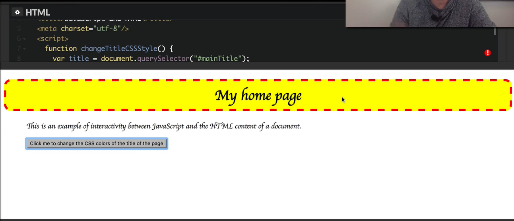{width="6.5in" height="2.323611111111111in"} -->
<h6 align="center">
<a href="https://codepen.io/w3devcampus/pen/WjMMLZ" target="_blank" rel="noopener noreferrer">Demo (CodePen)</a></h6>

<h5>1.2) Local scope / local variable (also called function scope)</h5>

Variables declared with the keyword var in a function, are said to
be &quot;local to the function&quot;. They &quot;mask&quot; any global variable that may
have the same name.

<b>When a variable is declared in a function, we also call it simply &quot;a
local variable&quot;</b>, as opposed to &quot;a global variable&quot;. <b>In JavaScript
5 (and this is not common in programming languages), local variables
are local to the function.</b> They can be used anywhere inside the
function.

Most programming languages have local variables that are limited to the
block of instructions between &apos;{&apos; and &apos;}&apos; that contains the variable
declaration. We call these variables &quot;block variables&quot;. This is the
case with variables declared with the let keyword  introduced by
JavaScript 6 / ES6. See examples at the end of this section.

Example of a local variable declared in a function, that is NOT local to
the block, but to the whole function:
<!--~~~~~~~~~~~~~~~~~~~~~~~~~~~~~~~~~~~~~~~~~~~~~~~~~~~~~~~~~~~~~~~~~~~~~~~~~~~~~~~~~~~~~~~~~~~~-->
<!--~~~~~~~~~~~~~~~~~~~~~~~~ 143.  (124) ~~~~~~~~~~~~~~~~~~~~~~~~~~~~-->
<p align="center" width="100%">

<!-- 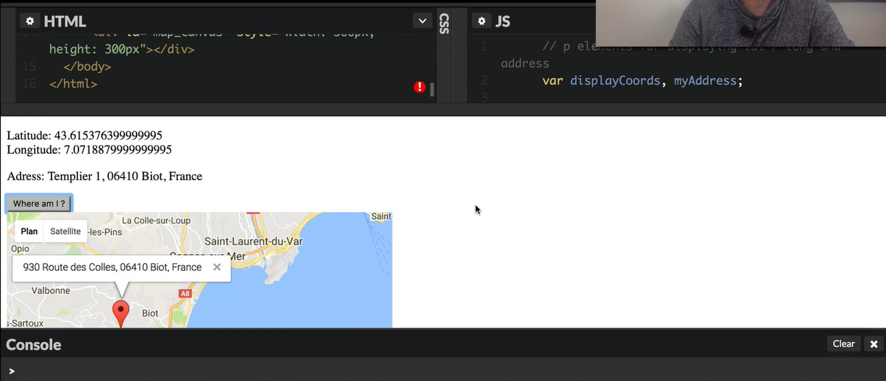{width="6.5in"
height="2.357638888888889in"} -->

https://codepen.io/w3devcampus/pen/RVMOGx

Here is another example that shows the differences between global and
local variables, and highlights the &quot;masking&quot; of global variables by
local variables when they share the same name.
<!--~~~~~~~~~~~~~~~~~~~~~~~~~~~~~~~~~~~~~~~~~~~~~~~~~~~~~~~~~~~~~~~~~~~~~~~~~~~~~~~~~~~~~~~~~~~~-->
<!--~~~~~~~~~~~~~~~~~~~~~~~~ 144.  (125) ~~~~~~~~~~~~~~~~~~~~~~~~~~~~-->
<p align="center" width="100%">

<!-- 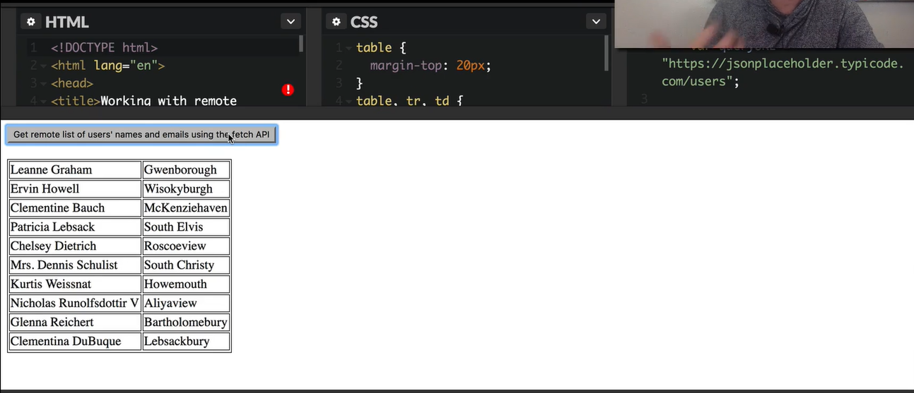{width="6.5in"
height="3.3743055555555554in"} -->

https://codepen.io/w3devcampus/pen/oWEEmN

<h5>1.3) Never declare a variable without the keyword var!</h5>

JavaScript is sometimes an overly permissive language. We can make
stupid errors that turn out to be very hard to detect. One such error
occurs when we forgot to use the var keyword while declaring a local
variable.

In JavaScript 5 / ES5, a variable declared in a function without
the var keyword, makes it a global variable.

<b>BEST PRACTICE: in JavaScript 5 / ES5, always use the keyword var when
declaring a global or a local variable.</b>

<b>Better: use the keyword let if you target browsers that support
JavaScript 6 or above.</b>

Here is an example that shows what happens when you forget to use var or
let while declaring a local variable:
<!--~~~~~~~~~~~~~~~~~~~~~~~~~~~~~~~~~~~~~~~~~~~~~~~~~~~~~~~~~~~~~~~~~~~~~~~~~~~~~~~~~~~~~~~~~~~~-->
<!--~~~~~~~~~~~~~~~~~~~~~~~~ 145.  (126) ~~~~~~~~~~~~~~~~~~~~~~~~~~~~-->
<p align="center" width="100%">

<!-- 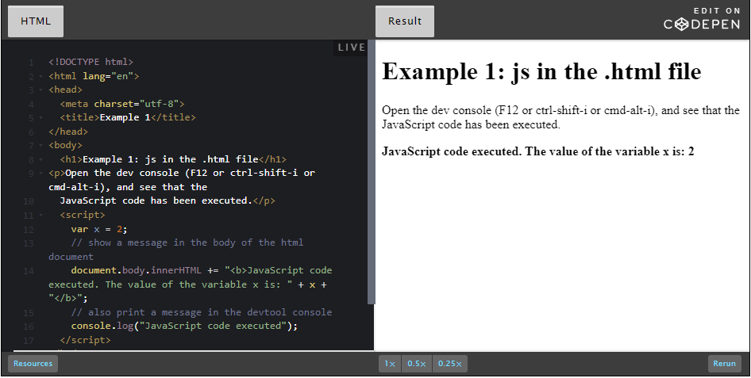{width="6.5in" height="3.941666666666667in"} -->

https://codepen.io/w3devcampus/pen/rmJJbo
<!--~~~~~~~~~~~~~~~~~~~~~~~~~~~~~~~~~~~~~~~~~~~~~~~~~~~~~~~~~~~~~~~~~~~~~~~~~~~~~~~~~~~~~~~~~~~~-->
<!--~~~~~~~~~~~~~~~~~~~~~~~~ 146.  (126) ~~~~~~~~~~~~~~~~~~~~~~~~~~~~-->
<p align="center" width="100%">

<!-- {width="6.375in"
height="1.2871139545056869in"} -->

<h5>2) Since 2015 and ES2015, there are new scopes, with the let keyword</h5>

<b>Modern JavaScript has the let keyword for declaring variables, and
the const keyword for declaring constants.</b>

<b>Modern JavaScript has two scopes:</b> <b>1) a global scope</b> for
declaring global variables, and<b> 2) a block scope</b> for declaring
variables between { and }. This is similar to what we find in many other
programming languages such as Java, C# etc.

Furthermore, like in most programming languages, inside a block, <b>a
local variable masks other variables located in higher scopes (global or
in another block that contains the current block).</b>

Example of a local variable declared with the let keyword. Its scope is
the block:
<!--~~~~~~~~~~~~~~~~~~~~~~~~~~~~~~~~~~~~~~~~~~~~~~~~~~~~~~~~~~~~~~~~~~~~~~~~~~~~~~~~~~~~~~~~~~~~-->
<!--~~~~~~~~~~~~~~~~~~~~~~~~ 147.  (127) ~~~~~~~~~~~~~~~~~~~~~~~~~~~~-->
<p align="center" width="100%">

<!-- 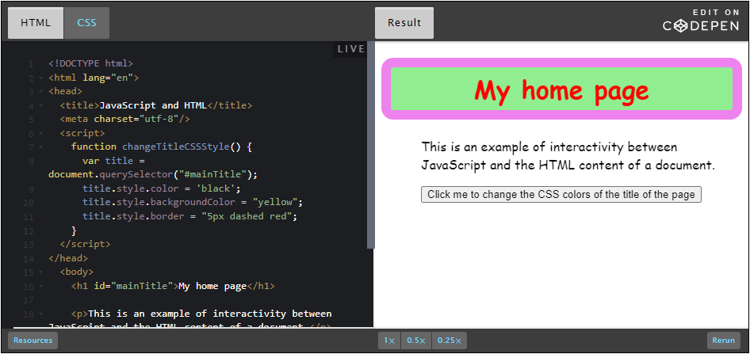{width="6.5in" height="2.46875in"} -->

https://codepen.io/w3devcampus/pen/VbXNPz

<h5>3) Recommended way to declare variables: var or let?</h5>

Well, all modern browsers support the let and const keywords, however,
you might find lots of examples that still use the var keyword&hellip;

<b>Anyway, we highly recommend to use let and const instead of var, for
declaring variables and constants!</b>

<!--~~~~~~~~~~~~~~~~~~~~~~~~~~~~~~~~~~~~~~~~~~~~~~~~~~~~~~~~~~~~~~~~~~~~~~~~~~~~~~~~~~~~~~~~~~~~-->
<h3 id="ch1-5-3">1.5.3 JS data types (5:27)</h3>
<!--~~~~~~~~~~~~~~~~~~~~~~~~~~~~~~~~~~~~~~~~~~~~~~~~~~~~~~~~~~~~~~~~~~~~~~~~~~~~~~~~~~~~~~~~~~~~-->

Hi!

Let's talk about JavaScript data types.

The data type of variable is the kind of value you can give to this
variable.

With JavaScript, there are many possibilities: even if when you declare
a variable, you don't type if data type: "var x=10", the value you give
to this variable will help JavaScript figure out the data type of this
variable.

And there is an operator named "typeof" that you can use for visualizing

the internal data table of variable. So "var x=10", this corresponds to
a number. If I give to "x" a string value like my name, then the type of
"x" will be "string". It changed its internal type on the fly, we call
this "dynamic typing". What kind of data types can we get? String,
number, we've got also boolean value: "var x = true" or "x = false"
corresponds to a boolean value: "typeof x"... boolean.

And I can say "if (x)" then... do something... "console.log("it's
true!!!")" and the boolean data types is useful for "if" statements or
some other statements that will test boolean value.

In that case, it printed "it's true!!!" because "x" was "true".

If I give to "x" the value "false", then if I execute this code, it will
do nothing because "x" is false.

We've got also some special values&hellip; but "typeof y": undefined.

I can test if y is undefined then ....And in that case, you can test if
a variable is defined or not.

There is a special data type called "null" that corresponds to "no
value".

The difference with the null defined variable is that the variable that
has the value of null is still defined.

Like "y" is not defined here... but if I say "z = null" then "z" is
defined.

Ok, this has not been printed because "z" was not undefined. OK, another
common value we give to variable is object. An object is something like
this: property, value. And if I look at the type of "person", it will
say: object. And object is a structured variable, I can use the "."
operator to check the value of some property.

So "person.familyName" will print the value "Buffa" .... "person.name"
will print my given name. There is a particular case for arrays. Arrays
are defined using "brackets". If I define an array with two names of
days in a week: Monday and Tuesday, then, its type is also &quot;object&quot;.
There is no type that is called &quot;array&quot;. Arrays are objects in
JavaScript. To sum up, we've got: number, string, Boolean, undefined,
and null and object.

Nothing else. And the "typeof" operator can be used to display the type
of an object.
<!------------------------------------------------------------------------------------------------>
<h4>What kind of values can we assign to a variable?</h4>

Well, there are multiple possibilities:

What we call &quot;primitive data types&quot;: for example a number, a string,
etc. ex:
<!--~~~~~~~~~~~~~~~~~~~~~~~~~~~~~~~~~~~~~~~~~~~~~~~~~~~~~~~~~~~~~~~~~~~~~~~~~~~~~~~~~~~~~~~~~~~~-->
<!--~~~~~~~~~~~~~~~~~~~~~~~~ 148.  (129) ~~~~~~~~~~~~~~~~~~~~~~~~~~~~-->
<p align="center" width="100%">


<pre>
var x = 3; var name = "Buffa";
<a href="" target="_blank" rel="noopener noreferrer">a set of playing cards</a>
](./images/image118.png){width="2.0833333333333335in" height="1.25in"}
</pre>

1.  Objects (everything that is not a  &quot;primitive data type&quot; is an
    object):
    var michel =

    -   There is a set of &quot;predefined objects&quot; in JavaScript (arrays,
        functions, etc). We will come back on these later in the course.

<h4>JavaScript has a small set of primitive data types</h4>

-   <b>number</b>: 1,2,105,3.14 &hellip;

-   <b>string</b>: &apos;a&apos;, &quot;one&quot;, &apos;two&apos; , &apos;World Wide Web&apos; &hellip;

-   <b>boolean</b>: true / false

-   <b>undefined</b>: absent or unknown value

-   <b>null</b>: special keyword, meaning no value or empty. The difference
    from undefined is that when a variable is null, it is still defined.

These are the simplest forms of data we can use in programming.

Anything that is not listed above is <b>an object </b>(JavaScript objects
are covered later in Module 3)<b>.</b> 

<b>You said JavaScript does not have types for variables?</b>

No! I said that JavaScript is weakly typed; you do not declare the type
of variable. In some other languages (Java language syntax, for
instance) instead of var x=2; or let name=&quot;Buffa&quot;; you would write int
x=2; or String name = &quot;Buffa&quot;;, with the datatype explicit in the
variable declaration.

<h4>Knowing the type of a JavaScript variable: the typeof operator</h4>

The next section of the course talks about &quot;operators&quot; but there is
one that is better introduced in this section: the <b>typeof</b> operator,
that is useful for knowing the type of a variable depending in its value
(possible values: number, string, boolean, undefined, object,
or function)

We will use it in lots of examples in the next three sections.

<!--~~~~~~~~~~~~~~~~~~~~~~~~~~~~~~~~~~~~~~~~~~~~~~~~~~~~~~~~~~~~~~~~~~~~~~~~~~~~~~~~~~~~~~~~~~~~-->
<!--~~~~~~~~~~~~~~~~~~~~~~~~ 149.  (130) ~~~~~~~~~~~~~~~~~~~~~~~~~~~~-->
<p align="center" width="100%">

<!-- <image149.jpeg>
{width="5.0in"
height="2.5648020559930007in"} -->

This operator is not often use in JavaScript programs, but it&apos;s useful
for us, for explaining the data types.

<!--~~~~~~~~~~~~~~~~~~~~~~~~~~~~~~~~~~~~~~~~~~~~~~~~~~~~~~~~~~~~~~~~~~~~~~~~~~~~~~~~~~~~~~~~~~~~-->
<h3 id="ch1-5-4">1.5.4 Numbers</h3>
<!--~~~~~~~~~~~~~~~~~~~~~~~~~~~~~~~~~~~~~~~~~~~~~~~~~~~~~~~~~~~~~~~~~~~~~~~~~~~~~~~~~~~~~~~~~~~~-->
<!--~~~~~~~~~~~~~~~~~~~~~~~~~~~~~~~~~~~~~~~~~~~~~~~~~~~~~~~~~~~~~~~~~~~~~~~~~~~~~~~~~~~~~~~~~~~~-->
<!--~~~~~~~~~~~~~~~~~~~~~~~~ 150. numbers 1 thu 9, then 0, twice (130) ~~~~~~~~~~~~~~~~~~~~~~~~~~~~-->
<p align="left" width="100%">

  
<h4>Number values can be:</h4>

<ul>
  <li><b>Integer</b>: 1, 4, 274929</li>
</ul>

<p>Type 343 in the devtool console, and after you press the Enter key,  the
 corresponding value (343) will be displayed.</p>

<ul>
  <li><b>Signed integer</b>: -17</li>
  <li><b>Decimal</b>: 3.46, -466.8770</li>
</ul>

<p>Examples of integer and decimals:</p>

<pre>
var n=1;
undefined
&gt; typeof n;
"number"

&gt; n=1234;
1234

&gt; typeof n;
"number"

&gt; n=1.23;
1.23

&gt; typeof n;
"number"

&gt; typeof 123;
"number"
</pre>

<ul>
  <li><b>Scientific notation</b>: 3.46e4, 5.3e+6, 5344000e-5</li>
</ul>

<pre>
3.46e4 equals 3.46 x 10&#94;4 equals 34600
</pre>

<h4>Examples:</h4>

<pre>
&gt; 1e1;
10

&gt; 1e+1;
10

&gt; 2e+3;
2000

&gt; typeof 2e+3;
"number"

&gt; 2e-3;
0.002

&gt; 123.456E-3;
0.123456

&gt; typeof 2e-3;
"number"
</pre>

<ul>
  <li><b>Octal</b>: 010</li>
</ul>

<b>Be careful with this, don&apos;t start an integer with 0 (zero),
JavaScript will understand it as an octal value.</b>

<pre><code>010 equals 8 which means 1 * 8^1 + 0 * 8^0</code></pre>

<pre><code>The number 0456 means 4 * 8^2 + 5 * 8^1 + 6 * 8^0</code></pre>

<b>Question 1</b>: What&apos;s the result, as an integer, of the
operation: 24 - 024?

<b>Explanation 1</b>: 24 is an integer which equals 24 but 024 is an octal
value which equals 20.

<b>Question 2</b>: Which value will be displayed in the devtool console if
you type 098 followed by the Enter key?

<b>Explanation 2</b>: 9 and 8 don&apos;t exist in base 8 (only 0 to 7), so the
typed number will be considered as an integer.

<ul>
  <li><b>Hexadecimal</b>: 0xF3</li>
</ul>

<pre><code>0xFF equals 255, 0xF3 means 15 * 16^1 + 3 * 16^0 and the resulting
value is 243</code></pre>

<h4>Examples of octal and hexadecimal data types:</h4>

<pre>
&gt; var n3 = 0377;
undefined
 
&gt; typeof n3;
"number"
 
&gt; n3;
255
 
&gt; var n4 = 0x00;
undefined
 
&gt; typeof n4;
"number"
 
&gt; n4;
0
 
&gt; var n5 = 0xFF;
undefined
 
&gt; typeof n5;
"number"
 
&gt; n5;
255
</pre>

<h5><b>Special values</b>:</h5>

<ul>
  <li>+Infinity</li>
  <li>-Infinity</li>
  <li>NaN (Not a Number)</li>
</ul>

The value Infinity (or +Infinity) represents all number values greater
than 1.79769313486231570e+308 and -Infinity represents values smaller
than -1.79769313486231570e+308.

Finally, Nan represents <b>not-a-number</b> values, for example if you try
to divide 0 by 0 (type 0/0 in the devtool console).

<pre>
&gt; 0 / 0;
NaN
 
&gt; 3 / 0;
Infinity
</pre>

<h4>Examples:</h4>

<p>Any operation with Infinity gives Infinity as a result:</p>

<pre>
1.   &gt; Infinity;
2.   Infinity
3.   
4.   &gt; typeof Infinity;
5.   "number"
6.   
7.   &gt; 1e309;
8.   Infinity
9.   
10.  &gt; 1e308;
11.  1e+308
12.  
13.  &gt; var a = 6 / 0;
14.  undefined
15.  
16.  &gt; a;
17.  Infinity
18.  
19.  &gt; var i = -Infinity;
20.  undefined
21.  
22.  &gt; i;
23.  -Infinity
24.  
25.  &gt; typeof i;
26.  "number"
27.  &gt; Infinity - Infinity;
28.  NaN
29.   
30.  &gt; -Infinity + Infinity;
31.  NaN
</pre>

<pre>
1.  &gt; Infinity - 20;
2.  Infinity
3.   
4.  &gt; -Infinity &ast; 3;
5.  -Infinity
6.   
7.  &gt; Infinity / 2;
8.  Infinity
9.   
10. &gt; Infinity - 9999999999999;
11. Infinity
</pre>

<h4>Examples with NaN:</h4>

<p>NaN is a special value and its type is &quot;Number&quot;!</p>

<pre>
1.  &gt; typeof NaN;
2.  "number"
3.   
4.  &gt; var a = NaN;
5.  undefined
6.   
7.  &gt; a;
8.  NaN 

&gt; var a = 10 &ast; "f";
  undefined
  
&gt; a;
  NaN 
  
&gt; 1 + 2 + a;
  NaN
</pre>

<h4>&lbrack;ADVANCED&rbrack; Optional explanations about numbers</h4>

In JavaScript, numbers are represented with a double-precision 64-bit
format (IEEE 754). These 64 bits are used with this table:

| Total bits |   Sign  | Exponent | Significant |
|------------|---------|----------|-------------|
| 64 |  1 |  11 | 52 |

<h5>What does it mean?</h5>

First, each number is represented as a float. For example, 1 equals 1.0.
But there are approximation errors that are well-known in float
calculations. One common example of errors due to the approximation of
floating point numbers is that 0.1 + 0.2 does not equal 0.3. 

<pre>
&gt; 0.1 + 0.2;
0.30000000000000004
</pre>
<!--~~~~~~~~~~~~~~~~~~~~~~~~~~~~~~~~~~~~~~~~~~~~~~~~~~~~~~~~~~~~~~~~~~~~~~~~~~~~~~~~~~~~~~~~~~~~-->
<!--~~~~~~~~~~~~~~~~~~~~~~~~ 151.  (135) ~~~~~~~~~~~~~~~~~~~~~~~~~~~~-->
<p align="center" width="100%">

<!-- {width="6.635416666666667in"
height="1.5729166666666667in"}  -->

Second, an integer has 2&#94;52 relevant bits, so the biggest integer
is 2&#94;53. There is one bit that determines the sign of the number, so
the smallest signed integer is -2&#94;53.

<b>Note</b>: Some arithmetic functions use only numbers with a 32-bit
format. Larger numbers will be converted&hellip;

For more information about floating point numbers, 
<a href="https://en.wikipedia.org/wiki/IEEE_floating_point">
follow this link at Wikipedia</a>.

<!--~~~~~~~~~~~~~~~~~~~~~~~~~~~~~~~~~~~~~~~~~~~~~~~~~~~~~~~~~~~~~~~~~~~~~~~~~~~~~~~~~~~~~~~~~~~~-->
<h3 id="ch1-5-5">1.5.5 JS operators and expressions</h3>
<!--~~~~~~~~~~~~~~~~~~~~~~~~~~~~~~~~~~~~~~~~~~~~~~~~~~~~~~~~~~~~~~~~~~~~~~~~~~~~~~~~~~~~~~~~~~~~-->
<b>An expression</b> is a small piece of code used to produce a value.

For example, the expression 3 + 5 produces the value 8, and the
value 11 alone is also an expression. Within an expression, we can find
values, variables, operators, and expressions. The first two have been
already described above, so all that&apos;s left are <b>operators</b>.

In JavaScript, <b>an operator</b> can be unary or binary (plus one ternary
operator). A unary operator is applied to one expression. It can be
prefixed or suffixed.

<h5>Unary operator example:</h5>

<pre>
typeof 'world';
</pre>

A binary operator is applied to two different expressions, and is both
prefixed and suffixed.

<h5>Binary operator example:</h5>

<pre>
var x = 45 / 32;
</pre>

<h5>The division operator is binary</h5>

Within an expression, we can also use parentheses to force the execution
of the expression inside. Parentheses can be used to indicate
precedence.   

For example, this is an expression: (3 + 2). And the expression (3 + 2)
&ast; 4, which equals 20, depends on the expression within the parentheses.

<!--~~~~~~~~~~~~~~~~~~~~~~~~~~~~~~~~~~~~~~~~~~~~~~~~~~~~~~~~~~~~~~~~~~~~~~~~~~~~~~~~~~~~~~~~~~~~-->
<!--~~~~~~~~~~~~~~~~~~~~~~~~ 152.  (10) ~~~~~~~~~~~~~~~~~~~~~~~~~~~~-->
<p align="left" width="100%">

<!-- 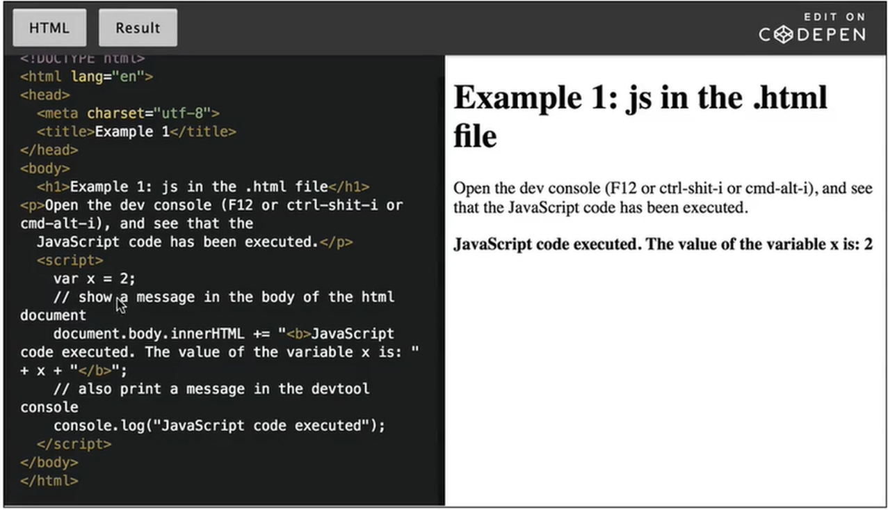{width="2.0833333333333335in"
height="1.2291666666666667in"} -->

In JavaScript, expressions can evaluate to four types, which
are: numbers, strings, booleans, and objects. For example, an expression
with the operator - will evaluate to a number. But an expression with
the operator + can evaluate to a number or a string (for addition or
concatenation).

<!--~~~~~~~~~~~~~~~~~~~~~~~~~~~~~~~~~~~~~~~~~~~~~~~~~~~~~~~~~~~~~~~~~~~~~~~~~~~~~~~~~~~~~~~~~~~~-->
<h3 id="ch1-5-6">1.5.6 Strings (part 1) (4:12)</h3>
<!--~~~~~~~~~~~~~~~~~~~~~~~~~~~~~~~~~~~~~~~~~~~~~~~~~~~~~~~~~~~~~~~~~~~~~~~~~~~~~~~~~~~~~~~~~~~~-->

To declare or manipulate strings you must write them with <b>single
quotes &apos; or double quotes &quot;</b> around them. Single quotes or double
quotes are both accepted, and there is no difference between them in
JavaScript. However, the community prefers to use single quote for
string - this is not a convention, but a recommendation.

And finally, you cannot start a string with a single and end with a
double quotes, or the opposite.

<pre>
&gt; "Hello World";
"Hello World"
 
&gt; "JavaScript Course";
"JavaScript Course"
 
&gt; 'With simple quotes';
"With simple quotes"
 
&gt; "Do not mix double and simple quotes'; // here we opened the string
with double and closed with simple quotes
</pre>

VM24763:1 Uncaught SyntaxError: Invalid or unexpected token

<h5>Image from the devtool console, from the above example:</h5>
<!--~~~~~~~~~~~~~~~~~~~~~~~~~~~~~~~~~~~~~~~~~~~~~~~~~~~~~~~~~~~~~~~~~~~~~~~~~~~~~~~~~~~~~~~~~~~~-->
<!--~~~~~~~~~~~~~~~~~~~~~~~~ 154.  (144) ~~~~~~~~~~~~~~~~~~~~~~~~~~~~-->
<p align="center" width="100%">

<!-- {width="6.583333333333333in"
height="2.4791666666666665in"} -->

##### There are many reasons to use simple quotes when possible:

1.  Double quotes are used in HTML

2.  You must hold the Shift key to type &quot;

3.  Single quotes are easier to read and to type

4.  To output HTML in JavaScript, single quotes are more useful
<!--~~~~~~~~~~~~~~~~~~~~~~~~~~~~~~~~~~~~~~~~~~~~~~~~~~~~~~~~~~~~~~~~~~~~~~~~~~~~~~~~~~~~~~~~~~~~-->
<h3 id="ch1-5-7">1.5.7 Strings (part 2)</h3>
<!--~~~~~~~~~~~~~~~~~~~~~~~~~~~~~~~~~~~~~~~~~~~~~~~~~~~~~~~~~~~~~~~~~~~~~~~~~~~~~~~~~~~~~~~~~~~~-->

<!--~~~~~~~~~~~~~~~~~~~~~~~~~~~~~~~~~~~~~~~~~~~~~~~~~~~~~~~~~~~~~~~~~~~~~~~~~~~~~~~~~~~~~~~~~~~~-->
<h3 id="ch1-5-8">1.5.8 String operators (6:44)</h3>
<!--~~~~~~~~~~~~~~~~~~~~~~~~~~~~~~~~~~~~~~~~~~~~~~~~~~~~~~~~~~~~~~~~~~~~~~~~~~~~~~~~~~~~~~~~~~~~-->

Strings can be defined using double quotes, or simple quotes.

Don&apos;t mix double and single quotes, it&apos;s not going to work.

You can mix them, but inside a string defined with simple quotes, you
can use &quot;hello my name is Michel...&quot;.

This works because I used double quotes inside a string defined with
simple quotes.

I can do the reverse: use simple quotes inside a string defined with
double quotes.

But if I wanted to use the simple quote like for &quot;I&apos;m your teacher&quot;,
you see that the color changes because this is not correct.

So, in that case you must use the antislash (&#92;)...

Like this&hellip; you escape the simple quote that confuses the JavaScript
interpreter, and you can, in that case, display simple quotes inside a
string that has been defined using simple quotes. So, the &#92; character
is also useful for printing special characters.

For "s1 = My&#92;n" ... it means &quot;go to the next line&quot;&hellip;

if I print "s1 = My&#92;&#92;nName&#92;&#92;Is&#92;&#92;Michel". You saw the carriage return
here, I came to the next line. .

Ok, let me fix it by adding &#92;&#92;n

In that case each word is on a different line. You can use also &#92;&#92;t for
inserting a tab, and &#92;&#92;&#92;&#92; for displaying the &#92;&#92; character itself.

In that case, you can display the &#92;&#92; character itself using double
antislash.

Ok, let&apos;s talk about string operators. So the "+" operator is the most
common one, it&apos;s useful for concatenating values to any string. Let&apos;s
look at one example.

If I say &apos;my name is&apos; + &apos;Michel Buffa', then you see that the result
here is the concatenation of the string 'my name is' and the string
'Michel Buffa'. You can also use variables of different types, that will
be converted to strings, if some parts of the + operator, some sides of
the operator, are strings.

Ok. If I try&hellip;

You see that the value of s is the concatenation of the string &quot;value
of x &quot; and the number value of x (that was 10), has been converted and
concatenated to it.

There are also some ways to convert variables to strings.

x here, is a number, but x = &quot;&quot; + 10; in that case,

x is a string. So, you can also concatenate string values... so s1 =
&quot;one&quot;, s2 = &quot;two&quot;, if I concatenate these values here, s is equal to
the concatenation of s1 and s2.

There is also an assignment operator called += that can be very useful
when concatenating values to a string. Like var s=Hello; s+=&quot;My
friend&quot;, you give a value of s=&quot;Hello my Friend&quot;.

The += means s = s+something, so it adds to the end of s. I can also use
strings in mathematical operations, and they can be converted
automatically. So I&apos;ve got s2 that is 10.

s2 is a string, and if I do s2=s2 &ast; 2; in that case, s2 has been
converted automatically.

The value &quot;10&quot; as a string became 10 as a number. And s2 now is a
number that is worth twice its previous value. If I try to use a string
that is not a number, not a value that can be converted to a number,
like &quot;hello&quot;&hellip; in that case -if do the same operation- I the result
is NaN that means &quot;Not a Number&quot;, you cannot convert &quot;hello&quot; to a
number that can be used in a mathematical expression or multiplied by
two.
<!------------------------------------------------------------------------------------------------>
#### Introduction to string operators

#### The concatenation operator (+)

The operator (+) used with strings is called the concatenation operator,
and it allows you to concatenate strings.

<pre>
1.  //the operator (+)
2.  var s1 = 'one';
3.  var s2= 'two';
4.  var s = s1 + s2;
5.  s;
6.  // returns 'onetwo'
7.  typeof s;
8.  //'string'
</pre>

<h4>The shorthand assignment operator (+=)</h4>

<p>The shorthand assignment operator (+=) can also be used to concatenate
strings.</p>

<pre>
//the assignment operator (+=)
var s1 = 'one';
var s2 = 'two';
s1+= s2; // or directly s1+='two'
s1;
//returns 'onetwo'
&lt;h4&gt;The method concat()&lt;/h4&gt;
&lt;p&gt;Another way to concatenate strings is the method concat().&lt;/p&gt;
//the 'concat' method
var s1 = 'one';
var s2 ='two';
var s = s1.concat(s2);
s;
//returns 'onetwo'
&lt;p&gt;All the methods shown above can be used with a variable number of arguments:&lt;/p&gt;
var s1 = 'Hello';
s1 = s1 + ' World' + ' JavaScript';
var s2 = 'Hello';
s2+= ' World' + ' JavaScript';
var s3 = 'Hello';
s3.concat(' World' , ' JavaScript' );
//s1,s2 and s3 return 'Hello World JavaScript'
</pre>

<h4>Converting strings</h4>

A String number in an arithmetic expression is converted to Number,
unless the formula is a pure addition.

<pre>
&gt; var s = '1'; s = 3 &ast; s; typeof s;
"number"
 
&gt; s;
3
 
&gt; var s = '1'; s++; typeof s;
"number"
 
&gt; s;
2
 
&gt; var s = "100"; typeof s;
"string"
 
&gt; s = s &ast; 1;
100
 
&gt; typeof s;
"number"
 
&gt; var d = "101 dalmatians";
undefined
 
&gt; d &ast; 1;
NaN
</pre>

<h4>The above example is shown in the devtools console:</h4>
<!--~~~~~~~~~~~~~~~~~~~~~~~~~~~~~~~~~~~~~~~~~~~~~~~~~~~~~~~~~~~~~~~~~~~~~~~~~~~~~~~~~~~~~~~~~~~~-->
<!--~~~~~~~~~~~~~~~~~~~~~~~~ 155.  (148) ~~~~~~~~~~~~~~~~~~~~~~~~~~~~-->
<p align="center" width="100%">

<!-- {width="3.4791666666666665in"
height="5.458333333333333in"} -->

#### How to convert a Number into a String

There is trick for converting a Number into a String: we concatenate
with an empty string, at the beginning of expression (type this in the
devtools):

<pre>
var n = 1;
typeof n;
// returns "number"
n = "" + n;
// returns "1"
typeof n;
// returns "string"
</pre>

#### Special character: the &quot;&#92;&#92;&quot;
The &#92;&#92; is useful for &quot;escaping&quot; special characters. Here are a few
examples:

<pre>
var s = 'I don't know';
var s = "I don't know"; // here the &#92; is useless
var s = "I don't know";  // same result as previous line
var s = '"Hello", he said.'; // ok, double quotes inside single one will be displayed
var s = "&#92;"Hello&#92;", he said."; // double quotes inside double quotes need to be escaped
</pre>

#### Escaping the escape! Use a double &quot;&#92;&quot;

<pre>
var s = "1&#92;&#92;2"; s;
// returns "1&#92;2"
</pre>

#### Special characters starting with &quot;&#92;&quot;

##### &quot;&#92;n&quot; for &quot;next line&quot;:

<pre>
var s = '&#92;n1&#92;n2&#92;n3&#92;n';
s
// returns "
1
2
3
"
</pre>

##### &quot;&#92;r&quot; for &quot;carriage return&quot;:

<pre>
var s = '1&#92;r2';
var s = '1&#92;n&#92;r2';
var s = '1&#92;r&#92;n2';
// the three previous lines give :
"1
2"
</pre>

<h5>&quot;&#92;t&quot; for &quot;insert a tabulation&quot;:</h5>

<pre>
var s = "1&#92;t2"
// s is equal to
"1 2"
</pre>
<!--~~~~~~~~~~~~~~~~~~~~~~~~~~~~~~~~~~~~~~~~~~~~~~~~~~~~~~~~~~~~~~~~~~~~~~~~~~~~~~~~~~~~~~~~~~~~-->
<h3 id="ch1-5-9">1.5.9 Objects (part 1)</h3>
<!--~~~~~~~~~~~~~~~~~~~~~~~~~~~~~~~~~~~~~~~~~~~~~~~~~~~~~~~~~~~~~~~~~~~~~~~~~~~~~~~~~~~~~~~~~~~~-->
We have already encountered objects in different examples. You can
easily recognize these objects:

They are declared using &quot;{&quot; and &quot;}&quot;, such as in var p = ,
givenName and familyName are called &quot;properties&quot;
and Michel and Buffa are their respective values.

We are using the &quot;.&quot; operator to access their properties or methods.
Example : daysOfTheWeek.length (arrays are objects too - special ones,
but objects), or document.body or window.innerWidth (try typing that in
the devtool console). There are plenty of predefined objects in
JavaScript (window, document, navigator, etc.). We have also
used console.log(&hellip;), and indeed console is a predefined JavaScript
object. With the object var p = {givenName:&apos;Michel&apos;, familyName:
&apos;Buffa&apos;}, we can access the properties the same way,
with: p.givenName and p.familyName.

<h4>Take a look at some common objects and properties!</h4>

Open your devtool console (F12 or ctrl-alt-i or cmd-alt-i on Mac), go to
the console tab and type &quot;window&quot; followed by a &quot;.&quot;, normally you
should see an auto-completion menu. Start typing &quot;inne&quot; and you should
see some possible completions.

Try looking at the values of the size of the current browser window
(type window.innerWidth followed by the &quot;enter/return&quot; key,
type window.innerHeight, etc.).

Try looking at the vendor of your browser: type &quot;navigator.vendor&quot;,
try looking at the current URL displayed in your window:
type window.location, etc.

We will study these objects later, but for the moment, just play with
objects :-)

<pre>
&gt; window.innerHeight
217
&gt; window.innerWidth
1704
&gt; navigator.vendor
"Google Inc."
</pre>

<h4>You can define your own objects</h4>

There are many ways to create your own JavaScript objects. For the
moment, let&apos;s stick to the simplest one, &quot;singleton objects&quot;, and for
now all you need to know is that they can have properties that hold
values. We will return to objects in Week 4 and cover them in further
detail.

```
var student1 = {
    fullName:'John Doe',
    age: 23,
    city: 'New York',
    ssn: "11-22-33-44" // no comma at the end of the last property
}                      // declaration
```

Accessing an object&apos;s properties: we use the operator &quot;.&quot;

```
> student1.ssn
"11-22-33-44"
> student1.age
23
> student1
[object Object] {
    age: 23,
    city: "New York",
    fullName: "John Doe",
    ssn: "11-22-33-44"
}
```

<!--~~~~~~~~~~~~~~~~~~~~~~~~~~~~~~~~~~~~~~~~~~~~~~~~~~~~~~~~~~~~~~~~~~~~~~~~~~~~~~~~~~~~~~~~~~~~-->
<h3 id="ch1-5-10">1.5.10 Arrays (part 1)</h3>
<!--~~~~~~~~~~~~~~~~~~~~~~~~~~~~~~~~~~~~~~~~~~~~~~~~~~~~~~~~~~~~~~~~~~~~~~~~~~~~~~~~~~~~~~~~~~~~-->
#### Definition: arrays are containers with indexes

Arrays are a special datatype. You declare arrays using brackets, like
this:

<pre>
var daysOfWeek = &lbrack;&rbrack;;
</pre>

You can fill them at declaration time:

<pre>
1.  var daysOfWeek = &lbrack;'Monday', 'Tuesday', 'Wednesday', 'Thursday', 'Friday', 'Saturday', 'Sunday'&rbrack;;
2.  var gradesInMaths = &lbrack;12, 7, 14, 18, 9, 11&rbrack;;
</pre>

#### Elements in an array can be accessed using <b>indexes</b>

Each element in an array has an index. <b>The first element&apos;s index is
0</b>, the second element&apos;s index is 1 etc.

To access an element, you use the array variable and &quot;&lbrack;&quot; followed by
the index value followed by &quot;&rbrack;&quot;, as shown in these examples:

<pre>
1.  var daysOfWeek = &lbrack;'Monday', 'Tuesday', 'Wednesday', 'Thursday', 'Friday', 'Saturday', 'Sunday'&rbrack;;
2.  undefined
3.  daysOfWeek&lbrack;0&rbrack;
4.  "Monday"
5.  daysOfWeek&lback;1&rbrack;
6.  "Tuesday"
7.  daysOfWeek&lbrack;2&rbrack;
8.  "Wednesday"
9.  daysOfWeek.length
10. 7
</pre>

#### Use the length property of an array to know its length

<pre>
1.  var daysOfWeek = &lbrack;'Monday', 'Tuesday', 'Wednesday', 'Thursday','Friday', 'Saturday', 'Sunday'&rbrack;;
2.  undefined
3.  daysOfWeek.<b>length</b>
4.  <b>7</b>
</pre>

Indeed, there are seven days in a week and the daysOfWeek array
has seven elements, indexed from <b>0</b> to <b>daysOfWeek.length -1</b>

<b>This way of enumerating all elements (from 0 to the length of the
array -1) is very, very common, and will prove to be very useful when
you learn how to iterate on an array&apos;s elements (Week 2).</b>

#### You can add elements to an array using a new index

If you want to add a new element at the end of an array, use the index
equal to the length of the array

<pre>
1.  <b>var daysOfWeek = &lbrack;'Monday', 'Tuesday', 'Wednesday', 
	  'Thursday', 'Friday';, 'Saturday'&rbrack;;</b>
2.  <b>undefined</b>
3.  <b>daysOfWeek.length</b>
4.  <b>6</b>
5.  <b>daysOfWeek&lbrack;6&rbrack;</b>
6.  <b>undefined</b>
7.  <b>// NO ELEMENT AT INDEX 6 in an array of 6 elements, first index is
    0 // last 6-1 = 5</b>
8.  &gt; daysOfWeek<b>&lbrack;6&rbrack; = 'Sunday'</b>
9.  <b>"Sunday"</b>
10. <b>daysOfWeek.length</b>
11. <b>7</b>
12. <b>// Sunday, the 7th day of week is at index 6 !</b>
</pre>

<h4>Arrays are JavaScript objects!</h4>

<p>Well, this is not so important for the moment, but look:</p>

<pre>
1.  &gt; var a = &lbrack;&rbrack;;
2.  &gt; <b>typeof a;</b>
3.  <b>"object"</b>
4.  &gt; var a = &lbrack;1,2,3&rbrack;;
5.  &gt; a
6.  &lbrack;1, 2, 3&rbrack;
7.  &gt; a&lbrack;0&rbrack;
8.  1
9.  &gt; a&lbrack;1&rbrack;
10. 2
</pre>

And indeed, when you write daysOfWeek.length, you are using the array as
an object, and you are using the length property of array objects.

<h4>Add an element at the end of an array using the push method</h4>

Since arrays are objects, we can do much more with them - in particular,
they have more properties and more methods than the push method. You
will learn more about this in a later lesson (Arrays part 2), but for
the moment, let&apos;s focus on the most useful features&hellip;

<pre>
1.  &gt; var daysOfWeek = &lbrack;'Monday', 'Tuesday', 'Wednesday', 'Thursday', 'Friday', 'Saturday'&rbrack;;
2.  undefined
3.  &gt; daysOfWeek.length
4.  6
5.  <b>daysOfWeek.push('Sunday');</b>
6.  7
7.  &gt; daysOfWeek
8.  &lbrack;"Monday", "Tuesday", "Wednesday", "Thursday", "Friday", "Saturday", "Sunday"&rbrack;
9.  &gt; daysOfWeek.length
10. 7
</pre>

<h4>Arrays and Strings</h4>

<p>Strings are arrays of characters!</p>

<h4>Consequence:</h4>

1.  They are objects too! 
2.  They have a length property,
3.  Each individual character can be accessed using an index.

Examples:

<pre>
1.  &gt; var s = 'one';
2.  &gt; s&lbrack;0&rbrack;
3.  "o"
4.  &gt; s&lbrack;1&rbrack;;
5.  "n"
6.  &gt; s&lbrack;2&rbrack;;
7.  "e"
8.  &gt; s.length;
9.  3
</pre>
<!--~~~~~~~~~~~~~~~~~~~~~~~~~~~~~~~~~~~~~~~~~~~~~~~~~~~~~~~~~~~~~~~~~~~~~~~~~~~~~~~~~~~~~~~~~~~~-->
<h3 id="ch1-5-11">1.5.11 Functions (part 1)</h3>
<!--~~~~~~~~~~~~~~~~~~~~~~~~~~~~~~~~~~~~~~~~~~~~~~~~~~~~~~~~~~~~~~~~~~~~~~~~~~~~~~~~~~~~~~~~~~~~-->

#### Definition of a function

A function allows you to group code, give it a name and be able to
execute it by calling it by name.

Functions always return a value:

-   Explicitly, using the keyword return followed by the value (<b>line
    3</b> of the next example),

-   Implicitly, in which case the return value is undefined.

#### Declaring a function

```
1.  function sum(a, b) {
2.      var c = a + b;
3.      return c;
4.  }
```

#### Calling a function

```
1.  var result = sum(1, 2);
2.  //result is equal to 3
3.  console.log(result)
4.  > 3
```

#### Function parameters

If parameters are omitted during the call, JavaScript gives them the
value undefined:

```
1.  > sum(1)
2.  NaN
```

#### Functions with a variable number of parameters

An array named &quot;arguments&quot; is created automatically in each function,
it contains all the call parameters of the function:

```
1.  function f() {
```{=html}

```
<!-- -->
```

```
1.     return arguments;
```

```{=html}
<!-- -->
```

```
1.  }
2.  &hellip;
3.  f();
4.  // returns []
5.  &hellip;
6.  f( 1, 2, 3, 4, true, ';Michel Buffa';);
7.  // returns [1, 2, 3, 4, true, "Michel Buffa"]
```

#### Example of the sum with a variable number of arguments

```
1.  function newSum() {
2.      var i, res = 0;
3.      var numberOfParameters = arguments.length;
4.      for (i = 0; i < numberOfParameters; i++) {
5.         res += arguments[i];
6.      }
7.      return res;
8.  }
9.  &hellip;
10. >>> newSum(1, 1, 1);
11. 3
12. >>> newSum(1, 2, 3, 4);
13. 10
```

<!--~~~~~~~~~~~~~~~~~~~~~~~~~~~~~~~~~~~~~~~~~~~~~~~~~~~~~~~~~~~~~~~~~~~~~~~~~~~~~~~~~~~~~~~~~~~~-->
<h3 id="ch1-6-1">1.6.1 Introduction</h3>
<!--~~~~~~~~~~~~~~~~~~~~~~~~~~~~~~~~~~~~~~~~~~~~~~~~~~~~~~~~~~~~~~~~~~~~~~~~~~~~~~~~~~~~~~~~~~~~-->

This section does not detail the examples presented. Some of them are
studied later in the course, some won&apos;t.

The examples are just here to bring some fun whilst making you play with
some various uses of JavaScript. You are invited to look at their source
code, and to tweak the examples. Do not worry if you don&apos;t understand
how they work. We are just giving you &quot;a taste&quot; of JavaScript. There
will be no graded exercises about them.

<!--~~~~~~~~~~~~~~~~~~~~~~~~~~~~~~~~~~~~~~~~~~~~~~~~~~~~~~~~~~~~~~~~~~~~~~~~~~~~~~~~~~~~~~~~~~~~-->
<h3 id="ch1-6-2">1.6.2 The devtool console</h3>
<!--~~~~~~~~~~~~~~~~~~~~~~~~~~~~~~~~~~~~~~~~~~~~~~~~~~~~~~~~~~~~~~~~~~~~~~~~~~~~~~~~~~~~~~~~~~~~-->

Using the console.log(&hellip;) instruction, you can <b>write messages to the
devtool console</b> of your browser. This is a common way to debug your
code!

For example, let&apos;s say you added a button to your Web page, but nothing
happens when you click on it.
It can be very difficult to spot your error without using the devtool
console and console.log(&hellip;)!

#### Example

Let&apos;s check that some parts of the code you wrote are executed
correctly.
<!--~~~~~~~~~~~~~~~~~~~~~~~~~~~~~~~~~~~~~~~~~~~~~~~~~~~~~~~~~~~~~~~~~~~~~~~~~~~~~~~~~~~~~~~~~~~~-->
<!--~~~~~~~~~~~~~~~~~~~~~~~~ 156.  (156) ~~~~~~~~~~~~~~~~~~~~~~~~~~~~-->
<p align="center" width="100%">

<!-- 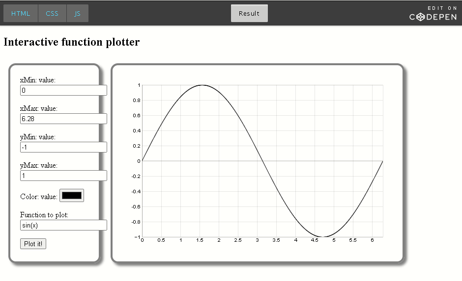{width="6.5in"
height="2.748611111111111in"} -->

Normally, when the button is clicked, we should call
the addXToThePage() function, which in turn should display the value of
the variable x inside an HTML paragraph.

Let&apos;s check if the function is really executed. We need to add
a console.log(&quot;In the addXToThePage function&quot;); as the first
instruction of the function:
<!--~~~~~~~~~~~~~~~~~~~~~~~~~~~~~~~~~~~~~~~~~~~~~~~~~~~~~~~~~~~~~~~~~~~~~~~~~~~~~~~~~~~~~~~~~~~~-->
<!--~~~~~~~~~~~~~~~~~~~~~~~~ 157.  (156) ~~~~~~~~~~~~~~~~~~~~~~~~~~~~-->
<p align="center" width="100%">

<!-- 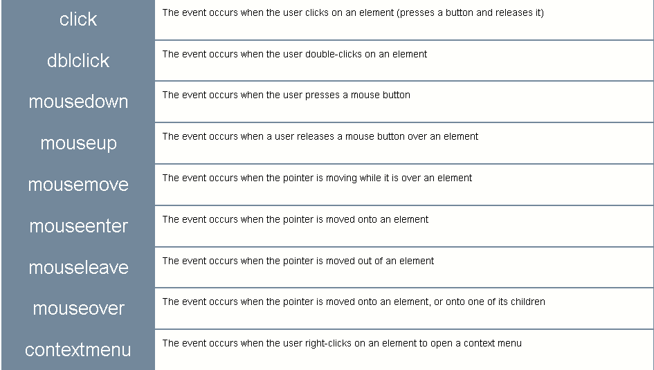{width="6.5in" height="3.18125in"} -->

And let&apos;s execute this with the devtool console open (use F12 on
Windows, or Cmd-Alt-i on a Mac, or control-shift-i). First, as the
provided example is located on CodePen, an online IDE, it&apos;s better to
execute it in &quot;debug mode&quot;. The online IDE will just display a page
(see snapshot below) with the code running:
<!--~~~~~~~~~~~~~~~~~~~~~~~~~~~~~~~~~~~~~~~~~~~~~~~~~~~~~~~~~~~~~~~~~~~~~~~~~~~~~~~~~~~~~~~~~~~~-->
<!--~~~~~~~~~~~~~~~~~~~~~~~~ 158.  (157) ~~~~~~~~~~~~~~~~~~~~~~~~~~~~-->
<p align="center" width="100%">

<!--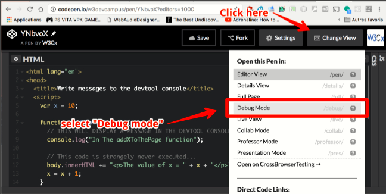{width="6.5in" 
height="3.270138888888889in"} -->

This action opens a new tab with only your code running in it (not the
whole codepen IDE + your code!). Open the devtool console (F12 or
control-shift-i or cmd-alt-i on Mac), and you should see this:
<!--~~~~~~~~~~~~~~~~~~~~~~~~~~~~~~~~~~~~~~~~~~~~~~~~~~~~~~~~~~~~~~~~~~~~~~~~~~~~~~~~~~~~~~~~~~~~-->
<!--~~~~~~~~~~~~~~~~~~~~~~~~ 159.  (157) ~~~~~~~~~~~~~~~~~~~~~~~~~~~~-->
<p align="center" width="100%">

<!--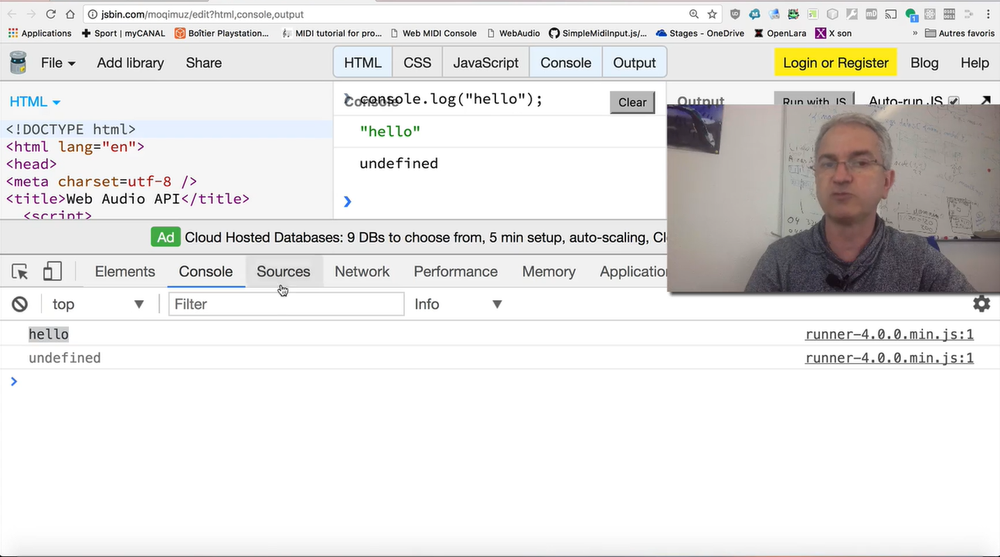{width="6.5in"
height="3.1631944444444446in"} -->

Now, press the button! An error message appears:
<!--~~~~~~~~~~~~~~~~~~~~~~~~~~~~~~~~~~~~~~~~~~~~~~~~~~~~~~~~~~~~~~~~~~~~~~~~~~~~~~~~~~~~~~~~~~~~-->
<!--~~~~~~~~~~~~~~~~~~~~~~~~ 160.  (158) ~~~~~~~~~~~~~~~~~~~~~~~~~~~~-->
<p align="center" width="100%">

<!-- {width="5.90625in"
height="0.9583333333333334in"} -->

Apparently the function name is wrong, addXToToThePage does not exist.
We can check the source code by clicking on the YNbvoX:40 link on the
right:
<!--~~~~~~~~~~~~~~~~~~~~~~~~~~~~~~~~~~~~~~~~~~~~~~~~~~~~~~~~~~~~~~~~~~~~~~~~~~~~~~~~~~~~~~~~~~~~-->
<!--~~~~~~~~~~~~~~~~~~~~~~~~ 161.  (158) ~~~~~~~~~~~~~~~~~~~~~~~~~~~~-->
<p align="center" width="100%">

<!-- {width="6.541666666666667in"
height="1.771887576552931in"} -->

Ok, so our first error was that we typed the wrong name in
the onclick=&quot;&hellip;&quot;, the name we used : AddXToToThePage has &quot;ToTo&quot;
instead of &quot;To&quot;. Let&apos;s fix that now and try again:
<!--~~~~~~~~~~~~~~~~~~~~~~~~~~~~~~~~~~~~~~~~~~~~~~~~~~~~~~~~~~~~~~~~~~~~~~~~~~~~~~~~~~~~~~~~~~~~-->
<!--~~~~~~~~~~~~~~~~~~~~~~~~ 162.  (158) ~~~~~~~~~~~~~~~~~~~~~~~~~~~~-->
<p align="center" width="100%">

<!--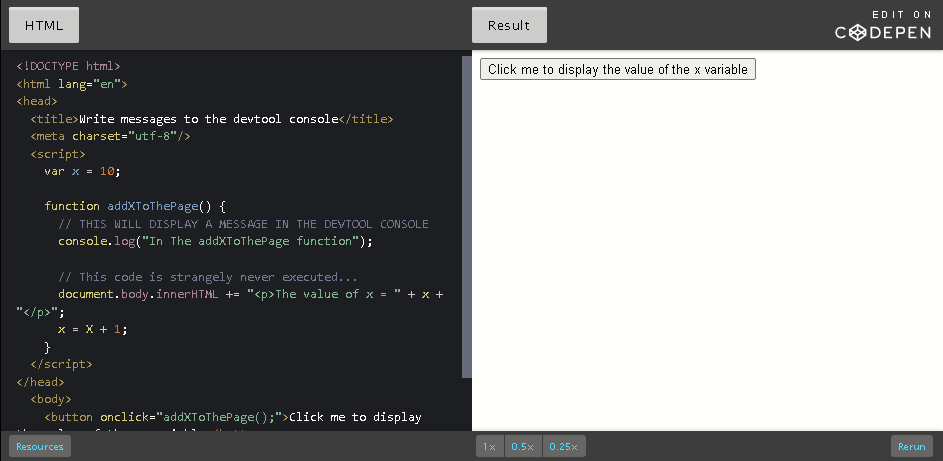{width="6.191674321959755in"
height="3.027040682414698in"} -->

After we&apos;ve changed the name of the function to the correct one, let&apos;s
go in debug mode, open the devtool console and click the button. Here is
what we get:
<!--~~~~~~~~~~~~~~~~~~~~~~~~~~~~~~~~~~~~~~~~~~~~~~~~~~~~~~~~~~~~~~~~~~~~~~~~~~~~~~~~~~~~~~~~~~~~-->
<!--~~~~~~~~~~~~~~~~~~~~~~~~ 164.  (160) ~~~~~~~~~~~~~~~~~~~~~~~~~~~~-->
<p align="center" width="100%">

<!--{width="6.208333333333333in"
height="4.520716316710411in"} -->

You can click on the button now . . .

Going further with console.log

Ok, you understand the principle&hellip; by using console.log(&hellip;) with a
string message as parameter, you can make the message appear in the
devtool console, confirming that you have executed your code without
error at least to this point&hellip;

Let&apos;s fix this &quot;X&quot;! We&apos;ll replace it with an &quot;x&quot; and everything
should be ok now:

You can click on the button now&hellip;.

#### Going further with console.log

#### Displaying variable values

Instead of just displaying pure string messages, you can also use the
&quot;+&quot; operator to concatenate variable values to the pure character
strings.
Example :

```
1.  var x = 2;
2.   
3.  console.log(<b>"The value of x is " + x + " and it';s ok like
    that."</b>);
```

We typed this code in the devtool console to check what it does:
<!--~~~~~~~~~~~~~~~~~~~~~~~~~~~~~~~~~~~~~~~~~~~~~~~~~~~~~~~~~~~~~~~~~~~~~~~~~~~~~~~~~~~~~~~~~~~~-->
<!--~~~~~~~~~~~~~~~~~~~~~~~~ 165.  (160) ~~~~~~~~~~~~~~~~~~~~~~~~~~~~-->
<p align="center" width="100%">

<!-- {width="6.114583333333333in"
height="1.4788757655293088in"} -->

You can use as many &quot;+&quot; as you like, the part right after the &quot;+&quot;
will be turned into a string if the part in front is a string&hellip;

You can also use parentheses in order to display results of simple
calculations:

```
1.  var x = 2;
2.  var y = 4;
3.  console.log("x = " + x);
4.  console.log("y = " + y);
5.   
6.  console.log("The value of (x+y) is " + (x+y) + " and it';s ok
    like that.");
```

Result:
<!--~~~~~~~~~~~~~~~~~~~~~~~~~~~~~~~~~~~~~~~~~~~~~~~~~~~~~~~~~~~~~~~~~~~~~~~~~~~~~~~~~~~~~~~~~~~~-->
<!--~~~~~~~~~~~~~~~~~~~~~~~~ 166.  (161) ~~~~~~~~~~~~~~~~~~~~~~~~~~~~-->
<p align="center" width="100%">

<!-- {width="7.416666666666667in"
height="3.0416666666666665in"} -->

You can use any operator (+, -, /, &ast;, etc.), you are not limited to
using the &quot;+&quot; operator.

And of course, you can use such code in your programs, not only in the
devtool console :-)

<!--~~~~~~~~~~~~~~~~~~~~~~~~~~~~~~~~~~~~~~~~~~~~~~~~~~~~~~~~~~~~~~~~~~~~~~~~~~~~~~~~~~~~~~~~~~~~-->
<h3 id="ch1-6-3">1.6.3 Modifying an HTML document</h3>
<!--~~~~~~~~~~~~~~~~~~~~~~~~~~~~~~~~~~~~~~~~~~~~~~~~~~~~~~~~~~~~~~~~~~~~~~~~~~~~~~~~~~~~~~~~~~~~-->

Don&apos;t worry if we do not explain all the details of this example. In
the first module, we&apos;re giving you &quot;a taste&quot; of what we can do with
JavaScript. Over the following modules, we&apos;ll delve deeper into the
details&hellip; 

We&apos;ve already seen some examples that modify the content of the
document <b>dynamically</b>. We changed a title by clicking on a button, we
displayed the value of a variable named x in the previous section, etc.

The browser comes with some very powerful APIs (Application Programming
Interfaces - a set of predefined objects/functions/variables you can
use):

1.  &quot;The selection API&quot; is used for &quot;selecting elements in the
    document&quot;. It uses the same syntax as CSS selectors. 

2.  The &quot;DOM API&quot; for &quot;Document Object Model&quot; API. When we
    used document.body.innerHTML += &quot;&lt;p&gt;The value of x is &quot; + x +
    &quot;&lt;/p&gt;&quot;; in a previous example, we used the DOM API for adding
    content to the body of the page (page = document).

3.  Another API is called the HTML Table JavaScript API, and is useful
    for building tables on the fly.

4.  etc.

<!--~~~~~~~~~~~~~~~~~~~~~~~~~~~~~~~~~~~~~~~~~~~~~~~~~~~~~~~~~~~~~~~~~~~~~~~~~~~~~~~~~~~~~~~~~~~~-->
<!--~~~~~~~~~~~~~~~~~~~~~~~~ 167. contact list (162) ~~~~~~~~~~~~~~~~~~~~~~~~~~~~-->
<p align="center" width="100%">

</p>

<p>Just click the button to build the HTML table dynamically. You should
see this:</p>
<!--~~~~~~~~~~~~~~~~~~~~~~~~~~~~~~~~~~~~~~~~~~~~~~~~~~~~~~~~~~~~~~~~~~~~~~~~~~~~~~~~~~~~~~~~~~~~-->
<!--~~~~~~~~~~~~~~~~~ 168. dynamic contact list; given name, family name (62) ~~~~~~~~~~~~~~~~~~-->
<p align="center" width="100%">

<!--~~~~~~~~~~~~~~~~~~~~~~~~~~~~~~~~~~~~~~~~~~~~~~~~~~~~~~~~~~~~~~~~~~~~~~~~~~~~~~~~~~~~~~~~~~~~-->
<h3 id="ch1-6-4">1.6.4 Modifying CSS styles on the fly</h3>
<!--~~~~~~~~~~~~~~~~~~~~~~~~~~~~~~~~~~~~~~~~~~~~~~~~~~~~~~~~~~~~~~~~~~~~~~~~~~~~~~~~~~~~~~~~~~~~-->
<p>We&apos;ve already seen some examples in which we modify the style of some
parts of a document using JavaScript. Here we show another example of
what can be done.</p>

<h4>Examples</h4>

<h4>Example #1: change common properties (color, border, background color)</h4>
<!--~~~~~~~~~~~~~~~~~~~~~~~~~~~~~~~~~~~~~~~~~~~~~~~~~~~~~~~~~~~~~~~~~~~~~~~~~~~~~~~~~~~~~~~~~~~~-->
<!--~~~~~~~~~~~~~~~~~~~~~~~~ 169.  (163) ~~~~~~~~~~~~~~~~~~~~~~~~~~~~-->
<p align="center" width="100%">


<h4>Example #2: change the background image property using an external image</h4>
<!--~~~~~~~~~~~~~~~~~~~~~~~~~~~~~~~~~~~~~~~~~~~~~~~~~~~~~~~~~~~~~~~~~~~~~~~~~~~~~~~~~~~~~~~~~~~~-->
<!--~~~~~~~~~~~~~~~~~~~~~~~~ 168.  (10) ~~~~~~~~~~~~~~~~~~~~~~~~~~~~-->
<p align="center" width="100%">


<h4>Example #3: Use the background image as a sprite sheet - animate Mario!</h4>
<!--~~~~~~~~~~~~~~~~~~~~~~~~~~~~~~~~~~~~~~~~~~~~~~~~~~~~~~~~~~~~~~~~~~~~~~~~~~~~~~~~~~~~~~~~~~~~-->
<!--~~~~~~~~~~~~~~~~~~~~~~~~ 169.  (10) ~~~~~~~~~~~~~~~~~~~~~~~~~~~~-->
<p align="center" width="100%">


<p>Notice how the CSS properties change when we use them from JavaScript:</p>

<ul>
  <li>background-color (CSS) becomes backgroundColor (JS)</li>
  <li>margin-left (CSS) becomes marginLeft (JS)</li>
  <li>etc.</li>
</ul>

<p>And the positions, widths and heights are always string values. In our
example we used pixel units and a percentage, so we need to add the
&quot;px&quot; and &quot;%&quot; character(s) when we manipulate these properties from
JavaScript.</p>
<!--~~~~~~~~~~~~~~~~~~~~~~~~~~~~~~~~~~~~~~~~~~~~~~~~~~~~~~~~~~~~~~~~~~~~~~~~~~~~~~~~~~~~~~~~~~~~-->
<h3 id="ch1-6-5">1.6.5 Adding interactivity with events</h3>
<!--~~~~~~~~~~~~~~~~~~~~~~~~~~~~~~~~~~~~~~~~~~~~~~~~~~~~~~~~~~~~~~~~~~~~~~~~~~~~~~~~~~~~~~~~~~~~-->
<p>With JavaScript, you can react to user interactions (keyboard, mouse,
gamepad), to changes in the lifecycle of your document (page has just
loaded or resized, screen has been rotated on a mobile device), or to be
notified when a long process has been completed (loading a large image
or sound from the network).</p>
<p>We&apos;ve already seen how we can make a &lt;button&gt; react to a mouse click
with &lt;button onclick=&quot;&hellip;&quot;&gt;Click me&lt;/button&gt;</p>
<p>Below, we outline some extra examples. In the next course module, we
will go into detail about events, and in the following modules, we will
study some of the most useful events in even greater depth.</p>

<h4>Examples</h4>

<h4>Example #1: use input events on an HTML input field</h4>
<!--~~~~~~~~~~~~~~~~~~~~~~~~~~~~~~~~~~~~~~~~~~~~~~~~~~~~~~~~~~~~~~~~~~~~~~~~~~~~~~~~~~~~~~~~~~~~-->
<!--~~~~~~~~~~~~~~~~~~~~~~~~ 170.  (10) ~~~~~~~~~~~~~~~~~~~~~~~~~~~~-->
<p align="center" width="100%">

<!-- 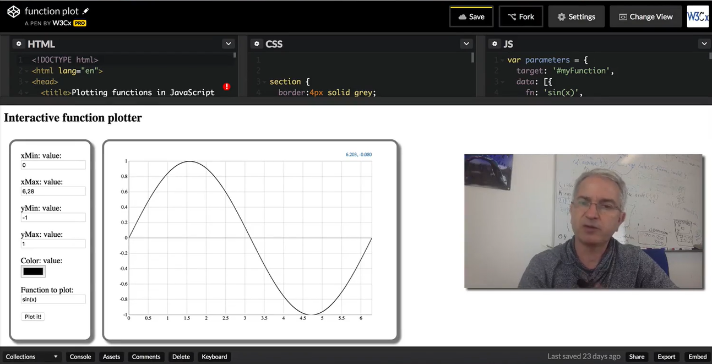{width="6.5in"
height="2.1347222222222224in"} -->

<h4>Example #2: listen to mouse events in an HTML5 canvas</h4>

<p>The HTML5 canvas is useful for drawing and animating at 60
frames/second. Very detailed tutorials are provided in the W3C 
<a href="https://www.edx.org/course/html5-coding-essentials-and-best-practices">
HTML5 Coding Essentials and Best Practices</a> course, while the W3Cx 
<a href="https://www.edx.org/course/html5-apps-and-games">HTML5 Apps and Games</a> 
MOOC addresses how to write video games using the canvas 2D API.</p>

<p>In this JS introductory course, we use HTML5 canvas to draw curves, to
make a small game, etc. Small and diverse examples for illustrating some
JavaScript data structures such as Arrays or Objects are going to be
presented.</p>
<!--~~~~~~~~~~~~~~~~~~~~~~~~~~~~~~~~~~~~~~~~~~~~~~~~~~~~~~~~~~~~~~~~~~~~~~~~~~~~~~~~~~~~~~~~~~~~-->
<!--~~~~~~~~~~~~~~~~~~~~~~~~ 169.  (10) ~~~~~~~~~~~~~~~~~~~~~~~~~~~~-->
<p align="center" width="100%">


<!--~~~~~~~~~~~~~~~~~~~~~~~~~~~~~~~~~~~~~~~~~~~~~~~~~~~~~~~~~~~~~~~~~~~~~~~~~~~~~~~~~~~~~~~~~~~~-->
<!--~~~~~~~~~~~~~~~~~~~~~~~~ 170.  (10) ~~~~~~~~~~~~~~~~~~~~~~~~~~~~-->
<p align="center" width="100%">


<h4>Example #4: move a monster in an HTML5 canvas using left and right arrow keys</h4>
<!--~~~~~~~~~~~~~~~~~~~~~~~~~~~~~~~~~~~~~~~~~~~~~~~~~~~~~~~~~~~~~~~~~~~~~~~~~~~~~~~~~~~~~~~~~~~~-->
<!--~~~~~~~~~~~~~~~~~~~~~~~~ 171.  (10) ~~~~~~~~~~~~~~~~~~~~~~~~~~~~-->
<p align="center" width="100%">


<!--~~~~~~~~~~~~~~~~~~~~~~~~~~~~~~~~~~~~~~~~~~~~~~~~~~~~~~~~~~~~~~~~~~~~~~~~~~~~~~~~~~~~~~~~~~~~-->
<h3 id="ch1-6-6">1.6.6 Using built-in HTML5 APIs</h3>
<!--~~~~~~~~~~~~~~~~~~~~~~~~~~~~~~~~~~~~~~~~~~~~~~~~~~~~~~~~~~~~~~~~~~~~~~~~~~~~~~~~~~~~~~~~~~~~-->
<p>Your browser comes with a lot of standard W3C APIs. By standard, we mean
&quot;parts of HTML5&quot; or real Web standards that will still work in 10
years. In contrast to &quot;industry standards&quot;, W3C standards are meant to
be supported by browsers for years to come. These standards are a joint
effort by the industry, the community, and W3C to develop stable,
reliable standards.</p>

<p>The following example uses some of these APIs, simply to &quot;show the
possibilities&quot;. Others will be discussed later on in the course, or in
other W3Cx courses.</p>

<h4>Examples</h4>

<h4>Example #1: using the WebCam</h4>

<p><b>CLICK ON THE TOP RIGHT OF THE BELOW WINDOW (on the &quot;Codepen&quot; logo)
to see this example running</b>. Due to security restrictions, the webcam
image cannot be seen in this embedded example anymore.</p>

<p>Look at the JavaScript tab! The 
<a href="https://www.edx.org/course/html5-coding-essentials-and-best-practices">
W3Cx HTML5 Coding Essentials and Best Practices</a> course provides many other 
examples that use the webcam.</p>

<p>If you want to spend some time having fun with the WebCam, don&apos;t forget
to try <a href="https://webcamtoy.com/">the WebCam Toy</a> demo!</p>

<h4>Example #2: using the WebAudio API to build a small synthetizer</h4>

<p>Click on the piano keyboard. Use the different buttons, sliders, etc.
This example uses the WebAudio API in order to synthesize sounds.</p>
<!--~~~~~~~~~~~~~~~~~~~~~~~~~~~~~~~~~~~~~~~~~~~~~~~~~~~~~~~~~~~~~~~~~~~~~~~~~~~~~~~~~~~~~~~~~~~~-->
<!--~~~~~~~~~~~~~~~~~~~~~~~~ 172.  (10) ~~~~~~~~~~~~~~~~~~~~~~~~~~~~-->
<p align="center" width="100%">

<!-- 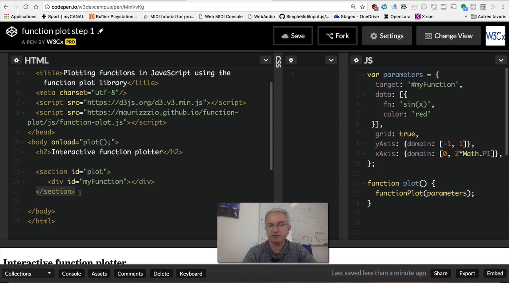{width="6.5in" height="4.813194444444444in"} -->

<h5>HTML:</h5>

I Hope you enjoy this pen, it was a lot of fun to make.

Both mouse and keyboard is supported. However, make sure you click onto
the preview window before using keyboard.

<!--~~~~~~~~~~~~~~~~~~~~~~~~~~~~~~~~~~~~~~~~~~~~~~~~~~~~~~~~~~~~~~~~~~~~~~~~~~~~~~~~~~~~~~~~~~~~-->
<h3 id="ch1-6-7">1.6.7 Using third-party JS APIs/libraries</h3>
<!--~~~~~~~~~~~~~~~~~~~~~~~~~~~~~~~~~~~~~~~~~~~~~~~~~~~~~~~~~~~~~~~~~~~~~~~~~~~~~~~~~~~~~~~~~~~~-->

Thousands of JavaScript libraries exist. Their purposes range from
making it easier to plot a math function,
playing [chiptune](https://fr.wikipedia.org/wiki/Chiptune) music,
animating objects, through to visualizing data and much more.

<h4>Examples</h4>

We provide some examples below, but feel free to look on the Web for
other external libraries.

<h4>Example #1: plot mathematical functions using the [function plot JavaScript library](https://mauriciopoppe.github.io/function-plot/)</h4>

There are numerous libraries for plotting math functions, but this one
is pretty easy to use and very powerful. Here is an example that
plots f(x) = x&#94;2, then f(x) = sin(x) and finally a mix of
fours functions : f(x) = x&#94;2 (in red), f(x) = 3&ast;x (in green), f(x) =
cos(x) (in blue) and f(x) = -3&ast;x&#94;2 + x&#94;2 (dashed)
<!--~~~~~~~~~~~~~~~~~~~~~~~~~~~~~~~~~~~~~~~~~~~~~~~~~~~~~~~~~~~~~~~~~~~~~~~~~~~~~~~~~~~~~~~~~~~~-->
<!--~~~~~~~~~~~~~~~~~~~~~~~~ 173.  (10) ~~~~~~~~~~~~~~~~~~~~~~~~~~~~-->
<p align="center" width="100%">

<!-- 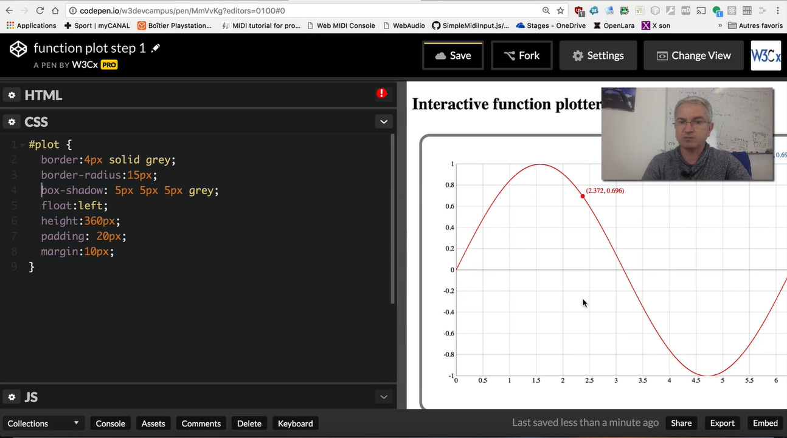{width="6.5in" height="5.102083333333334in"} -->

Here is another much simpler example, please edit the code (click on
&quot;edit on codepen&quot;) and change the function for something like f(x) =
x&#94;3 and look at the result (don&apos;t forget to change
the xRange and yRange values). If you have trouble, [look
here](https://codepen.io/w3devcampus/pen/MJMYNb) for a solution.

<!--~~~~~~~~~~~~~~~~~~~~~~~~~~~~~~~~~~~~~~~~~~~~~~~~~~~~~~~~~~~~~~~~~~~~~~~~~~~~~~~~~~~~~~~~~~~~-->
<!--~~~~~~~~~~~~~~~~~~~~~~~~ 174.  (10) ~~~~~~~~~~~~~~~~~~~~~~~~~~~~-->
<p align="center" width="100%">

<!-- 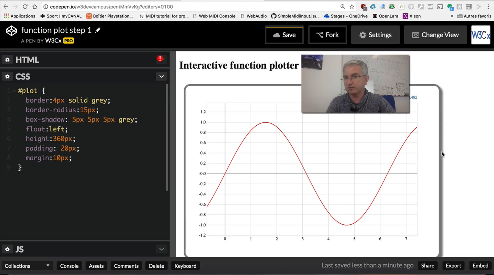{width="6.5in" height="3.0569444444444445in"} -->
<!--~~~~~~~~~~~~~~~~~~~~~~~~~~~~~~~~~~~~~~~~~~~~~~~~~~~~~~~~~~~~~~~~~~~~~~~~~~~~~~~~~~~~~~~~~~~~-->
<h3 id="ch1-6-8">1.6.8 Working with remote data</h3>
<!--~~~~~~~~~~~~~~~~~~~~~~~~~~~~~~~~~~~~~~~~~~~~~~~~~~~~~~~~~~~~~~~~~~~~~~~~~~~~~~~~~~~~~~~~~~~~-->

Let's see a few examples on how to work with remote data.

<h4>Examples</h4>

<h5>Example #1: use remote structured data</h5>

This example downloads and displays a list of users in a table
(see [remote data](https://jsonplaceholder.typicode.com/users)):
<!--~~~~~~~~~~~~~~~~~~~~~~~~~~~~~~~~~~~~~~~~~~~~~~~~~~~~~~~~~~~~~~~~~~~~~~~~~~~~~~~~~~~~~~~~~~~~-->
<!--~~~~~~~~~~~~~~~~~~~~~~~~ 175.  (10) ~~~~~~~~~~~~~~~~~~~~~~~~~~~~-->
<p align="center" width="100%">

<!-- 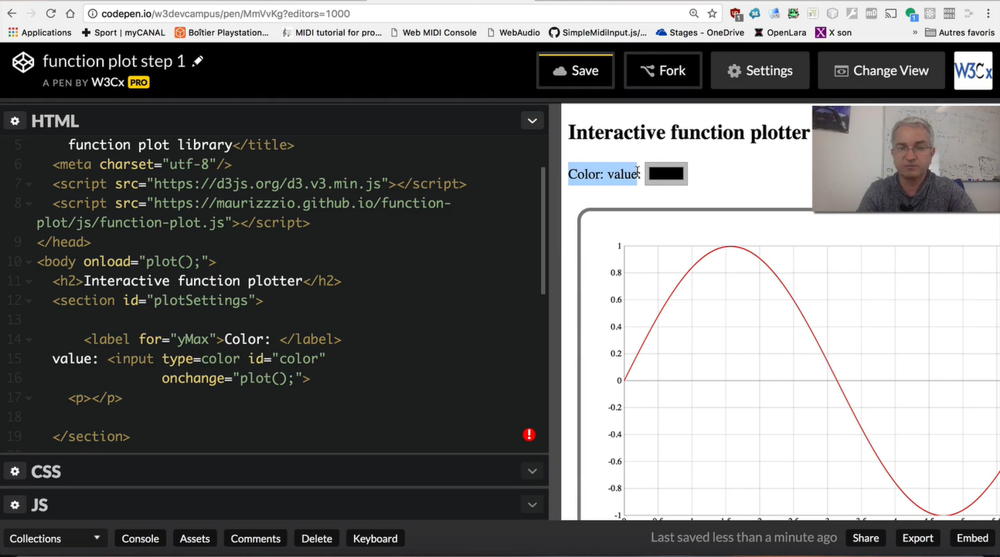{width="6.5in" height="4.909722222222222in"} -->

<h4>Example #2: load and decode remote sounds for use in a video game</h4>

This example just shows how to use the HowlerJS external library to load
remote sounds, decode them and play them as samples in memory (useful
for video games):
<!--~~~~~~~~~~~~~~~~~~~~~~~~~~~~~~~~~~~~~~~~~~~~~~~~~~~~~~~~~~~~~~~~~~~~~~~~~~~~~~~~~~~~~~~~~~~~-->
<!--~~~~~~~~~~~~~~~~~~~~~~~~ 176.  (10) ~~~~~~~~~~~~~~~~~~~~~~~~~~~~-->
<p align="center" width="100%">

<!-- ### 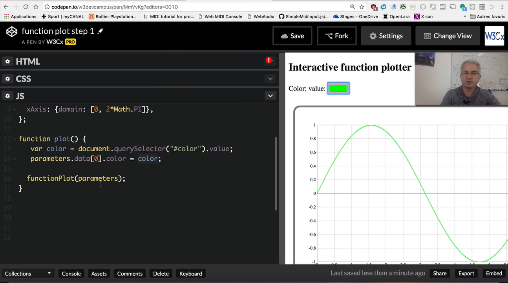{width="6.5in" height="3.25in"} -->

<!--~~~~~~~~~~~~~~~~~~~~~~~~~~~~~~~~~~~~~~~~~~~~~~~~~~~~~~~~~~~~~~~~~~~~~~~~~~~~~~~~~~~~~~~~~~~~-->
<h3 id="ch2-1">2.1 Video introduction - Module 2</h3>
<!--~~~~~~~~~~~~~~~~~~~~~~~~~~~~~~~~~~~~~~~~~~~~~~~~~~~~~~~~~~~~~~~~~~~~~~~~~~~~~~~~~~~~~~~~~~~~-->

Hey everyone!

In this module, you will learn how to handle events (using a keyboard, a
mouse, or a game pad), detect which button has been pressed, what is the
position of the mouse pointer, what key has been pressed, etc.

You will discover the DOM API, as this is the standard application
programming interface that will be used for interactive with the content
of an HTML document.

In addition, we will introduce some new fundamental JavaScript bricks,
such as conditional statements, logical operators (if, then, else), and
loops.

How to display multiple rows in a table, how to draw multiples graphical
objects on the screen.

Finally, we will write together a small JavaScript game using the HTML5
canvas API.

Animating and drawing shapes at 60 frames/second is a lot of fun, and
we'll make you play with the most of the language elements seen so far.

And please, as I like video game, don&apos;t forget to share your project in
the forum.

And let other students enjoy your creation :D

<!--~~~~~~~~~~~~~~~~~~~~~~~~~~~~~~~~~~~~~~~~~~~~~~~~~~~~~~~~~~~~~~~~~~~~~~~~~~~~~~~~~~~~~~~~~~~~-->
<h3 id="ch2-1-2">2.1.2 Module 2 outline</h3>
<!--~~~~~~~~~~~~~~~~~~~~~~~~~~~~~~~~~~~~~~~~~~~~~~~~~~~~~~~~~~~~~~~~~~~~~~~~~~~~~~~~~~~~~~~~~~~~-->
<p>What you will learn in Module 2:</p>

<ul>
  <li>Conditional statements and logical operators: if&hellip;then&hellip;else,
    etc.</li>
  <li>Loops: iterate on collections, do things repeatedly</li>
  <li>Events: detect keys, mouse clicks or moves, window resize events, etc.</li>
  <li>DOM: interact with the content of the HTML page (by selecting
    elements, modifying them, adding and removing new ones)</li>
  <li>HTML5 canvas: learn how to draw and animate simple shapes</li>
</ul>
<!--~~~~~~~~~~~~~~~~~~~~~~~~~~~~~~~~~~~~~~~~~~~~~~~~~~~~~~~~~~~~~~~~~~~~~~~~~~~~~~~~~~~~~~~~~~~~-->
<h3 id="ch2-2-1">2.2.1 Boolean values and logical operators</h3>
<!--~~~~~~~~~~~~~~~~~~~~~~~~~~~~~~~~~~~~~~~~~~~~~~~~~~~~~~~~~~~~~~~~~~~~~~~~~~~~~~~~~~~~~~~~~~~~-->

Live coding video: boolean value, if&hellip;else statement and comparison
operators

Comparison operators and the if, else statements.

First, let&apos;s look at some code&hellip;

We&apos;ve got a &quot;JavaScriptCourse&quot; variable that we&apos;re gonna set to
true, it&apos;s a boolean variable.

And we&apos;re gonna see how this variable can be tested in a &quot;if&quot;
statement.

In order to use the &quot;if&quot; statement, we type &quot;if&quot;, followed by
parentheses, and by a block of instructions, that will be executed only if what is between
the parentheses here, is true.

I&apos;m gonna put this variable that we set to true, and add an instruction
inside.

We can see in the console that the instruction in the block has been
executed, and &quot;This is a JavaScript course&quot; has been printed to the
console log.

This is because when the thing we test -the expression we test between
the parentheses-is true, the block of instructions that follows the
&quot;if&quot; statement, is executed.

If I set the variable to false and run the example again, then nothing
is executed because the expression is false and the block of
instructions is completely avoided.

We can improve this example using an else statement.

&quot;This is NOT a JavaScript course!&quot; I run it again.

And the thing that is executed is the else block of instructions &quot;This
is NOT a JavaScript course!&quot;.

If I set it back to true, you can see that it&apos;s a bit like a switch. It
prints: &quot;This is a JavaScript course!&quot;

Ok, let&apos;s see now comparison operators.

They are: less than, more than, less or equals to, more or equals to,
equals equals (that means &quot;equals&quot;), not equals (that means
&quot;different&quot;), and a different version of these last two operators,
that are called strict equals and strict not equals operators.

And they are written === and !== .

These last two syntaxes are preferred because they will avoid you a lot
of errors.

I will show the differences in a minute, but consider these last with
the three equals (===) and not equals equals (==), to be the ones you
must use.

Let&apos;s see some code now...

I declared the variable &quot;age&quot; with a value of 1, and I added some
if&hellip; else statements.

If &quot;age&quot; is less than 2, print &quot;I&apos;m a baby&quot;, and you can see that
this has been executed, because the variable is 1, 1 is less than 2. It&apos;s been
executed...

I can add some &quot;else&hellip;if&quot; statements.

If age is 10, then in that case I&apos;ll go to the else statement and I
will test again if in this case, age is less than 18.

I&apos;ll print &quot;I&apos;m a child&quot;.

And this works too. Only the second case has been executed.

The &quot;if&quot; block of instructions has been ignored, and the second &quot;if&quot;
block of instructions has been executed.

I can chain the &quot;else&hellip;if&quot; statements like that.

And you can notice that I added at the end only an &quot;else&quot; statement,
without an &quot;if&quot; behind.

This means: &quot;when all the other cases are false, please come here!&quot;.

If I set my age to be 70, then in that case, all the tests will be
false, and I will execute the block of instructions that is just after the last &quot;else&quot;,
and it prints &quot;I&apos;m old&quot;.

I can also try&hellip; if the variable has some exact value using the ==
operator.

If I set the variable to be 72, then this test is true and it prints
&quot;I&apos;m 72&quot; in the devtool console.

We can also use more than one test at once using logical operators.

The double ampersand (&&) here is the AND operator.

This will be true only is age is more than 12 and less than 14.

If I set the variable to 13, it will print &quot;I&apos;m a young teenager&quot;
because both tests here, > 12 and &lt; 14, are true.

I can use also the OR operator.

In that case, it will be true if one of the two are true.

Let&apos;s try with age = 8.

With age equals to 8, this is false, age > 12, but age &lt; 14 is true,
it prints &quot;I&apos;m a young teenager&quot;.

Finally, let&apos;s have a look at the === operator.

If I set the age to be &quot;72&quot;, but as a string, like this... it
prints... let me clear the devtool console and execute it again... it prints &quot;I&apos;m 72&quot;
because the age variable, that is a string, has been converted
implicitly to a number.

If I use the triple equal sign, then it does not print anymore &quot;I&apos;m
72&quot; because age, as a string, has not been converted to a number.

And thrust me, it&apos;s much better to use the triple equals operator, it
will avoid you many errors like considering a string as a number, and so
on.

<h4>Source code of the example shown in the video</h4>

<p><a href="https://codepen.io/w3devcampus/pen/pPmqwq?editors=0012" target="_blank" rel="noopener noreferrer">This example is available on
CodePen</a></p>

<p>Before talking about how your JavaScript program can make decisions,
such as &quot;<b>if this condition is fulfilled then I&apos;ll do this, otherwise
I&apos;ll do that&hellip;</b>&quot;, we need to define a few more concepts.</p>

Let&apos;s tart with &quot;boolean values&quot; and &quot;logical operators&quot;.

<h4>Boolean values</h4>

The <b>boolean</b> type represents a logical entity having two
values: true and false.

Use of the keywords true and false:

```
1.  var b = true; 
2.   
3.  var b = false;
```

A boolean variable should not be enclosed in quotation marks, otherwise
it becomes a string variable:

```
1.  var b = 'true'; // b is not a boolean but a string
```

<h4>Undefined and null values</h4>

<h4>Undefined</h4>

<p>undefined is returned when a variable has not been assigned:</p>

```
1.  var foo;
2.  > foo
3.  undefined
4.   
5.  > typeof foo;
6.  'undefined'
7.   
8.  >if (foo === undefined) {
9.      console.log('The variable foo has no value and is undefined');
10. }
11. 'The variable foo has no value and is undefined'
```

The above example shows how we can test whether a variable has a value
(<b>line 8</b> uses a conditional statement).

The keyword &quot;<b>undefined</b>&quot; is part of the JavaScript language, so you
can assign the undefined value to a variable:

```
1.  > var foo = undefined; // equivalent to var foo; without giving any value
2.  undefined
3.   
4.  > foo;
5.  undefined
```

var foo; and var foo = undefined; are equivalent but we recommend that
you use the first version to declare the variable (it is shorter, and
that reduces the code).

If you try to access a variable that has not been declared before,
a ReferenceError will be raised. But the typeof operator will return
&quot;undefined&quot;:

```
1.  > bar;
2.  ReferenceError
3.   
4.  > typeof bar;
5.  'undefined'
```

<h4>Logical operators</h4>

The logical operators are: 

-   <b>&&</b> (AND)  
    usage example : <b>if ((x  > 0) && (x &lt; 10)) {</b>
    <b>                 console.log(&apos;x is strictly positive and less
    than 10&apos;);</b>
    <b>             }</b>

-   <b>&vert;&vert;</b> (OR)
    usage  example : <b>if ((x  > 0) &vert;&vert; (x == -5)) { </b>
    <b>                 console.log(&apos;x is positive or equal to
    -5&apos;); </b>
    <b>             }</b>

-   <b>!</b> (NOT)
    usage example : <b>if (!(x  > 0)) { </b>
    <b>                 console.log(&apos;x is not positive (x is less or
    equal to 0&apos;); </b>
    <b>             }</b>

-   <b>&&</b>, <b>&vert;&vert;</b> operators are binary, <b>!</b> is unary. 

```
1.  var b = !true; 
2.  b; //false
3.   
4.  var b = !!true;
5.  b; //true
6.   
7.  var b = "one"; 
8.  !b;   false // implicit conversion of "one" to a boolean value
9.   
10. var b = "one"; // implicit conversion of "one" to a boolean value
11. !!b; //true
```

In an expression with logical operators, as shown in <b>lines
8 </b>and<b> 11</b> of the previous example, non-boolean values are
implicitly converted to boolean.

<h4>Lazy evaluation or short-circuit evaluation</h4>

Logical expressions are evaluated from left to right. JavaScript uses a
mechanism known as &quot;short-circuit evaluation&quot; to prevent the second,
third, and nth conditions from being tested in certain cases: 

-   false && something (an expression)  is always false, and the part to
    the right of && operator is not tested.

-   true &vert;&vert; something (an expression) is evaluated to true, and the
    part to the right of the &vert;&vert; operator is not tested.

Examples:

```
1.  var b = 5;
2.  var c = 6;
3.   
4.  if ((b === 5) &vert;&vert; (b === 6))  { //the second part is never tested
5.      console.log('b is equal to 5 or equal to 6');
6.  }
7.   
8.  if ((b === 5) && (c === 6)) {  // second part is evaluated
9.      console.log('b  is equal to 5 and c is equal to 6');
10. }
11.  
12. if ((b === 15) && (c === 6)) {  // second part is never evaluated
13.     console.log('b  is equal to 5 and c is equal to 6');
14. } else {
15.     console.log('b not equal to 15 or c not equal to 6');
16. }
```

<h4>Implicit conversions of non boolean values in expressions</h4>

Used with logical operators or within statements, <b>non-boolean values
are implicitly converted to booleans</b>.  

<b>All the following values are evaluated as false :</b>

-   <b>false</b>

-   <b>undefined</b>

-   <b>null</b>

-   <b>0</b>

-   <b>NaN</b>

-   <b>the empty string &apos;&apos;</b>

<b>Everything else is evaluated as true!</b>

```
1.  var boo = 'hello' && 'world'; // boo is equal to 'world' that
    is 'true'.
```

In the above example, &apos;hello&apos; && &apos;world&apos; is evaluated as true but
will return a value! Indeed, boo will equal &apos;world&apos; because
&apos;hello&apos; is a string value that is evaluated as true. And &apos;world&apos; is
in also true as it&apos;s not one of the value cited in the previous
paragraph. If we do : if (boo) then&hellip;. we will enter the if statement.

The rule is that both && and &vert;&vert; result in the value of (exactly) one
of their operands:

-   A && B returns the value A if A can be coerced into false;
    otherwise, it returns B.

-   A &vert;&vert; B returns the value A if A can be coerced into true;
    otherwise, it returns B.

External resource: [The && and &vert;&vert; Operators in
JavaScript](https://mariusschulz.com/blog/the-and-and-or-operators-in-javascript)

<b>TO SUM UP: it works &quot;normally&quot; if you just think true/false, but the
real value affected is not true false, it&apos;s one of the operands, that
can be seen as true/false.</b>

<pre>1.  <b>var boo2 = (0/0) || 43.2 ;</b></pre>

boo2 equals 43.2 because the expression 0/0 equals NaN, which is evaluated as false.

<b>Question:</b>

What is the value of the variable myNumber after the execution of this
code? 

```
var myNumber = !1;
 
if(myNumber == null){
   myNumber = 3;
}
 
myNumber = myNumber || 2;
```

<b>Explanation</b>: after the first line, myNumber equals false. In
the if statement, at <b>line 3</b>, false does not equal null. Therefore,
the value 3 is not assigned to the var myNumber. In the last
line, myNumber is evaluated as false, then the value 2 is given to the
variable myNumber.

<h4>Comparison operators</h4>

-   Equal <b>==</b>

-   Not equal <b>!=</b>

-   Greater than <b>></b>

-   Greater than or equal <b>>=</b>

-   Less than <b>&lt;</b>

-   Less than or equal to <b>&lt;=</b>

-   Strict equal <b>===</b>

-   Strict not equal <b>!==</b>

<h4>What is the difference between <b>==</b> and === in JavaScript?</h4>

<h5>Equal (==)</h5>

Returns true if the operands are strictly equal <b>with type
conversion</b>.

<h5>Strict equal (===)</h5>

Returns true if the operands are strictly equal <b>with no type
conversion</b>.

The triple-equals operator never does type coercion. It returns true if
both operands reference the same object, or in the case of value types,
have the same value.

Some examples :

```
1 == 1 ;
//true
 
1 == 2 ;
//false
 
/* Here, the interpreter will try to convert the string '1'
into a number before doing the comparison */
 
1 == '1';
//true :
 
 
//with strict equal, no conversion:
 
1 === 1;
//true
1 === '1';
//false
```

<b>Depending on the context, generally strict equal (or strict not
equal) is preferred. </b>

<b>[Best practice for beginners]{.underline}: always use === or !== for
comparisons.</b>

Here are interesting articles:

-   [Why you should use strict
    equal](https://www.impressivewebs.com/why-use-triple-equals-javascipt/)

-   [Equality comparisons and
    sameness](https://developer.mozilla.org/en-US/docs/Web/JavaScript/Equality_comparisons_and_sameness)

<h4>Specific case of NaN</h4>

As we have already seen, JavaScript has some special values. One of them
is NaN: "Not-a-Number". 

```
NaN has this special property : 
NaN == NaN;
// false
 
NaN === NaN;
// false
```

<b> Nan is equal to nothing - not even to itself!</b>  But you do have a
function to check the NaN value:  isNaN(expr) 

-   isNaN: returns true if the argument coerces to NaN, and otherwise
    returns false.

```
isNaN(NaN);
// true
 
isNaN(0/0);
// true
 
isNaN(12);
// false
 
isNaN('foo');
// true
```

&quot;A reliable way for ECMAScript code to test if a value X is a NaN, is
an expression of the form X !== X. The result will be true if, and only
if, X is a NaN. &quot; (see
the [isNan documentation](https://www.ecma-international.org/ecma-262/5.1/#sec-15.1.2.4)).

<b>A complete example with isNaN: </b>

```
var num =0/0;
 
if(isNaN(num)){
   num = 0;
}
//shortened version with the conditional operator
var num = isNaN(num) ? 0 : num
 
//version with logical operator (implicit conversion)
var num = num || 0;
 
/*
   <=> num = NaN || 0
 
   <=> num = false || 0
*/
 
num;
//returns 0 in this three cases
```

Of course 0/0 rarely happens, but there are other cases where NaN can
appear, for example:

-   parseInt(&apos;foo&apos;);  returns NaN   //parseInt tries to convert a
    String to a Number 

-   Math.sqrt(-1); return NaN 

<!--~~~~~~~~~~~~~~~~~~~~~~~~~~~~~~~~~~~~~~~~~~~~~~~~~~~~~~~~~~~~~~~~~~~~~~~~~~~~~~~~~~~~~~~~~~~~-->
<h3 id="ch2-2-2">2.2.2 Conditional statements</h3>
<!--~~~~~~~~~~~~~~~~~~~~~~~~~~~~~~~~~~~~~~~~~~~~~~~~~~~~~~~~~~~~~~~~~~~~~~~~~~~~~~~~~~~~~~~~~~~~-->

Hi! Let&apos;s have a look at the switch statement.

I prepared a small example in which we take a day number between 0 and
6, 0 for Monday, 1 for Tuesday, and so on...

And to pick a random number that is an integer, we used a formula like
this,

that uses a predefined object called Math.

So, Math.random() returns a number between 0 and 1, 6 multiplied by
this, will give a number between 0 and 7, and we just return the rounded
nearest integer.

When we execute this, &quot;picked day number&hellip;&quot; you see that it takes
some random values each time we execute.

If I clear the console and execute this, it will pick a number.

And then, here is a first version that uses &quot;if statements&quot; that is a
bit naïve.

It says: if day equals 0, then print Monday; if day equals 1 ... ; and
so on.

Why is it naïve?

Because we&apos;re going to execute all the tests and we all know that only
one of them will be true.

Instead of multiplying series the tests, a better version is to use
&quot;if&hellip; else&quot; statements, like this&hellip; so if day equals 0, then print
Monday, else if day equals 1, print Tuesday&hellip;

In that case, we&apos;re gonna test just until we find the day, and all the
else will be ignored.

A much better version uses a switch.

When you&apos;ve got to make multiple tests, it might be more interesting to
use a switch.

So, switch(day). Then you test with the different possible values, using
the &quot;case&quot; keyword.

&quot;case 0&quot;: that means that &quot;if day equals 0, then execute
console.log(&apos;Monday&apos;).

The break here means &quot;ignore all the other cases&quot;.

So, when you put a break after each case, it&apos;s a bit like the
&quot;if&hellip;else&quot; example we saw earlier: only one block of instructions
will be executed here...

So you can see that the 3 different versions with the naive if, the
if-else statement and the switch, give the same result.

Be careful because sometimes, if you forget to use a &quot;break&quot;, you can
enter

different case statements.

You can make errors if you don&apos;t know what to break keyword means, but
it can also be useful to regroup cases.

For example, if I want to print &quot;This is a week day, we go to work!&quot;,
when we&apos;ve got Monday, Tuesday&hellip; any day of the week! And if I want
to print &quot;Week end!&quot; for Saturday and Sunday, then I can regroup cases
like that.

You see case 0, case 1, case 2, case 3, case 4&hellip; and then just use a
break after we executed the block of instructions that is related to all
these five cases.

So doing this, we will print &quot;Week Day&hellip;&quot; only if the day has a
value of 0, 1, 2, 3 or 4, and we will print &quot;Week end!&quot; if it has a
value of 5 or 6.

Be careful because I saw this error a lot of time with beginners: you
must use &quot;case&quot; only with a value after it, not an expression!

This thing here case &quot;day greater or equal than 0&quot; or &quot;day less than
4&quot; is not valid.

You cannot use an expression here, after the case.

This is not going to work.

Avoid!

This&hellip; error!

And finally, there is a better solution to the problem I've illustrated.

It&apos;s not to use any if or any switch&hellip;but use an array!

So, if we&apos;ve got an array that contains all the string values for the
days of the week, we can just do a console.log&hellip; daysOfTheWeek&hellip; 
brackets, and use the day as an index.

And this works too and it&apos;s only two lines of code.

<h4>Example from the video</h4>

<p><a href="https://codepen.io/w3devcampus/pen/jmoJRZ" target="_blank" rel="noopener noreferrer">CodePen example from the video</a></p>

JavaScript source code is a set of statements. There are a couple of
different statement types. We have already seen one of them, the
variable statement:

```
1.  var myVar = 'hello ' + 'world';
```

We&apos;ve also seen the expression statement:

```
1.  3 + 4;
2.  // more often like this
3.  var x = (3 + 4);
4.  var y = (5 + x);
```

A statement closes with a semicolon, but we will see later that missing
semicolons are automatically inserted (for readability reasons, we
highly recommend systematically adding a semicolon at the end of all
statements).

Statements are generally executed sequentially from top to bottom of the
script. However, this flow can be modified by statements such as
conditional statements and iteration statements.

<h4>The block statement</h4>

The block statement is a simple statement which allows us to group a set
of statements wrapped in curly braces. 

<h4>Block statement:</h4>

```
1.  {
2.  var i = 0;
3.  var result = false;
4.  console.log('i = ' + i);
5.  }
```

The block statement is used by other statements such as the if-statement
or for-statement. We will see these statements below.

<h4>Conditional statements</h4>

All the examples for this section are in this codepen (to run it: click
on the &quot;edit on CodePen&quot; label, and once in CodePen, open the devtool
console to see the outputs of this program):
 
(Please look, edit and try whatever you want. There are parts that are
commented - please remove comments and try to understand the results).

<b>Conditional statements are used to execute a unit of code</b>
<b>only if a condition is evaluated as true.</b>

<h4>The if statement</h4>

<b>Syntax:</b>

<pre><b>if</b> ( Expression ) Statement <b>else</b> Statement
<b>if</b> ( Expression ) Statement
<b>The expression may include:</b></pre>

-   logical operators ( <b>! && &vert;&vert;</b> )

-   comparison operators
    ( <b>==</b>, <b>===</b>, <b>></b>, <b>>=</b>, <b>&lt;</b>, <b>&lt;=</b> )

-   any values or expressions which can be converted to boolean

<h4>Example #1: if-statement</h4>

<pre>1.  var num = 10;
2.  <b>if</b> (num === 10) <b>{</b>
3.  num = 20;
4.  <b>}</b>
5.  // num equals 20</pre>

<h4>Example #2: if-else statement</h4>

<pre>
1.  var num = 10;
2.  <b>if</b> (num >; 10) <b>{</b>
3.  num = 20;
4.  <b>}</b> <b>else</b> <b>{</b>
5.  num = 0;
6.  <b>}</b>
7.  // num equals 0
</pre>

<b>Reminder:</b>

The following values will evaluate to false:

-   <b>false</b>

-   <b>undefined</b>

-   <b>null</b>

-   <b>0</b>

-   <b>NaN</b>

-   <b>&quot;&quot;</b> (empty string)

<b>All other values, including all objects, evaluate to true when passed
to a conditional statement.</b>

<h4>The if-then-else ternary operator</h4>

<p>This ternary operator is a shortcut version of if&hellip;then&hellip;else.</p>

<p>Let&apos;s look at this code example:</p>

<pre>
1.  var max;
2.  var min = 2;
3.  if (min &tl; 10) {
4.  max = min + 10;
5.  } else {
6.  max = min;
7.  }
</pre>

<b>Explanation</b>: You can replace this &quot;if-then-else&quot; statement with
the ternary operator that uses a syntax with &quot;?&quot; and &quot;:&quot;

<pre>
1.  var max;
2.  var min;
3.  max = (min &tl; 10)? min+10 : min;
</pre>

<b>Line 3</b> can be read as if (min &lt; 10) then max = min+10, else max =
min. The &quot;then&quot; part is after the &quot;?&quot; and the &quot;else&quot; part is after
the &quot;:&quot; part.

This &quot;short&quot; version is not recommended except for very simple
statements that involve a very obvious block of instructions for the
&quot;then&quot; and the &quot;else&quot;. Usually this syntax is much harder to read
for beginners.

<h4>Curly braces</h4>

Should we use them in if-then-else statements? There are examples
without curly braces on the Web: what does this mean?

Here are two versions of the same code.

<b>Version 1: </b>no curly braces

<pre>
1.  <b>if</b> (a &gt; 2)
2.      result = 'a is bigger than 2';
3.  <b>else</b>
4.      result = 'a is not bigger than 2';
</pre>

<b>Version 2: </b>with curly braces for delimiting the &quot;then&quot; and
&quot;else&quot; blocks

<pre>
1.  <b>if</b> (a &gt; 2) <b>{</b>
2.  result = 'a is bigger than 2';
3.  <b>} else {</b>
4.  result = 'a is not bigger than 2';
5.  <b>}</b>
</pre>

Version 1 and version 2 are equivalent. Indeed, version 1 is correct:
you can omit curly braces if the &quot;then&quot; or &quot;else&quot; blocks are made of
only one statement (one line of code).

But version 2 is cleaner and more readable, and, in particular, it is
much better for maintainability (because you can add a statement just by
pressing the enter key. And you can add some extra lines of code without
worrying about adding curly braces because you broke the &quot;1 line
statement rule&quot;).

<b>So it is strongly recommended that you always use if-statements</b>
<b>enclosed in curly braces. </b>

Of course, one-line if-statements like this :

```
1.  if (true) doSomething();
```

&hellip;are really fast to write, but if you want to add a second statement
later it will become more time consuming.

<b>Conclusion: always use curly braces!</b>

#### The switch statement

In order to avoid having a series of ifs and elses, it is possible to
use a <b>switch</b> statement. 

The syntax of the switch statement is:

```
**switch** (expression) **{**
    **case** value1:
        statement
        **break**;       // break can be omitted in that case
                     // the second test case will be executed
                     // most of the time we add a break; at the end
                     // of a &quot;case&quot;
 
    **case** value2:
        statement
        **break**;

    **case** value3:
        statement
        **break**;
 
    **default**:         // if no case tested true
        statement
        **break**;
}
```

If the value of an expression equals one of the cases (the equality
operator evaluated is** ===**), all the statements next to this case
block are executed sequentially until the keyword **break** is reached.

<h4>Example #1: a common switch/case/default example</h4>

```
var gear = '';
 
**switch** (cloudColor) **{**
    **case** 'green':
        gear = 'spacesuit';
        break;
 
    **case** 'black':
        gear = 'boots';
        **break**;
 
    **case** 'grey':
        gear = 'umbrella';
        **break**;
 
    **case** 'white':
        gear = 'jacket';
        **break**;
 
    **default**:
        gear = 'watch';
        **break**; // useless if in the last case
**}** // end of the switch statement
```

In this example, if the clouds are grey, then my gear will be just an
umbrella. If they are white, I&apos;ll wear only a jacket, if they are black
I&apos;ll be nude with just boots (!), and if they are green I&apos;ll get a
spacesuit. And if the cloud color is none of these, then I&apos;ll only wear
a watch. The presence of the **break** keyword at the end of the
different cases make the choices 100% exclusive. Only one case can be
executed!

<h4>Example 2#: a switch without &quot;breaks&quot; at the end of each case</h4>

```
var gear = '';

**switch** (cloudColor) **{**
    **case** 'green':
        gear += 'spacesuit';
        **break**;
 
    **case** 'black':
        gear += 'boots, ';
 
    **case** 'grey':
        gear += 'umbrella, ';
 
    **case** 'white':
        gear += 'jacket, ';
 
    **default**:
        gear += 'watch';
**}** // end of the switch statement
```

**Explanation**: if the clouds are black, then my gear will be &apos;boots,
umbrella, jacket, watch&apos;. If the clouds are green, my gear is a
spacesuit (because of the break keyword, other cases will not be
tested). If the cloud color is not in the listed colors, then my gear is
only a watch (default case).

<h4>Example #3: three ways to do condition statements</h4>

To finish up this section, here is a complete example (to run it: click
on the &quot;edit on codepen&quot; label and once in codepen, open the devtool
console to see the outputs of this program):
<!--~~~~~~~~~~~~~~~~~~~~~~~~~~~~~~~~~~~~~~~~~~~~~~~~~~~~~~~~~~~~~~~~~~~~~~~~~~~~~~~~~~~~~~~~~~~~-->
<!--~~~~~~~~~~~~~~~~~~~~~~~~ 177.  (10) ~~~~~~~~~~~~~~~~~~~~~~~~~~~~-->
<p align="center" width="100%">

<!-- 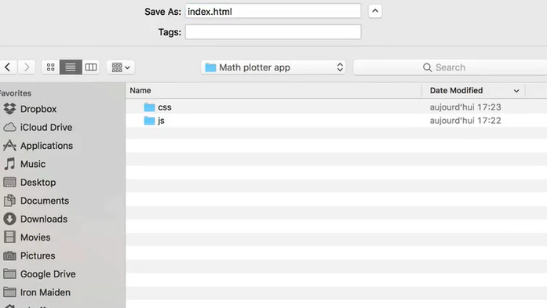{width="6.5in" height="2.0659722222222223in"} -->

<h5>HTML:</h5>

```
<!DOCTYPE html>
<html lang=&quot;en&quot;>
<head>
<title>3 ways to do conditional statements</title>
<meta charset=&quot;utf-8&quot;/>
</head>
<body>
Look at the js code from this example!
And do not forget to open the devtool
console to see the outputs.
</body>
</html>
```

<h5>JS:</h5>

```
/*CONDITIONAL STATEMENTS*/
/*3 examples which are equivalent*/
//try to change foo value
var foo=1;
//var foo=2;
//var foo=1000;
//var foo=0;
//var foo='1';
var bar1,bar2,bar3;
//example 1
if(foo===1){
bar1='one';
}
else if(foo===2){
bar1='two';
}
else{
bar1='something';
}
//example 2
bar2 = (foo===1)?'one':(foo===2)?'two':'something';
//example 3
switch(foo){
case 1 :
bar3='one';
break;
case 2 :
bar3 ='two';
break;
default:
bar3 ='something';
}
//now we print results :
console.log('example1,&#92;n bar1 >> ' + bar1);
console.log('example2,&#92;n bar2 >> ' + bar2);
console.log('example3,&#92;n bar3 >> ' + bar3);
```

<!--~~~~~~~~~~~~~~~~~~~~~~~~~~~~~~~~~~~~~~~~~~~~~~~~~~~~~~~~~~~~~~~~~~~~~~~~~~~~~~~~~~~~~~~~~~~~-->
<h3 id="ch2-2-3">2.2.3 Loop statements</h3>
<!--~~~~~~~~~~~~~~~~~~~~~~~~~~~~~~~~~~~~~~~~~~~~~~~~~~~~~~~~~~~~~~~~~~~~~~~~~~~~~~~~~~~~~~~~~~~~-->

Hi!

Let&apos;s talk about loop statements.

There are different loop statements in JavaScript.

One is the &quot;while&quot; loop statement.

It starts with some initializations, you give some values to some
variables, then you use the keyword &quot;while&quot; followed by an expression
that you will test.

It will be evaluated as &quot;true&quot; or &quot;false&quot;.

When this expression is false, you continue after the block of
instructions

that is inside the loop.

So, let&apos;s start with an example. We&apos;ve got here some initialization:
&quot;var n = 1, m = 1;&quot;.

We&apos;ve got the keyword &quot;while&quot; followed by the condition, &quot;n less
than 4&quot;, followed by a block of instructions that will be executed as
long as the condition is evaluated as true.

So, with n = 1, n is less than 4, we execute the block of instructions.

Inside the block, n is incremented, n += 1, then n = 2, it&apos;s still less
than 4, we continue, n = 3, it&apos;s still less than 4, we continue, n = 4,
then the condition is false: 4 is not strictly less than 4, and we
continue after the loop and the console.log is executed.

Let&apos;s have a look at the execution of this program. So, while it&apos;s
executed, it prints in the body of the loop console.log, it prints n =
1, this is the initial value, n = 2, n = 3&hellip; when n = 4 the condition
is no more true and we go at the next instruction after the block of
instructions of the loop.

Inside the loop, we also incremented the variable m by adding the
consecutive values of n.

And m had a starting value of one.

1 + 1 + 2 + 3 + 4 &hellip;. the final result is 10 as you can see.

The second kind of loops you can use are called the &quot;do&hellip;while&quot;
loops.

They are very similar to the while loops except that the first execution
of the block of instructions does not depend on any condition.

The condition of the loop is at the end, after the keyword &quot;while&quot;.

Do something&hellip; while the condition is true&hellip;

Let&apos;s look at this example: we&apos;ve got a variable i that has a value of
zero, and we increment it in the loop, but before incrementing it we
print its value.

The final condition is &quot;i strictly less than 20&quot;.

So we are going to execute this for 0, 1, 2... and when i++ will give a
value to i that is 20, then the condition will be no more true, and we
will finish the execution of the loop and execute the console.log that
is here. So, look at the devtool console:

we executed the loop for i = 0 to i = 19. After the last display of the
value, we incremented i, the condition was false, i is 20 now, and we printed
its value.

Ok, the last sort of loop statements you can use are called &quot;for&quot;
loops.

The syntax is like that: &quot;for&quot; followed by parenthesis, followed by a
block of instructions.

And in the parenthesis you&apos;ve got three different parts separated by
semicolons.

The first part is the initialization part, then the &quot;condition ». As
long as the condition is true, the block of instructions will be
evaluated. And there is something called the &quot;final expression&quot;: it&apos;s
a set of instructions that will be executed like if they were located at
the very end of the loop, as the last instruction.

So usually we increment some variables, or decrement some variables that
will make, after a certain number of executions of the loop, the
condition false.

So let&apos;s try a small example: we are going to count one by one from an
initial value to an end value.

You see: I counted from 0 to 5, not included, because of the &quot;less
than&quot; operator here.

I counted for i equals 0, 1, 2, 3, 4&hellip; then, when i is equal to 5 the
condition is no more true and we exit the loop.

We can also use less than or equal to.

In this case we counted to the final value and included it.

We can also increment the loop 2 by 2.

In that case (let me clear and execute again), we run the loop with a value of 
i = 0, i=2, i=4, i=6, the condition is no more true, we exit from the loop.

We can also iterate on the elements of an array.

This is very common.

We&apos;ve got an array here called &quot;daysOfTheWeek&quot; and we are going to
enumerate all the elements inside.

Let&apos;s make a &quot;for&quot; loop, and the final value&hellip; the number of times
we are going to iterate is the number of elements in the array. It&apos;s
given by the &quot;length&quot; property of the array.

What we did: we executed the loop from i = 0, to i = 1, 2, 3, 4, 5, 6, 7!

This is the value of &quot;daysOfWeek.length&quot;, and we incremented the i
variable at the end.

We did this for i = 0, 1, 2, 3, 4, 5, 6 and we displayed the element
with the index equal to i, inside the loop.

Example from the video

<a href="https://codepen.io/w3devcampus/pen/qmGeYZ?editors=0012" target="_blank" rel="noopener noreferrer">Example on CodePen</a>
<!--~~~~~~~~~~~~~~~~~~~~~~~~~~~~~~~~~~~~~~~~~~~~~~~~~~~~~~~~~~~~~~~~~~~~~~~~~~~~~~~~~~~~~~~~~~~~-->
<!--~~~~~~~~~~~~~~~~~~~~~~~~ 178.  (10) ~~~~~~~~~~~~~~~~~~~~~~~~~~~~-->
<p align="center" width="100%">

<!-- <h4></h4> <!-- 2.6" width --> -->

<h4>Loops</h4>

A loop is used to run the same block of code several times while a
condition is satisfied.

If you have trouble with loops, the online tool 
<a href="https://toolness.github.io/slowmo-js/" target="_blank" rel="noopener noreferrer">slowmoJS</a> can be really
useful: you just have to copy and paste an example into it to run it
step by step and see how your program executes loops.

<h4>The while statement</h4>

With a **while** statement, a block of code is executed repeatedly while
the specified condition is satisfied (evaluates to true).

<h4>Syntax:</h4>

**while ( condition ) statement**

The condition is an expression, and the statement can be a block
statement.

Typical example of a while statement:

<pre>1.  var i = 1, j = 1;
2.   
3.  <b>while ( i < 4 ) {</b>
4.      j += i;
5.      i += 1; 
6.  <b>}</b>
7.  &hellip;</pre>

The block inside the while (**lines 4 and 5**) will be executed three
times:

-   **Line 1** initializes i with a value of 1.

-   We enter the while statement at **line 3**. Is the value
    of i strictly less than 4?

-   Yes, the variable i is equal to 1, we enter the statement inside
    the while.

-   **Run 1:**

    -   We execute **line 4**: j += i; (equivalent to j = j + i).
        As j was set to 1 at **line 1**, j is now equal to 2.

    -   We execute **line 5** and increment i by one. The variable i is
        now equal to 2.

    -    We go back to the while at **line 3**. Is i < 4? Yes, we
        execute lines 3 and 4 again.

-   **Run 2:**

    -   Now at the end of **line 5**, j is equal to &quot;old j value&quot; +
        &quot;new i value&quot;, so j = 2 + 2 = 4, i has been incremented and is
        now equal to 3.

    -   We go back to the while at **line 3**. Is i < 4? Yes, we
        execute lines 3 and 4 again.

-   **Run 3:**

    -   Now at the end of** line 5**, j is equal to &quot;old j value&quot; +
        &quot;new i value&quot;, so j = 4 + 3 = 7, i has been incremented and is
        now equal to 4.

    -   We go back to the while at **line 3**. Is i < 4? No! The value
        of i is now 4, which is not less than 4. We continue
        the execution of the program at line 7 with i = 4 and j = 7.

Of course, if the condition never evaluates to false, the block will be
executed infinitely until the machine crashes&hellip; a test like while (i
> 0) { &hellip;..} will never stop and will eat all the CPU.

Try this example now with 
<a href="https://toolness.github.io/slowmo-js/?code=var%20i%20%3D%201%2C%20j%20%3D%201%3B%0A%20%0Awhile%20(%20i%20%3C%204%20)%20%7B%0A%20%20%20%20j%20%3D%20j%20%2B%20i%3B%0A%20%20%20%20i%20%3D%20i%20%2B%201%3B%20%0A%7D&filterrange=65-65" target="_blank" rel="noopener noreferrer">
slowmoJS</a>!

<h4>The do-while statement</h4>

The do-while statement is very similar to the while statement, but its
syntax is different:

**do statement while ( condition )**

Typical example:

```
1.  var i = 0;
2.   
3.  **do {**
4.  **    console.log('i = ' + i);**
5.      i++;
6.  **} while(i < 20);**
7.   
8.  console.log('Value of i after the do-while statement: ' + i);
```

The **do-while statement executes the content of the loop once before
checking the condition of the while**, whereas a **while statement will
check the condition first before executing the content**.

A do-while is used for a block of code that must be executed at least
once.These situations tend to be relatively rare, thus the simple
while-statement is more commonly used. 

If you want to &quot;see&quot; the difference, [look at the &quot;do-while&quot;
statement with
slowmoJS](https://toolness.github.io/slowmo-js/?code=var%20condition%3D%20false%3B%0Avar%20foo%20%3D%200%3B%0Ado%7B%0A%20foo%2B%2B%3B%0A%7D%20while(condition%20%3D%3D%20true)%3B%0A%0Afoo%3B&filterrange=80-80) and [the
&quot;while&quot; statement
slowmoJS](https://toolness.github.io/slowmo-js/?code=var%20condition%3D%20false%3B%0Avar%20foo%20%3D%200%3B%0Awhile(condition%20%3D%3D%20true)%3B%20%7b%0Afoo%2B%2B%0A%7d%0A%0Afoo%3B&filterrange=68-68). 

<h4>The for statement</h4>

This statement adds some things to the while and do-while statements: an
initialization expression and an incrementing expression.

Its syntax is:

**for (initialization; condition; incrementation) statement**

The three expressions within the parentheses are optional. If the
condition is omitted, it is replaced by true (infinite loop).

Typical example (counting from 0 to 10):

```
1.  for (var i = 0; i <= 10; i++) {
2.    console.log('i = ' + i);
3.  }
```

We can have more than one instruction in the &quot;initialization part&quot;
(var i = 0), and more than one instruction in the &quot;incrementation
part&quot; (i++). Here is another example:

```
1.  for (**var i = 1, j = 1;** i <= 10;** i++, j+=2**) {
2.  console.log('i = ' + i + ' j = ' + j);
3.  }
```

In this example, two variables are defined and assigned within the
initialization expression. Before each execution of the block statement,
the condition is checked; here we need i <=10. After each execution of
the block statement, the incremental expression is executed to increment
the variables i by 1 and j by 2.

Open the devtool console of your browser and copy and paste the above
code, or [look at the slowmoJS
execution](https://toolness.github.io/slowmo-js/?code=for%20(var%20i%20%3D%201%2C%20j%20%3D%201%3B%20i%20%3C%3D%2010%3B%20i%2B%2B%2C%20j%2B%3D2)%20%7B%0A%20%20%20%20console.log(%27i%20%3D%20%27%20%2B%20i%20%2B%20%27%20j%20%3D%20%27%20%2B%20j)%3B%0A%7D&filterrange=0-89).

<h4>The for-in statement</h4>

The for-in statement is used to iterate through an object (or through an
array, which is also an object). 

Its syntax is:

```
1.  for ( variable in expression ) statement
```

Typical example:

```
1.  var michel = {              // michel is an object
2.      familyName:'Buffa',     // familyName, givenName, age
3.                              // are its properties
4.      givenName: 'Michel',
5.      age: 51
6.  }
7.   
8.  **for(var property in michel) {**   // the for-in will
9.                                  // enumerate properties
10.     console.log(property);      // will print &quot;familyName&quot;,
11.                                 // &quot;givenName&quot;,
12.                                 // &quot;age&quot;
13.     console.log(michel[property]);  // michel['givenName']  same 
14.                                     // as michel.givenName
15. **}**
```

Before each execution of the block statement, the variable named
&quot;property&quot; is assigned with the name of one of the properties (the
keys) of the object.

We will see further examples of this statement in module 4, which is
devoted to the study of JavaScript objects.

<h4>&lbrack;ADVANCED&rbrack; Other statements</h4>

<h4>The continue statement</h4>

The continue statement is used to stop the execution of a block and
start the next iteration of the loop. The difference from the &quot;break&quot;
statement is that the loop continues.

Syntax:

```
1.  continue [label]
```

The label is optional.

Typical example:

```
for(var i = 1, k = 0; i < 5; i++) {
    if (i === 3) {
        continue;
    }
 
    k += 2&ast;i;
    console.log('k += ' + (2*i));
}
console.log('Final k value:' + k)
```

Copy and paste this example in your devtool console, but first, try to
guess what the value of k will be!

Hint: **lines 2-4** mean that **line 6** will never be executed for i =
3. That means that i&ast;2 will only be added to k for i = 1, 2 and 4&hellip;

<h4>The break statement</h4>

The break statement is used to stop an iteration, a switch or a labelled
statement.

Syntax:

```
1.  break [label]
```

Typical example:

```
var tab = ['michel', 'john', 'donald', 'paul']; // johh at
index = 1
 
function isNameInTheArray(name, theArray) {
    console.log("Number of elements in the array :
" + theArray.length);
    for(var i=0; i < theArray.length; i++) {
        console.log('comparing with element in the array at pos
' + i);
 
        if(theArray[i] === name) {
           console.log('the name ' + name +
                       ' is in the array at pos: ' + i);
           break;
        } else {
           console.log(name + ' is not at pos ' + i);
        }
    }
}
 
// Execute the function
isNameInTheArray('john', tab);
```

Copy and paste in the devtool console. You&apos;ll see that the function
that compares each element in the array passed as the second parameter
with the name &apos;john&apos;, will stop looping after &apos;john&apos; has been found
at index = 1.

<h4>**Detailed explanations:**</h4>

-   **Line 20** executes the function

-   **Line 6**: The for statement loops on all existing indexes in
    the tab, from 0 to tab.length

-   **Line 9**: if the condition is true, we enter the block and
    execute** lines 10-12**

-   The break statement at **line 12** will exit from the loop, it
    &quot;breaks&quot; the loop.

-   The different console.log(&hellip;) will never display the message
    &quot;comparing with elements&hellip;&quot; with indexes greater than 1: the
    loop exists when &apos;john&apos; is found at index 1 (i equal to 1).

<!--~~~~~~~~~~~~~~~~~~~~~~~~~~~~~~~~~~~~~~~~~~~~~~~~~~~~~~~~~~~~~~~~~~~~~~~~~~~~~~~~~~~~~~~~~~~~-->
<h3 id="ch2-2-4">2.2.4 Discussion and projects</h3>
<!--~~~~~~~~~~~~~~~~~~~~~~~~~~~~~~~~~~~~~~~~~~~~~~~~~~~~~~~~~~~~~~~~~~~~~~~~~~~~~~~~~~~~~~~~~~~~-->

Here is the discussion forum for this part of the course. Please either
post your comments/observations/questions or share your creations.

#### Suggested topic of discussion:

-   Did you know about the === and !== operators we recommend you to
    use?

#### Optional projects:

-   If not allergic to High School math, please write a piece of code
    that solves second degree equations. You pass the a, b, c parameters
    of: ax^2^ + bx + c, and the solve function will compute delta =
    b^2^ - 4a&ast;c. Test the sign of delta, and if it&apos;s equal to zero,
    then display (in the console, or better, in the page) the roots of
    the equation.

-   Try to write a small program that asks you to guess a number. It
    will choose randomly a number, and will ask you to enter a value in
    an input field. Then it will display &quot;too small&quot; or &quot;too big&quot;,
    until you find the number.
    
    **Hint**: use the Math.random and Math.round methods, such as in let
    randomNumber = Math.round(Math.random() &ast; 10); to get a random
    value between 0 and 10.
    
    For working with input fields, look at section 1.4 from the first
    module, the math function plotter example used input fields. Or look
    at the section about DOM in this module.
<!--~~~~~~~~~~~~~~~~~~~~~~~~~~~~~~~~~~~~~~~~~~~~~~~~~~~~~~~~~~~~~~~~~~~~~~~~~~~~~~~~~~~~~~~~~~~~-->
<!--~~~~~~~~~~~~~~~~~~~~~~~~ 179.  (10) ~~~~~~~~~~~~~~~~~~~~~~~~~~~~-->
<p align="center" width="100%">

<!-- 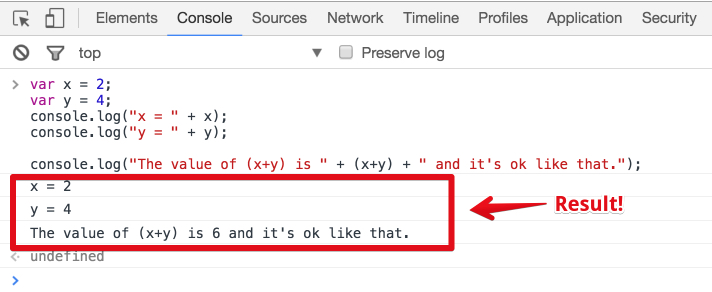{width="1.25in" height="0.9375in"} -->

-   Try to make a quiz using the DOM and buttons, checkboxes, etc.

-   Display a question, for example &quot;Which actor played in Titanic?&quot;,
    and display two or three buttons (&quot;Leonardo Di Caprio&quot;,
    &quot;Christian Bale&quot;, &quot;Nicolas Cage&quot;). Then, when the user presses a
    button, you must check the answer and display the next question,
    etc.

-   Use CSS with an image background for the buttons.

-   Or use images with click listeners - we saw this in the section
    about the DOM and events.

-   A bit more challenging: use checkboxes instead of a set of buttons
    (we&apos;ve done an example close to this in the section that presented
    the DOM).

<!--~~~~~~~~~~~~~~~~~~~~~~~~~~~~~~~~~~~~~~~~~~~~~~~~~~~~~~~~~~~~~~~~~~~~~~~~~~~~~~~~~~~~~~~~~~~~-->
<h3 id="ch2-3-1">2.3.1 Functions and callbacks</h3>
<!--~~~~~~~~~~~~~~~~~~~~~~~~~~~~~~~~~~~~~~~~~~~~~~~~~~~~~~~~~~~~~~~~~~~~~~~~~~~~~~~~~~~~~~~~~~~~-->

Let&apos;s see how to declare a function and a callback.

#### Functions

There are two ways to declare a function.

<h4>1) Standard function declaration</h4>

We&apos;ve already seen that functions can be declared using this syntax:

```
1.  function functionName(parameters) {
2.  // code to be executed
3.  }
```

A function declared this way can be called like this:

```
1.  functionName(parameters);
```

Notice that we do not add a semicolon at the end of a function
declaration. Semicolons are used to separate executable JavaScript
statements, and a function declaration is not an executable statement.

Here is an example:
<!--~~~~~~~~~~~~~~~~~~~~~~~~~~~~~~~~~~~~~~~~~~~~~~~~~~~~~~~~~~~~~~~~~~~~~~~~~~~~~~~~~~~~~~~~~~~~-->
<!--~~~~~~~~~~~~~~~~~~~~~~~~ 180.  (10) ~~~~~~~~~~~~~~~~~~~~~~~~~~~~-->
<p align="center" width="100%">

<!-- 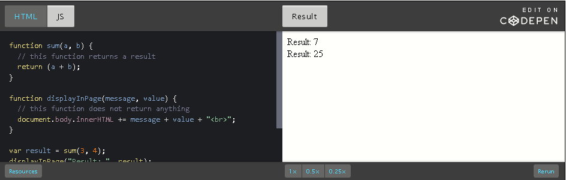{width="6.5in" height="2.0659722222222223in"} -->

<h5>HTML:</h5>

```
<!doctype html>
<html>
<head lang=&quot;en&quot;>
<title>Functions declaration - Part 1</title>
<meta charset=&quot;utf-8&quot;>
</head>
<body>
</body>
</html>
```

<h5>JS:</h5>

```
function sum(a, b) {
// this function returns a result
return (a + b);
}
function displayInPage(message, value) {
// this function does not return anything
document.body.innerHTML += message + value + &quot;<br>&quot;;
}
var result = sum(3, 4);
displayInPage(&quot;Result: &quot;, result);
// we could have written this
displayInPage(&quot;Result: &quot;, sum(10, 15));
```

In the above example, the sum function returns a value, and
the displayInPage function does not return anything.

<h4>2) Use a function expression</h4>

A JavaScript function can also be defined using an expression that can
be stored in a variable. Then, the variable can be used as a function:

Here is a typical example:
<!--~~~~~~~~~~~~~~~~~~~~~~~~~~~~~~~~~~~~~~~~~~~~~~~~~~~~~~~~~~~~~~~~~~~~~~~~~~~~~~~~~~~~~~~~~~~~-->
<!--~~~~~~~~~~~~~~~~~~~~~~~~ 181.  (10) ~~~~~~~~~~~~~~~~~~~~~~~~~~~~-->
<p align="center" width="100%">

<!-- {width="6.5in" height="2.272222222222222in"} -->

<h5>HTML:</h5>

```
<!doctype html>
<html>
<head lang=&quot;en&quot;>
<title>Function expressions - Part 2</title>
<meta charset=&quot;utf-8&quot;>
</head>
<body>
</body>
</html>
```

<h5>JS:</h5>

```
var sum = function(a, b) {
return (a + b);
};
var displayInPage = function(message, value) {
// this function does not return anything
document.body.innerHTML += message + value + &quot;<br>&quot;;
};
var result = sum(3, 4);
displayInPage(&quot;Result: &quot;, result);
// we could have written this
displayInPage(&quot;Result: &quot;, sum(10, 15));
```

Notice how the sum and displayInPage functions have been declared. We
used a variable to store the function expression, then we can call the
functions using the variable name. And we added a semicolon at the end,
since we executed a JavaScript instruction, giving a value to a
variable.

The &quot;function expression&quot; is an &quot;anonymous function&quot;, a function
without a name, that represents a value that can be assigned to a
variable. Then, the variable can be used to execute the function.

We say that functions are &quot;first class objects&quot; which can be
manipulated like any other object/value in JavaScript.

This means that functions can also be used as parameters to other
functions. In this case they are called &quot;callbacks&quot;.

#### Callbacks

Indeed, as functions are first-class objects, we can pass a function as
an argument, as a parameter to another function and later execute that
passed-in function or even return it to be executed later. When we do
this, we talk about **callback functions** in JavaScript: a function
passed to another function, and executed inside the function we called.

All the examples of event listeners that you&apos;ve seen used callback
functions. Here is another one that registers mouse click listeners on
the window object (the window objects represent the whole HTML
document):
<!--~~~~~~~~~~~~~~~~~~~~~~~~~~~~~~~~~~~~~~~~~~~~~~~~~~~~~~~~~~~~~~~~~~~~~~~~~~~~~~~~~~~~~~~~~~~~-->
<!--~~~~~~~~~~~~~~~~~~~~~~~~ 182.  (10) ~~~~~~~~~~~~~~~~~~~~~~~~~~~~-->
<p align="center" width="100%">

<!-- 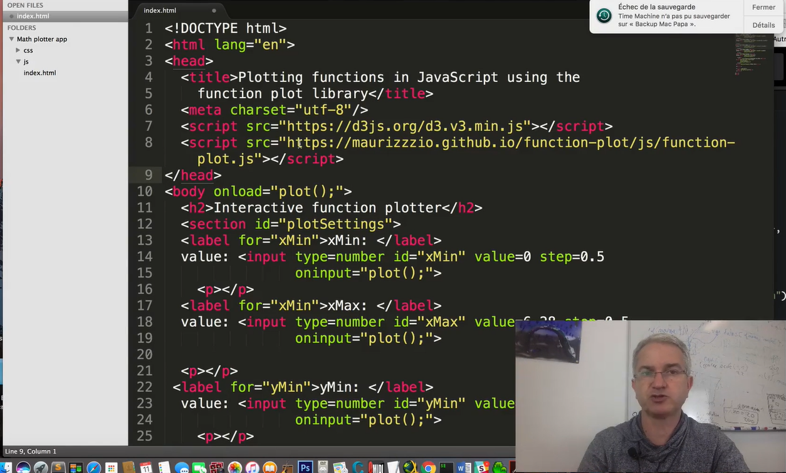{width="6.5in" height="2.588888888888889in"} -->

<h5>HTML:</h5>

```
<!doctype html>
<html>
<head lang=&quot;en&quot;>
<title>Callback functions</title>
<meta charset=&quot;utf-8&quot;>
</head>
<body>
<p>Click in the page!</p>
</body>
</html>
```

<h5>JS:</h5>

```
// Add a click event listener on the whole document
// the processClick function is a callback:
// a function called by the browser when a click event
// is detected
window.addEventListener('click', processClick);
function processClick(event) {
document.body.innerHTML += &quot;Button clicked<br>&quot;;
}
// We could have written this, with the body of the callback as an
argument of the addEventListener function
window.addEventListener('click', function(evt) {
document.body.innerHTML += &quot;Button clicked version 2<br>&quot;;
});
```

In this case, the processClick function is passed as a parameter to
the addEventListener method/function.

Callback functions are derived from a programming paradigm known
as **functional programming**. They are very, very common in JavaScript.
We&apos;ll use them a lot in the next section of the course, called
&quot;Handling events&quot;.

<!--~~~~~~~~~~~~~~~~~~~~~~~~~~~~~~~~~~~~~~~~~~~~~~~~~~~~~~~~~~~~~~~~~~~~~~~~~~~~~~~~~~~~~~~~~~~~-->
<h3 id="ch2-4-1">2.4.1 Introduction</h3>
<!--~~~~~~~~~~~~~~~~~~~~~~~~~~~~~~~~~~~~~~~~~~~~~~~~~~~~~~~~~~~~~~~~~~~~~~~~~~~~~~~~~~~~~~~~~~~~-->

Adding interactivity to a Web application can be achieved by using only
CSS, such as by using the :hover pseudo CSS class.

For example:
<!--~~~~~~~~~~~~~~~~~~~~~~~~~~~~~~~~~~~~~~~~~~~~~~~~~~~~~~~~~~~~~~~~~~~~~~~~~~~~~~~~~~~~~~~~~~~~-->
<!--~~~~~~~~~~~~~~~~~~~~~~~~ 183.  (10) ~~~~~~~~~~~~~~~~~~~~~~~~~~~~-->
<p align="center" width="100%">

<!-- 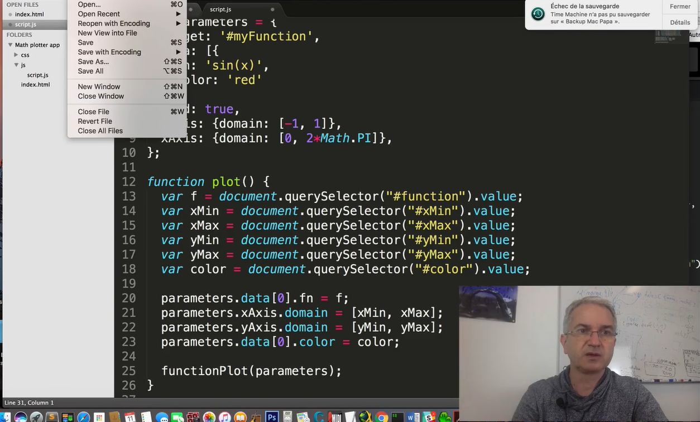{width="6.5in" height="2.0861111111111112in"} -->

<h5>HTML:</h5>

```
<!DOCTYPE html>
<html lang=&quot;en&quot;>
<head>
<title>Mouse over</title>
<meta charset=&quot;utf-8&quot;/>
</head>
<body>
<button>Put the mouse cursor over me</button>
</body>
</html>
```

<h5>CSS:</h5>

```
button:hover {
color:red;
border:2px solid;
}
```

However, firing a specific action when the button is clicked, knowing
which mouse button has been used, computing the (x, y) mouse pointer
position in the button system coordinate, or executing more complex
tasks can only be done through JavaScript.

With JavaScript, a button click, a move of the mouse, a resized window,
and many other interactions create what are called &quot;events&quot;.  The
timing and order of events cannot be predicted in advance. We say that
&quot;event processing&quot; is asynchronous. Web browsers detect events as they
occur, and may pass them to JavaScript code. They do this by allowing
you to register functions as **event listeners**, also
called **handlers** or **callbacks** for specific events.

Each time an event occurs, the browser puts it in a &quot;queue of events&quot;.

Then the browser looks at a list of &quot;Event Listeners&quot; and calls the
ones that correspond to the type of event &quot;they listen to&quot;.

<!--~~~~~~~~~~~~~~~~~~~~~~~~~~~~~~~~~~~~~~~~~~~~~~~~~~~~~~~~~~~~~~~~~~~~~~~~~~~~~~~~~~~~~~~~~~~~-->
<h3 id="ch2-4-2">2.4.2 Adding and removing event listeners</h3>
<!--~~~~~~~~~~~~~~~~~~~~~~~~~~~~~~~~~~~~~~~~~~~~~~~~~~~~~~~~~~~~~~~~~~~~~~~~~~~~~~~~~~~~~~~~~~~~-->

#### Live coding video: adding an event listener to a document
<!--~~~~~~~~~~~~~~~~~~~~~~~~~~~~~~~~~~~~~~~~~~~~~~~~~~~~~~~~~~~~~~~~~~~~~~~~~~~~~~~~~~~~~~~~~~~~-->
<!--~~~~~~~~~~~~~~~~~~~~~~~~ 184.  (10) ~~~~~~~~~~~~~~~~~~~~~~~~~~~~-->
<p align="center" width="100%">

<!-- 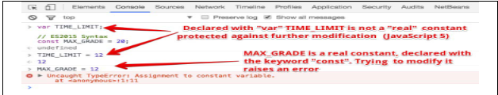{width="6.5in" height="5.139583333333333in"} -->

Hello. Let&apos;s see how events work in JavaScript. In this video, I will
show you how to add a simple event listener for detecting clicks or mouse moves,
and we will start with the simplest example.

It's listening for events that will occur anywhere on the Web page.

When we add an event listener to the whole page, the syntax is this one:
you can type &quot;AddEventListener&quot;, followed by the name of the event.

Here we are going to listen to mouse clicks. And then indicate the
reference of the callback function that will process the event.

Let&apos;s write this callback&hellip;and let&apos;s try it! I clicked on the page
anywhere, and an alert message appeared.

This is the first syntax, and there is a variant that is very common in
JavaScript, when the length of the callback (source code) is small, you
can directly add the callback inside the parenthesis of the AddEventListener
call.

So, let&apos;s see this example&hellip; I&apos;m going to comment the first example,
and this time, instead of just adding as an argument the name of the
callback, we directly put the body of the callback.

<so a function&hellip; and we don&apos;t have to indicate a name: it&apos;s an
anonymous function, an anonymous callback. So, when we click on the
page, we will execute this callback that is located exactly as the
second argument.

If I click on the page, you can see that it works again.

And this syntax is very common!

Notice the parenthesis, followed by a semicolon at the end, because this
is just like a parameter.

It&apos;s an anonymous callback function, that is the second argument.
Finally, there is a first syntax, that uses the the object that will
fire the event. The window object is the whole document. We start with
&quot;on&quot; followed by the name -in lowercase- of the event, and we assign
to this property &quot;onclick&quot;, we assign directly the function.

We can directly type the anonymous function, like that. We add a
semicolon because this is a an executable statement. And if I click&hellip; &hellip;it
works. Okay, or I could have used the same syntax we saw earlier, with a
regular callback function with a name, and we just indicate onclick
equal the name of the callback, like this, which is the same name&hellip; So
if I click, it works.

In this video, I will show you how to add an event listener to an html
element, and not to the whole document, like in the previous video.

So, let&apos;s try with a button. One of the easiest way to detect a click
on a button is to use the onclick = name of the function, name of the callback that will
process the function.

In that case, we can locate the body of this callback anywhere in the
script element.

We can, for example, put the script element in the head element at the
top of the html document.

Let&apos;s try like that&hellip;

In that case, you see, when I click, the processClick callback is
called.

I always add an argument here, that is not used in this example, 
but it will be the topic of a next video.

Here, I&apos;using just the DOM API for adding some text to the document.

If you want to use the other syntax with addEventListener, you must take
some precautions.

You will need first to locate the element, so that you can manipulate it
from JavaScript.

For that, we usually add an id attribute so that we can identify the
element.

And then we use a script element.

I&apos;m putting this one at the end of the document.

There is a good reason for that, that I will explain.

And first, I get a reference on the element.
For that, we use the selector API: it&apos;s a built-in feature that is in
your browser, that is very useful for getting references on elements.
document.querySelector is the name of the method we are going to use.

And then, we use a CSS3 selector.

Notice that the id I use is the same I used in the declaration of the
html button.

Once I've got the reference on the object, I can add the event listener.

Let&apos;s try it.

I click on the button and I get an alert.

You must understand that when you execute document.querySelector,
the button must exist in the page and must has been rendered.

We say that &quot;the DOM of the page must be ready&quot;.

When an HTML page is rendered, it&apos;s sequential, it goes from top to
bottom, so in that case, the button is created, added to the DOM, then the
script is executed, and document.querySelector will return a reference on the button.

If I move this script tag before the button, in that case, it&apos;s not
going to work because the b variable here will correspond to nothing,
it will be null because there is not yet a button in the DOM.

And if we look at the devtool console, we see

&quot;cannot read property addEventListener of null&quot;.

This occurs at this line, we try to run addEventListener on a variable
that is null.

So, be very careful, do not try to select an HTML element when the DOM
is not yet ready.

<h4>Event listeners: a typical example</h4>

Here is one possible syntax for registering an event listener that
listens to &quot;click&quot; events on any part of the window (clicks anywhere
on a web document will be processed by this event handler):

```
<script>
    addEventListener('click', function(evt) {
        document.body.innerHTML += 'Button clicked!';
    });
</script>
```

<h4>Try it below by clicking anywhere on the document:</h4>
<!--~~~~~~~~~~~~~~~~~~~~~~~~~~~~~~~~~~~~~~~~~~~~~~~~~~~~~~~~~~~~~~~~~~~~~~~~~~~~~~~~~~~~~~~~~~~~-->
<!--~~~~~~~~~~~~~~~~~~~~~~~~ 185.  (10) ~~~~~~~~~~~~~~~~~~~~~~~~~~~~-->
<p align="center" width="100%">

<!-- 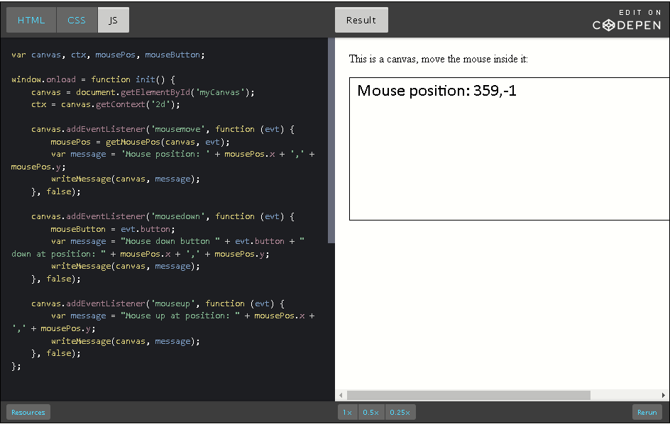{width="6.5in" height="2.0770833333333334in"} -->

<h5>HTML:</h5>

```
<!DOCTYPE html>
<html lang=&quot;en&quot;>
<head>
<title>First example of an event listener</title>
<meta charset=&quot;utf-8&quot;>
<script>
addEventListener('click', function(evt) {
document.body.innerHTML += &quot;Button clicked!<br>&quot;;
});
</script>
</head>
<body>
<p>Click anywhere on this page</p>
</body>
</html>
```

The addEventListener function is one possible syntax for registering a
function to be called when a given type of event occurs.

```
1.  addEventListener(type_of_event, callback_function)
```

In the example below, the type of event is a &apos;click&apos;, and the callback
function is the part in bold:

```
1.  function(evt) {
2.     console.log(&quot;Button clicked!&quot;);
3.  }
```

When this function is small (a few lines of code), it&apos;s common practice
to put its body as the second parameter of
the addEventListener function.

In other words, this:

```
1.  <script>
2.  addEventListener('click', **function(evt) {**
3.      **document.body.innerHTML += 'Button clicked!';**
4.  **}**);
5.  </script>
```

&hellip; is the same as this (the function called when a click occurs has
its body &quot;outside&quot; of the addEventListener parameters, and we use its
name as the second parameter):

```
1.  <script>
2.  addEventListener('click',** processClick**);
3.  
4.  function** processClick**(evt) {
5.      console.log(&quot;Button clicked!&quot;);
6.  }
7.  </script>
```

#### Adding an event listener to specific HTML elements

Instead of listening to event on the whole document
(using addEventListener is the same as using window.addEventListener),
we can listen to specific DOM elements.

For example, here is how we can listen to clicks on a specific button
(whereas clicks on the rest of the document will be ignored).
<!--~~~~~~~~~~~~~~~~~~~~~~~~~~~~~~~~~~~~~~~~~~~~~~~~~~~~~~~~~~~~~~~~~~~~~~~~~~~~~~~~~~~~~~~~~~~~-->
<!--~~~~~~~~~~~~~~~~~~~~~~~~ 186.  (10) ~~~~~~~~~~~~~~~~~~~~~~~~~~~~-->
<p align="center" width="100%">

<!-- 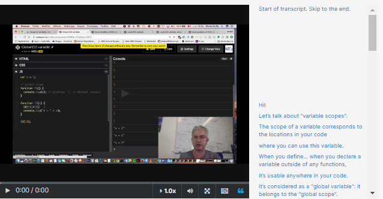{width="6.5in" height="2.0701388888888888in"} -->

<h5>HTML:</h5>

```
<!DOCTYPE html>
<html lang=&quot;en&quot;>
<head>
<title>Second example of an event listener</title>
<meta charset=&quot;utf-8&quot;>
</head>
<body>
<button id=&quot;myButton&quot;>Click me!</button>
<p></p>
<script>
var b = document.querySelector(&quot;#myButton&quot;);
b.addEventListener('click', function(evt) {
alert(&quot;Button clicked&quot;);
});
</script>
</body>
</html>
```

In this example, instead of using the addEventListener method directly,
we used it on a DOM object (the button):

1.  Get a reference of the HTML element that can fire the events you
    want to detect. This is done using the DOM API that we&apos;ll cover in
    detail later in this Module. In this example we used one of the most
    common/useful methods: var b =
    document.querySelector(&quot;#myButton&quot;);

2.  Call the addEventListener method on this object. In the
    example: b.addEventListener(&apos;click&apos;, callback)

Every DOM object has an addEventListener method. Once you get a
reference of  any HMTL element from JavaScript, you can start listening
to events on it.

### An alternative method for adding an event listener to an HTML element: use an &quot;on&quot; attribute (ex: onclick = &quot;&hellip;.&quot;)

Instead of using b.addEventListener(&apos;click&apos;, callback), it&apos;s possible
to use an onclick=&apos;doSomething();&apos; attribute directly in the HTML tag
of the element:
<!--~~~~~~~~~~~~~~~~~~~~~~~~~~~~~~~~~~~~~~~~~~~~~~~~~~~~~~~~~~~~~~~~~~~~~~~~~~~~~~~~~~~~~~~~~~~~-->
<!--~~~~~~~~~~~~~~~~~~~~~~~~ 187.  (10) ~~~~~~~~~~~~~~~~~~~~~~~~~~~~-->
<p align="center" width="100%">

<!-- 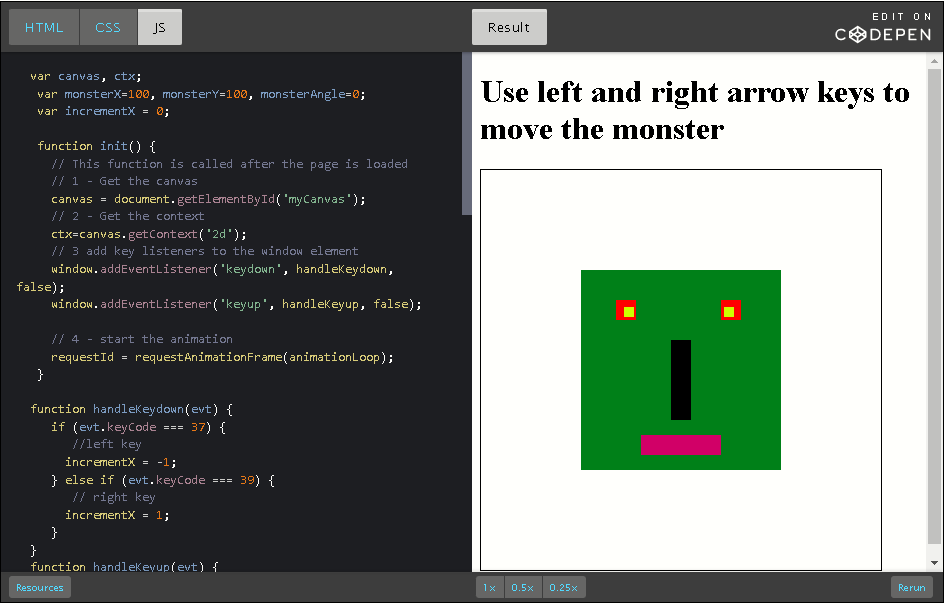{width="6.5in" height="2.104861111111111in"} -->

<h5>HTML:</h5>

```
<!DOCTYPE html>
<html lang=&quot;en&quot;>
<head>
<title>Third example of an event listener</title>
<meta charset=&quot;utf-8&quot;>
<script>
function processClick(evt) {
alert(&quot;Button clicked&quot;);
};
</script>
</head>
<body>
<button id=&quot;myButton&quot; onclick=&quot;processClick(event);&quot;>Click
me!</button>
</body>
</html>
```

This syntax:

```
1.  <button id=&quot;myButton&quot; **onclick=&quot;processClick(event);**&quot;>Click
    me!</button>
```

&hellip; is ok when you only need a single event listener to click events
for this button, as there can be only one onclick attribute per element.

Using the b.addEventListener(&apos;click&apos;, callback) syntax,  you can
register more than one event listener. You&apos;ll need rarely to do this,
so in my opinion it&apos;s fine to choose whichever syntax you like.

Remember that for big projects, it&apos;s always better to separate the
HTML, CSS and JavaScript code. In this case, I&apos;d recommend that you put
all your event listener definitions in a separate JavaScript file, and
use the addEventListener syntax in preference to the &quot;on&quot; attributes
syntax.

### Removing event listeners

When we click on the button, we execute the processClick(evt) callback
function, and inside we remove the listener we previously registered.
Consequence: if we click on the button again, nothing happens as there
is no longer a click event listener attached to it.
<!--~~~~~~~~~~~~~~~~~~~~~~~~~~~~~~~~~~~~~~~~~~~~~~~~~~~~~~~~~~~~~~~~~~~~~~~~~~~~~~~~~~~~~~~~~~~~-->
<!--~~~~~~~~~~~~~~~~~~~~~~~~ 188.  (10) ~~~~~~~~~~~~~~~~~~~~~~~~~~~~-->
<p align="center" width="100%">

<!-- 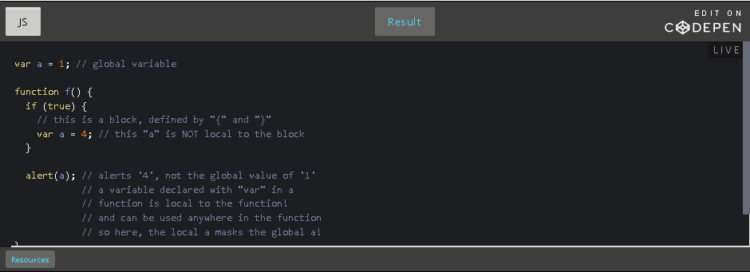{width="6.5in" height="2.0909722222222222in"} -->

<h5>HTML:</h5>

```
<!DOCTYPE html>
<html lang=&quot;en&quot;>
<head>
<title>Removing an event listener</title>
<meta charset=&quot;utf-8&quot;>
</head>
<body>
<button id=&quot;myButton&quot;>Click me, this will work only once!</button>
<p></p>
<script>
var b = document.querySelector(&quot;#myButton&quot;);
b.addEventListener('click', processClick);
function processClick(evt) {
alert(&quot;Button clicked, event listener removed, try to click on the
button again: nothing will happen anymore!&quot;);
b.removeEventListener('click', processClick);
}
</script>
</body>
</html>
```

Note that to remove an event listener, you should have added it with its
named function, so that we can pass it to
both addEventListener and removeEventListener.

<!--~~~~~~~~~~~~~~~~~~~~~~~~~~~~~~~~~~~~~~~~~~~~~~~~~~~~~~~~~~~~~~~~~~~~~~~~~~~~~~~~~~~~~~~~~~~~-->
<h3 id="ch2-4-3">2.4.3 The event object</h3>
<!--~~~~~~~~~~~~~~~~~~~~~~~~~~~~~~~~~~~~~~~~~~~~~~~~~~~~~~~~~~~~~~~~~~~~~~~~~~~~~~~~~~~~~~~~~~~~-->

The event object is the only parameter passed to event listeners.

Typical example:

```
1.  function processClick(**evt**) {
2.      alert(&quot;Button clicked!&quot;);
3.  }
```

Each event listener has a single parameter that is  a &quot;DOM event
object&quot;. It has various properties and methods that can be very useful.

For example, with a &apos;keyup&apos;, &apos;keydown&apos; or &apos;keypress&apos; event, the
event object contains the code of the key that has been
pressed/released, with a &apos;mousemove&apos; listener we can get the relative
position of the mouse in the DOM element that has generated the event,
etc.

The event object contains some important properties and methods that are
common to all types of events:

-   **evt.type**: the name of the event

-   **evt.target:** for example, is the HTML element that has fired the
    event. In our previous examples with the click listeners on a
    button, **evt.target** in the event listener is the button itself.

-   **evt.stopPropagation()**: will not propagate the event to all other
    elements that listen to it. If several elements are registered for a
    click event - for example, you have a click listener on a button and
    on the window (the whole page). If you click on the button, and if
    in its click event listener you call evt.stopPropagation(); then the
    click event listener on the window object will never be called.

-   **evt.preventDefault()**: the default browser behavior will not be
    executed. For example, in a &apos;contextmenu&apos; event listener attached
    to an object, if you call **evt.preventDefault()**, instead of
    having the right click default context menu of your browser
    displayed, you&apos;ll be able to display your own context menu,
    like [in this
    example](https://jsbin.com/kuyorac/edit?html,css,js,console,output).

It also contains properties that are associated with the type of the
event, for example:

-   **evt.button**: the mouse button that has been used in the case of a
    mouse event listener

-   **evt.keyCode**: the code of the key that has been used

-   **evt.pageX**: coordinate of the mouse relative to the page

-   etc.

In the subsequent sections of this course we will look at the most
common types of events in detail.

### Reference table

The most useful common properties are:
<!--~~~~~~~~~~~~~~~~~~~~~~~~~~~~~~~~~~~~~~~~~~~~~~~~~~~~~~~~~~~~~~~~~~~~~~~~~~~~~~~~~~~~~~~~~~~~-->
<!--~~~~~~~~~~~~~~~~~~~~~~~~ 189.  (10) ~~~~~~~~~~~~~~~~~~~~~~~~~~~~-->
<p align="center" width="100%">

<!-- 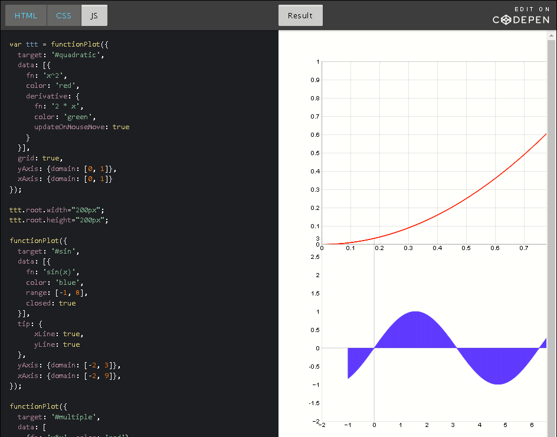{width="6.5in" height="2.5520833333333335in"} -->
<!--~~~~~~~~~~~~~~~~~~~~~~~~~~~~~~~~~~~~~~~~~~~~~~~~~~~~~~~~~~~~~~~~~~~~~~~~~~~~~~~~~~~~~~~~~~~~-->
<h3 id="ch2-4-4">2.4.4 Page lifecycle events</h3>
<!--~~~~~~~~~~~~~~~~~~~~~~~~~~~~~~~~~~~~~~~~~~~~~~~~~~~~~~~~~~~~~~~~~~~~~~~~~~~~~~~~~~~~~~~~~~~~-->

Hi!

This time let&apos;s talk about the event object, and we&apos;ll start looking
at different types of events.

One of the events you will use is called the &apos;load&apos; event, and you can
apply it on the page using onload equal followed by the name of the
callback.

I usually call this callback &quot;init&quot; and this is a good practice:
always use a function that will be called when the page is loaded.

I&apos;m adding a console.log message just to verify.

I open the console, and you can see that if I save the document and run
again the example, or if I clear the console and execute it again, this
callback is called when the page is loaded&hellip;

that means &quot;when the DOM is ready&quot;.Then, from this function, I can
call any other function, I can execute any kind of code, I will never
have to wonder&hellip; to think: &quot;is the DOM ready?&quot;

For example, to update this part of the page&hellip;

I use a span with an id attribute.

I can locate the span&hellip; and like this&hellip; using the querySelector
method and a CSS selector on the id&hellip; &quot;pageStatus&quot; is the id of the
element&hellip;

Then I can change the content of the page&hellip;

If you look at what is happening when I execute the code, it says &quot;page
loaded&quot;.

So, this is a very good practice.

I nearly always do this on my own softwares.

Another variant is that instead of using the &quot;onload&quot; syntax, you can
just write window.load = init.

This will produce the same result&hellip; onload&hellip; and in that case,
instead of using body onload&hellip;you use window.onload.

It&apos;s a bit better because you do not mix JavaScript and html, it&apos;s a
better separation of the different parts of your Web application.

You may notice that here I haven&apos;t typed the event argument.

Every event callback will have an event object passed by the browser
when the event is processed.

And this event object can be used to guess what type of event has been
fired, can be used to get the different properties of the event, such as
the x and y positions of the mouse, the button that has been clicked,
the target element that fired the event and so on&hellip;

If now, for example, I want to listen to events on a button&hellip; a bit in
a similar way we presented in a previous example&hellip;

I can add a listener in the init function&hellip;and in this listener, I
can, for example, display the name of the button that has been used for
clicking.

Let&apos;s try it&hellip; here is the console, I clear it, then I click on the
button, and it says it&apos;s button 0.

You can also try different types of events, like detecting mouse moves.

In that case, we are going to detect mouse moves on the button, and you
can see in the console that it works.

You can, for example, use the event objet to detect the x position of
the mouse.

There are different properties for getting the position of the mouse,
relative to top of the page, relative to the top of the viewport or
relative to the the element that fired the event.

This is detailed in the section about mouse events.

But here, I&apos;m just showing you one the most common property, that is
called clientX: it gives the position of the cursor, relative to the top
of the page.

Just as an example of using the different properties of the event
element.

In the next sections, for each kind of event, we&apos;ll detail the
different properties and provide examples that show how to use them.

#### Online example used in the above video

-   [Example on
    CodePen](https://codepen.io/w3devcampus/pen/XgrveY?editors=0001)

The page lifecycle events detect when the page is loaded and when the
DOM is ready.

#### Events related to the page lifecycle

There are many other events related to the page life cycle. The most
useful ones for an introduction course are shown below:
<!--~~~~~~~~~~~~~~~~~~~~~~~~~~~~~~~~~~~~~~~~~~~~~~~~~~~~~~~~~~~~~~~~~~~~~~~~~~~~~~~~~~~~~~~~~~~~-->
<!--~~~~~~~~~~~~~~~~~~~~~~~~ 190.  (10) ~~~~~~~~~~~~~~~~~~~~~~~~~~~~-->
<p align="center" width="100%">

<!-- 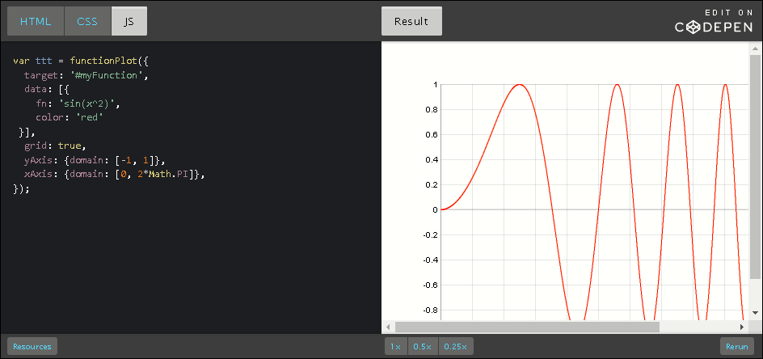{width="6.5in" height="2.029166666666667in"} -->

<h4>Page event properties</h4>

There are no particular properties that need to be mentioned here.
Usually, the load event listener corresponds to a JavaScript function
that can be seen as &quot;the main&quot; function of your Web application. It is
a best practice to start everything after the page has been completely
loaded. In the resize listener, you get the new size of the window, or
the new size of some HTML elements in the page (as they might have been
resized too when the window was resized), and then you do something
(redraw a graphic in an HTML canvas that takes into account the new
canvas size, for example).

#### Example 1: wait until the page is loaded (when the DOM is ready) before doing something

This first variant that uses <body onload=&quot;init();&quot;>
<!--~~~~~~~~~~~~~~~~~~~~~~~~~~~~~~~~~~~~~~~~~~~~~~~~~~~~~~~~~~~~~~~~~~~~~~~~~~~~~~~~~~~~~~~~~~~~-->
<!--~~~~~~~~~~~~~~~~~~~~~~~~ 191.  (10) ~~~~~~~~~~~~~~~~~~~~~~~~~~~~-->
<p align="center" width="100%">

<!-- 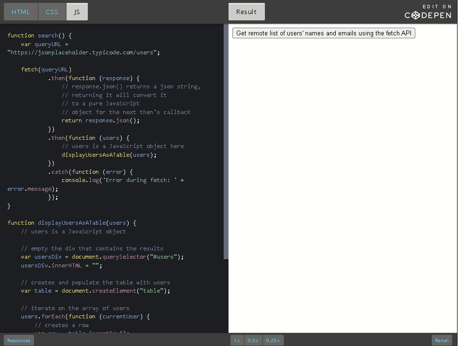{width="6.5in" height="2.0701388888888888in"} -->

<h5>HTML:</h5>

```
<!DOCTYPE html>
<html lang=&quot;en&quot;>
<head>
<meta charset=&quot;utf-8&quot;>
<meta name=&quot;viewport&quot; content=&quot;width=device-width&quot;>
<title>Example1 of the 'load' event</title>
</head>
<body onload='init();'>
<p>This page uses <code><body onload='init();'></code> in
  the JS code to execute the init function ONLY WHEN THE PAGE HAS BEEN
  LOADED!</p>
<p>This is important as very often we cannot do important things
  before the DOM is ready (all HTML elements have been created and can be
  manipulated from JavaScript).</p>
<p>PAGE STATUS: <span id=&quot;pageStatus&quot;>NOT LOADED
  YET</span></p>
</body>
</html>
```

<h5>CSS:</h5>

```
#pageStatus {
border:1px solid red;
padding: 2px;
color:red;
}
```

<h5>JS:</h5>

```
function init() {
var status = document.querySelector('#pageStatus');
status.innerHTML = 'LOADED!';
// start working!
// &hellip;.
}
```

This second variant: using window.onload = init; in the JavaScript
code&hellip;
<!--~~~~~~~~~~~~~~~~~~~~~~~~~~~~~~~~~~~~~~~~~~~~~~~~~~~~~~~~~~~~~~~~~~~~~~~~~~~~~~~~~~~~~~~~~~~~-->
<!--~~~~~~~~~~~~~~~~~~~~~~~~ 192.  (10) ~~~~~~~~~~~~~~~~~~~~~~~~~~~~-->
<p align="center" width="100%">

<!-- 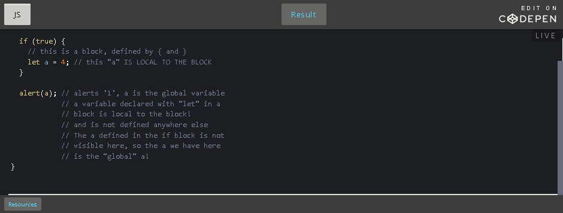{width="6.5in" height="2.0701388888888888in"} -->

<h5>HTML:</h5>

```
<!DOCTYPE html>
<html lang=&quot;en&quot;>
<head>
<meta charset=&quot;utf-8&quot;>
<meta name=&quot;viewport&quot; content=&quot;width=device-width&quot;>
<title>Example 2 of the 'load' event</title>
</head>
<body>
<p>This page uses <code>window.onload = init;</code> in the JS
  code to execute the init function ONLY WHEN THE PAGE HAS BEEN
  LOADED!</p>
<p>This is important as very often we cannot do important things
  before the DOM is ready (all HTML elements have been created and can be
  manipulated from JavaScript).</p>
<p>PAGE STATUS: <span id=&quot;pageStatus&quot;>NOT LOADED
  YET</span></p>
</body>
</html>
```

<h5>CSS:</h5>

<pre>
#pageStatus {
border:1px solid red;
padding: 2px;
color:red;
}
</pre>

<h5>JS:</h5>

<pre>
window.onload = init;
function init() {
var status = document.querySelector('#pageStatus');
status.innerHTML = 'LOADED!';
// start working!
// &hellip;.
}
</pre>

<h4>Example 2: detect a resize of the window</h4>

In this example, we&apos;re listening to page load and page resize events.
When the window is loaded for the first time, or resized, we call
the resize() callback function.
The window.innerWidth and window.innerHeight properties are used to
display the updated size of the window. We also
use screen.width and screen.height to display the screen size.
<!--~~~~~~~~~~~~~~~~~~~~~~~~~~~~~~~~~~~~~~~~~~~~~~~~~~~~~~~~~~~~~~~~~~~~~~~~~~~~~~~~~~~~~~~~~~~~-->
<!--~~~~~~~~~~~~~~~~~~~~~~~~ 193.  (10) ~~~~~~~~~~~~~~~~~~~~~~~~~~~~-->
<p align="center" width="100%">

<!-- 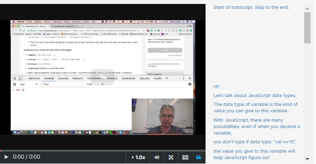{width="6.5in" height="2.0631944444444446in"} -->

<h5>HTML:</h5>

```
<!DOCTYPE html>
<html lang=&quot;en&quot;>
<head>
  <meta charset=&quot;utf-8&quot;>
  <meta name=&quot;viewport&quot; content=&quot;width=device-width&quot;>
  <title>Example1 of the 'resize' event</title>
</head>
<body>
  <p>This page uses <code>window.onresize = resize;</code> in the JS
    code to execute the resize function. Try to change the size of your
    window now!</p>
  <p>Curent page size: <span id=&quot;pageSize&quot;></span></p>
  <p>Screen size: <span id=&quot;screenSize&quot;></span></p>
</body>
</html>
```

<h5>CSS:</h5>

<pre>
border:1px solid red;
padding: 2px;
color:red;
}
</pre>

<h5>JS:</h5>

<pre>
window.onload = resize;
window.onresize = resize;
function resize(evt) {
  console.log(&quot;resize&quot;);
  var pageSizeSpan = document.querySelector('#pageSize');
  pageSizeSpan.innerHTML = &quot;Width: &quot; + window.innerWidth + &quot; Height:
    &quot; + window.innerHeight;
// screen size
var screenSizeSpan = document.querySelector('#screenSize');
  screenSizeSpan.innerHTML = &quot;Width: &quot; + screen.width + &quot; Height: &quot; +
    screen.height;
}
</pre>

<h4>Example 3: do something as the page is being scrolled up or down</h4>
<!--~~~~~~~~~~~~~~~~~~~~~~~~~~~~~~~~~~~~~~~~~~~~~~~~~~~~~~~~~~~~~~~~~~~~~~~~~~~~~~~~~~~~~~~~~~~~-->
<!--~~~~~~~~~~~~~~~~~~~~~~~~ 194.  (10) ~~~~~~~~~~~~~~~~~~~~~~~~~~~~-->
<p align="center" width="100%">

<!-- 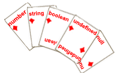{width="6.5in" height="2.0701388888888888in"} -->

<h5>HTML:</h5>

```
<!DOCTYPE html>
<html lang=&quot;en&quot;>
<head>
<meta charset=&quot;utf-8&quot;>
<meta name=&quot;viewport&quot; content=&quot;width=device-width&quot;>
<title>Example of the 'scroll' event</title>
</head>
<body>
<div class=&quot;progress&quot;>
<div>Percentage</div>
</div>
<p id=&quot;text&quot;>Scroll me and the progress bar on the right will show
the percentage of scroll. Look also at the CSS
code (body is 2000px height, for example)&hellip;</p>
</body>
</html>
```

<h5>CSS:</h5>

<pre>
.progress {
  border: 1px solid blue;
  width: 100px;
  position: fixed;
  top: 10px; right: 10px;
}
.progress &lt; div {
  height: 12px;
  background: lightBlue;
  width: 0%;
  font-size:8px;
}
#text {
  margin-top:50px;
}
body {
  height: 2000px;
}
</pre>

<h5>JS:</h5>

<pre>window.onload = init;
  var progressBar;
    function init() {
    progressBar = document.querySelector(&quot;.progress div&quot;);
  window.addEventListener(&quot;scroll&quot;, function() {
    var max = document.body.scrollHeight - window.innerHeight;
    var percent = (window.pageYOffset / max) &ast; 100;
    progressBar.style.width = percent + &quot;%&quot;;
  });
}</pre>
<!--~~~~~~~~~~~~~~~~~~~~~~~~~~~~~~~~~~~~~~~~~~~~~~~~~~~~~~~~~~~~~~~~~~~~~~~~~~~~~~~~~~~~~~~~~~~~-->
<h3 id="ch2-4-5">2.4.5 Key events</h3>
<!--~~~~~~~~~~~~~~~~~~~~~~~~~~~~~~~~~~~~~~~~~~~~~~~~~~~~~~~~~~~~~~~~~~~~~~~~~~~~~~~~~~~~~~~~~~~~-->
<p>This has been a bit of a nightmare for years, as different browsers have
had different ways of handling key events and key codes (
<a href="https://unixpapa.com/js/key.html" target="_blank" rel="noopener noreferrer">read this</a> if you are fond of 
JavaScript archeology). Fortunately it&apos;s much better today, and we are able 
to rely on methods that should work on any browser.</p>

<p>When you listen to keyboard related events (keydown, keyup or keypressed), the 
event parameter passed to the listener function will contain the code of the key 
that fired the event. Then it is possible to test which key has been pressed or 
released, like this:</p>

<pre>
1.  window.addEventListener('keydown', function(event) {
2.     if (<b>event.keyCode === 37</b>) {
3.       //left arrow was pressed
4.     }
5.  });
</pre>

<p>At <b>line 2</b>, the value &quot;37&quot; is the key code that corresponds to the
left arrow. It might be difficult to know which codes represent
which real keyboard keys, so here are some handy pointers:</p>

<ul>
  <li>Try key codes with this <a href="http://www.asquare.net/javascript/tests/KeyCode.html" target="_blank" rel="noopener noreferrer">
    interactive example</a>.</li>
  <li>And find a list of keyCodes (taken from this CSS Tricks 
    <a href="https://css-tricks.com/snippets/javascript/javascript-keycodes/#keycode-values" target="_blank" rel="noopener noreferrer">
	article</a>).</li>
</ul>

<h4>The different key events</h4>

<h4>Event types related to keyboard</h4>
<!--~~~~~~~~~~~~~~~~~~~~~~~~~~~~~~~~~~~~~~~~~~~~~~~~~~~~~~~~~~~~~~~~~~~~~~~~~~~~~~~~~~~~~~~~~~~~-->
<!--~~~~~~~~~~~~~~~~~~~~~~~~ 195.  (10) ~~~~~~~~~~~~~~~~~~~~~~~~~~~~-->
<p align="center" width="100%">

<!-- 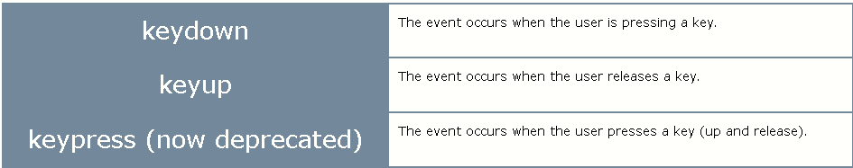{width="6.5in" height="1.2861111111111112in"} -->

<h4>keyboardEvent properties

These are legacy properties, still used by many JavaScript code around
the world. However, we do not recommend that you use them if you are
targeting modern browsers. keyCode has a more powerful/easy to use
replacement called code (not yet supported by all browsers), that comes
with a new key property (see the following pages of the course).
<!--~~~~~~~~~~~~~~~~~~~~~~~~~~~~~~~~~~~~~~~~~~~~~~~~~~~~~~~~~~~~~~~~~~~~~~~~~~~~~~~~~~~~~~~~~~~~-->
<!--~~~~~~~~~~~~~~~~~~~~~~~~ 196.  (10) ~~~~~~~~~~~~~~~~~~~~~~~~~~~~-->
<p align="center" width="100%">

<!-- 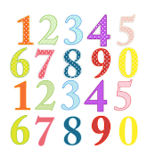{width="6.5in" height="1.7333333333333334in"} -->

<h4>Example #1: use keyup and keydown on the window object</h4>
<!--~~~~~~~~~~~~~~~~~~~~~~~~~~~~~~~~~~~~~~~~~~~~~~~~~~~~~~~~~~~~~~~~~~~~~~~~~~~~~~~~~~~~~~~~~~~~-->
<!--~~~~~~~~~~~~~~~~~~~~~~~~ 197.  (10) ~~~~~~~~~~~~~~~~~~~~~~~~~~~~-->
<p align="center" width="100%">

<!-- {width="6.5in" height="2.0631944444444446in"} -->

<h5>HTML:</h5>

```
<!DOCTYPE html>
<html lang=&quot;en&quot;>
<head>
<meta charset=&quot;utf-8&quot;>
<meta name=&quot;viewport&quot; content=&quot;width=device-width&quot;>
<title>Example of the 'keyup' and 'keydown' events on the window
  object</title>
</head>
<body>
<p>Please type some keys and see what happens</p>
<div id=&quot;keys&quot;></div>
</body>
</html>
```

<h5>JS:</h5>

```
window.onkeyup = processKeyUp;
window.onkeydown = processKeyDown;
/&ast; or we could have written:
window.addEventListener('keyup', processKeyUp);
window.addEventListener('keydown', processKeyDown);
&ast;/
function processKeyUp(evt) {
var keys = document.querySelector('#keys');
keys.innerHTML += &quot;keyup: &quot; + evt.key + &quot; code: &quot; + evt.keyCode +
  &quot;<br>&quot;;
}
function processKeyDown(evt) {
var keys = document.querySelector('#keys');
keys.innerHTML += &quot;keydown: &quot; + evt.key + &quot; code: &quot; + evt.keyCode +
&quot;<br>&quot;;
}
```

<h4>Example #2: see  keypress on the window object</h4>

See the Pen [keyup and keydown events on
window](https://codepen.io/w3devcampus/pen/WpWjey/) by W3Cx
([&commat;w3devcampus](https://codepen.io/w3devcampus))
on [CodePen](https://codepen.io/).

<h4>Example #3: detect a combination of keys + modifier keys (shift, ctrl, alt)</h4>

Try to type shift-a for example, ctrl-shift-b or alt-f&hellip;
<!--~~~~~~~~~~~~~~~~~~~~~~~~~~~~~~~~~~~~~~~~~~~~~~~~~~~~~~~~~~~~~~~~~~~~~~~~~~~~~~~~~~~~~~~~~~~~-->
<!--~~~~~~~~~~~~~~~~~~~~~~~~ 198.  (10) ~~~~~~~~~~~~~~~~~~~~~~~~~~~~-->
<p align="center" width="100%">

<!-- 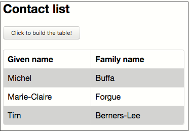{width="6.5in" height="2.0770833333333334in"} -->

<h5>HTML:</h5>

```
<!DOCTYPE html>
<html lang=&quot;en&quot;>
<head>
<meta charset=&quot;utf-8&quot;>
<meta name=&quot;viewport&quot; content=&quot;width=device-width&quot;>
<title>Example of the 'keypress' event on the window object, awith
  shift, meta and alt</title>
</head>
<body>
<p>Please type some keys and see what happens. Try typing key
  modifiers at the same time: shift, alt, control</p>
<div id=&quot;keys&quot;></div>
</body>
</html>
```

<h5>JS:</h5>

```
window.onkeydown = processKeyDown;
/&ast; or we could have written:
window.addEventListener('keypress', processKeyPress);
&ast;/
function processKeyDown(evt) {
var keys = document.querySelector('#keys');
keys.innerHTML += &quot;keypress: &quot; + evt.key +
&quot; code: &quot; + evt.keyCode + &quot; Modifiers : &quot;;
var modifiers = &quot;&quot;;
if(event.shiftKey)
modifiers += &quot;SHIFT &quot;;
if(event.altKey)
modifiers += &quot;ALT &quot;;
if(event.ctrlKey)
modifiers += &quot;CTRL &quot;;
if(modifiers === &quot;&quot;)
modifiers = &quot;NONE&quot;;
keys.innerHTML += modifiers + &quot;<br>&quot;;
}
```

<!--~~~~~~~~~~~~~~~~~~~~~~~~~~~~~~~~~~~~~~~~~~~~~~~~~~~~~~~~~~~~~~~~~~~~~~~~~~~~~~~~~~~~~~~~~~~~-->
<h3 id="ch2-4-6">2.4.6 Dealing with different keyboard layouts</h3>
<!--~~~~~~~~~~~~~~~~~~~~~~~~~~~~~~~~~~~~~~~~~~~~~~~~~~~~~~~~~~~~~~~~~~~~~~~~~~~~~~~~~~~~~~~~~~~~-->

Please do not assume that each key is at the same location on the
keyboard in every country!

We&apos;ve shown how to detect keyup, keydown and keypress events using the
DOM API, and how to use the keyCode property of the DOM event.

Be careful when you use the key events in your application, as keyboard
layouts vary from one country to another. Most first person shooter
games (FPS) use three keys located on the top left of your keyboard to
move your character. French AZERTY keyboards will use ZQSD for this (Z =
up/move forward, Q and D are for left/right and S is for down/move
backward), while US keyboards will use WASD, for example. So keep in
mind that keys are not located at the same place on keyboards from
different countries.

Extract from the &quot;[Internationalize your keyboard
controls](https://hacks.mozilla.org/2017/03/internationalize-your-keyboard-controls/)&quot;
article on MDN:

**&quot;Recently I came across two lovely new graphical demos, and in both
cases, the controls would not work on my French **[*AZERTY
keyboard*](https://en.wikipedia.org/wiki/AZERTY)**.**

**There was the wonderful WebGL 2 technological demo **[*After The
Flood*](https://www.youtube.com/watch?v=TT7ugKuUMv0/)**, and the very
cute **[*Alpaca
Peck*](https://codepen.io/shshaw/full/apwMwM/)**. **[*Shaw*](https://codepen.io/shshaw/)** was
nice enough to fix the latter when I told him about the issue. It turns
out the Web browser actually exposes a useful API for this.&quot;**

### One keyboard, many layouts

For details, see [Wikipedia's keyboard layout
page](https://en.wikipedia.org/wiki/Keyboard_layout)!

<h4>[QWERTY](https://en.wikipedia.org/wiki/QWERTY) layout, used in US, GB, etc.</h4>

<!--~~~~~~~~~~~~~~~~~~~~~~~~~~~~~~~~~~~~~~~~~~~~~~~~~~~~~~~~~~~~~~~~~~~~~~~~~~~~~~~~~~~~~~~~~~~~-->
<!--~~~~~~~~~~~~~~~~~~~~~~~~ 199.  (10) ~~~~~~~~~~~~~~~~~~~~~~~~~~~~-->
<p align="center" width="100%">

<!-- 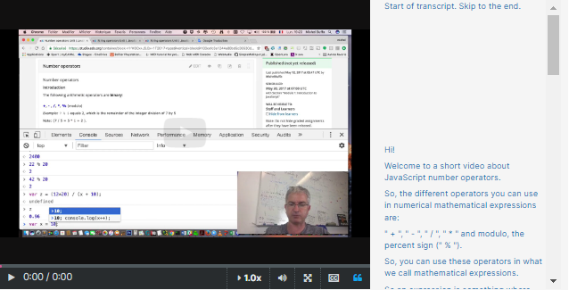{width="5.208333333333333in" height="1.7395833333333333in"} -->
<!--~~~~~~~~~~~~~~~~~~~~~~~~~~~~~~~~~~~~~~~~~~~~~~~~~~~~~~~~~~~~~~~~~~~~~~~~~~~~~~~~~~~~~~~~~~~~-->
<!--~~~~~~~~~~~~~~~~~~~~~~~~ 200.  (10) ~~~~~~~~~~~~~~~~~~~~~~~~~~~~-->
<p align="center" width="100%">

<!-- 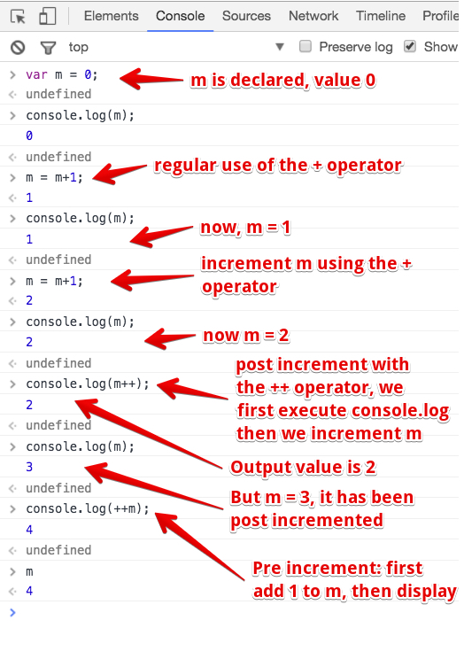{width="5.208333333333333in" height="1.6041666666666667in"} -->

<h4>In addition, [QWERTZ](https://en.wikipedia.org/wiki/QWERTZ) keyboards are in use in Germany and other European countries, and [DVORAK](https://en.wikipedia.org/wiki/Dvorak_keyboard_layout) is another alternative to QWERTY:</h4>

DVORAK:
<!--~~~~~~~~~~~~~~~~~~~~~~~~~~~~~~~~~~~~~~~~~~~~~~~~~~~~~~~~~~~~~~~~~~~~~~~~~~~~~~~~~~~~~~~~~~~~-->
<!--~~~~~~~~~~~~~~~~~~~~~~~~ 201.  (10) ~~~~~~~~~~~~~~~~~~~~~~~~~~~~-->
<p align="center" width="100%">

<!-- 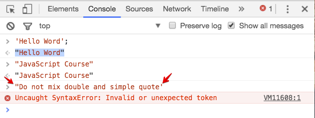{width="5.208333333333333in" height="1.6041666666666667in"} -->

QWERTZ:
<!--~~~~~~~~~~~~~~~~~~~~~~~~~~~~~~~~~~~~~~~~~~~~~~~~~~~~~~~~~~~~~~~~~~~~~~~~~~~~~~~~~~~~~~~~~~~~-->
<!--~~~~~~~~~~~~~~~~~~~~~~~~ 202.  (10) ~~~~~~~~~~~~~~~~~~~~~~~~~~~~-->
<p align="center" width="100%">

<!-- 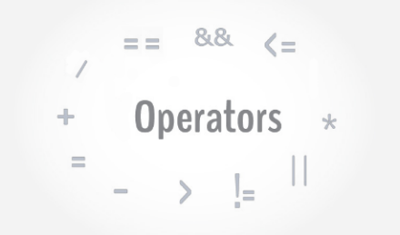{width="5.208333333333333in" height="1.7395833333333333in"} -->

<h4>Saudi Arabic keyboard layout (see more [Arabic keyboards](https://en.wikipedia.org/wiki/Arabic_alphabet#Keyboards)):</h4>
<!--~~~~~~~~~~~~~~~~~~~~~~~~~~~~~~~~~~~~~~~~~~~~~~~~~~~~~~~~~~~~~~~~~~~~~~~~~~~~~~~~~~~~~~~~~~~~-->
<!--~~~~~~~~~~~~~~~~~~~~~~~~ 203.  (10) ~~~~~~~~~~~~~~~~~~~~~~~~~~~~-->
<p align="center" width="100%">

<!-- 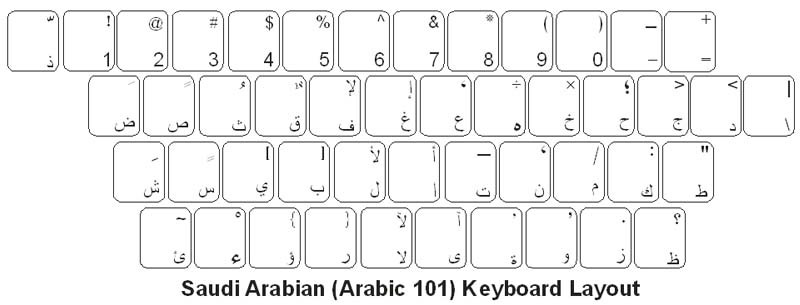{width="6.5in" height="2.478125546806649in"} -->

<h4>[Bangla National (Jatiyo) keyboard](https://en.wikipedia.org/wiki/Bengali_input_methods#Bangla_Jatiyo):</h4>
<!--~~~~~~~~~~~~~~~~~~~~~~~~~~~~~~~~~~~~~~~~~~~~~~~~~~~~~~~~~~~~~~~~~~~~~~~~~~~~~~~~~~~~~~~~~~~~-->
<!--~~~~~~~~~~~~~~~~~~~~~~~~ 204.  (10) ~~~~~~~~~~~~~~~~~~~~~~~~~~~~-->
<p align="center" width="100%">

<!-- 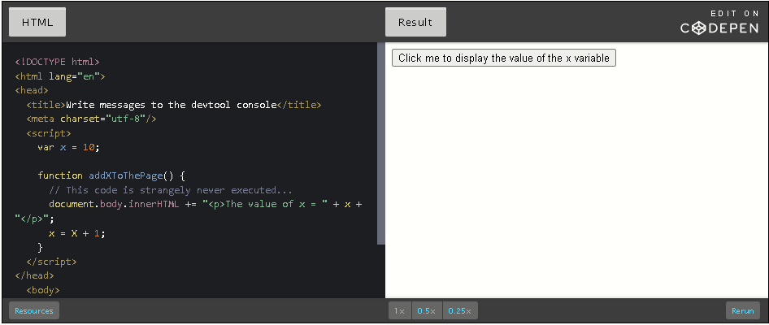{width="6.5in" height="2.4452384076990374in"} -->

<!--~~~~~~~~~~~~~~~~~~~~~~~~~~~~~~~~~~~~~~~~~~~~~~~~~~~~~~~~~~~~~~~~~~~~~~~~~~~~~~~~~~~~~~~~~~~~-->
<h3 id="ch2-4-7">2.4.7 Key and code properties</h3>
<!--~~~~~~~~~~~~~~~~~~~~~~~~~~~~~~~~~~~~~~~~~~~~~~~~~~~~~~~~~~~~~~~~~~~~~~~~~~~~~~~~~~~~~~~~~~~~-->

key and code are new recommended properties you can use with modern
browsers.

You may have noticed that in some examples from the previous course page
about key events, we used event.key in order to display the character
that has been typed. The key property has been introduced with a new W3C
API called UI Events (or DOM level 3 events), that has been discussed
since 2000.  All major browsers have implemented this very
practical key property. It comes with another property named code, which
is what keyCode should have been. The value of the code property
corresponds to a code that is more readable than the value of the
old keyCode property.

-   **key: **when the pressed key is a printable character, you get the
    character in string form. When the pressed key is not a printable
    character (for example: Backspace, Control, but also Enter or Tab
    which actually are printable characters), you get a multi-character
    descriptive string, like &apos;Backspace&apos;, &apos;Control&apos;, &apos;Enter&apos;,
    &apos;Tab&apos;.

-   **code**: Gives you the physical key that was pressed, in string
    form. This means it's totally independent of the keyboard layout
    that is being used. So let's say the user presses the Q key on a
    QWERTY keyboard. **Then event.code gives you &apos;KeyQ&apos;
    while event.key gives you &apos;q&apos;.
    
    But when an AZERTY keyboard user presses the A key, he also gets
    &apos;KeyQ&apos; as event.code, yet event.key contains &apos;a&apos;. This happens
    because the A key on a AZERTY keyboard is at the same location as
    the Q key on a QWERTY keyboard.
    
    **As for numbers, the top digit bar yields values like &apos;Digit1&apos;,
    while the numeric pad yields values like &apos;Numpad1&apos;.

### List of codes, the reference keyboard

There's no existing keyboard with all the possible keys. That's why the
W3C published [a specification just for
this](https://www.w3.org/TR/uievents-code/). You can read about
the [existing mechanical
layouts](https://www.w3.org/TR/uievents-code/#keyboard-layout) around
the world, as well as their [reference
keyboard](https://www.w3.org/TR/uievents-code/#code-value-tables). For
instance here is their reference keyboard for the alphanumerical part:

<!--~~~~~~~~~~~~~~~~~~~~~~~~~~~~~~~~~~~~~~~~~~~~~~~~~~~~~~~~~~~~~~~~~~~~~~~~~~~~~~~~~~~~~~~~~~~~-->
<!--~~~~~~~~~~~~~~~~~~~~~~~~ 205.  (10) ~~~~~~~~~~~~~~~~~~~~~~~~~~~~-->
<p align="center" width="100%">

<!-- {width="6.5in" height="2.2425in"} -->

Also, please read through [the examples given in the
specification](https://w3c.github.io/uievents/#code-examples). They show
very clearly what happens when the user presses various types of keys,
both for code and key.

### Example that displays the key and code values with your current keyboard
<!--~~~~~~~~~~~~~~~~~~~~~~~~~~~~~~~~~~~~~~~~~~~~~~~~~~~~~~~~~~~~~~~~~~~~~~~~~~~~~~~~~~~~~~~~~~~~-->
<!--~~~~~~~~~~~~~~~~~~~~~~~~ 206.  (10) ~~~~~~~~~~~~~~~~~~~~~~~~~~~~-->
<p align="center" width="100%">

<!-- 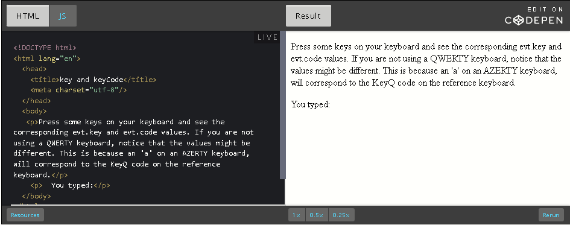{width="6.5in" height="2.5652777777777778in"} -->

<h5>HTML:</h5>

```
<!DOCTYPE html>
<html lang=&quot;en&quot;>
<head>
<title>key and keyCode</title>
<meta charset=&quot;utf-8&quot;/>
</head>
<body>
<p>Press some keys on your keyboard and see the corresponding evt.key
  and evt.code values. If you are not using a QWERTY keyboard, notice that
  the values might be different. This is because an 'a' on an AZERTY
  keyboard, will correspond to the KeyQ code on the reference
  keyboard.</p>
<p> You typed:</p>
</body>
</html>
```

<h5>JS:</h5>

```
window.onkeydown = function(evt) {
document.body.innerHTML += &quot;key = &quot; + evt.key + &quot;<br>&quot;;
document.body.innerHTML += &quot;code = &quot; + evt.code + &quot;<br><br>&quot;;
}
```

I encourage you to take a look and get at least an overview of this
specification.

Please note that the W3C has also published a sibling specification
describing the values for the key property.

### Current browser support

-   [CanIUse table for key](https://caniuse.com/#feat=keyboardevent-key)

-   [CanIUse table
    F-for code](https://caniuse.com/#feat=keyboardevent-code)

<!--~~~~~~~~~~~~~~~~~~~~~~~~~~~~~~~~~~~~~~~~~~~~~~~~~~~~~~~~~~~~~~~~~~~~~~~~~~~~~~~~~~~~~~~~~~~~-->
<h3 id="ch2-4-8">2.4.8 Mouse events</h3>
<!--~~~~~~~~~~~~~~~~~~~~~~~~~~~~~~~~~~~~~~~~~~~~~~~~~~~~~~~~~~~~~~~~~~~~~~~~~~~~~~~~~~~~~~~~~~~~-->

<b><i>Important note*: Remember that many people do not use the mouse and
rely on the keyboard to interact with the Web. This requires keyboard
access to all functionality, including form controls, input, and other
user interface components (**[*learn
more*](https://www.w3.org/WAI/intro/people-use-web/principles#operable)**).**

Detecting mouse events in a canvas is quite straightforward: you add an
event listener to the canvas, and the browser invokes that listener when
the event occurs.

The example below is about listening to mouseup and mousedown events
(when a user presses or releases any mouse button):

```
canvas.addEventListener('mousedown', function (evt) {
   // do something with the mousedown event
});
canvas.addEventListener('mouseup', function (evt) {
   // do something with the mouseup event
});
```

The event received by the listener function will be used for getting the
button number or the coordinates of the mouse cursor. Before looking at
different examples, let&apos;s look at the different event types we can
listen to.

#### Mouse events

<h4>Event types related to mouse</h4>
<!--~~~~~~~~~~~~~~~~~~~~~~~~~~~~~~~~~~~~~~~~~~~~~~~~~~~~~~~~~~~~~~~~~~~~~~~~~~~~~~~~~~~~~~~~~~~~-->
<!--~~~~~~~~~~~~~~~~~~~~~~~~ 207.  (10) ~~~~~~~~~~~~~~~~~~~~~~~~~~~~-->
<p align="center" width="100%">

<!-- 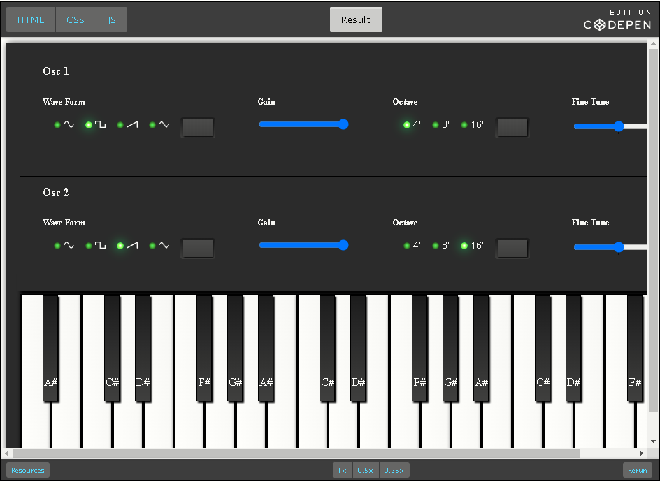{width="6.5in" height="3.6798611111111112in"} -->

<h4>MouseEvent properties</h4>
<!--~~~~~~~~~~~~~~~~~~~~~~~~~~~~~~~~~~~~~~~~~~~~~~~~~~~~~~~~~~~~~~~~~~~~~~~~~~~~~~~~~~~~~~~~~~~~-->
<!--~~~~~~~~~~~~~~~~~~~~~~~~ 208.  (10) ~~~~~~~~~~~~~~~~~~~~~~~~~~~~-->
<p align="center" width="100%">

<!-- {width="6.5in" height="4.127083333333333in"} -->

<h4>Examples</h4>

<h4>Example #1: detect a click on an element</h4>
<!--~~~~~~~~~~~~~~~~~~~~~~~~~~~~~~~~~~~~~~~~~~~~~~~~~~~~~~~~~~~~~~~~~~~~~~~~~~~~~~~~~~~~~~~~~~~~-->
<!--~~~~~~~~~~~~~~~~~~~~~~~~ 209.  (10) ~~~~~~~~~~~~~~~~~~~~~~~~~~~~-->
<p align="center" width="100%">

<!-- {width="6.5in" height="2.0631944444444446in"} -->

<h5>HTML:</h5>

```
<!DOCTYPE html>
<html lang=&quot;en&quot;>
<head>
<meta charset=&quot;utf-8&quot;>
<meta name=&quot;viewport&quot; content=&quot;width=device-width&quot;>
<title>detect mouse clicks on elements</title>
</head>
<body>
<button id=&quot;button1&quot;
  onclick=&quot;processClick(event)&quot;>Button1</button>
<div id=&quot;myDiv&quot; onclick=&quot;processClick(event)&quot;>Click also on this
  div!</div>
<div id=&quot;clicks&quot;></div>
</body>
</html>
```

<h5>CSS:</h5>

```
#myDiv {
color:red;
background-color: pink;
width:100px;
height:100px;
text-align:center;
margin:20px;
}
```

<h5>JS:</h5>

```
window.onclick = processClick;
function processClick(evt) {
var clicks = document.querySelector('#clicks');
var target = evt.target.id;
if(target === &quot;&quot;) {
clicks.innerHTML += &quot;You clicked on the window, not on a particular
  element!<br>&quot;;
} else {
clicks.innerHTML += &quot;Element clicked id: &quot; + target + &quot;<br>&quot;;
}
evt.stopPropagation(); // try commenting it and click on the button or
div
}
```

<h4>Example #2: see the differences between clientX/clientY and pageX/pageY</h4>

The source code is not meant to be understood. It uses the jQuery lib.
Please move the mouse pointer, and look at the different properties.
Then scroll the page (the table at the top will not move), and look at
the properties again; notice how pageX/pageY change, since they are
relative to the top of the page, even if they are not visible. Click on
the codePen label on top right and run this example! It does not work
when embedded in this page!
<!--~~~~~~~~~~~~~~~~~~~~~~~~~~~~~~~~~~~~~~~~~~~~~~~~~~~~~~~~~~~~~~~~~~~~~~~~~~~~~~~~~~~~~~~~~~~~-->
<!--~~~~~~~~~~~~~~~~~~~~~~~~ 210.  (10) ~~~~~~~~~~~~~~~~~~~~~~~~~~~~-->
<p align="center" width="100%">

<!-- {width="6.5in" height="2.0701388888888888in"} -->

<h5>HTML:</h5>

```
<!DOCTYPE html>
<html lang=&quot;en&quot;>
<head>
<script
  src=&quot;https://ajax.googleapis.com/ajax/libs/jquery/1/jquery.min.js&quot;></script>
<meta charset=utf-8 />
<title>client - page - screen</title>
</head>
<body>
<table>
<tr>
<td>Mouse position inside:</td>
<td>X &nbsp;&nbsp;&nbsp; Y</td>
</tr>
<tr>
<td>- client:</td>
<td id=&quot;client&quot;></td>
<td>Client Viewport</td>
</tr>
<tr>
<td>- page:</td>
<td id=&quot;page&quot;></td>
<td>Document Page (scroll down to see the difference)</td>
</tr>
<tr>
<td>(scrollTop:</td>
<td id=&quot;scrollTop&quot;></td>
<td>Scroll top [pageY-clientY] )</td>
</tr>
<tr>
<td>- screen:</td>
<td id=&quot;screen&quot;></td>
<td>Screen</td>
</tr>
</table>
</body>
</html>
```

<h5>CSS:</h5>

```
body{
height:4000px;
font-family:Arial,&quot;Helvetica Neue&quot;,Helvetica,sans-serif;
}
table{
position:fixed;
width:100%;
padding:10px 20px;
background:#eee;
border-spacing:5px 0;
}
table td{
vertical-align:bottom;
border:1px dashed #ddd;
padding:3px 10px;
}
table tr:first-child{
background:#ddd;
}
```

<h5>JS:</h5>

```
var m = ['client','page','screen']; // mods
&dollar;(document).mousemove(function(e){
for(var i=0; i<3; i++){
&dollar;('#'+m[i]).text((e[m[i]+'X'])+' '+ (e[m[i]+'Y']));
}
&dollar;('#scrollTop').text(
&dollar;('html, body').scrollTop()
);
});
```

<h4>Example #3: detect a mousemove event and get the mouse position relative to the page</h4>
<!--~~~~~~~~~~~~~~~~~~~~~~~~~~~~~~~~~~~~~~~~~~~~~~~~~~~~~~~~~~~~~~~~~~~~~~~~~~~~~~~~~~~~~~~~~~~~-->
<!--~~~~~~~~~~~~~~~~~~~~~~~~ 211.  (10) ~~~~~~~~~~~~~~~~~~~~~~~~~~~~-->
<p align="center" width="100%">

<!-- 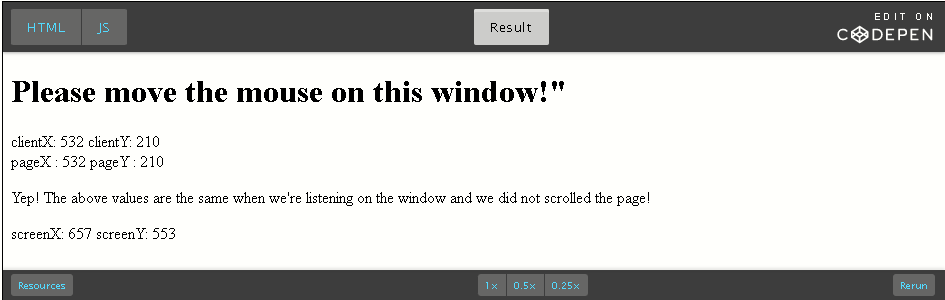{width="6.5in" height="2.0631944444444446in"} -->

<h5>HTML:</h5>

```
<!DOCTYPE html>
<html lang=&quot;en&quot;>
<head>
<meta charset=&quot;utf-8&quot;>
<meta name=&quot;viewport&quot; content=&quot;width=device-width&quot;>
<title>mousemove events relative to page</title>
</head>
<body>
<h1>Please move the mouse on this window!&quot;</h1>
<div id=&quot;mousePositions&quot;></div>
<p>Yep! The above values are the same when we're listening on the
  window and we did not scrolled the page!</p>
<div id=&quot;mouseScreenPositions&quot;></div>
</body>
</html>
```

<h5>JS:</h5>

```
window.onmousemove = processMouseMouve;
function processMouseMouve(evt) {
var mousePositions = document.querySelector('#mousePositions');
mousePositions.innerHTML = &quot;clientX: &quot; + evt.clientX +
&quot; clientY: &quot; + evt.clientY + &quot;<br>&quot; +
&quot; pageX : &quot; + evt.pageX +
&quot; pageY : &quot; + evt.pageY +
&quot;<br>&quot;;
var mouseScreenPositions =
  document.querySelector('#mouseScreenPositions');
mouseScreenPositions.innerHTML = &quot;screenX: &quot; + evt.screenX +
&quot; screenY: &quot; + evt.screenY +
&quot;<br>&quot;;
}
```

<h4>Example #4: detect a mousemove and get the mouse position relative to the element that fired the event</h4>

Here is a first version that does not work well due to a naive use of
clientX/PageX and clientY/pageY mouse event properties:

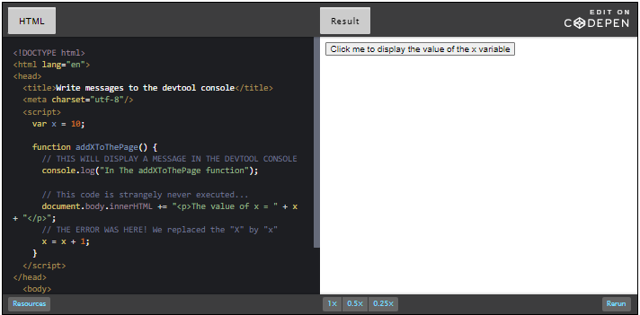{width="6.5in"
height="2.0722222222222224in"}

<h5>HTML:</h5>

```
<!DOCTYPE html>
<html lang=&quot;en&quot;>
<head>
<meta charset=&quot;utf-8&quot;>
<meta name=&quot;viewport&quot; content=&quot;width=device-width&quot;>
<title>mousemove events relative to page</title>
</head>
<body>
<h1>Please move the mouse on the grey canvas below!</h1>
<p>The mouse position is not correct (try to move the cursor at the
  top left corner of the cavas: it should be 0,0 but it isn't. And if you
  scroll the page it's worse). clientX and clientY cannot be used &quot;as
  is&quot;.</p>
<canvas id=&quot;myCanvas&quot; width=300 height=50></canvas>
<div id=&quot;mousePositions&quot;></div>
<div id=&quot;mouseScreenPositions&quot;></div>
</body>
</html>
```

<h5>CSS:</h5>

```
canvas {
border:4px solid;
margin-left:20px;
background-color:lightGrey;
}
body {
height:2000px;
}
```

<h5>JS:</h5>

```
window.onload = init;
function init() {
// page has been loaded
canvas = document.querySelector('#myCanvas');
canvas.addEventListener('mousemove', processMouseMouve)
}
function processMouseMouve(evt) {
var mousePositions = document.querySelector('#mousePositions');
mousePositions.innerHTML = &quot;mouse pos X: &quot; + evt.clientX +
&quot; mouse pos Y: &quot; + evt.clientY +
&quot;<br>&quot;
}
```

Here is another version that uses clientX/clientY and
the e.target.getBoundingClientRect() method that returns the bounding
rectangle that contains the element that fired the event. The return
value has top, left, width, and height properties that describe this
rectangle. We can use the top and left properties along
with evt.clientX and evt.clientY to fix the mouse position and to get a
real position relative to the top left corner of the canvas:

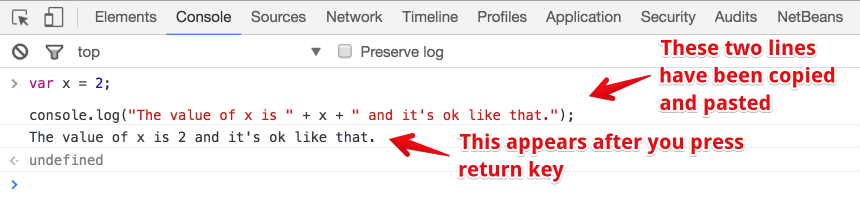{width="6.5in"
height="2.9541666666666666in"}

<h5>HTML:</h5>

```
<!DOCTYPE html>
<html lang=&quot;en&quot;>
<head>
<meta charset=&quot;utf-8&quot;>
<meta name=&quot;viewport&quot; content=&quot;width=device-width&quot;>
<title>mousemove events relative to page</title>
</head>
<body>
<h1>Please move the mouse on the grey canvas below!</h1>
<p>You'll see that there is a no more a problem: (0, 0) is now at the
  top left corner of the canvas, even if we scroll the page!</p>
<canvas id=&quot;myCanvas&quot; width=300 height=50></canvas>
<div id=&quot;mousePositions&quot;></div>
<div id=&quot;mouseScreenPositions&quot;></div>
</body>
</html>
```

<h5>CSS:</h5>

```
canvas {
border:4px solid;
margin-left:20px;
background-color:lightGrey;
}
body {
height:2000px;
}
```

<h5>JS:</h5>

```
function init() {
// page has been loaded
canvas = document.querySelector('#myCanvas');
canvas.addEventListener('mousemove', processMouseMouve)
}
function processMouseMouve(evt) {
var mousePositions = document.querySelector('#mousePositions');
var rect = evt.target.getBoundingClientRect()
var mouseX = evt.clientX - rect.left;
var mouseY = evt.clientY - rect.top;
mousePositions.innerHTML = &quot;mouse pos X: &quot; + mouseX +
&quot; mouse pos Y: &quot; + mouseY +
&quot;<br>&quot;
}
```

<h5>JavaScript source code extract:</h5>

```
function processMouseMouve(evt) {
    var mousePositions = document.querySelector('#mousePositions');
    // adjust mouse position relative to the canvas
**    var rect = evt.target.getBoundingClientRect()**
**    var mouseX = evt.clientX - rect.left;**
**    var mouseY = evt.clientY - rect.top;**
    mousePositions.innerHTML = &quot;mouse pos X: &quot; + mouseX +
                               &quot; mouse pos Y: &quot; + mouseY +
                               &quot;<br>&quot;
}
```

<h4>Example #5: combine mouseup, mousedown, mousemove to implement a click and drag behavior</h4>

{width="6.5in"
height="2.3618055555555557in"}

<h5>HTML:</h5>

```
<!DOCTYPE html>
<html lang=&quot;en&quot;>
<head>
<meta charset=&quot;utf-8&quot;>
<meta name=&quot;viewport&quot; content=&quot;width=device-width&quot;>
<title>mousemove events relative to page</title>
</head>
<body>
<h1>Please click and drag the div below.</h1>
<div id=&quot;dragMe&quot; class='draggable'>Drag me!</div>
</body>
</html>
```

<h5>CSS:</h5>

```
body {
padding:10px
}
.draggable {
width:100px;
height:100px;
background-color:#666;
color:white;
padding:10px 12px;
cursor:move;
position:absolute; /&ast; important (all position that's not 'static') &ast;/
}
```

<h5>JS:</h5>

```
window.onmousemove = moveElem;
window.onmouseup = stopMovingElem;
window.onload = init;
var selected = null; // element to be moved
var oldMouseX, oldMouseY; // Stores x & y coordinates of the mouse pointer
var elemX, elemY;
function init() {
document.querySelector('.draggable').onmousedown = function (evt) {
dragInit(evt);
};
}
// Will be called when user starts dragging an element
function dragInit(evt) {
// Store the elem
selected = evt.target;
elemX = selected.offsetLeft;
elemY = selected.offsetTop;
oldMouseX = evt.clientX;
oldMouseY = evt.clientY;
}
// Will be called when user dragging an element
function moveElem(e) {
// new mouse ps
var newMouseX = e.clientX;
var newMouseY = e.clientY;
if(oldMouseX !== undefined) {
// how many pixels did we move the mouse?
var dx = newMouseX - oldMouseX;
var dy = newMouseY - oldMouseY;
}
if (selected !== null) {
// move the selected element dx, dy pixels hozontally/vertically
changePosOfSelectedElement(dx, dy);
}
// update the old position of the mouse
oldMouseX = newMouseX;
oldMouseY = newMouseY;
}
function changePosOfSelectedElement(dx, dy) {
// update the old position of the selected element
elemX += dx;
elemY += dy;
// change the pos on screen of the element
// by modifying its CSS left/top properties
selected.style.left = elemX + 'px';
selected.style.top = elemY + 'px';
}
// Destroy the object when we are done
function stopMovingElem() {
selected = null;
}
```

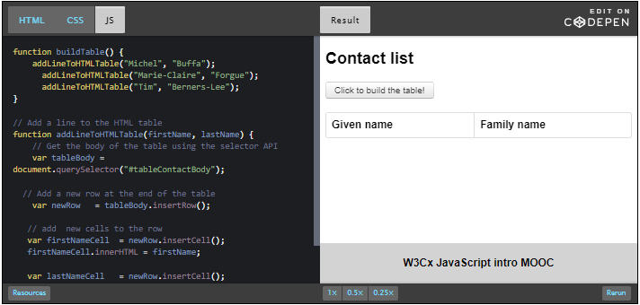{width="6.5in"
height="2.7958333333333334in"}

<h5>HTML:</h5>

```
<!DOCTYPE html>
<html lang=&quot;en&quot;>
<head>
<meta charset=&quot;utf-8&quot;>
<title>Example of right click context menu in pure JS</title>
</head>
<body>
<div>
<nav id=&quot;context-menu&quot; class=&quot;context-menu&quot;>
<ul class=&quot;context-menu&lowbar;&lowbar;items&quot;>
<li class=&quot;context-menu&lowbar;&lowbar;item&quot; id=&quot;context-menu-learn&quot;
  onclick=&quot;menuItem1();&quot;>
Learn
</li>
<li class=&quot;context-menu&lowbar;&lowbar;item&quot; onclick=&quot;menuItem2();&quot;>
Clear
</li>
<li class=&quot;context-menu&lowbar;&lowbar;item&quot; onclick=&quot;toggleMenuOff();&quot;>
Close
</li>
</ul>
</nav>
</div>
<p>Try to right click on this div:</p>
<div id=&quot;div1&quot; class=&quot;div&quot;>A Div with a context menu</div>
<p> This one does not have a context menu attached, try also a right click: </p>
<div id=&quot;div2&quot; class=&quot;div&quot;>Another Div without a context menu</div>
</body>
</html>
```

<h5>CSS:</h5>

```
/&ast; CONTEXT MENU &ast;/
/&ast; context menu &ast;/
.context-menu {
display: none;
position: absolute;
z-index: 10;
padding: 12px 0;
width: 240px;
background-color: #fff;
border: solid 1px #dfdfdf;
box-shadow: 1px 1px 2px #cfcfcf;
}
.context-menu&#45;-active {
display: block;
}
.context-menu&lowbar;&lowbar;items {
list-style: none;
margin: 0;
padding: 0;
}
.context-menu&lowbar;&lowbar;item {
display: block;
margin-bottom: 4px;
padding: 4px 12px;
color: #0066aa;
text-decoration: none;
}
.context-menu&lowbar;&lowbar;item:last-child {
margin-bottom: 0;
}
.context-menu&lowbar;&lowbar;item:hover {
color: #fff;
background-color: #0066aa;
}
#div1 {
background-color:red;
height:100px;
}
#div2 {
background-color:green;
height:100px;
}
```

<h5>JS:</h5>

```
window.onload = init;
var menu, menuIsVisible;
function init() {
menu = document.querySelector(&quot;#context-menu&quot;);
menuIsVisible = false;
/&ast; to attach a context menu to all divs, you can do this:
var divs = document.querySelectorAll(&quot;.div&quot;);
divs.forEach(function(d) {
> addContextMenu(d);
});
&ast;/
// attache the context menu to the first div
var div1 = document.querySelector(&quot;#div1&quot;);
addContextMenu(div1);
// Clicking anywhere on the window toggle the menu off
window.addEventListener('click', toggleMenuOff);
}
function addContextMenu(elem) {
elem.addEventListener(&quot;contextmenu&quot;, function(e) {
> //console.log(&quot;contextmenu activated&quot;);
>
> e.preventDefault(); // avoids default right click menu
>
> toggleMenuOn();
>
> positionMenu(e);
});
}
function toggleMenuOn() {
if(!menuIsVisible) {
menuIsVisible = true;
> menu.classList.add(&quot;context-menu&#45;-active&quot;); // see further in the
> DOM section of the course
}
}
function toggleMenuOff() {
if(menuIsVisible) {
menuIsVisible = false;
> menu.classList.remove(&quot;context-menu&#45;-active&quot;);
}
}
function positionMenu(e) {
// Mouse position is relative to the element clicked
// We make the coords absolute in the page
var clickCoordsX = e.pageX;
var clickCoordsY = e.pageY;
var menuWidth = menu.offsetWidth + 1;
var menuHeight = menu.innerHeight + 1;
var elementWidth = e.target.offsetWidth;
var elementHeight = e.target.offsetHeight;
if ((elementWidth - clickCoordsX) < menuWidth) {
menu.style.left = elementWidth - menuWidth + &quot;px&quot;;
} else {
menu.style.left = clickCoordsX + &quot;px&quot;;
}
if ((elementHeight - clickCoordsY) < menuHeight) {
menu.style.top = elementHeight - menuHeight + &quot;px&quot;;
} else {
menu.style.top = clickCoordsY + &quot;px&quot;;
}
}
// Actions called when a menu item is choosen
function menuItem1() {
console.log('learn');
toggleMenuOff();
}
function menuItem2() {
console.log('clear');
toggleMenuOff();
}
```

<!--~~~~~~~~~~~~~~~~~~~~~~~~~~~~~~~~~~~~~~~~~~~~~~~~~~~~~~~~~~~~~~~~~~~~~~~~~~~~~~~~~~~~~~~~~~~~-->
<h3 id="ch2-4-9">2.4.9 Form and input field events</h3>
<!--~~~~~~~~~~~~~~~~~~~~~~~~~~~~~~~~~~~~~~~~~~~~~~~~~~~~~~~~~~~~~~~~~~~~~~~~~~~~~~~~~~~~~~~~~~~~-->

#### Events related to forms

{width="6.5in"
height="2.6506944444444445in"}

#### FormEvent properties

There are no particular properties that need to be mentioned here.
Usually, on a form event listener, we check the content of the different
input fields, using their value property. See examples in the part of
the course that deals with form events.

<h4>Example #1: validating on the fly as the user types in a text input field</h4>

First variant: using the &apos;input&apos; event:

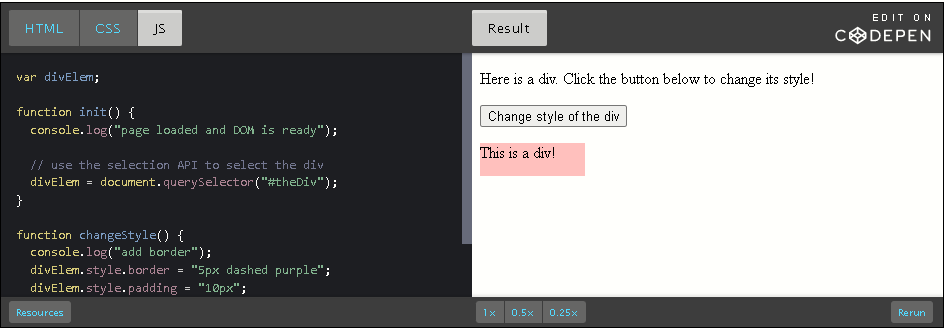{width="6.5in"
height="2.4854166666666666in"}

<h5>HTML:</h5>

```
<!DOCTYPE html>
<html lang=&quot;en&quot;>
<head>
<meta charset=&quot;utf-8&quot;>
<meta name=&quot;viewport&quot; content=&quot;width=device-width&quot;>
<title>Simple input field validation</title>
</head>
<body>
<h1>Simple input field validation using the 'input' event</h1>
<p>Just type a name in the input field and see what happens!</p>
<label>
<span>Name (required):</span>
<input type=&quot;text&quot;
name=&quot;nom&quot;
maxlength=&quot;32&quot;
required
oninput = &quot;validateName(this)&quot;>
</label>
<p>
<span id=&quot;nameTyped&quot;></span>
</p>
</body>
</html>
```

<h5>JS:</h5>

```
function validateName(field) {
// this is the input field text content
var name = field.value;
// get the output div
var output = document.querySelector('#nameTyped');
// display the value typed in the div
output.innerHTML = &quot;Valid name: &quot; + name;
// You can do validation here, set the input field to
// invalid is the name contains forbidden characters
// or is too short
// for example, let's forbid names with length < 5 chars
if(name.length < 5) {
output.innerHTML = &quot;This name is too short (at least 5 chars)&quot;;
}
}
```

<h4>Second variant: using the &apos;keyup&apos; event:</h4>

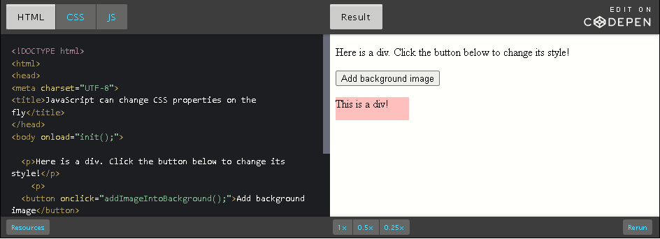{width="6.5in"
height="2.4784722222222224in"}

<h5>HTML:</h5>

```
<!DOCTYPE html>
<html lang=&quot;en&quot;>
<head>
<meta charset=&quot;utf-8&quot;>
<meta name=&quot;viewport&quot; content=&quot;width=device-width&quot;>
<title>Simple input field validation using keyup events</title>
</head>
<body>
<h1>Simple input field validation using the 'input' event</h1>
<p>Just type a name in the input field and see what happens! <span
  style=&quot;color:red&quot;> TRY TO TYPE A &quot;!&quot; too</span></p>
<label>
<span>Name (required):</span>
<input type=&quot;text&quot;
name=&quot;nom&quot;
maxlength=&quot;32&quot;
required
onkeyup = &quot;validateName(event)&quot;>
</label>
<p>
<span id=&quot;keyTyped&quot;></span>
</p>
</body>
</html>
```

<h5>JS:</h5>

```
function validateName(evt) {
// this is the input field text content
var key = evt.key;
// get the output div
var output = document.querySelector('#keyTyped');
// display the value typed in the div
output.innerHTML = &quot;Valid key: &quot; + key;
// You can do validation here, set the input field to
// invalid is the name contains forbidden characters
// or is too short
// for example, let's forbid names with length < 5 chars
if(key === &quot;!&quot;) {
output.innerHTML = &quot;This key is forbidden!&quot;;
// remove the forbidden char
// current typed value
var name = evt.target.value;
// we use the substring JavaScript function
// to remove the last character
// first parameter = start index
// second = last index
evt.target.value = name.substring(0, name.length-1);
}
}
```

Note that HTML5 forms and the multiple facets of form and input field
validation are covered in depth in the W3C [HTML5 Coding Essentials and
Best Practices](https://www.edx.org/course/html5-coding-essentials-and-best-practices) course,
which dedicates a whole week to this topic.

<h4>Example #2: do something while a slider is being moved</h4>

{width="6.5in"
height="2.451388888888889in"}

<h5>HTML:</h5>

```
<!DOCTYPE html>
<html lang=&quot;en&quot;>
<head>
<meta charset=&quot;utf-8&quot;>
<meta name=&quot;viewport&quot; content=&quot;width=device-width&quot;>
<title>JavaScript slider use</title>
</head>
<body>
<h1>Simple <code><input type=range></code> field validation
  using the 'input' event</h1>
<p>Just move the slider</p>
<label>
1 <input type=&quot;range&quot;
min=1
max=12
step=0.1
oninput = &quot;doSomething(event)&quot;> 12
</label>
<p>
<span id=&quot;sliderValue&quot;></span>
</p>
</body>
</html>
```

<h5>JS:</h5>

```
function doSomething(evt) {
// this is the slider value
var val = evt.target.value;
// get the output div
var output = document.querySelector('#sliderValue');
// display the value typed in the div
output.innerHTML = &quot;Value selected: &quot; + val;
```

<h4>Example #3: detect value changes in a number input field</h4>


}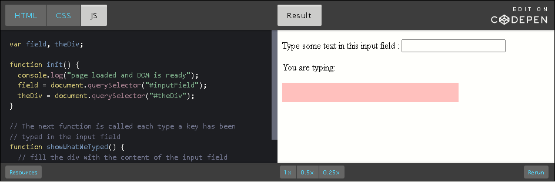{width="6.5in"
height="2.4923611111111112in"}

<h5>HTML:</h5>

```
<!DOCTYPE html>
<html lang=&quot;en&quot;>
<head>
<meta charset=&quot;utf-8&quot;>
<meta name=&quot;viewport&quot; content=&quot;width=device-width&quot;>
<title>JavaScript number input use</title>
</head>
<body>
<h1>Simple <code><input type=number></code> field validation
using the &apos;input&apos; event</h1>
<p>type a number or use the small vertical arrows</p>
<label>
```

<h5>Type a number:</h5>

```
<input type=&quot;number&quot;
min=1
max=12
step=0.1
oninput = &quot;doSomething(event)&quot;>
</label>
<p>
<span id=&quot;numberValue&quot;></span>
</p>
</body>
</html>
```

<h5>JS:</h5>

```
function doSomething(evt) {
// this is the slider value
var val = evt.target.value;
// get the output div
var output = document.querySelector(&apos;#numberValue&apos;);
// display the value typed in the div
output.innerHTML = &quot;Value selected: &quot; + val;
}
```

<h4>Example #4: choose a color and do something</h4>

{width="6.5in"
height="2.0520833333333335in"}

<h5>HTML:</h5>

```
<!DOCTYPE html>
<html lang=&quot;en&quot;>
<head>
<meta charset=&quot;utf-8&quot;>
<meta name=&quot;viewport&quot; content=&quot;width=device-width&quot;>
<title>JavaScript color chooser use</title>
</head>
<body>
<h1>Simple <code><input type=color></code> use</h1>
<p>Pick a color to change the background color of the page</p>
<label>
<input type=&quot;color&quot;
onchange = &quot;changePageBackgroundColor(this.value);&quot;>
<!&#45;- we could have used oninput= in the previous line &#45;->
</label>
<p>
<span id=&quot;choosedColor&quot;></span>
</p>
</body>
</html>
```

<h5>JS:</h5>

```
function changePageBackgroundColor(color) {
document.body.style.backgroundColor = color;
// get the output div
var output = document.querySelector(&apos;#choosedColor&apos;);
// display the value typed in the div
output.innerHTML = &quot;Color selected: &quot; + color;
}
```

<!--~~~~~~~~~~~~~~~~~~~~~~~~~~~~~~~~~~~~~~~~~~~~~~~~~~~~~~~~~~~~~~~~~~~~~~~~~~~~~~~~~~~~~~~~~~~~-->
<h3 id="ch2-4-10">2.4.10 Reference tables</h3>
<!--~~~~~~~~~~~~~~~~~~~~~~~~~~~~~~~~~~~~~~~~~~~~~~~~~~~~~~~~~~~~~~~~~~~~~~~~~~~~~~~~~~~~~~~~~~~~-->

#### Quick summary of event management in JavaScript

<h5>HTML5 events:</h5>

{width="2.8333333333333335in"
height="2.8333333333333335in"}

There is no input or output in JavaScript. We treat **events** caused by
user actions as inputs, and we manipulate the DOM structure as
output. Usually in a JavaScript application, we will get info such as
the key strokes, the mouse button clicks and the mouse position, and we
will refer to these variables when determining what action to perform.

In any case, the events are called DOM events, and we use the DOM APIs
to create **event handlers**.

<h4>How to listen to events {#how-to-listen-to-events .unnumbered}

There are three ways to manage events in the DOM structure. You could
attach an event inline in your HTML code like this:

<h4>**Method #1: declare an event handler in the HTML code**</h4>

<div id=&quot;someDiv&quot; **onclick**=&quot;alert(&apos;clicked!&apos;)&quot;> content of
the div </div>

This method is very easy to use, but it is not the recommended way to
handle events. Indeed, although it currently works,
it is **deprecated** (will probably be abandoned in the future). Mixing
&apos;visual layer&apos; (HTML) and &apos;logic layer&apos; (JavaScript) in one place is
really bad practice and causes a host of problems during development.

<h4>**Method #2: attach an event handler to an HTML element in JavaScript**</h4>

```
1.  document.getElementById(&apos;someDiv&apos;).**onclick **= function() {
2.  alert(&apos;clicked!&apos;);
3.  }
```

This method is fine, but  you will not be able to attach
multiple **listener** functions. If you need to do this, use the version
shown below.

<h4>**Method #3: register a callback to the event listener with the addEventListener method (preferred  method)**</h4>

```
1.  document.getElementById(&apos;someDiv&apos;).**addEventListener**(&apos;click&apos;, function() {
2.  alert(&apos;clicked!&apos;);
3.  }, false);
```

Note that the third parameter describes whether the **callback** has to
be called during the captured phase. This is not important for now, just
set it to false or ignore it (you can even pass only two parameters to
the addEventListener function call and do not set this boolean parameter
at all).

<h4>Details of the DOM event are passed to the event listener function</h4>

When you create an **event listener** and attach it to an element, the
listener will create an **event object** to describe what happened. This
object is provided as a parameter of the **callback function**:

```
1.  element.addEventListener(&apos;click&apos;, function(**event**) {
2.  **// now you can use event object inside the callback**
3.  }, false);
```

Depending on the type of event you are listening to, you will consult
different properties from the event object in order to obtain useful
information such as: &quot;which keys are pressed down?&quot;, &quot;what is the
location of the mouse cursor?&quot;, &quot;which mouse button has been
clicked?&quot;, etc.

In the following lessons, we will remind you how to deal with the
keyboard and the mouse.

### Further reading

In method 1 (above), we mentioned that &quot;mixing &apos;visual layer&apos; (HTML)
and &apos;logic layer&apos; (JavaScript) &hellip; is bad practice&quot;, and this is
similarly reflected in many style features being deprecated in HTML5 and
moved into CSS3. The management philosophy at play here is called &quot;the
separation of concerns&quot; and applies in several ways to software
development - at the code level, through to the management of staff.
It&apos;s not part of the course, but professionals may find the following
references useful:

-   [Separation of concerns - Wikipedia, the free
    encyclopedia](https://en.wikipedia.org/wiki/Separation_of_concerns)

-   [Software Architecture and the Art of Separation of
    Concerns ](https://medium.com/@alliecohen_Tech/software-architecture-and-the-art-of-separation-of-concerns-1bd780cb8f2a)

### Reference tables for events and properties/methods

These tables are provided as a reference. They are a compilation of the
most common event types sorted by domain (key, mouse, forms, etc.). For
each domain you will see the most useful event types and their
properties. In the following course pages, we will show  examples that
use most of the events displayed in these tables.

<h4>Event object</h4>

Most useful common properties:

  type       Returns the name of the event

  target     Returns the element that triggered the event


Most useful common methods:

  preventDefault()    Cancels the event if it is cancelable, meaning that the
                      default action that belongs to the event will not occur

  stopPropagation()   Prevents further propagation of an event during event
                      flow


<h4>Page</h4>

<h4>Events related to the page lifecycle</h4>

There are many other events related to the page life cycle. Below are
the most useful ones for an intro course:

  load     This event occurs when an object has loaded (including all its
           resources: images, etc.) This event is very useful when you want
           to run JS code and be sure that the DOM is ready (in other
           words, be sure that a document.getElementById(&hellip;) or
           document.querySelector(&hellip;) will not raise an error because the
           document has not been loaded and elements you are looking for
           are not ready.

  resize   The event occurs when the document view is resized. Usually we
           get the new size of the window inside the event listener using
           var w = window.innerWidth; and
           var h = window.innerHeight;

  scroll   The event occurs when an element&apos;s scrollbar is being scrolled.
           Usually, in the scroll event listener, we use things such as:
             var max = document.body.scrollHeight - innerHeight;
            var percent = (pageYOffset / max);
           &hellip;to know the percentage of the scroll in the page.

<h4>Page event properties</h4>

There are no particular properties that need to be mentioned here.
Usually, the load event listener corresponds to a JavaScript function
that can be seen as &quot;the main&quot; function of your Web Application. It is
good practice to start everything after the page has been completely
loaded. In the resize listener, you get the new size of the window, or
the new size of some HTML elements in the page (as they might have been
resized too when the window was resized) and then you do something
(redraw a graphic in an HTML canvas that takes into account the new
canvas size, for example).

<h4>Keyboard</h4>

<h4>Event types related to keyboard</h4>

  keydown    The event occurs when the user is pressing a key

  keyup      The event occurs when the user releases a key

  keypress   The event occurs when the user presses a key (up and
             release)

<h4>keyboardEvent properties</h4>

  keyCode    Returns the Unicode character code of the key that triggered
             the onkeypress ,onkeydown or onkeyup event

  shiftKey   Returns whether the &quot;shift&quot; key was pressed when the key
             event was triggered

  ctrlKey    Returns whether the &quot;ctrl&quot; key was pressed when the key
             event was triggered

  altKey     Returns whether the &quot;alt&quot; key was pressed when the key event
             was triggered

<h4>Mouse</h4>

<h4>Event types related to mouse</h4>

  click         The event occurs when the user clicks on an element
                (presses a button and releases it)

  dblclick      The event occurs when the user double-clicks on an element

  mousedown     The event occurs when the user presses a key (up and
                release)

  mouseup       The event occurs when a user releases a mouse button over
                an element

  mousemove     The event occurs when the pointer is moving while it is
                over an element

  mouseenter    The event occurs when the pointer is moved onto an element

  mouseleave    The event occurs when the pointer is moved out of an
                element

  mouseover     The event occurs when the pointer is moved onto an element,
                or onto one of its children

  contextmenu   The event occurs when the user right-clicks on an element
                to open a context menu

<h4>MouseEvent properties</h4>

  button          Returns which mouse button was pressed when the mouse
                  event was triggered

  clientX and     Returns the coordinates of the mouse pointer, relative
  clientY         to the element coordinate system that triggered the
                  event

  pageX and pageY Returns the coordinates of the mouse pointer, relative
                  to the document, when the mouse event was triggered

  screenX and     Returns the coordinates of the mouse pointer, relative
  screenY         to the screen, when an event was triggered

  altKey,         Returns whether the &quot;alt, ctrl and shift&quot; key was
  ctrlKey,        pressed when an event was triggered
  shiftKey        

  detail          Returns a number that indicates how many times the
                  mouse was clicked

<h4>Forms</h4>

<h4>Events related to forms</h4>

  input    The event occurs when an element gets user input (e.g., a key
           is typed on an input field, a slider is moved, etc.)

  change   The event occurs when the content of a form element, the
           selection, or the checked state have changed (for <input>,
           <select>, and <textarea>). A change event listener on a
           slider will generate an event when the drag/move ended, while
           input events will be useful to do something as the slider is
           being moved.

  focus    The event occurs when an element gets focus (e.g., the user
           clicks in an input field)

  blur     The event occurs when an element loses focus (e.g., the user
           clicks on another element)

  select   The event occurs after the user selects some text (for
           <input> and <textarea>)

  submit   The event occurs when a form is submitted

<h4>FormEvent properties</h4>

There are no particular properties that need to be mentioned here.
Usually, on a form event listener, we check the content of the different
input fields, using their value property. See examples in the course, in
the part dealing with form events.

<!--~~~~~~~~~~~~~~~~~~~~~~~~~~~~~~~~~~~~~~~~~~~~~~~~~~~~~~~~~~~~~~~~~~~~~~~~~~~~~~~~~~~~~~~~~~~~-->
<h3 id="ch2-4-11">2.4.11 Discussion and project</h3>
<!--~~~~~~~~~~~~~~~~~~~~~~~~~~~~~~~~~~~~~~~~~~~~~~~~~~~~~~~~~~~~~~~~~~~~~~~~~~~~~~~~~~~~~~~~~~~~-->

Here is the discussion forum for this part of the course. Please either
post your comments/observations/questions or share your creations.

### Suggested topics

-   Did you know the differences between clientX, pageX, etc. when
    dealing with mousemove events? Did you know the method we showed for
    getting the mouse position relative to the elements you&apos;re moving
    the mouse on?

-   Did you know the different keyboard layouts, and
    the code and key event properties?

### Optional project

{width="2.0833333333333335in"
height="1.3854166666666667in"}

-   Try to write a small game that will display a word taken from an
    array, randomly, and you will have to type the letters of this word
    as fast as you can. A bit like the &quot;type of the dead&quot; game (look
    on YouTube). You can imagine the evolution such as choosing the
    level, start with 3 letter words, 4 letter words, etc.
    Choose a topic (medicine, with very difficult words to spell, etc.).
    If you look at the end of the module, you will see how to work with
    graphics and animation, you can also imagine a graphic version of
    this game.

<!--~~~~~~~~~~~~~~~~~~~~~~~~~~~~~~~~~~~~~~~~~~~~~~~~~~~~~~~~~~~~~~~~~~~~~~~~~~~~~~~~~~~~~~~~~~~~-->
<h3 id="ch2-5-1">2.5.1 Introducing the DOM</h3>
<!--~~~~~~~~~~~~~~~~~~~~~~~~~~~~~~~~~~~~~~~~~~~~~~~~~~~~~~~~~~~~~~~~~~~~~~~~~~~~~~~~~~~~~~~~~~~~-->
When a user clicks on a link or enters a URL in the address of your Web
browser, it downloads the page's HTML text and builds up a model of the
document's structure called the DOM (Document Object Model). This model
is used to render the HTML page on the screen.

The DOM is a standard  that describes how a document must be
manipulated. It defines a "language- and platform neutral interface".
So, **every browser offers the same JavaScript DOM API**.

The DOM API is a programming interface the JavaScript programmer can use
to modify the HTML content or the CSS style of HTML elements on the fly.

The DOM API provides the document object as a structured object, a group
of nodes represented as a tree. We saw this in Module 1 when we revised
the basic principles of HTML .

The document object also exposes a large set of methods to access and
manipulate the structured document. Through the DOM, look for nodes
(html elements that compose the page), move nodes, delete nodes, modify
nodes (attributes, content), and also handle their associated events.

In JavaScript, the DOM is accessible through the property document of
the global object window. We rarely manipulate the window object
directly as it is implicit: window.document is the same as document. 

So by using this object, we can access and manipulate our page from
JavaScript as a structured document.

### Reminder from Module 1: HTML and the DOM

&apos;Elements&apos; are the pieces themselves, i.e., a paragraph, a header,
and even the body are elements. Most elements can contain other
elements - for example, the body element would contain header elements,
paragraph elements, in fact pretty much all of the visible elements of
the Document Object Model (developers call it the &quot;DOM&quot;).

Let&apos;s take, for example, a simplified version of the last HTML code we
showed you:

```
<!DOCTYPE html&gt;
<html lang=&quot;en&quot;&gt;
    <head&gt;
        <title&gt;Your first HTML page</title&gt;
        <meta charset=&quot;utf-8&quot;&gt;
    </head&gt;
    <body&gt;
        <h1&gt;My home page</h1&gt;
        <p&gt;Hi! Welcome to my Home Page! My name is Michel Buffa,
I&apos;m a professor at the University of Côte d&apos;Azur, in France,
and I&apos;m also the author
of two other W3CX MOOCS.
        </p&gt;
    </body&gt;
</html&gt;
```

Click the red circle next to HTML to unfold this HTML document structure
(we can also say &quot;see its DOM structure&quot;):

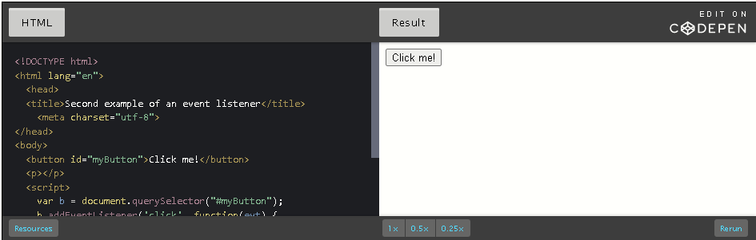{width="5.75in"
height="2.4793799212598424in"}

Consider the figure above.  It contains a single html element.  It turns
out this includes within it the entire content of your html file.  If
you click on the &quot;html&quot; red node, you&apos;ll find that it contains two
components, a head and a body.  Clicking on each of these will reveal
their respective contents.  This structure is what we computer
scientists call a &quot;tree&quot;.  Any given element (except for the outermost
&apos;html&apos; element) is wholly contained inside another element, referred
to as the &quot;parent&quot; element.  Not surprisingly, the elements that a
given element contains are its &quot;child&quot; elements.  And, yes, children
of a common parent are often referred to as &quot;siblings&quot;.

Thus, in the example above, the top element is the html element, which
contains just two elements, the head and body.  The head element
contains a title element and the body contains an h1 element and
a p element.  In a more typical example, the body would contain many
more children, but for our purposes this is enough. p is for
&quot;paragraph&quot; (the text between &lt;p&gt; and &lt;/p&gt; will be separated by
some space before the next element is displayed in the final HTML page
rendering), h1 means &quot;heading level 1&quot;, and will be rendered by
default in bold with a bigger char size than any other text element,
etc.

### There are different types of nodes in the DOM

There are different types of nodes, but don&apos;t worry - the most useful
ones are highlighted in bold.

-   **Element (example: &lt;ul&gt;&lt;/ul&gt;)**

-   **Text (example: &lt;p&gt;the text within the element p is a node of
    type text&lt;/p&gt;)**

-   Document, DocumentFragment, DocumentType (example: &lt;!doctype
    html&gt; for html5), Comment (example: &lt;!&#45;- left column &#45;-&gt;),
    ProcessingInstruction (example: &lt;?php echo &dollar;name ?&gt;)

### Exploring the DOM with the devtool console

You can explore the DOM with the devtool console. This time we used
Firefox for exploring the DOM, as it proposes a good structured view of
the DOM and of its properties/methods:

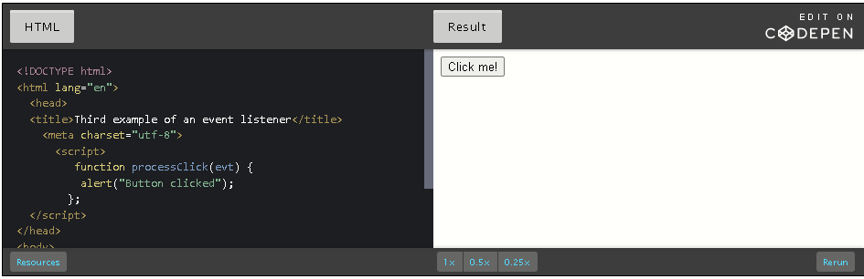{width="6.5in"
height="4.077083333333333in"}

If you scroll down the right panel of the devtool console, as in the
above screenshot, you will be able to look at all the properties, all
the methods, all the event listeners:

{width="5.75in"
height="5.867334864391951in"}

You can also use the &quot;DOM inspector&quot; to locate a particular element
with the mouse: click the target icon and click on  the element on the
page that you want to inspect, this time with Google Chrome, but you
will find this option in all modern browsers&apos; devtool consoles:

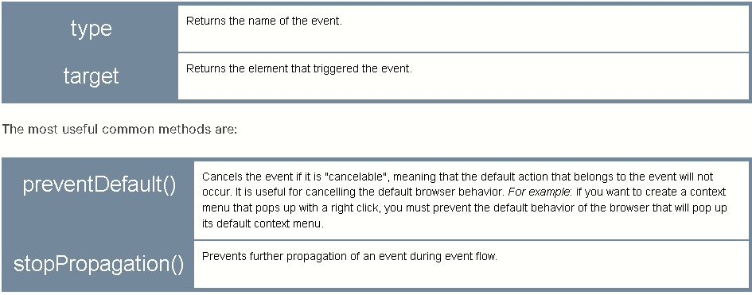{width="6.0in" height="3.775in"}

<!--~~~~~~~~~~~~~~~~~~~~~~~~~~~~~~~~~~~~~~~~~~~~~~~~~~~~~~~~~~~~~~~~~~~~~~~~~~~~~~~~~~~~~~~~~~~~-->
<h3 id="ch2-5-2">2.5.2 A warning about the DOM API</h3>
<!--~~~~~~~~~~~~~~~~~~~~~~~~~~~~~~~~~~~~~~~~~~~~~~~~~~~~~~~~~~~~~~~~~~~~~~~~~~~~~~~~~~~~~~~~~~~~-->
The DOM and the DOM API can be cumbersome and complicated. There are
many methods and properties for manipulating the DOM tree, that are not
&quot;very JavaScript&quot;. There are historical reasons for this: the DOM
wasn't designed exclusively for JavaScript. Rather, it tries to define a
language-neutral interface that can be used in other systems as well ---
not just HTML but also XML, which is a generic data format with an
HTML-like syntax.

HTML5 made some additions that are not in the DOM API but which greatly
help the JavaScript programmer (we&apos;ll see this in a minute with the
&quot;selector API&quot;, for example).

So, we&apos;ve decided to focus on only 20% of the DOM API and on the
selector API (for selecting elements in the DOM). These are the most
useful parts and it will give you enough knowledge to solve nearly every
problem where you need to manipulate the DOM.

{width="3.0in"
height="2.6492804024496936in"}

<!--~~~~~~~~~~~~~~~~~~~~~~~~~~~~~~~~~~~~~~~~~~~~~~~~~~~~~~~~~~~~~~~~~~~~~~~~~~~~~~~~~~~~~~~~~~~~-->
<h3 id="ch2-5-3">2.5.3 Accessing HTML elements</h3>
<!--~~~~~~~~~~~~~~~~~~~~~~~~~~~~~~~~~~~~~~~~~~~~~~~~~~~~~~~~~~~~~~~~~~~~~~~~~~~~~~~~~~~~~~~~~~~~-->
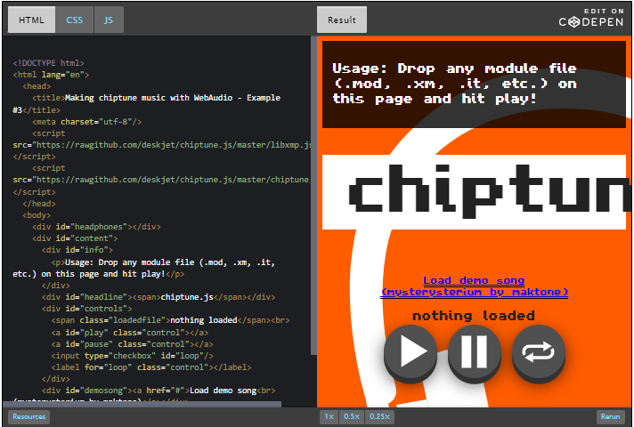{width="5.75in"
height="4.474276027996501in"}

Hi!

This time, let&apos;s look a bit more in depth to the different methods for
selecting

elements in an HTML page, and then do something with these elements.

I prepared here an HTML document that contains two buttons that do
nothing for the moment, and it contains also 4 images. Here are the
images... They&apos;ve got an id: img1, img2, and so on. They&apos;ve got some
URLs and a width. If we look at the JavaScript code I prepared, I added
an init function that is called when the page is loaded. You remember
from a previous video that we can do that using body onload=init. Or we
can use (this is an alternative): window.onload=init.

This is what I did here. When the page is loaded, we are going to first
check that the init function is executed. And it&apos;s executed after the
page is loaded, after the DOM is ready.

Then we will select all images, and set some CSS properties.

I can have a look at the console, and if I just type anything, it
executes again the example, and we see that the console.log in the init
function has been executed.

That means that the load event listener has been defined correctly.

In order to select all the images, and not only one, we can use the
query.SelectorAll method from the document object.

I&apos;m using querySelectorAll and by just typing the name of an element,
it will select all the elements, the html elements, of this type.

Now, in order to iterate on the collection of elements, you can use the
forEach iterator.

This one will be detailed later but let&apos;s see now a very simple use of
it.

It takes a single argument that is a callback.

Here I&apos;m using just a variable that corresponds to the current image.

You can name it as you like. In that case it&apos;s &quot;currentImage&quot;.

If I do currentImage.style.border&hellip; you see that when the page is
executed, it will take each element from the list of images, and add to each image
a border. Let&apos;s make it larger!

You see, we added a border of 10 pixels width.

You can also add a margin. In that case I&apos;ve got the different images
with a margin of 10 pixels at top, left, right and bottom. Let&apos;s try to
add a border only to the first image. When we click on the first button.
If we look at the HTML code, we added an onlick event listener that will
call addBorderToFirstImage, a callback defined in the JavaScript code.
We can check that the listener works by adding a console.log and
clicking on the button. It works!

How to select the first image? We use document.querySelector, and here I
can use the id of the image&hellip; img1, and then use the style property of
the object:

img1.style&hellip;, and you see that if I click on the button, then it adds
a border.

I could have used just &quot;img&quot;, in order to select only the first
element of type &quot;img&quot;.

It&apos;s the same syntax I used for querySelectorAll, except that in that
case it selects just the first one, and you&apos;ve got the same result.

If I want to resize all the images, I can, in that case, use CSS
properties,

or you can use the width attribute of the images. In order to select all
the images, I&apos;m going to use the same technique I used for adding a
border to all the images earlier. I will first select all the images
using querySelectorAll, then I will use the foreach iterator, and use
the width attribute of each individual image, to set this attribute to a
given value&hellip;so&hellip; if I click here&hellip;Oh! The images are only 10
pixels&hellip; then maybe this is too small!

Let&apos;s try 70 pixels&hellip;I click on the button and the images are
resized!

I can click on the first button to add a border. You saw the different
possibilities.

### Accessing HTML elements with the selector API (recommended)

Extract from [HTML5 selectors API -- It's like a Swiss Army Knife for
the
DOM](https://www.webdirections.org/blog/html5-selectors-api-its-like-a-swiss-army-knife-for-the-dom/) :
&quot;**One of the many reasons for the success of JavaScript libraries
like **[*jQuery*](https://jquery.org/)** and **[*Prototype*](http://prototypejs.org/)**,
on top of their easing the pain of cross-browser development was how
they made working with the DOM far less painful than it had previously
been, and indeed how it was with the standard DOM. Being able to use
arbitrary CSS selector notation to get matching elements from a document
made the standard DOM methods seem antiquated, or at the very least, far
too much like hard work.**

**Luckily, the standards and browser developers took notice. The W3C
developed the Selectors API, a way of easily accessing elements in the
DOM using standard CSS selector concepts, and browser developers have
baked these into all modern browsers, way back to IE8.**&quot;

<h4>The querySelector(CSSSelector) and querySelectorAll(CSSSelector) methods</h4>

Ah&hellip; these methods owe a lot to [jQuery](https://jquery.org/)! They
introduce a way to use CSS selectors (including CSS3 selectors) for
requesting the DOM, like jQuery introduced ages ago.

Any CSS  selector can be passed as a parameter for these methods.

-   While **querySelector(selector)** will return the first element in
    the DOM that matches the selector (and you will be able to work with
    it directly),

-   **querySelectorAll(selector) returns a collection of HTML elements
    corresponding to all elements matching the selector**. To process
    the results, it will be necessary to loop over each of the elements
    in the collection.

<h4>Typical use:</h4>

Looking for an element in the whole document (the whole HTML page): call
the querySelector method (or querySelectorAll) on the document object,
that corresponds to the whole DOM tree of your web page:

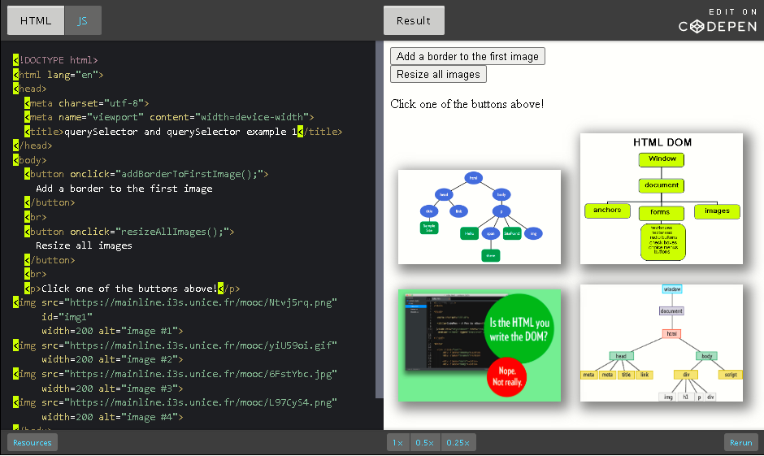{width="5.0in"
height="2.983974190726159in"}

<h5>HTML:</h5>

```
<!DOCTYPE html>
<html lang=&quot;en&quot;>
<head>
<meta charset=&quot;utf-8&quot;>
<meta name=&quot;viewport&quot; content=&quot;width=device-width&quot;>
<title>querySelector and querySelector example 1</title>
</head>
<body>
<button onclick=&quot;addBorderToFirstImage();&quot;>
Add a border to the first image
</button>
<br>
<button onclick=&quot;resizeAllImages();&quot;>
Resize all images
</button>
<br>
<p>Click one of the buttons above!</p>


</body>
</html>
```

<h5>JS:</h5>

```
window.onload = init;
function init() {
// we&apos;re sure that the DOM is ready
// before querying it
// add a shadow to all images
// select all images
var listImages = document.querySelectorAll(&quot;img&quot;);
// change all their width to 100px
listImages.forEach(function(img) {
// img = current image
img.style.boxShadow = &quot;5px 5px 15px 5px grey&quot;;
img.style.margin = &quot;10px&quot;;
});
}
function addBorderToFirstImage() {
// select the first image with id = img1
var img1 = document.querySelector(&apos;#img1&apos;);
// Add a red border, 3px wide
img1.style.border = &apos;3px solid red&apos;;
}
function resizeAllImages() {
// select all images
var listImages = document.querySelectorAll(&quot;img&quot;);
// change all their width to 100px
listImages.forEach(function(img) {
// img = current image
img.width = 100;
});
}
```

**Source code from the above example:**

**HTML part**: we have two buttons that will call a JavaScript function
(**lines 2 and 6**) where we will manipulate the DOM), and we have four
images, the first one with an id equal to &quot;img1&quot; (**lines 11, 14, 16
and 18**). 

```
1.  &hellip;
2.  <button onclick=&quot;addBorderToFirstImage();&quot;>
3.  Add a border to the first image
4.  </button>
5.  <br>
6.  <button onclick=&quot;resizeAllImages();&quot;>
7.  Resize all images
8.  </button>
9.  <br>
10. <p>Click one of the buttons above!</p>
11. 
14. 
16. 
18. 
20. &hellip;
```

**JavaScript part**: the init function is executed as soon as the page
is loaded (and the DOM is ready), in this function we add a shadow and
margins to all images (**lines 3-21**). The two other functions are
called when one of the HTML buttons is clicked (**line 23 and line
31**).

```
1.  window.onload = init; // run init once the page is loaded
2.  function init() {
3.  // we&apos;re sure that the DOM is ready
4.  // before querying it
5.  // this function runs once the page is loaded
6.  // add a shadow to all images
7.  // select all images
8.  var listImages = document.querySelectorAll(&quot;img&quot;);
9.  // change all their width to 100px
10. listImages.forEach(function(img) {
// img = current image
// add a shadow 5px left, 5 pixel down, 15px blur, 5px spread
// grey
img.style.boxShadow = &quot;5px 5px 15px 5px grey&quot;;
// add a margin 10px on each side
img.style.margin = &quot;10px&quot;;
11. });
12. }
13. function addBorderToFirstImage() {
14. // select the first image with id = img1
15. var img1 = document.querySelector(&apos;#img1&apos;);
16. // Add a red border, 3px wide
17. img1.style.border = &apos;3px solid red&apos;;
18. }
19. function resizeAllImages() {
20. // select all images
21. var listImages = document.querySelectorAll(&quot;img&quot;);
22. // change all their width to 100px
23. listImages.forEach(function(img) {
// img = current image, we resize it by changing its
// width attribute
img.width = 100;
24. });
25. }
```

<h4>Miscellanous examples of use of querySelector(CSSSelector) and querySelectorAll(CSSselector)</h4>

Here are some other examples that use more complicated CSS selectors. If
you are not familiar with their syntax, we recommend that you follow the
CSS basics, and HTML5 and CSS fundamentals courses
from [W3Cx](https://www.edx.org/school/w3cx).

<h4>**Example #1: get all &lt;li&gt; directly in a &lt;ul&gt; of class nav**</h4>

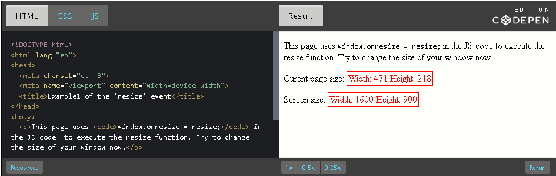{width="6.5in"
height="3.803472222222222in"}

<h5>HTML:</h5>

```
1.  <!DOCTYPE html>
2.  <html lang=&quot;en&quot;>
3.  <head>
4.  <meta charset=&quot;utf-8&quot;>
5.  <meta name=&quot;viewport&quot; content=&quot;width=device-width&quot;>
6.  <title>querySelector and querySelector example 1</title>
7.  </head>
8.  <body>
9.  <button onclick=&quot;firstLiClassRedInUl();&quot;>Select first li of
    class red and color it in red</button>
10. <br>
11. <button onclick=&quot;allLisInUlOfClassNav();&quot;>Underline All li in a
    ul of class nav</button>
12. <ul class=&quot;nav&quot;>
13. <li>Home</li>
14. <li class=&quot;red&quot;>Products</li>
15. <li>About</li>
16. </ul>
17. Another list:
18. <ul>
19. <li>Apple</li>
20. <li class=&quot;red&quot;>Cherries</li>
21. <li>Oranges</li>
22. </ul>
23. </body>
24. </html>
```

<h5>JS:</h5>

```
1.  function firstLiClassRedInUl() {
2.  // first li of class=&quot;red&quot; in a ul
3.  var elm = document.querySelector(&quot;ul li.red&quot;);
4.  elm.style.color = &apos;red&apos;;
5.  }
6.  function allLisInUlOfClassNav() {
7.  // get all li directly in a ul of class nav
8.  var list = document.querySelectorAll(&quot;ul.nav > li&quot;);
9.  list.forEach(function(elm) {
10. elm.style.textDecoration = &quot;underline&quot;;
11. })
}
```

<h4>Source code extracts:</h4>

<h5>HTML:</h5>:

```
1.  <button onclick=&quot;firstLiClassRedInUl();&quot;>Select first li of
    class red and color it in red</button>
2.  <br>
3.  <button onclick=&quot;allLisInUlOfClassNav();&quot;>Underline All li in a
    ul of class nav</button>
4.  <ul class=&quot;nav&quot;>
5.  <li>Home</li>
6.  <li class=&quot;red&quot;>Products</li>
7.  <li>About</li>
8.  </ul>
9.  Another list:
10. <ul>
11. <li>Apple</li>
12. <li class=&quot;red&quot;>Cherries</li>
13. <li>Oranges</li>
14. </ul>
```

<h5>JavaScript code:</h5>

```
1.  function firstLiClassRedInUl() {
2.  // first li of class=&quot;red&quot; in a ul
3.  var elm = document.querySelector(&quot;ul li.red&quot;);
4.  elm.style.color = &apos;red&apos;;
5.  }
6.  function allLisInUlOfClassNav() {
7.  // get all li directly in a ul of class nav
8.  var list = document.querySelectorAll(&quot;ul.nav > li&quot;);
9.  list.forEach(function(elm) {
10. elm.style.textDecoration = &quot;underline&quot;;
11. })
12. }
```

Example #2: display all checked &lt;input type=&quot;checkbox&quot;&gt; elements
located inside an element of a given id
<!--~~~~~~~~~~~~~~~~~~~~~~~~~~~~~~~~~~~~~~~~~~~~~~~~~~~~~~~~~~~~~~~~~~~~~~~~~~~~~~~~~~~~~~~~~~~~-->
<!--~~~~~~~~~~~~~~~~~~~~~~~~~~~~ 202.  (xxx) ~~~~~~~~~~~~~~~~~~~~~~~~~~~~~~-->
<p align="center" width="100%">

</p>
<!-- 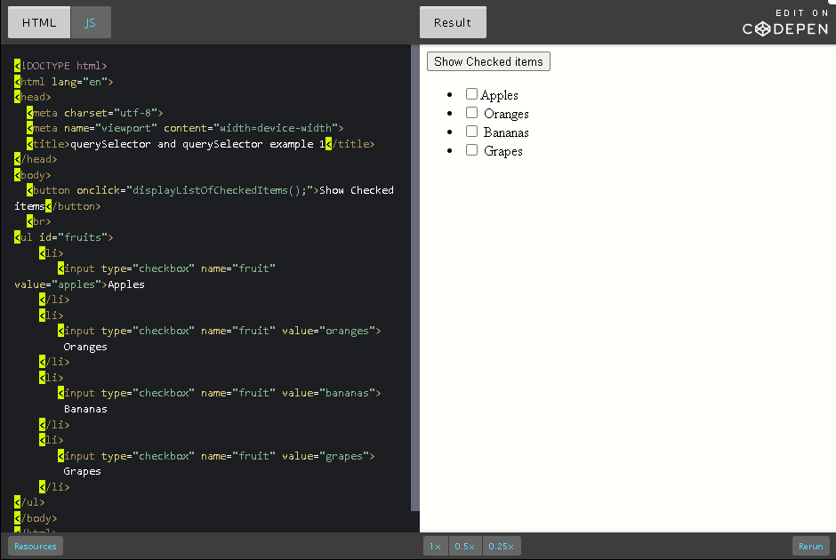{width="6.5in" height="4.35625in"} -->

<h5>HTML:</h5>

```
<!DOCTYPE html>
<html lang=&quot;en&quot;>
<head>
<meta charset=&quot;utf-8&quot;>
<meta name=&quot;viewport&quot; content=&quot;width=device-width&quot;>
<title>querySelector and querySelector example 1</title>
</head>
<body>
<button onclick=&quot;displayListOfCheckedItems();&quot;>Show Checked
  items</button>
<br>
<ul id=&quot;fruits&quot;>
<li>
<input type=&quot;checkbox&quot; name=&quot;fruit&quot; value=&quot;apples&quot;>Apples
</li>
<li>
<input type=&quot;checkbox&quot; name=&quot;fruit&quot; value=&quot;oranges&quot;>
Oranges
</li>
<li>
<input type=&quot;checkbox&quot; name=&quot;fruit&quot; value=&quot;bananas&quot;>
Bananas
</li>
<li>
<input type=&quot;checkbox&quot; name=&quot;fruit&quot; value=&quot;grapes&quot;>
Grapes
</li>
</ul>
</body>
</html>
```

<h5>JS:</h5>

```
function displayListOfCheckedItems() {
// all inputs that have been checked
var listOfSelectedValues=&quot;&quot;;
var list = document.querySelectorAll(&quot;#fruits input:checked&quot;);
list.forEach(function(elm) {
listOfSelectedValues += elm.value + &quot; &quot;;
// Put the li in red.
// the li is the parent of the current input elem stored
// in the elm variable
elm.parentNode.style.color = &apos;green&apos;;
});
document.body.append(&quot;You selected: &quot; + listOfSelectedValues);
}
Extract from the source code:
```

<h5>HTML:</h5>

```
<button onclick=&quot;<b>displayListOfCheckedItems();</b>&quot;>
    Show Checked items
1.  </button>
2.  <br>
3.  <ul id=&quot;fruits&quot;>
4.  <li>
5.  <input type=&quot;checkbox&quot; name=&quot;fruit&quot; value=&quot;apples&quot;>
6.  Apples
7.  </li>
8.  <li>
9.  <input type=&quot;checkbox&quot; name=&quot;fruit&quot; value=&quot;oranges&quot;>
10. Oranges
11. </li>
12. <li>
13. <input type=&quot;checkbox&quot; name=&quot;fruit&quot; value=&quot;bananas&quot;>
14. Bananas
15. </li>
16. <li>
17. <input type=&quot;checkbox&quot; name=&quot;fruit&quot; value=&quot;grapes&quot;>
18. Grapes
19. </li>
20. </ul>
```

JavaScript code: we select all elements of type input that have an
attribute checked equal to true, and located inside an element whose id
is &quot;fruits&quot;. Notice the use of document.querySelectorAll, for
selecting more than one element (<b>line 6</b>), then, we iterate on the
list (<b>line 8</b>) and concatenate to the string
variable listOfSelectedValues the value of each element (located in
its value attribute). This is done in <b>line 9</b>.

<b>Lines 9-12</b> use the parentNode property of the selected nodes in
order to change the color of the &lt;li&gt; (parents of &lt;input&gt; elements
selected) in red. In the DOM tree, we selected input elements that
are each a child of a &lt;li&gt; element. The text displayed: &quot;Apples&quot;,
&quot;Oranges&quot; etc. belong to the &lt;li&gt; element. In order to access it
from the &lt;input&gt; child we selected, we use elm.parentNode.

Finally, at the end of the document, <b>line 14</b> adds a message followed
by this list:

```
1.  function displayListOfCheckedItems() {
2.  // all inputs that have been checked
3.  var listOfSelectedValues=&quot;&quot;;
4.  var list = document.querySelectorAll(&quot;#fruits input:checked&quot;);
5.  list.forEach(function(elm) {
6.  listOfSelectedValues += elm.value + &quot; &quot;;
7.  // Put the li in red.
8.  // the li is the parent of the current input elem stored
9.  // in the elm variable
10. elm.parentNode.style.color = &apos;green&apos;;
11. });
12. document.body.append(&quot;You selected: &quot; + listOfSelectedValues);
13. }
```

<h4>Example #3: change the background of all paragraphs &lt;p&gt; in an element of a given id</h4>
<!--~~~~~~~~~~~~~~~~~~~~~~~~~~~~~~~~~~~~~~~~~~~~~~~~~~~~~~~~~~~~~~~~~~~~~~~~~~~~~~~~~~~~~~~~~~~~-->
<!--~~~~~~~~~~~~~~~~~~~~~~~~~~~~ 203.  (xxx) ~~~~~~~~~~~~~~~~~~~~~~~~~~~~~~-->
<p align="center" width="100%">

</p>
<!-- {width="6.5in" height="2.6972222222222224in"} -->

<h5>HTML code:</h5>

```
1.  <button onclick=&quot;<b>changeBackGroundOfPs(&apos;firstDiv&apos;);<b>&quot;>Change
    backgrounds of p under a given element known by id</button>
2.  <br>
3.  <div <b>id=&quot;firstDiv&quot;</b>>
4.  <p>First paragraph.</p>
5.  <p>Second paragraph.</p>
6.  </div>
```

JavaScript code: we build a CSS selector using the id passed as a
parameter. In this example, the id is &apos;firstDiv&apos;, the id of the div
at *line 3* in the above code.

So, the variable CSS selector at *line 2* in the JavaScript code below
will have a value equal to &quot;#firstDiv p&quot;, that means: select
all &lt;p&gt; under an element whose id is &quot;firstDiv&quot;.
The paragraphs variable is a list that contains the paragraphs selected.
Then we iterate on this list (this time using a for loop, which is an
alternative method to using the forEach method used in previous
examples) (*lines 5-7*), and we change the background of all selected
paragraphs (*line 6*).

```
1.  function changeBackGroundOfPs(id) {
2.  var paragraphs = document.querySelectorAll(&quot;#&quot; + id + &quot; p&quot;);
3.  // Another way to iterate on all elements in a collection
4.  for (var i = 0; i < paragraphs.length; i++ ) {
5.  paragraphs[i].style.backgroundColor = &quot;lightGreen&quot;;
6.  }
7.  }
```

<h5>Other examples that use more complex selectors:</h5>

```
1.  // all elements li in ul elements in an element of id=nav
2.  var el = document.querySelector(&apos;#nav ul li&apos;);
3.  // all li in a ul, but only even elements
4.  var els = document.querySelectorAll(&apos;ul li:nth-child(even)&apos;);
5.  // all td directly in tr in a form of class test
6.  var els = document.querySelectorAll(&apos;form.test > tr > td&apos;);
7.  // all paragraphs of class warning or error
8.  querySelectorAll(&quot;p.warning, p.error&quot;);
9.  // first element of id=foo or id=bar
10. querySelector(&quot;#foo, #bar&quot;);
11. // first p in a div
12. var div = document.getElementById(&quot;bar&quot;);
13. var p = div.querySelector(&quot;p&quot;);
```

### Accessing HTML elements with the DOM API (old fashioned)

These methods are from the DOM API and can all be replaced by the
querySelector and querySelectorAll methods that we&apos;ve discussed. They
are still used in many JavaScript applications, and are very simple to
understand.

From the document we can access the elements composing our Web page in a
few ways:

-   <b>document.getElementById(identifier)</b> returns the element which
    has the id "identifier".

This is equivalent to document.querySelector(&quot;#identifier&apos;); (just add
a &#35; before the id when using a CSS selector). 

Example: var elm = document.getElementById(&apos;myDiv&apos;); is equivalent
to document.querySelector(&apos;#myDiv&apos;);

-   <b>document.getElementsByTagName(tagName) </b>returns a list of
    elements which are named "tagName".

This is equivalent to document.querySelectorAll(tagName);

Example: var list = document.getElementByTagName(&apos;img&apos;); is equivalent
to document.querySelector(&apos;img&apos;);

-   <b>document.getElementsByClassName(className)</b> returns a list of
    elements which have the class "className".

This is equivalent to document.querySelectorAll(&apos;.className&apos;); 

Example: var list = document.getElementByClassName(&apos;important&apos;); is
equivalent to document.querySelector(&apos;.important&apos;); (just add a &apos;.&apos;
before the class name when using a CSS selector). 

Notice that identifier, tagName and className must be of type String.

<!--~~~~~~~~~~~~~~~~~~~~~~~~~~~~~~~~~~~~~~~~~~~~~~~~~~~~~~~~~~~~~~~~~~~~~~~~~~~~~~~~~~~~~~~~~~~~-->
<h3 id="ch2-5-4">2.5.4 Changing the style of selected HTML elements</h3>
<!--~~~~~~~~~~~~~~~~~~~~~~~~~~~~~~~~~~~~~~~~~~~~~~~~~~~~~~~~~~~~~~~~~~~~~~~~~~~~~~~~~~~~~~~~~~~~-->
<h5>The style attribute</h5>

How to modify an HTML element&apos;s CSS properties from JavaScript?

The most common way to modify the CSS style of one of several elements
you selected using the DOM or Selector API, is to use
the style attribute.

<h5>Typical use:</h5>

```
// select the paragraph with id = &quot;paragraph1&quot;
var p = document.querySelector(&apos;#paragraph1&apos;);
// change its color
p.style.color = &apos;red&apos;;
```

<b>Warning</b>: with the style attribute, you can modify (or read) any CSS
property, but be careful: the syntax changes a little due to the fact
that in JavaScript the &quot;-&quot; is a math operator, while in CSS it is used
to separate properties made of multiple words, such as background-color.

When using such properties from JavaScript, the rule is simple:

1.  Remove the &quot;-&quot; sign,

2.  Capitalize the word after the &quot;-&quot; sign!

Simple, isn&apos;t it?

<h4>Examples:</h4>

-   text-align becomes style.textAlign

-   margin-left becomes style.marginLeft

-   etc.

The most useful CSS properties (we do recommend that you follow the W3Cx
courses CSS basics, CSS and HTML5 fundamentals from W3Cx to learn more
about CSS):

-   color: changing the color of the text content of selected
    element(s),

-   background-color: same but this time the background color,

-   margin and padding properties (external and internal margins),
    including their variants: margin-left, margin-top, margin-right,
    margin-bottom, also padding-left, etc.

-   border and border-radius: change the border, type (plain, dashed),
    color, thickness, rounded corners etc.

-   box-shadow to add shadows to selected elements, 

-   font, font-style: font characters and style (italic, bold, plain)

-   text-align (centered, etc.)

Here are some examples:
<!--~~~~~~~~~~~~~~~~~~~~~~~~~~~~~~~~~~~~~~~~~~~~~~~~~~~~~~~~~~~~~~~~~~~~~~~~~~~~~~~~~~~~~~~~~~~~-->
<!--~~~~~~~~~~~~~~~~~~~~~~~~~~~~ 204.  (xxx) ~~~~~~~~~~~~~~~~~~~~~~~~~~~~~~-->
<p align="center" width="100%">

</p>

### Using the ClassList interface to change more than one CSS property simultaneously {#using-the-classlist-interface-to-change-more-than-one-css-property-simultaneously .unnumbered}

### External resources: {#external-resources-2 .unnumbered}

-   [The W3C specification about the classList DOM
    interface](https://www.w3.org/TR/dom/#dom-element-classlist)

-   [An article from the Mozilla Developer&apos;s web
    site ](https://hacks.mozilla.org/2010/01/classlist-in-firefox-3-6/)

Until now, to manipulate CSS classes of an HTML element was a bit
complex, both for verifying the presence of a class name in an element,
and for adding or removing classes associated with a given element.

The ClassList interface simplifies it all by acting as a container
object and by providing a set of methods to manipulate its content.

The classList property applies to an HTML element, and returns a
collection of class names:

<pre>
1.  var elem= document.querySelector(&quot;#id1&quot;);
2.  var allClasses = elem.<b>classList</b>;
</pre>

<h5>The classList API</h5>

<pre>
3.  The list of methods usable on a classList object are add(),
    remove(), toggle() and contains().
4.  // By default, start without a class in the div: <div class=&quot;&quot;/>
5.  // Set &quot;foo&quot; as the class by adding it to the classList
6.  div.classList.add(&apos;foo&apos;); // now <div class=&quot;foo&quot;/>
7.  // Check that the classList contains the class &quot;foo&quot;
8.  div.classList.contains(&apos;foo&apos;); // returns true
9.  // Remove the class &quot;foo&quot; from the list
10. div.classList.remove(&apos;foo&apos;); // now <div class=&quot;&quot;/>
11. // Check if classList contains the class &quot;foo&quot;
12. div.classList.contains(&apos;foo&apos;); // returns false: &quot;foo&quot; is gone
13. // Check if class contains the class &quot;foo&quot;,
14. // If it does, &quot;foo&quot; is removed, if it doesn&apos;t, it&apos;s added
15. div.classList.toggle(&apos;foo&apos;); // class set to <div
    class=&quot;foo&quot;/>
16. div.classList.toggle(&apos;foo&apos;); // class set to <div class=&quot;&quot;/>
</pre>

### Another example: add and remove multiple CSS properties in a list of checkboxes
<!--~~~~~~~~~~~~~~~~~~~~~~~~~~~~~~~~~~~~~~~~~~~~~~~~~~~~~~~~~~~~~~~~~~~~~~~~~~~~~~~~~~~~~~~~~~~~-->
<!--~~~~~~~~~~~~~~~~~~~~~~~~~~~~ 205.  (xxx) ~~~~~~~~~~~~~~~~~~~~~~~~~~~~~~-->
<p align="center" width="100%">

</p>

This is a variation of an example from a previous section. This time,
when the &lt;input type=&quot;checkbox&quot;&gt; elements have been checked, in
order to give the parent &lt;li&gt; a background color, a border, and to
change the text color, we use a CSS class named &quot;checked&quot;:

<h5>CSS code:</h5>

```
1.  .checked {
2.  border: 2px dashed #000;
3.  background-color: green;
4.  color:yellow;
5.  }
&hellip; and
the classList.add(CSS_class) and classList.remove(CSS_class) methods on
the <li> elements:
```

<h5>JavaScript code:</h5>

```
1.  function displayListOfCheckedItems() {
2.  // all inputs that have been checked
3.  var listOfSelectedValues=&quot;&quot;;
4.  var list = document.querySelectorAll(&quot;#fruits input:checked&quot;);
5.  list.forEach(function(elm) {
```

    -   listOfSelectedValues += elm.value + &quot; &quot;;

    -   <b>// get the li parent of the current selected input</b>

    -   <b>var liParent = elm.parentNode;</b>

    -   <b>// add the CSS class .checked</b>

    -   <b>liParent.classList.add(&quot;checked&quot;);</b>

```
});
document.body.append(&quot;You selected: &quot; + listOfSelectedValues);
}
function reset() {
var list = document.querySelectorAll(&quot;#fruits input&quot;);
list.forEach(function(elm) {
> // uncheck
>
> elm.checked = false;
>
> <b>// remove CSS decoration</b>
>
> <b>var liParent = elm.parentNode;</b>
>
> <b>liParent.classList.remove(&quot;checked&quot;);</b>
12. });
13. }
```

<!--~~~~~~~~~~~~~~~~~~~~~~~~~~~~~~~~~~~~~~~~~~~~~~~~~~~~~~~~~~~~~~~~~~~~~~~~~~~~~~~~~~~~~~~~~~~~-->
<h3 id="ch2-5-5">2.5.5 Modifying selected HTML elements</h3>
<!--~~~~~~~~~~~~~~~~~~~~~~~~~~~~~~~~~~~~~~~~~~~~~~~~~~~~~~~~~~~~~~~~~~~~~~~~~~~~~~~~~~~~~~~~~~~~-->

We&apos;ve already seen many examples in which we selected one or more
elements, and modified their content. Let&apos;s summarize all the methods
we&apos;ve seen, and perhaps introduce a few new things&hellip;

Properties that can be used to change the value of selected DOM node

<h4>Using the innerHTML property</h4>

This property is useful when you want to change all the children of a
given element. It can be used to modify the text content of an element,
or to insert a whole set of HTML elements inside another one.

<b>Typical use:</b>

<pre>
var elem = document.querySelector('#myElem');
elem.innerHTML = 'Hello '; // replace content by Hello
elem.innerHTML += '<b>Michel Buffa</b>', // append at the end
// Michel Buffa in bold
elem.innerHTML = 'Welcome' + elem.innerHTML; // insert Welcome
// at the beginning
elem.innerHTML = ''; // empty the elem
</pre>

<h4>Using the textContent property</h4>

It&apos;s also possible, with selected nodes/elements that contain text, to
use the textContent property to read the text content or to modify it.
There are subtle differences that can be seen in the above example
(click the &apos;edit on CodePen&quot; part on the top left, and once in
codePen, open the devtool console):
<!--~~~~~~~~~~~~~~~~~~~~~~~~~~~~~~~~~~~~~~~~~~~~~~~~~~~~~~~~~~~~~~~~~~~~~~~~~~~~~~~~~~~~~~~~~~~~-->
<!--~~~~~~~~~~~~~~~~~~~~~~~~~~~~ 206.  (xxx) ~~~~~~~~~~~~~~~~~~~~~~~~~~~~~~-->
<p align="center" width="100%">

</p>

<h5>HTML:</h5>

<pre>
1.  &lt;!DOCTYPE html&gt;
2.    &lt;html lang=&quot;en&quot;&gt;
3.    &lt;head&gt;
4.      &lt;meta charset=&quot;utf-8&quot;&gt;
5.      &lt;meta name=&quot;viewport&quot; content=&quot;width=device-width&quot;&gt;
6.      &lt;title&gt;Modifying content of selected DOM nodes&lt;/title&gt;
7.    &lt;/head&gt;
8.    &lt;body&gt;
9.      &lt;h1&gt;Open the console and look at the JavaScript code!&lt;/h1&gt;
10.     &lt;p id=&quot;first&quot;&gt;first paragraph&lt;/p&gt;
11.     &lt;p id=&quot;second&quot;&gt;&lt;em&gt;second&lt;/em&gt; paragraph&lt;/p&gt;
12.   &lt;/body&gt;
13. &lt;/html&gt;
</pre>

<h5>JS:</h5>

<pre>
1.  window.onload = init;
2.  function init() {
3.  // DOM is ready
4.  var firstP = document.querySelector("#first");
5.  console.log(firstP.textContent);
6.  console.log(firstP.innerHTML);
7.  firstP.textContent = &quot;Hello I'm the first paragraph&quot;;
8.  console.log(firstP.textContent);
9.  var secondP = document.querySelector("#second");
10. console.log(secondP.textContent);
11. console.log(secondP.innerHTML);
12. secondP.textContent = "Hello I'm the second paragraph";
13. console.log(secondP.textContent);
14. console.log(secondP.innerHTML);
15. }
</pre>

<h5>Extract from the HTML code:</h5>

<pre>
&lt;p id="first"&gt;first paragraph&lt;/p&gt;
&lt;p id="second"&gt;&lt;em&gt;second&lt;/em&gt; paragraph&lt;/p&gt;
</pre>

JavaScript code: the comments after lines that start
with console.log correspond to what is printed in the devtool debug
console. Notice the difference between the textNode value and
the innerHTML property values at <b>lines 13-14</b>:
while textContent returns only the text inside the second
paragraph, innerHTML also returns the &lt;em&gt;&hellip;&lt;/em&gt; that surrounds
it. However, when we modify the textContent value, it also replaces the
text decoration (the &lt;em&gt; is removed), this is done at <b>lines
16-20</b>.

<pre>
1.  window.onload = init;
2.   
3.  function init() {
4.     // DOM is ready
5.     var firstP = document.querySelector("#first");
6.     console.log(firstP.textContent); // "first paragraph"
7.     console.log(firstP.innerHTML);   // "first paragraph"
8.   
9.     firstP.textContent = "Hello I&apos;m the first paragraph";
10.    console.log(firstP.textContent); // "Hello I&apos;m the first
    paragraph"
11.                                      
12.    var secondP = document.querySelector("#second");
13.    console.log(secondP.textContent); // "second paragraph"
14.    console.log(secondP.innerHTML);   // "<em>second</em>
    paragraph"
15. 
16.    secondP.textContent = "Hello I&apos;m the second paragraph";
17.    console.log(secondP.textContent); // "Hello I&apos;m the second
18.                                      // paragraph"
19.    console.log(secondP.innerHTML);   // "Hello I&apos;m the second
20.                                      // paragraph"
21. }
</pre>

### Changing the attributes of selected elements

It&apos;s very common to modify the attributes of selected elements: the
width of an image, CSS style with the style attribute, value of an input
field, etc.

This example shows some of the things we can do:
<!--~~~~~~~~~~~~~~~~~~~~~~~~~~~~~~~~~~~~~~~~~~~~~~~~~~~~~~~~~~~~~~~~~~~~~~~~~~~~~~~~~~~~~~~~~~~~-->
<!--~~~~~~~~~~~~~~~~~~~~~~~~~~~~ 207.  (xxx) ~~~~~~~~~~~~~~~~~~~~~~~~~~~~~~-->
<p align="center" width="100%">

</p>

<h5>HTML:</h5>

<pre>
&lt;!DOCTYPE html&gt;
&lt;html lang="en"&gt;
&lt;head&gt;
&lt;meta charset="utf-8"&gt;
&lt;meta name="viewport" content="width=device-width"&gt;
&lt;title&gt;Modifying content of selected DOM nodes&lt;/title&gt;
&lt;/head&gt;
&lt;body&gt;
&lt;h1&gt;Try these&lt;/h1&gt;
&lt;p&gt;What is your name: &lt;input type="text" id="name"
  value="Michel"&gt; &lt;button onclick="resetName();"&gt;Reset (click to
  empty the input field)&lt;/button&gt;&lt;/p&gt;
&lt;p&gt;Pick a color: &lt;input id="color" type="color"
  value='#FF0000'&gt;&lt;button onclick="setToGreen();"&gt;Set color chooser
  to green&lt;/button&gt;&lt;/p&gt;
&lt;p&gt;In the next example, click on the input field and use the small 
  vertical arrows to increase the value. Notice that the numbers go 1 by 1
  and that the maximum value is 20. Then click the button and do the same
  thing!&lt;/p&gt;
&lt;p&gt;Pick a number between 0 and 20: &lt;input id="number"
  type="number" min=0 max=20 step = 1 value='10'&gt;&lt;button
  onclick="changeStep();"&gt;Change step and max attribute values
  &lt;/button&gt;&lt;/p&gt;
&lt;p&gt;Click the next image to change its url and size:&lt;/p&gt;
&lt;img
  src="https://www.paris-web.fr/2013/assets_c/2013/08/michel-buffa-thumb-143x143-372.jpg"
  onclick="changeAndResize(this)" alt="Michel Buffa"&gt;
&lt;/body&gt;
&lt;/html&gt;
</pre>

<h5>JS:</h5>

<pre>
function resetName() {
var inputField = document.querySelector("#name");
inputField.value = "";
}
function setToGreen() {
var colorChooser = document.querySelector("#color");
colorChooser.value = "#00FF00";
}
function changeStep() {
var number = document.querySelector("#number");
number.value = 10;
number.step = "0.1";
number.max = 11;
}
function changeAndResize(img) {
img.src="https://pbs.twimg.com/profile_images/110455194/n666194627_2302_400x400.jpg";
img.width=250;
img.style.border = "4px solid red";
}
</pre>

<!--~~~~~~~~~~~~~~~~~~~~~~~~~~~~~~~~~~~~~~~~~~~~~~~~~~~~~~~~~~~~~~~~~~~~~~~~~~~~~~~~~~~~~~~~~~~~-->
<h3 id="ch2-5-6">2.5.6 Adding new elements to the DOM</h3>
<!--~~~~~~~~~~~~~~~~~~~~~~~~~~~~~~~~~~~~~~~~~~~~~~~~~~~~~~~~~~~~~~~~~~~~~~~~~~~~~~~~~~~~~~~~~~~~-->

To add a new element to the HTML DOM, you must create the element
(element node) first, and then append it to an existing element.

#### Example:

<pre>
&lt;!DOCTYPE html&gt;
&lt;html&gt;
&lt;body&gt;
&lt;h2&gt;JavaScript HTML DOM&lt;/h2&gt;
&lt;p&gt;Add a new HTML Element.&lt;/p&gt;
&lt;div id="div1"&gt;
&lt;p id="p1"&gt;This is a paragraph.&lt;/p&gt;
&lt;p id="p2"&gt;This is another paragraph.&lt;/p&gt;
&lt;/div&gt;
&lt;script&gt;
const para = document.createElement("p");
const node = document.createTextNode("This is new.");
para.appendChild(node);
const element = document.getElementById("div1");
element.appendChild(para);
&lt;/script&gt;
&lt;/body&gt;
&lt;/html&gt;
</pre>

<h4>Output:</h4>
<!--~~~~~~~~~~~~~~~~~~~~~~~~~~~~~~~~~~~~~~~~~~~~~~~~~~~~~~~~~~~~~~~~~~~~~~~~~~~~~~~~~~~~~~~~~~~~-->
<!--~~~~~~~~~~~~~~~~~~~~~~~~~~~~ 208.  (xxx) ~~~~~~~~~~~~~~~~~~~~~~~~~~~~~~-->
<p align="center" width="100%">

</p>
<!--~~~~~~~~~~~~~~~~~~~~~~~~~~~~~~~~~~~~~~~~~~~~~~~~~~~~~~~~~~~~~~~~~~~~~~~~~~~~~~~~~~~~~~~~~~~~-->
<!--~~~~~~~~~~~~~~~~~~~~~~~~~~~~~~~~~ xxx. (999) ~~~~~~~~~~~~~~~~~~~~~~~~~~~~~~~~~~~~~~~~~-->
<p align="center" width="100%">

</p>
<!-- last editted 7/16/2024 6:25pm -->
<!-- last editted 7/19/2024 6:00pm -->
<!-- last editted 7/20/2024 5:49am -->
<!-- last editted 7/23/2024 7:17pm -->
